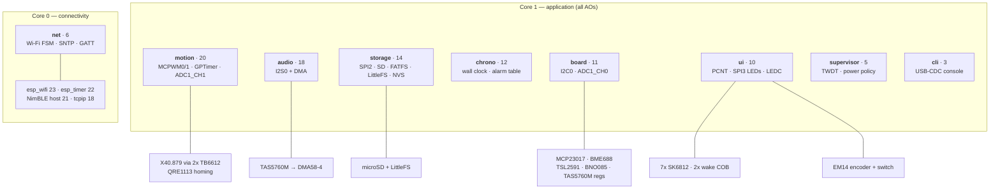
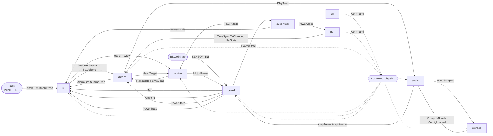
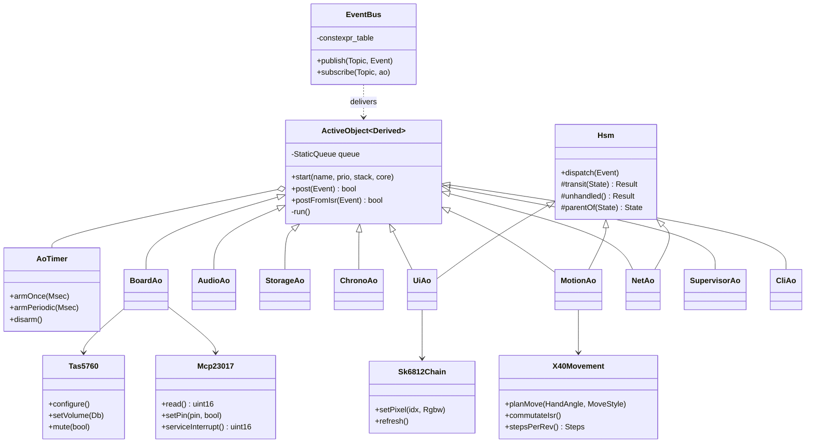
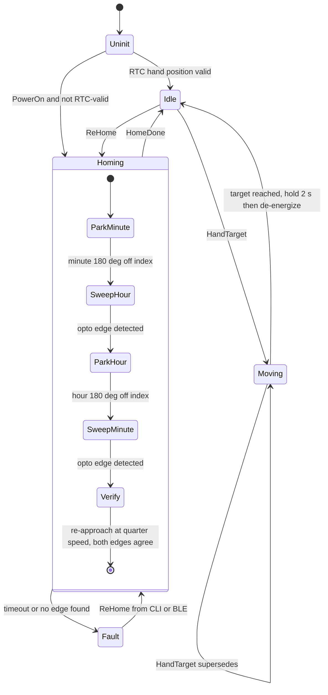
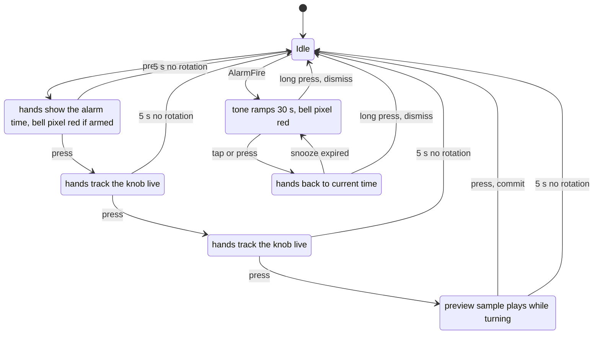
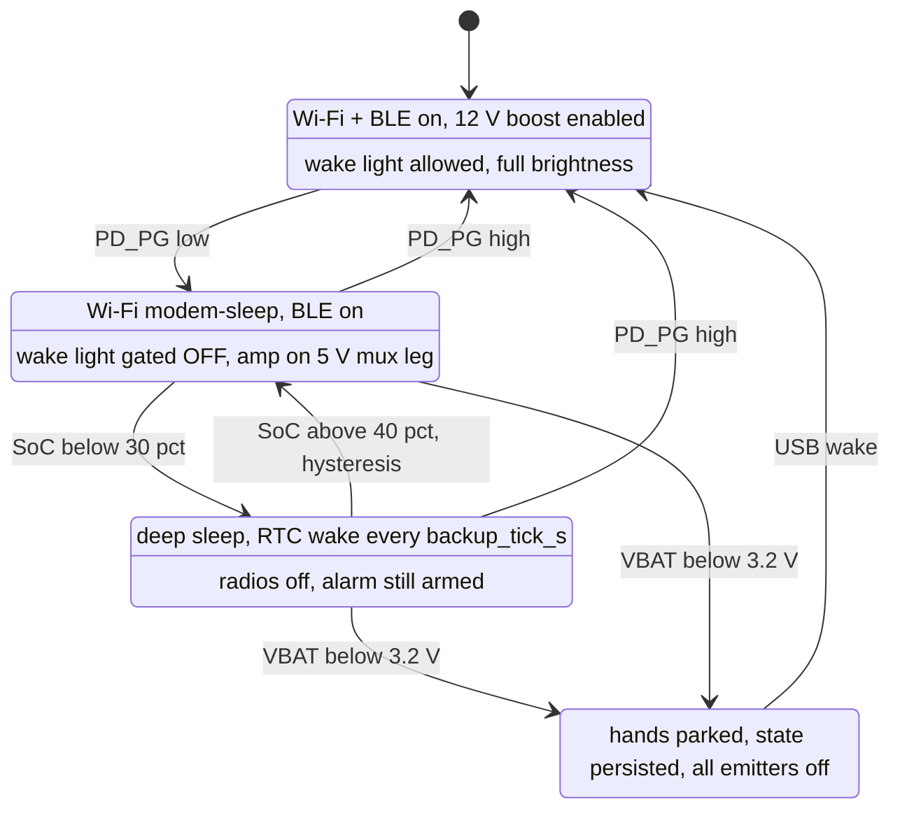
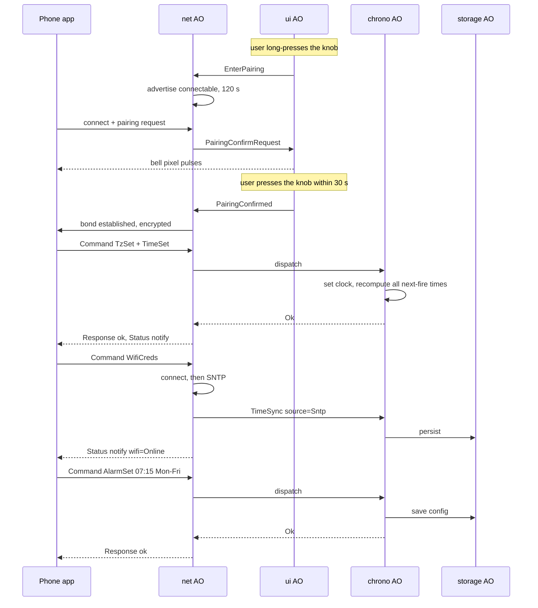
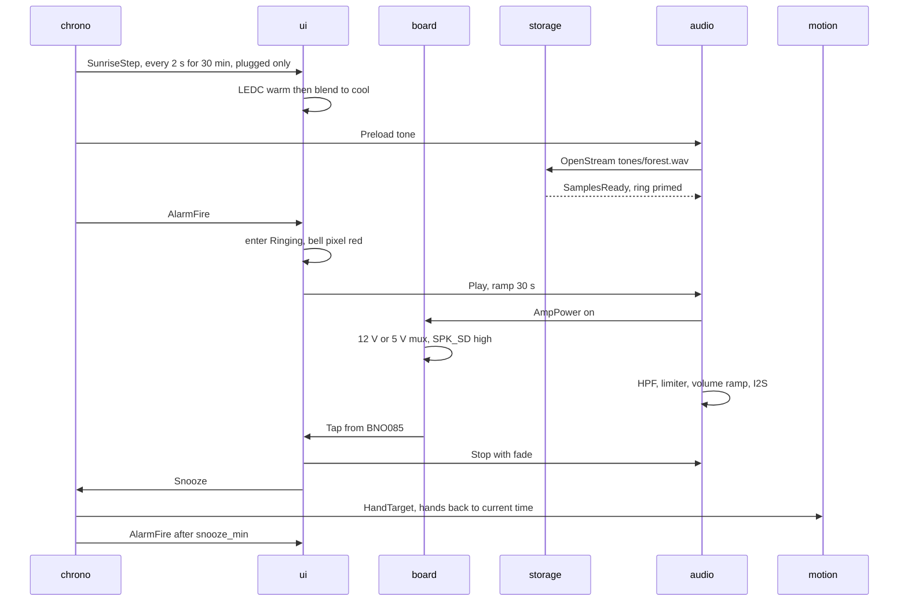

# Firmware Architecture — Wooden Smart Clock

> Design document for the ESP32-S3 firmware. **Written before any code.** Hardware is frozen
> (rev 0.1 PCB); this document is the software counterpart to [`README.md`](README.md) (product spec)
> and [`esp32.md`](esp32.md) (pin map). Where the two disagree, `esp32.md` wins on pins and this file
> wins on software structure.

**Status:** v1.0 draft · **Owner:** you · **Created:** 2026-07-26 · **Target:** ESP-IDF ≥ 5.3 (GCC 13)

---

## 0. Locked decisions

| # | Decision | Rationale |
|---|---|---|
| D1 | **ESP-IDF FreeRTOS + a hand-rolled C++20 active-object layer.** Not QP/C++ | FreeRTOS is unavoidable (Wi-Fi/lwIP/NimBLE/FATFS are all FreeRTOS tasks). QP's *pattern* is what's valuable — one queue per AO, run-to-completion, no shared state. The *framework* would need an SMP port and would still leave half the system as non-AO tasks. ~500 LOC you own beats a port you don't |
| D2 | **C++23 (`-std=gnu++23`), no exceptions, no RTTI, no heap after init** | GCC 13 on IDF ≥5.3 → `std::expected`, `std::variant` events, `constexpr` LUTs, concepts for driver fakes. Static queues/stacks make memory behaviour provable |
| D3 | **9 active objects**, all pinned to **core 1**; core 0 left to Wi-Fi/BLE/lwIP | Removes essentially all SMP reasoning — your AOs are effectively uniprocessor |
| D4 | **SK6812 driven by `led_strip` SPI backend on SPI3**, not RMT | SPI3 is otherwise unused (SPI2 = microSD). SPI+DMA is immune to Wi-Fi interrupt jitter, which is the classic NeoPixel glitch source; frees all 4 RMT channels. IO7 reaches SPI3 MOSI through the GPIO matrix |
| D5 | **Stepper commutation from a GPTimer ISR @ 20 kHz**, ×16 microstepping; MCPWM carrier 25 kHz | GPTimer decouples update rate from carrier, and can be **stopped when idle** (the hands are stationary >99 % of the time). 20 kHz × ×16 → max ≈1.1 rev/s slew, ample for time-set |
| D6 | **32.768 kHz crystal is the RTC slow clock** (`CONFIG_RTC_CLK_SRC_EXT_CRYS`) | Drives wall-clock retention, `esp_timer` re-basing across sleep, and the deep-sleep wake timer. ±20 ppm ≈ 1.7 s/day between SNTP syncs. See §7.1 — this is *not* the commutation clock |
| D7 | **Deep-sleep hand cadence is a runtime config** (`backup_tick_s`, default **60**, range 1–900) | Motion is always *absolute-target*, never "step N times", so cadence is a pure power/aesthetics knob with zero correctness coupling. Changing it later is one NVS value |
| D8 | **WAV only** (16-bit PCM, 44.1/48 kHz) | No decoder, no extra stack/heap, no dependency. SD space is free. FLAC can be added later behind the same `AudioSource` concept |
| D9 | **One `Command` surface shared by the CLI and the BLE app** | The phone app and the debug console need the same 40 operations. Defining them once (§5) means every feature is testable from the console the day it exists, and host-testable with no transport at all |

---

## 1. Platform

| Item | Setting |
|---|---|
| SoC / module | ESP32-S3-WROOM-1-**N16R8** (16 MB flash, 8 MB octal PSRAM, 3 GPIO consumed by PSRAM) |
| SDK | ESP-IDF ≥ 5.3 (GCC 13) |
| Language | C++23, `-fno-exceptions -fno-rtti`; C only inside vendor drivers |
| Console | **USB-Serial-JTAG only** (IO19/20). No UART is exposed — IO43 carries `I2S_MCLK` |
| Debug | `esp_console` REPL over USB-CDC + OpenOCD/GDB over the *same* cable |

### `sdkconfig.defaults` (the settings that matter)

```ini
CONFIG_IDF_TARGET="esp32s3"

# console + logging: USB-CDC is the only path (IO43 is I2S_MCLK)
CONFIG_ESP_CONSOLE_USB_SERIAL_JTAG=y
CONFIG_ESP_CONSOLE_SECONDARY_NONE=y

# D6 — external 32.768 kHz crystal as RTC slow clock  ← accurate timekeeping
CONFIG_RTC_CLK_SRC_EXT_CRYS=y
CONFIG_RTC_CLK_CAL_CYCLES=3000
CONFIG_ESP_TIME_FUNCS_USE_RTC_TIMER=y
CONFIG_ESP_TIME_FUNCS_USE_ESP_TIMER=y

# memory
CONFIG_SPIRAM=y
CONFIG_SPIRAM_MODE_OCT=y
CONFIG_SPIRAM_SPEED_80M=y
CONFIG_SPIRAM_USE_MALLOC=y
CONFIG_SPIRAM_MALLOC_ALWAYSINTERNAL=4096       # small allocs stay internal

# language
CONFIG_COMPILER_CXX_EXCEPTIONS=n
CONFIG_COMPILER_CXX_RTTI=n
CONFIG_COMPILER_OPTIMIZATION_PERF=y
CONFIG_COMPILER_STACK_CHECK_MODE_STRONG=y      # dev builds

# scheduling
CONFIG_FREERTOS_HZ=1000
CONFIG_FREERTOS_UNICORE=n
CONFIG_ESP_MAIN_TASK_AFFINITY_CPU0=y

# power (battery modes, §7.4)
CONFIG_PM_ENABLE=y
CONFIG_FREERTOS_USE_TICKLESS_IDLE=y
CONFIG_PM_DFS_INIT_AUTO=y

# reliability
CONFIG_ESP_TASK_WDT_TIMEOUT_S=10
CONFIG_ESP_TASK_WDT_CHECK_IDLE_TASK_CPU1=n     # AOs feed it explicitly
CONFIG_ESP_COREDUMP_ENABLE_TO_FLASH=y
CONFIG_ESP_COREDUMP_DATA_FORMAT_ELF=y

# radios
CONFIG_BT_ENABLED=y
CONFIG_BT_NIMBLE_ENABLED=y
CONFIG_BT_NIMBLE_EXT_ADV=n
```

### Partition table (16 MB)

| Name | Type | Size | Use |
|---|---|---|---|
| `nvs` | data/nvs | 64 K | config, hand trim, alarm table |
| `nvs_keys` | data/nvs_keys | 4 K | NVS encryption (optional) |
| `otadata` | data/ota | 8 K | |
| `phy_init` | data/phy | 4 K | |
| `ota_0` / `ota_1` | app | 3 M each | A/B OTA with rollback |
| `coredump` | data/coredump | 128 K | post-mortem, read by `cli` |
| `assets` | data/littlefs | ~9 M | system sounds, BSEC state, event-trace spill |

microSD carries **user** assets only (`/sd/tones/*.wav`); the device must be fully functional with no card.

---

## 2. Layering & repo layout

```
firmware/
├─ CMakeLists.txt                 # idf.py build
├─ sdkconfig.defaults
├─ main/                          # app_main: construct + start AOs, nothing else
├─ components/
│  ├─ core/                       # ← 100 % host-testable, zero IDF
│  │   event.hpp  active.hpp  hsm.hpp  bus.hpp  timer.hpp
│  │   result.hpp units.hpp static_vector.hpp ring.hpp trace.hpp
│  ├─ command/                    # ← host-testable: the Command/Response surface (§5)
│  ├─ domain/                     # ← host-testable: alarm scheduler, hand math,
│  │                              #    sunrise curve, DSP biquad+limiter, gamma
│  ├─ hal/                        # RAII wrappers: Mcpwm Gptimer I2cBus I2sTx SpiBus
│  │                              # Adc Pcnt LedStrip Ledc Gpio Nvs UsbConsole
│  ├─ drivers/                    # X40Movement Tb6612 Qre1113 Sk6812Chain Tas5760
│  │                              # Mcp23017 Bme688 Tsl2591 Bno085 Lt3652Status
│  ├─ services/                   # the 9 active objects (§3)
│  └─ transport/                  # cli_adapter/  ble_gatt/   → both call command::dispatch
└─ test/
   ├─ host/                       # GoogleTest, native compiler, fakes for hal/
   └─ target/                     # Unity, on-device peripheral tests
```

**Dependency rule (enforced by CMake `REQUIRES`, so violations fail the build):**

```
main → services → { command, domain, drivers, core }
drivers → { hal, core }          services never touch hal directly for owned peripherals
transport → command              transport never touches services directly
core, domain, command → nothing  (no IDF headers at all → host build works)
```

### Rules of the road

1. **One owner per peripheral.** Named in §3. Nobody else may touch it — not even "just to read".
2. **No AO event handler blocks > 2 ms.** Debug builds assert on overrun. Slow work → request another AO.
3. **No heap allocation after `app_main` returns.** Static queues, static stacks, fixed-capacity containers.
4. **No shared mutable state.** Events carry copies; config is an immutable snapshot swapped atomically.
5. **Drivers never post events**, never log at INFO, never block on a queue. They are pure I/O + math.
6. **Anything reachable from the CLI is reachable from BLE and vice versa** — one `Command` enum (§5).
7. **All scheduling from `esp_timer_get_time()`** (monotonic µs). `time()` is for *display only*.
8. **ISRs are IRAM-safe**: no logging, no allocation, no I²C, notify/queue-from-ISR only.

---

## 3. Concurrency model

### 3.1 Core pinning

Core 0 belongs to the IDF: `esp_wifi` (prio 23), `esp_timer` (22), NimBLE host (21), `tcpip` (18).
**Core 1 runs every application task.** Consequence: your AOs preempt each other strictly by priority
and never run truly in parallel, so the only cross-core concerns are the `net` AO's queue and a
handful of `std::atomic` status flags.

### 3.2 Tasks

| # | AO | Prio | Core | Stack | Owns exclusively | Responsibility |
|---|---|---|---|---|---|---|
| 1 | **`motion`** | 20 | 1 | 3.5 K | MCPWM0, MCPWM1, GPTimer0, ADC1_CH1 (IO2) | Trajectory planning, homing FSM, absolute hand bookkeeping, backlash policy |
| 2 | **`audio`** | 18 | 1 | 8 K | I²S0 + DMA | WAV streaming → HPF biquad + limiter + volume ramp → I²S. Amp pop-free sequencing |
| 3 | **`storage`** | 14 | 1 | 6 K | SPI2/SD/FATFS, LittleFS, NVS | Audio prefetch into a PSRAM ring; config load/save; BLE asset upload; OTA writes. **All blocking file I/O lives here** |
| 4 | **`chrono`** | 12 | 1 | 4 K | wall clock, alarm table | Time authority (TZ/DST/sources), alarm scheduling, sunrise pre-roll, hand targets, re-home policy |
| 5 | **`board`** | 11 | 1 | 5 K | **I²C0 (sole owner)**, ADC1_CH0 (IO1) | MCP23017 service, TAS5760M registers, BME688/BSEC, TSL2591, BNO085 (SHTP/SH-2), VBAT, charger status, radio toggle |
| 6 | **`ui`** | 10 | 1 | 4 K | PCNT unit0, SPI3→SK6812, LEDC ch0/1 | The knob HSM; all light output (7 pixels + wake light), gamma, ALS gating, hard-off |
| 7 | **`net`** | 6 | **0** | 5 K | esp_event, SNTP, NimBLE app link, OTA | Connectivity HSM, BLE GATT server + provisioning, obeys `RADIO_OFF` as a hard override |
| 8 | **`supervisor`** | 5 | 1 | 3 K | TWDT, power policy, coredump | Power-mode policy, low-battery shutdown, fault latch + LED fault codes, reset-reason reporting |
| 9 | **`cli`** | 3 | 1 | 6 K | USB-CDC console | Text ⇄ `Command`. Touches no hardware |

Total static stack ≈ 45 KB of 512 KB internal SRAM.

**Why 9 and not 3 or 20.** Each task exists because it owns a resource that must have exactly one
owner (I²C, I²S, SPI2, MCPWM, the console) or because it must not be blocked by a slower peer
(`motion` must never wait on an SD read; `audio` must never wait on I²C). Merge levers if you want
fewer: `supervisor`→`chrono`, `storage`→`audio` (costs the decoupled prefetch). Split levers:
LED rendering out of `ui`, BLE out of `net`.

### 3.3 ISR / callback contexts

| Source | Rate | Work |
|---|---|---|
| **GPTimer0 → commutation** | 20 kHz **while moving; stopped when idle** | Q16.16 phase accumulator += velocity → index `constexpr` sine LUT → write 8 MCPWM comparators. ≈3 µs, IRAM. The task never touches a comparator |
| I²S `on_sent` | ~180 Hz | Task-notify `audio` |
| GPIO `ENC_SW` IO17 | user | Start 5 ms debounce timer → `KnobPress` to `ui` |
| GPIO `SENSOR_INT` IO42 | rare | Notify `board` → drain one SHTP packet from the BNO085. **BNO085 only** — the TSL2591's `ALS_INT` moved to expander GPB3 (`REVIEW.md` #11), so it arrives via `EXPANDER_INT` |
| GPIO `EXPANDER_INT` IO44 | rare | Notify `board` → reads INTF/INTCAP (clears the latch). Sources: charger CHRG/FAULT/PD_PG, `SPK_FAULT`, radio toggle, **TSL2591 `ALS_INT` (GPB3)** |
| PCNT IO47/48 | — | **No ISR.** Hardware quadrature + glitch filter; `ui` diffs the count every 20 ms |
| SPI3 DMA (LED) | on demand | Driver-internal |

### 3.4 Task & ownership map



### 3.5 Event flow (publish/subscribe)



Solid arrows = normal runtime events. Dashed = the shared command surface (§5).

---

## 4. The core framework (~500 LOC)

### 4.1 Events

```cpp
// components/core/event.hpp
struct Tick          { uint32_t seq; };
struct KnobTurn      { int16_t detents; };
struct KnobPress     { Msec held; };
struct Tap           { uint8_t count; };
struct HandTarget    { HandAngle hour, minute; MoveStyle style; };
struct HandState     { HandAngle hour, minute; bool homed, moving; };
struct AlarmFire     { AlarmId id; };
struct SunriseStep   { uint8_t warm_pct, cool_pct; };
struct PowerState    { Millivolt vbat; uint8_t soc; bool plugged, charging, fault; };
struct Ambient       { Lux lux; Millicelsius temp; uint16_t iaq; };
struct NetState      { WifiPhase wifi; BlePhase ble; bool radio_disabled; };
struct PowerMode     { Mode mode; };          // Plugged | Battery | BatteryLow | Shutdown
// ... ~40 total

using Event = std::variant<Tick, KnobTurn, KnobPress, Tap, HandTarget, HandState,
                           AlarmFire, SunriseStep, PowerState, Ambient, NetState,
                           PowerMode, /* ... */>;
static_assert(sizeof(Event) <= 16, "keep events queue-cheap");
```

Events are **values**. Anything bigger than 16 bytes (audio blocks, asset chunks) travels as an
index into a statically allocated pool, with the pool slot owned by exactly one AO at a time.

### 4.2 Active object

```cpp
template <class Derived, size_t QLen>
class ActiveObject {
public:
    void start(const char* name, UBaseType_t prio, uint32_t stack, BaseType_t core);
    bool post(Event const&);                              // task context
    bool postFromIsr(Event const&, BaseType_t* woken);    // ISR context
private:
    [[noreturn]] void run() {
        static_cast<Derived*>(this)->onStart();
        for (;;) {
            Event e;
            if (queue_.receive(e, kWdtFeedPeriod)) {
                trace::record(id_, e);                    // §6.9 event tracer
                ScopedBudget b{id_, 2_ms};                // debug: assert on overrun
                std::visit([this](auto const& ev) {
                    static_cast<Derived*>(this)->on(ev);  // overload set, compile-time dispatch
                }, e);
            }
            esp_task_wdt_reset();
        }
    }
    StaticQueue<Event, QLen> queue_;
};
```

`std::visit` over an overload set means **an AO that forgets to handle an event fails to compile**
(provide a catch-all `on(auto const&) {}` only where ignoring is deliberate).

### 4.3 Hierarchical state machine

```cpp
class Hsm {
protected:
    struct Result { enum { Handled, Unhandled, Transition } kind; State target; };
    using State = Result (Hsm::*)(Event const&);
    Result handled()             { return {Result::Handled, nullptr}; }
    Result unhandled()           { return {Result::Unhandled, nullptr}; }   // bubbles to parent
    Result transit(State s)      { return {Result::Transition, s}; }
    virtual State parentOf(State) const = 0;
public:
    void dispatch(Event const&);   // walks up on Unhandled; runs exit/entry chains on Transition
};
```

Used by `ui` (§6.6), `motion` homing (§6.1), `net` (§6.7), and the alarm/ringing lifecycle.
~120 lines, host-tested standalone.

### 4.4 Class model



### 4.5 Units

```cpp
template <class Tag, class Rep> struct Quantity { Rep v; /* +,-,*,/ , comparisons */ };
using Steps      = Quantity<struct StepsTag,   int32_t>;
using MicroSteps = Quantity<struct UStepsTag,  int32_t>;
using HandAngle  = Quantity<struct AngleTag,   uint32_t>;  // 0 .. 2^16 == full revolution
using Msec       = Quantity<struct MsecTag,    uint32_t>;
using Millivolt  = Quantity<struct MvTag,      uint16_t>;
```

`HandAngle` as a **16-bit wrapping fixed-point revolution** is the single best decision in the
motion code: wrap-around, shortest-path direction and "12 o'clock" all become integer arithmetic
with no modulo bugs, and hour vs minute hands share one type without ever being interchangeable
with `Steps`.

---

## 5. The `Command` surface (CLI ⇔ BLE ⇔ tests)

The debug console and the phone app need the *same* ~40 operations. Define them once:

```cpp
// components/command/command.hpp   (no IDF, host-testable)
struct TimeSet    { int64_t epoch_ms; };
struct TzSet      { StaticString<48> posix; StaticString<40> iana; };
struct AlarmSet   { AlarmId id; Alarm a; };
struct AlarmArm   { AlarmId id; bool armed; };
struct HandGoto   { HandAngle h, m; };
struct HandHome   {};
struct VolumeSet  { uint8_t pct; };
struct WifiCreds  { StaticString<33> ssid; StaticString<64> psk; };
// ...
using Command  = std::variant<TimeSet, TzSet, AlarmSet, AlarmArm, HandGoto, HandHome,
                              VolumeSet, WifiCreds, /* ... */>;

enum class Origin  : uint8_t { Local, Cli, Ble };
enum class Status  : uint8_t { Ok, BadArg, Denied, Busy, NotReady, Failed };

Status dispatch(Command const&, Origin, ResponseSink&);
```

- `dispatch()` validates, checks authorization for the origin, and posts the corresponding event to
  the owning AO. It never performs I/O itself.
- **Authorization:** `Origin::Ble` requires a bonded, encrypted link. `Origin::Cli` requires
  `unsafe on` for anything that moves hardware. `Origin::Local` (knob) is always allowed.
- **Host tests call `dispatch()` directly** with fake AOs — the entire app-facing feature set is
  testable with no transport, no radio and no hardware.

Two thin adapters, nothing more:

| Adapter | Lives in | Job |
|---|---|---|
| `transport/cli_adapter` | `cli` AO | argtable3 → `Command`; `Response` → formatted text |
| `transport/ble_gatt` | `net` AO | TLV frame → `Command`; `Response` → notification (§8) |

---

## 6. Services in detail

### 6.1 `motion`

**Owns:** MCPWM0 (minute, IO4/5/6/3), MCPWM1 (hour, IO38/39/40/41), GPTimer0, ADC1_CH1 (`HOME_OPTO`, IO2).
**Does not own:** `STEP_STBY` — that lives on the MCP23017, so `motion` requests it from `board` (below).

- **Geometry:** X40.879 on the X27 base spec ≈ **1/3° per full step → 1080 steps/rev**; ×16
  microstepping → 17 280 µsteps/rev. ⚠ *Verify on the bench during bring-up (`hand spr`) — this is
  the one number the whole dial depends on.*
- **Cadence:** minute hand = 1 full step every 3.33 s; hour hand = 1 full step every 40 s. The
  movement is idle >99 % of the time → coils de-energized between moves, GPTimer stopped.
- **Commutation:** ISR advances a Q16.16 phase accumulator and writes 8 comparator registers from a
  `constexpr` 64-entry quarter-sine LUT. Task computes only the trapezoidal velocity profile.
- **Motor power handshake:** entering `Moving` posts `MotorPower{on}` to `board`; `board` clears
  `STEP_STBY` over I²C (~200 µs) and replies. Power is held for **2 s after the last move**
  (hysteresis) so a multi-step slew doesn't thrash the I²C bus.
- **Backlash:** every move **finishes clockwise**. A counter-clockwise target overshoots by
  `backlash_usteps` (NVS, default 0) and approaches from below. Removes gear slop from the displayed time.
- **Absolute-target only.** The API is `HandTarget{hour, minute, style}`. There is no "step N times"
  command in the system, which is exactly what makes D7 (flexible sleep cadence) free.



**Re-home policy** (owned by `chrono`, executed here): cold boot · after an SNTP step > 2 s ·
after 24 h of continuous running · on user request · after any `Fault`.

### 6.2 `audio`

**Owns:** I²S0 (BCLK IO10, LRCLK IO11, DOUT IO12, **MCLK IO43 = 256 × f_S**).

Pipeline, per 256-frame block (5.3 ms @ 48 kHz):

```
storage ring (PSRAM) → WAV unpack 16-bit → stereo→mono downmix
  → HPF biquad ~150 Hz (Linkwitz-Riley, protects the 2 mm-Xmax DMA58-4)
  → optional shelf EQ  → soft-knee peak limiter (attack 1 ms / release 100 ms)
  → smoothed volume gain → hard-clip guard → I²S DMA (both slots, PBTL)
```

All float (the S3 has a single-precision FPU). The **TAS5760M has no on-chip DSP** — this chain is
the only thing between a 12 V Class-D amp and a 2″ driver, so the limiter is a **safety** feature,
not a nicety. Coefficients are live-tunable from the CLI (`snd dsp`) and persisted to NVS.

#### Output-power ceiling — **8 W peak into 4 Ω (hard limit, 2026-07-27)**

The limiter is also what protects the **output-filter inductors L5/L6** (Coilcraft XAL4040-103MEC,
10 µH). They carry the full speaker current, and nothing in hardware protects them: the TAS5760M's
overcurrent error trips at **7 A per BTL output, doubled in PBTL ≈ 14 A** — 4–5× past the
inductors' **3.0 A saturation**. Firmware is the only guard.

| | @ 12 W (rail-limited max) | **@ 8 W (the cap)** | Part rating |
|---|---|---|---|
| Speaker RMS current | 1.73 A | **1.41 A** | Irms 2.2 A (20 °C rise) |
| Audio peak current | 2.45 A | **2.00 A** | — |
| + switching ripple `PVDD/(4·L·f_SW)` | ±0.38 A | ±0.38 A | — |
| **Worst-case instantaneous** | 2.83 A (94 % of Isat) | **2.38 A (79 % of Isat)** | **Isat 3.0 A** |
| DCR heat, both inductors | 0.50 W | **0.34 W** | DCR 84 mΩ |

**Ceiling in dBFS** — the limiter works in dBFS, so the watt target has to be translated through the
TAS5760M analog gain (`A_GAIN[3:2]`, reg 0x06 — see `power_values.md` §10):

```
V_rms(8 W, 4 Ω) = √(8·4) = 5.66 V        ceiling_dBFS = 20·log10(5.66 / 10^(A_GAIN_dBV/20))
```

| A_GAIN | 0 dBFS equals | ceiling for 8 W |
|---|---|---|
| **19.2 dBV** (our setting) | 9.12 V rms | **−4.1 dBFS** |
| 22.6 dBV | 13.49 V rms | −7.5 dBFS |
| 25.0 dBV | 17.78 V rms | −9.9 dBFS |

- `kSpkPowerCeilW = 8.0f` and `kLimitCeilDbfs = -4.1f` are **compile-time constants**, not config.
  `Config::limiter_dbfs` and `snd dsp limit` are **clamped to ≤ `kLimitCeilDbfs`** — the CLI accepts
  a quieter value and rejects a louder one with the reason. Default moves **−1.0 → −4.1 dBFS**.
- **Recompute `kLimitCeilDbfs` if A_GAIN or the 12 V setpoint changes.** A gain bump silently
  re-scales the watts behind the same dBFS number.
- **On battery** the ceiling is not the binding limit: PVDD drops to ~4.96 V (LTC4412 mux), the rail
  clips at 3.5 V rms ≈ **3.1 W**, peak inductor current ~1.25 A. The hard-clip guard handles it.
- The 8 W cap does **not** replace the shared-rail budget: 8 W acoustic ≈ 9.4 W off the 12 V boost,
  and wake LEDs + audio must still stay ≤ ~12 W total (`power_values.md` §5) during a sunrise alarm.
- ⚠ Bench-confirm before trusting it: current probe on L5 at max volume with the real alarm sample,
  looking for the current peaks going non-linear (core saturation), not just for the dBFS number.

**Pop-free sequencing** (both directions, via `board`):
start → enable 12 V/5 V PVDD path → start I²S clocks → wait 10 ms → `SPK_SD` high (unmute) → ramp gain.
stop → ramp gain to 0 → `SPK_SD` low → wait 5 ms → stop I²S.

### 6.3 `storage`

**Owns:** SPI2 (SD: SCLK IO13, MOSI IO14, MISO IO21, CS IO18), LittleFS, NVS.

- Prefetches WAV data into a **2 s PSRAM ring** (≈192 KB @ 48 kHz stereo) so `audio` never blocks
  on a 100 ms SD hiccup. Underrun → fade to silence, never a click.
- Config load/save with a versioned schema + per-version migration function.
- BLE asset upload lands here (offset + CRC32, resumable).
- OTA image writes; rollback confirmation only after 60 s of healthy uptime.
- **Card-absent is a normal state.** System sounds live in LittleFS on internal flash.

### 6.4 `chrono` — the time authority

- **Two clocks, never confused:** `esp_timer_get_time()` (monotonic µs) for *all* scheduling;
  `localtime()` + POSIX TZ for *display only*.
- **Time source priority** with quality tracking:

| Source | Set by | Quality | Notes |
|---|---|---|---|
| `Sntp` | `net` | best | `esp_netif_sntp`, **smooth (adjtime) sync** so hands slew rather than jump; step only if delta > 35 min |
| `Ble` | phone app | good | Used when Wi-Fi is unavailable or disabled by the rear toggle |
| `Rtc` | 32.768 kHz crystal across reboot/sleep | ok | ±20 ppm ≈ 1.7 s/day |
| `None` | cold boot, no cell, no USB | — | Hands run the "unknown time" animation; status pixel `clock` pulses |

- **Drift learning (optional, cheap):** record the correction applied at each SNTP sync, estimate the
  crystal's ppm error, and apply it as a slow correction while offline. Turns 1.7 s/day into ~0.2 s/day.
- **Alarm model:** `{id, hh, mm, dow_mask, enabled, tone, sunrise_min, volume, snooze_min}`, up to 8.
  Next-fire is **recomputed from `localtime` whenever anything changes** — never stored as
  "seconds remaining". DST policy: an alarm at a skipped local time fires at the next valid minute;
  a doubled local time fires **once**, on the first occurrence.
- Emits `HandTarget` on each due step, `SunriseStep` during the pre-roll, `AlarmFire` at T=0.

### 6.5 `board` — sole I²C owner

| Device | Addr | Cadence |
|---|---|---|
| MCP23017 | 0x20 | On `EXPANDER_INT` → read `INTF`/`INTCAP` (clears the latch) **+ a 1 s resync read** to recover from a missed interrupt (a known MCP23017 failure mode) |
| TAS5760M | 0x6C | On demand (config at start, volume, mute, fault read) |
| BNO085 | 0x4A | `SENSOR_INT` → drain one SHTP packet; **Tap Detector only**, no polling. Not a register map — see below |
| TSL2591 | 0x29 | 1 s, auto-gain; publishes `Ambient` |
| BME688 | 0x77 | BSEC LP mode, 3 s; state blob saved to LittleFS every 6 h |

Also owns **ADC1_CH0 `VBAT_SENSE`**: assert `VBAT_DIV_EN` → settle 1 ms → 64-sample average with
`adc_cali` curve fitting → de-assert. Every 10 s plugged, 60 s on battery, always before a sleep decision.

#### Hardware-imposed requirements (from the 2026-08-02 review — `kicad/REVIEW.md`)

> **R-BOARD-1 — set `IOCON.MIRROR = 1` before enabling any MCP23017 interrupt.**
> `INTA` and `INTB` are tied together on the board (one line to IO44). They are
> push-pull, active-low outputs by default, so if per-bank interrupts are enabled
> while `MIRROR = 0`, one bank asserting while the other does not puts **two
> push-pull outputs in contention**. `MIRROR = 1` makes both pins reflect both
> banks, so they always drive the same level. POR is safe (`GPINTEN = 0`, both
> deasserted); the hazard window is only between enabling interrupts and setting
> MIRROR — so write `IOCON` **first**. Setting `IOCON.ODR = 1` (open-drain) is an
> equally valid alternative; `R94` is already fitted as the pull-up.
> *(review finding #21)*

> **R-BOARD-2 — never assert `CELL_TEST` unless `PD_PG` says the wall is live.**
> `CELL_TEST` turns off `Q2`, the reverse-polarity P-FET in series with the cell.
> Its body diode faces VBAT→cell+, so it **cannot** back-feed: on battery,
> asserting `CELL_TEST` cuts all system power. The board then reboots (rails drop
> → MCP23017 loses power → its GPIOs go hi-Z → `R26` pulls `Q8` off → `Q9` off →
> `Q2` conducts again), i.e. it is a **self-recovering reset loop, not damage** —
> but it is an unbounded one while the condition persists. There is no hardware
> interlock, so this is a firmware invariant: gate every `CELL_TEST` assertion on
> a fresh `PD_PG` read, and treat it as a plugged-only diagnostic.
> *(review finding #16 — accepted as firmware-enforced, see REVIEW.md)*

> ⚠ **BSEC licensing.** Bosch's BSEC 2.x is a binary blob under its own license. If that's
> unacceptable, fall back to the open `BME68x` driver plus a simple gas-resistance baseline — the
> AO interface (`Ambient`) is identical either way.

#### 6.5.1 BNO085 — not an accelerometer, a sensor hub

This document previously specified an **LIS3DH**; the sensor board carries a **BNO085**
(corrected 2026-08-04, see `kicad/REVIEW.md` #12). The `Tap` event and its consumers are
unchanged, but the driver is a different class of thing and the estimate should reflect that.

**Board facts** (from `kicad-sensor/gen/b_imu.py`, wired to CEVA's own I²C reference):

| | |
|---|---|
| Address | **0x4A** — `SA0` low via `R3` (`R4` is the DNP alternate for 0x4B) |
| Interface | `PS1 = PS0 = 0` → **I²C**; `H_CSN` tied high (unused in I²C) |
| Timebase | `CLKSEL0 = 0` → the sensor board's **own 32.768 kHz crystal** |
| `SENSOR_INT` | active-low, **push-pull** (not open-drain). `R97` on the main board is harmless but redundant |
| Reset | **no host line.** `NRST` is a 10k/100 nF power-on RC only |

**What changes versus a register-map part**

1. **Transport is SHTP, not registers.** Every exchange is a packet: a 4-byte SHTP header
   (length LSB/MSB, channel, sequence) then payload, on top of the SH-2 command/report layer.
   Use CEVA's reference `sh2` driver and give it an I²C read/write shim over the `board` bus —
   do not hand-roll it.
2. **`SENSOR_INT` means "the hub has a packet for you"**, not "a tap happened". The ISR notifies
   `board`; `board` reads exactly one SHTP packet and lets `sh2` dispatch it. Most packets early
   on are not sensor reports.
3. **Boot is asynchronous.** After the POR RC releases, the hub emits an unsolicited advertisement
   and a reset-complete before it will accept configuration. Drain those, confirm with a product-ID
   request, *then* enable features. Budget a few hundred ms; do not block an AO for it — treat
   BNO085 bring-up as a small state machine inside `board`.
4. **Enable only `SH2_TAP_DETECTOR`.** The hub can also produce rotation vector, accel, gyro, mag,
   step counter, stability and significant-motion reports. Every enabled feature costs I²C traffic
   and power for a product that needs one bit. Leave the rest off.
5. **Allow generous I²C timeouts.** The BNO085 clock-stretches; the ESP32-S3 master handles it, but
   the per-transaction timeout must not be tuned down to what the MCP23017 needs.
6. **Power is materially higher** than the LIS3DH this replaced (mA, not µA). It is on the always-on
   `+3V3` rail with no gate — folded into the same "mostly wall-powered" acceptance as
   `REVIEW.md` #14, but note it in §7.4 rather than assuming a µA-class part.

> **R-BOARD-3 — the BNO085 cannot be reset by firmware.** `NRST` has no host line, so a wedged
> hub can only be cleared by cycling `+3V3`, which the board also cannot do. Give the driver a
> liveness check (no packet within N seconds of an expected one → mark the sensor failed), publish
> the failure, and **degrade gracefully**: tap-to-snooze stops working, nothing else does. Do not
> let a silent BNO085 stall `board` or wedge the I²C bus for the other three devices.
> *(If a host reset line is ever wanted, it needs a spare expander pin and a wire on J7 — J7.6 is
> now taken by `ALS_INT`.)*

### 6.6 `ui` — the knob HSM + all light output

**Owns:** PCNT unit0 (IO47/48, glitch filter, polled at 20 ms and diffed), `ENC_SW` IRQ (IO17,
5 ms debounce), SK6812 chain (SPI3 → IO7, 7 pixels: 1–2 dial wash on-PCB, 3–7 status off-board
via J12), wake LEDC (IO45 warm / IO46 cool).

Implements README §12 exactly:



Orthogonal regions running in parallel with the above: **`Sunrise`** (30 min warm→neutral ramp,
plugged-only; on battery it degrades to a slow dial-pixel glow since the 12 V boost is off) and
**`Fault`** (blink code across the status row).

Sensitivity: 64 CPR × 4 = **256 counts/rev**; default 4 counts per minute of adjustment
(configurable), with an acceleration curve so a fast spin covers 12 h.

**Zero emission when idle is a hard invariant** (R2/R6): leaving any mode drives all 7 pixels to 0
and both LEDC channels to 0 duty. ALS gating only ever *reduces* brightness.

### 6.7 `net`

Wi-Fi HSM (`Off → Provisioning → Connecting → Online → Backoff`), `esp_netif_sntp`, NimBLE GATT
server (§8), OTA orchestration.

**`RADIO_OFF` (expander GPA3) is a hard override**, checked on the state's entry action *and* on
every reconnect attempt — not just at boot. Asserted → `esp_wifi_stop()` + `nimble_port_stop()`,
and the AO refuses every transition out of `Off` until it clears. On-device knob configuration
keeps working with radios off; time then comes from the crystal alone.

### 6.8 `supervisor`

Power policy (§7.4), TWDT registration for all 9 AOs (10 s timeout; each AO's queue-receive timeout
is 2 s so it feeds naturally), low-battery shutdown sequencing, `esp_reset_reason()` +
coredump reporting on boot, fault latch → LED code.

**Firmware safety interlocks** (the hardware is already double-redundant per README §10 — the
firmware's job is not to undermine it):

1. `BOOST12_EN` is never asserted unless `PD_PG` reads high. Single choke point, one function.
2. Any panic / WDT / brownout path asserts `STEP_STBY` and `SPK_SD` **before** anything else.
3. `CELL_TEST` is a brief, plugged-only pulse behind a guard that refuses on battery.
4. Wake-light PWM is gated off in any battery mode (12 V boost is plugged-only).
5. Low battery: `< 3.2 V` → park hands, persist state, all emitters off, deep-sleep on USB-wake only.
6. The firmware never enforces the 80 % charge cap — that is the LT3652 float divider's job. It only
   *reports* `CHRG`/`FAULT`/SoC.

### 6.9 `cli`

§9. Also hosts the **event tracer**: a lock-free 256-entry ring in RTC slow memory recording
`{timestamp, source AO, event tag, 4 payload bytes}` for every event dispatched by every AO
(§4.2). It survives a panic and a deep-sleep cycle, and `ev dump` prints it. This is the
replacement for QP's QS tracing, at a cost of ~3 KB and ~200 ns per event.

---

## 7. Cross-cutting design

### 7.1 The 32.768 kHz crystal (D6)

The ABS07 crystal on IO15/16 is the **RTC slow-clock source**, selected by
`CONFIG_RTC_CLK_SRC_EXT_CRYS=y`. It is what makes the clock a clock:

| It drives | Consequence |
|---|---|
| RTC timekeeping across reboot and deep sleep | Wall clock survives resets without a network |
| `esp_sleep_enable_timer_wakeup()` | The `backup_tick_s` wake (D7) lands within ~±20 ppm, not the ±5 % of the internal RC |
| `esp_timer` re-basing after sleep | Monotonic time stays monotonic across sleep cycles |

Boot sequence must **verify the crystal actually started** — `rtc_clk_slow_src_get()` after init; if
it fell back to the 150 kHz RC, latch a fault, log it, and mark the time source quality as degraded
(the difference is 1.7 s/day vs minutes/day, and silently shipping the RC would be a bad bug).
`CONFIG_RTC_CLK_CAL_CYCLES=3000` gives a tighter calibration than the default at negligible boot cost.

> The commutation ISR (D5) runs off a **GPTimer on APB**, unrelated to the crystal — 20 kHz needs
> resolution, not long-term accuracy.

### 7.2 Hand position

| Where | What | When |
|---|---|---|
| `RTC_DATA_ATTR` (RTC slow RAM) | `{hour_usteps, minute_usteps, homed, magic}` | Every move; survives deep sleep **and** a soft reset → a `backup_tick_s` wake never re-homes |
| NVS | Same, plus `steps_per_rev`, per-hand `zero_offset`, `backlash_usteps` | Graceful shutdown + trim changes |
| Nowhere | — | Cold boot / brownout → **always home** |

### 7.3 Deep-sleep cadence (D7)

```
wake (RTC timer, backup_tick_s)
  → restore hand position from RTC RAM      (~0 ms)
  → read wall clock from RTC                (~0 ms)
  → compute absolute target angles          (pure math, domain/)
  → MotorPower on, move, MotorPower off     (~30–80 ms)
  → sample VBAT, decide next mode           (~5 ms)
  → esp_deep_sleep(backup_tick_s)
```

Duty ≈ 100 ms per 60 s at ~40 mA → **~1 mA average** vs ~25 mA in modem-sleep. `backup_tick_s` is a
plain NVS value: set it to 1 for smooth motion on the bench, 300 to squeeze the last hours out of a
dying cell. Nothing else in the system knows or cares, because motion is absolute-target (§6.1).

### 7.4 Power modes



Alarms fire in **every** mode including `BatteryLow` — the deep-sleep wake schedule is
`min(backup_tick_s, time_to_next_alarm)`, and the alarm wake brings radios up only if needed.

> **Standing draw the firmware cannot switch off.** The EM14 encoder (26 mA on `+5V`), the
> QRE1113 homing LED (14 mA on `+3V3`) and the BNO085 are all hard-wired to always-on rails — no
> gate exists (`REVIEW.md` #14, deferred because the product is mostly wall-powered). So
> `BatteryLow` deep sleep saves the *SoC's* current, not the board's, and backup runtime is set by
> those fixed loads rather than by `backup_tick_s`. Don't model battery life as if deep sleep were
> µA-class.

### 7.5 Configuration

Single versioned struct in NVS namespace `clock`, with one migration function per version bump:

```cpp
struct Config {
    uint16_t version;
    char     tz_posix[48];   char tz_iana[40];
    Alarm    alarms[8];
    uint8_t  volume_pct, brightness_pct, sunrise_min, snooze_min;
    uint16_t backup_tick_s;                                   // D7
    uint32_t steps_per_rev;  int16_t zero_h, zero_m; uint16_t backlash_usteps;
    float    hpf_hz, limiter_dbfs;   // limiter_dbfs clamped <= kLimitCeilDbfs
                                     // (-4.1 = the 8 W L5/L6 cap, §6.2)
    uint8_t  knob_counts_per_unit;
    bool     dial_glow_enabled;
};
```

`chrono`, `ui` and `audio` hold a `const Config&` snapshot; only `storage` writes, and it publishes
`ConfigChanged` after a successful commit.

---

## 8. Companion app link (BLE)

Two separate concerns, deliberately not merged:

### 8.1 Wi-Fi provisioning — use Espressif's, don't invent one

`wifi_provisioning` over BLE (protocomm, **security2 / SRP6a**) with the stock "ESP BLE Provisioning"
app for v1, and the same protocol re-implemented in your own app later. Credentials never traverse a
characteristic you wrote. Advertised **only** while in provisioning mode (first boot, or knob
long-press → `Provisioning`, 5 min timeout).

### 8.2 Clock Control service — custom GATT

128-bit vendor base UUID. Four characteristics, all requiring an encrypted bonded link:

| Char | Props | Payload |
|---|---|---|
| `Status` | read, **notify** | Packed: epoch_ms, tz hash, alarm-armed mask, next-fire epoch, SoC %, plugged/charging, Wi-Fi phase, homed, fault bits. Notified on change, ≤1 Hz |
| `Command` | write w/ response | TLV frame: `{req_id, cmd_id, len, payload}` → decoded to a `Command` (§5) |
| `Response` | **notify** | `{req_id, status, len, payload}` |
| `Bulk` | write w/o response | Chunked WAV upload: `{offset, data…}`, CRC32 + commit at end, resumable. Routed to `storage` |

MTU negotiated to 247 (chunk = MTU − 3). Everything the app can do, `dispatch()` already validates
and routes — the GATT layer contains no product logic.

**Pairing UX without a display.** LE Secure Connections, Just Works, plus a **physical confirmation**:
on a pairing request the `bell` pixel pulses and the user must press the knob within 30 s. That's a
proximity proof no remote attacker has. Bonded peers thereafter get filtered (whitelist) advertising;
`Pairing` mode is only entered by knob long-press or on first boot.



And the alarm itself, end to end:



---

## 9. Debug CLI

**Transport:** `esp_console_new_repl_usb_serial_jtag()` + linenoise (history, tab completion) +
argtable3. One USB-C cable carries flash, GDB and this console.

**The rule that makes it worth building: the CLI never touches hardware.** Every command becomes a
`Command` (§5) or an injected `Event`. That makes it an integration-test harness — you can drive the
entire product with no knob, no dial and no waiting for 07:00.

| Group | Commands |
|---|---|
| system | `stat` · `top` (per-task CPU + stack high-water) · `heap` · `ver` · `reboot [ota\|dfu]` · `log <tag> <lvl>` · `coredump` |
| **trace** | `ev` live event tap · `ev dump` (256-entry RTC ring, survives panic) · `ev filter <ao>` |
| **inject** | `sim press [long]` · `sim turn <±n>` · `sim tap` · `sim alarm` · `sim batt <mV>` · `sim unplug` · `sim sunrise <pct>` |
| hands | `hand home` · `hand goto <hh:mm>` · `hand step <h\|m> <±n>` · `hand zero <h\|m>` · `hand spr <n>` · `hand backlash <n>` · `hand sweep` · `hand opto` (live ADC — you need this to place the index mark) |
| light | `led <0-6> <r> <g> <b> <w>` · `led test` (chain walk — proves the 74AHCT1G125 and the off-board J12 harness) · `wake <warm%> <cool%>` · `als` |
| audio | `snd play <file>` · `snd tone <hz> <s>` · `snd vol <0-100>` · `snd dsp hpf <hz>` · `snd dsp limit <dbfs>` *(clamped ≤ −4.1 dBFS = the 8 W cap; a louder value is rejected with the reason)* · `snd stop` · `amp reg <r> [v]` |
| bus | `i2c scan` · `i2c rd\|wr <addr> <reg> [v]` · `exp` (dump both MCP23017 ports) · `exp set <pin> <0\|1>` |
| power | `pwr` (VBAT, SoC, CHRG/FAULT/PD_PG, mode) · `pwr mode <auto\|active\|low>` · `pwr cell` (runs the `CELL_TEST` discriminator) · `pwr sleep <s>` |
| time | `time [set <iso>]` · `tz <posix>` · `sync` · `clk` (slow-clock source + measured ppm) |
| alarms | `alarm list` · `alarm set <id> <hh:mm> <dow>` · `alarm arm\|disarm <id>` · `alarm test <id>` |
| net | `net stat` · `net wifi <ssid> <psk>` · `net off` · `ble pair` · `ble unbond` |
| storage | `ls [path]` · `cfg` · `cfg set <k> <v>` · `fmt` |

**Guards:** `hand`, `wake`, `snd`, `exp set`, `pwr`, `fmt` sit behind `unsafe on` (auto-expires after
60 s) and compile out of release builds via `CONFIG_CLOCK_CLI_UNSAFE`. `stat`, `top`, `ev`, `pwr`
(read-only) and `coredump` stay in release — they are the field diagnostics.

`stat` should be one screen and answer "what is it doing right now":

```
clock v0.3.1  up 4d02h  rst=DEEPSLEEP  core1 12%  heap 178K/8.1M psram
time  2026-07-26 14:07:33 CEST  src=SNTP(+0.4s, 18m ago)  slowclk=XTAL32K 32768.6Hz (-19ppm)
hands 14:07  homed  idle  h=6300us m=4021us  drift=0
alarm 07:15 Mon-Fri ARMED  next in 17h08m   snooze=9m
ui    Idle   pixels off   wake 0/0
pwr   PLUGGED  15.0V PD  vbat 4.02V (79%)  chrg=CV fault=none
net   wifi=Online -54dBm  ble=bonded(1) adv=off  radio_off=0
snd   idle  vol 62%  hpf 150Hz  limit -4.1dBFS (8W cap)
```

---

## 10. Timing & resource budget

| Consumer | Load | Note |
|---|---|---|
| Commutation ISR | 6 % of core 1 **while moving**, 0 % idle | 20 kHz × ~3 µs; hands move <1 % of the time |
| Audio DSP | ~8 % of core 1 while playing | 2 biquads + limiter on 48 kHz mono, float |
| LED render | <1 % | 7 pixels @ 50 Hz over SPI DMA |
| BSEC | <1 % | 3 s cadence |
| BNO085 SH-2 driver | <1 % CPU | Tap-only, so packets are rare — but budget RAM for the `sh2` state plus an SHTP buffer sized to the largest report you enable. **Measure it once the driver is in**; it is the one item here that is a guess, not a calculation |
| Everything else | <2 % | event-driven |
| **Internal SRAM** | ~45 K stacks + ~60 K IDF/Wi-Fi + DMA | of 512 K |
| **PSRAM** | 192 K audio ring + BSEC + OTA scratch | of 8 M |

Headroom is large. That's deliberate — the budget is spent on *determinism* (stopped timers,
de-energized coils, tickless idle), not on cycles.

---

## 11. Testing

**Host build** (plain CMake + GoogleTest, no IDF, runs in CI in seconds) covers everything that
actually carries bugs, because all of it is pure:

| Under test | Cases that matter |
|---|---|
| `ui` HSM | Scripted event lists → assert mode, pixels, hand targets. Every timeout path |
| Alarm scheduler | DST spring-forward (skipped local time), fall-back (doubled time), TZ change mid-week, dow masks, leap day, alarm set to "now" |
| Hand math | Wrap at 12:00, shortest-path direction, backlash overshoot, `steps_per_rev` trim, angle↔time round-trip for all 43 200 minute positions |
| DSP | Biquad impulse response vs a reference; limiter never exceeds ceiling for a full-scale square wave; `snd dsp limit` above `kLimitCeilDbfs` is rejected, and a config restored from NVS is re-clamped; no NaN on denormals |
| `Command` dispatch | Authorization matrix per `Origin`; malformed TLV; every command round-trips CLI text → `Command` → BLE TLV → `Command` |
| Config migration | Every version N → N+1, plus corrupt/truncated blobs |

Target-only (Unity, on-device): drivers, DMA, I²C timing, deep-sleep wake accuracy, homing repeatability.

**Goal: ≥90 % of `services/` + `domain/` + `command/` covered on the host.** The `post()` seam in
`ActiveObject` is what buys that — swap the queue for a recording fake and an AO becomes a pure function.

---

## 12. Bring-up milestones

| # | Milestone | Proves |
|---|---|---|
| 0 | **Console + `stat` + `top` + `ev`** | The CLI is milestone zero, not an afterthought — everything after this is debuggable |
| 1 | `board`: `i2c scan` → MCP23017 → confirm `STEP_STBY`/`SPK_SD` idle-safe → VBAT → sensors | The board is alive and safe |
| 2 | Crystal check (`clk`), RTC retention across `pwr sleep` | D6 works; time survives |
| 3 | `motion` open-loop (`hand step`), tune microstep depth + 25 kHz carrier for silence, `hand opto` to place the index mark, then the homing FSM | The mechanism |
| 4 | `ui`: PCNT + press + `led test` | Knob and the off-board J12 pixel harness |
| 5 | `chrono` + SNTP: **hands follow real time** | A working clock. Stop and enjoy it |
| 6 | `audio`: I²S + MCLK + TAS5760M regs → tone → WAV from SD → tune `snd dsp` → **scope L5 current at max volume** (peaks must stay linear, ≤ ~2.4 A — §6.2) | The alarm can be loud without killing the driver *or* saturating the output inductors |
| 7 | Alarm + sunrise + snooze end-to-end | The product |
| 8 | `supervisor` power modes + `backup_tick_s` deep-sleep loop, measure actual mA | The 48 h backup claim |
| 9 | BLE provisioning + Clock Control service + OTA | The app |

---

## 13. Open questions / deferred

1. **`steps_per_rev` for the X40.879** — the addendum defers to the X27 base spec (1/3°/step → 1080).
   Confirm on the bench at milestone 3; everything downstream reads it from NVS, so a surprise costs
   one CLI command, not a rebuild.
2. **Does the X40 hold hand position unpowered?** If detent + gear friction is insufficient, the
   de-energize-between-moves strategy (§6.1) and the deep-sleep cadence both need rework
   (fallback: energize one phase at reduced duty as a hold current).
3. **BSEC license** (§6.5) — blob or open BME68x + custom baseline.
4. **Sunrise on battery** — currently degrades to a dial-pixel glow. Is that acceptable, or should
   `BatteryLow` suppress the sunrise entirely and only ring?
5. **Snooze limit** — unlimited, or dismiss after N snoozes? (Bedroom device; a hard limit is a
   safety-of-oversleeping question, not a technical one.)
6. **Multi-alarm UI** — the knob exposes one alarm (README §12). The app can set 8. Decide whether
   the knob edits "the next alarm" or "alarm 0".
7. **FLAC** — deferred behind the `AudioSource` concept (D8). Add only if WAV file sizes annoy you.

---

## 14. Cross-reference: pin → owner

| Pin | Signal | Owned by | Driver |
|---|---|---|---|
| IO1 | `VBAT_SENSE` | `board` | ADC1_CH0 + `adc_cali` |
| IO2 | `HOME_OPTO` | `motion` | ADC1_CH1 oneshot @1 kHz while homing |
| IO3-6 | minute coils | `motion` | MCPWM0 + GPTimer ISR |
| IO7 | `NEOPIX_DATA` | `ui` | **SPI3 + DMA** via `led_strip` (D4) |
| IO8/9 | I²C SDA/SCL | `board` | `i2c_master`, 400 kHz |
| IO10/11/12/43 | I²S BCLK/LRCLK/DOUT/**MCLK** | `audio` | I²S0, MCLK = 256 f_S |
| IO13/14/21/18 | microSD | `storage` | SPI2, ~25 MHz |
| IO15/16 | `XTAL32K` | *system* | RTC slow clock (D6) |
| IO17 | `ENC_SW` | `ui` | GPIO IRQ + 5 ms debounce |
| IO19/20 | USB D± | *system* | USB-Serial-JTAG: flash + CDC + JTAG |
| IO38-41 | hour coils | `motion` | MCPWM1 + same ISR |
| IO42 | `SENSOR_INT` | `board` | GPIO IRQ |
| IO44 | `EXPANDER_INT` | `board` | GPIO IRQ |
| IO45/46 | wake warm/cool | `ui` | LEDC ~1 kHz, gamma |
| IO47/48 | `ENC_A/B` | `ui` | PCNT unit0, glitch filter |
| MCP23017 GPA/GPB | STBY, SPK_SD, BOOST12_EN, RADIO_OFF, PD_PG, CHRG, FAULT, … | `board` | Requested by peers via events |
