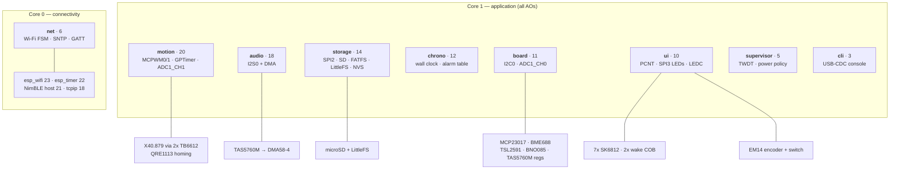
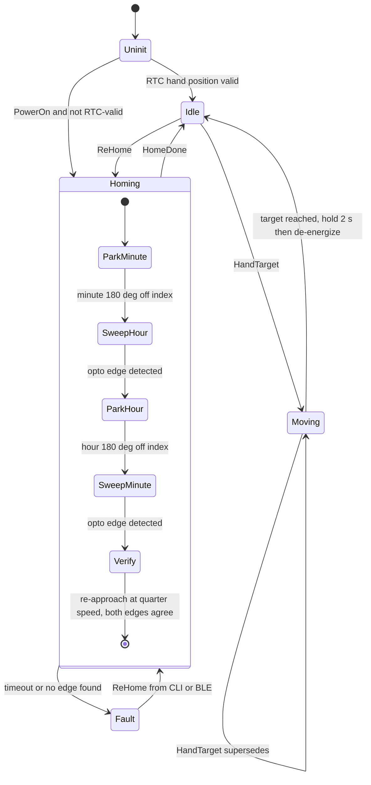
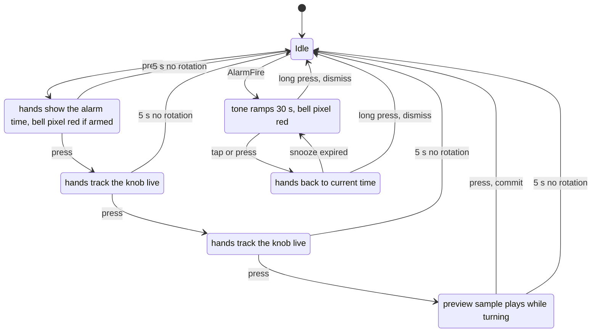
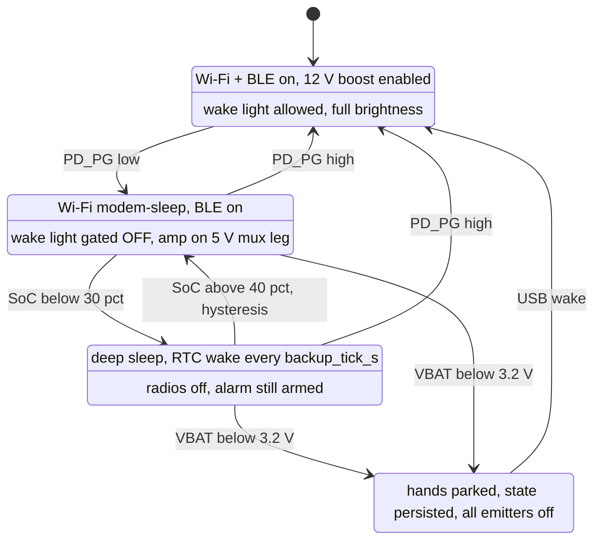
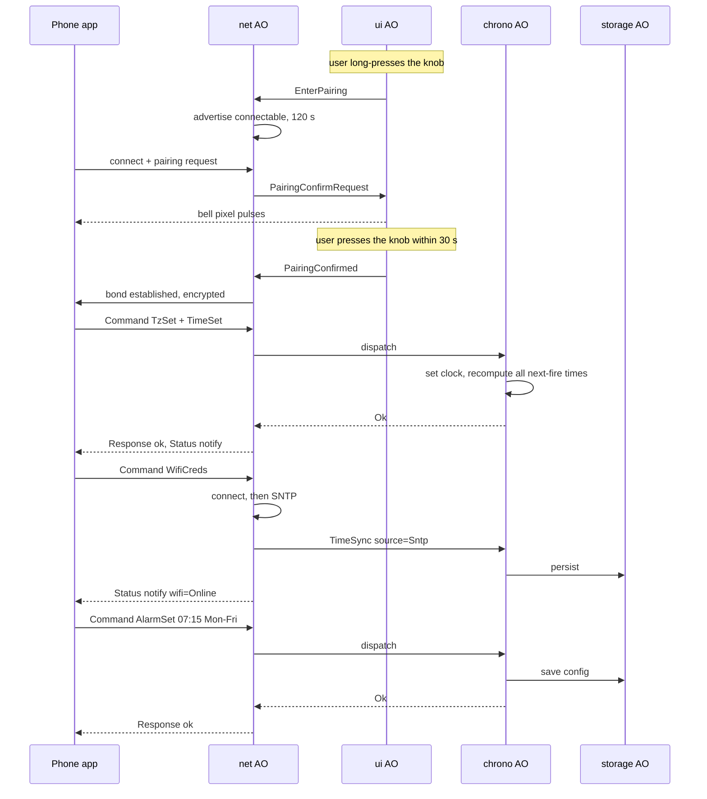
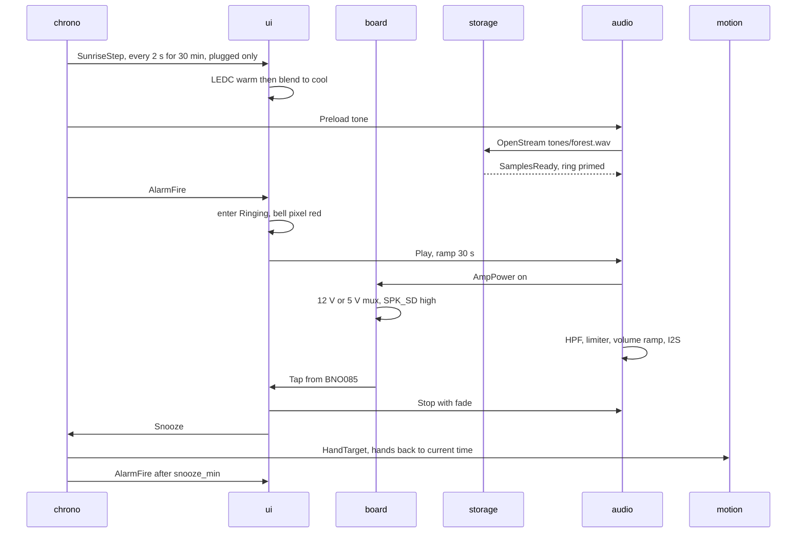

# Firmware Architecture — Wooden Smart Clock

> Design document for the ESP32-S3 firmware. Hardware is frozen and **at the fab**: main board
> **rev 0.3**, sensor board **v0.2** — both ordered 2026-08-09, ETA ~3 weeks (≈2026-08-30). This
> document is the software counterpart to [`README.md`](README.md) (product spec) and
> [`esp32.md`](esp32.md) (pin map). Where the two disagree, `esp32.md` wins on pins and this file
> wins on software structure — with the standing exceptions in **§15**.

**Status:** v1.2 · **Owner:** you · **Created:** 2026-07-26 · **Updated:** 2026-08-10
**Toolchain:** ESP-IDF **v5.5.5** (pinned, GCC 14.2, C++23) — §1.1
**Interim hardware:** **ESP32-S3-DevKitC-1U-N8R8** (DigiKey `1965-ESP32-S3-DEVKITC-1U-N8R8-ND`,
arrives 2026-08-10) — the whole firmware except the motor, amp and sensor daughterboard can be
brought up on it, plus a full host simulator. See **§12.0**.

---

## 0. Locked decisions

| # | Decision | Rationale |
|---|---|---|
| D1 | **ESP-IDF FreeRTOS + a hand-rolled C++23 active-object layer.** Not QP/C++ | FreeRTOS is unavoidable (Wi-Fi/lwIP/NimBLE/FATFS are all FreeRTOS tasks). QP's *pattern* is what's valuable — one queue per AO, run-to-completion, no shared state. The *framework* would need an SMP port and would still leave half the system as non-AO tasks. ~500 LOC you own beats a port you don't |
| D2 | **C++23 (`-std=gnu++23`), no exceptions, no RTTI, no heap after init** | GCC 13 on IDF ≥5.3 → `std::expected`, `std::variant` events, `constexpr` LUTs, concepts for driver fakes. Static queues/stacks make memory behaviour provable |
| D3 | **9 active objects**, all pinned to **core 1**; core 0 left to Wi-Fi/BLE/lwIP | Removes essentially all SMP reasoning — your AOs are effectively uniprocessor |
| D4 | **SK6812 driven by `led_strip` SPI backend on SPI3**, not RMT | SPI3 is otherwise unused (SPI2 = microSD). SPI+DMA is immune to Wi-Fi interrupt jitter, which is the classic NeoPixel glitch source; frees all 4 RMT channels. IO7 reaches SPI3 MOSI through the GPIO matrix |
| D5 | **Stepper commutation from a GPTimer ISR @ 20 kHz**, ×16 microstepping; MCPWM carrier 25 kHz | GPTimer decouples update rate from carrier, and can be **stopped when idle** (the hands are stationary >99 % of the time). 20 kHz × ×16 → max ≈1.1 rev/s slew, ample for time-set |
| D6 | **32.768 kHz crystal is the RTC slow clock** (`CONFIG_RTC_CLK_SRC_EXT_CRYS`) | Drives wall-clock retention, `esp_timer` re-basing across sleep, and the deep-sleep wake timer. ±20 ppm ≈ 1.7 s/day between SNTP syncs. See §7.1 — this is *not* the commutation clock |
| D7 | **Deep-sleep hand cadence is a runtime config** (`backup_tick_s`, default **60**, range 1–900) | Motion is always *absolute-target*, never "step N times", so cadence is a pure power/aesthetics knob with zero correctness coupling. Changing it later is one NVS value |
| D8 | **WAV only** (16-bit PCM, 44.1/48 kHz) | No decoder, no extra stack/heap, no dependency. SD space is free. FLAC can be added later behind the same `AudioSource` concept |
| D9 | **One `Command` surface shared by the CLI and the BLE app** | The phone app and the debug console need the same 40 operations. Defining them once (§5) means every feature is testable from the console the day it exists, and host-testable with no transport at all |

### 0.1 Locked 2026-08-09 (firmware kickoff)

Added when work started, three weeks ahead of the boards. Everything here exists to make the
*absence* of hardware a non-blocker.

| # | Decision | Rationale |
|---|---|---|
| D10 | **One app binary. Two axes of build config: `PROFILE` (`dev`\|`release`) × `BOARD` (`devkit`\|`rev0_3`\|`host`)** — not a separate bring-up firmware | The dev build lands well inside the 2.5 M app slot (§1.2), so flash was never the constraint. The decisive argument is different: a bring-up command that drives the **real** AO through the **real** `Command` surface tests the shipping path. A standalone "HW test" firmware tests code that will not be in the product, and drifts out of sync within a month. `BOARD` selects a pin map + a device-presence bitmask, nothing more (§7.6) |
| D11 | **Toolchain and every dependency pinned in-tree, in one file** (`firmware/toolchain.lock`), with `dependencies.lock` committed | ESP-IDF `v5.5.5` exactly — not "≥5.3". A silent GCC or `led_strip` bump is a debugging trap you pay for at 2 a.m. on the bench. Updating is deliberate and cheap: edit one line, re-run `tools/idf-setup.sh`, commit the new `dependencies.lock`. §1.1 |
| D12 | **Per-module runtime log levels through our own O(1) atomic table**, not `esp_log_level_set` — and the module list **is** the AO list | `sys debug motion verbose` at 20 kHz commutation must cost a relaxed load and a compare, not IDF's per-tag cache lookup. Sharing one vocabulary with the task names and CLI groups (D13) means there is exactly one word for "the motion subsystem" anywhere in the system. §9.4 |
| D13 | **CLI grammar is `<group> [object] <verb> [args]` where the groups are the AO names**, and `help` is generated from the same table the parser uses | `help` that is a hand-written string drifts from the parser on day two. Generating both from one `CmdSpec` table makes drift impossible and gives tab-completion for free. §9.2 |
| D14 | **`clocksim` — a native host binary running the real services against a fake HAL, with the same CLI on stdin — is a first-class build target**, not a test scaffold | The boards are 3 weeks out and the code that carries the bugs (alarm/DST, homing FSM, knob HSM, hand wrap math, limiter) needs no silicon. This also means every CLI command is exercised long before it is typed into a real device. §11.2 |
| D15 | **The DevKitC uses the production pin map verbatim.** A device that is absent returns `NotPresent`; it is never faked into reporting success | The devkit carries the *same module* (WROOM-1U-N8R8, same 3 PSRAM pins gone), so any pin remap would be gratuitous divergence — and a remap is exactly the kind of difference that hides a real bug until the PCB arrives. The one accepted exception (`ENC_SW` → `BOOT`) is opt-in and named in §12.0 |
| D16 | **`Status::NotPresent` is a first-class result, surfaced by the CLI, never logged as an error** | Half the bring-up is deliberately running with things missing (no SD card, no sensor daughterboard, no cell). If absence produces error spam, real errors get lost in it. §5 |

---

## 1. Platform

| Item | Setting |
|---|---|
| SoC / module | ESP32-S3-WROOM-1-**N8R8** (8 MB flash, 8 MB octal PSRAM, 3 GPIO consumed by PSRAM) |
| SDK | ESP-IDF **v5.5.5**, pinned exactly (D11) |
| Compiler | `xtensa-esp-elf` **GCC 14.2** (shipped with 5.5.5) |
| Language | C++23 (`-std=gnu++23`), `-fno-exceptions -fno-rtti`; C only inside vendor drivers |
| Console | **USB-Serial-JTAG only** (IO19/20) on the product board. No UART is exposed — IO43 carries `I2S_MCLK`. The devkit may add UART0 as a *secondary* console (§12.0) |
| Debug | `esp_console` REPL over USB-CDC + OpenOCD/GDB over the *same* cable |
| Host build | native clang/gcc, same C++23, no IDF — unit tests and `clocksim` (D14, §11) |

### 1.1 Toolchain & dependency locking (D11)

Three kinds of dependency, three locking mechanisms, **one file that names the versions**:

```yaml
# firmware/toolchain.lock          ← the single source of truth
idf:
  tag:  v5.5.5                    # git tag in espressif/esp-idf
  path: ~/esp/esp-idf-v5.5.5      # one dir per tag: two versions coexist, rollback is a PATH change
  targets: esp32s3
  python: "3.13"                  # IDF 5.5's detect_python.sh probes up to 3.13 only — see note
components:                       # ESP-IDF Component Manager (registry), exact versions, no ranges
  espressif/led_strip: "3.0.3"
  joltwallet/littlefs: "1.22.3"
vendored:                         # git submodules under firmware/vendor/
  sh2:      { repo: ceva-dsp/sh2, tag: v1.4.0 }    # BNO085 SH-2/SHTP driver (§6.5.1)
  googletest: { repo: google/googletest, tag: v1.17.0 }   # host tests only
tools:                            # host-side only, but still pinned — see the note below
  clang-format: "22"              # major only; output drifts between majors
manual:                           # license-gated, not fetchable — see §6.5
  bosch/BSEC: "2.6.1.0"
```

| Layer | Pinned by | Update procedure |
|---|---|---|
| **ESP-IDF + GCC + OpenOCD** | `idf.tag` above; `tools/idf-setup.sh` clones `--branch <tag> --depth 1 --shallow-submodules` into a **tag-named directory** and runs `install.sh esp32s3` | Bump `idf.tag`, re-run the script, build, commit. The old tree stays on disk — rollback is instant and does not re-download |
| **Managed components** | Exact `==` versions in `main/idf_component.yml`; **`dependencies.lock` is committed** | `idf.py update-dependencies`, review the lock diff, commit it. CI fails if the lock is dirty after a build |
| **Vendored C sources** (`sh2`, GoogleTest) | git submodules at a tag | `git -C vendor/sh2 checkout <tag>` + commit the pointer |
| **Bosch BSEC** | Not redistributable. `tools/fetch-bsec.sh` prints the download URL and verifies a **SHA-256** into `vendor/bsec/` | Optional: the build falls back to open `BME68x` + a gas baseline when `vendor/bsec/` is absent (§6.5) |
| **clang-format** | `tools.clang-format` above (major only). Style in `firmware/.clang-format`, applied by `tools/format.sh`, VS Code format-on-save and the `.githooks/pre-commit` hook | Bump the major, run `tools/format.sh`, commit the reformat **on its own** — mixing a restyle into a behaviour change makes both unreviewable. A skew only warns: it must not block a commit |

- `tools/idf-setup.sh` is **idempotent** and verifies the checked-out tag matches `toolchain.lock`
  before doing anything, so a stale shell cannot silently build against the wrong SDK.
- `tools/env.sh` sources `$idf.path/export.sh` **and** asserts `idf.py --version` equals the pinned
  tag. Every other script sources `tools/env.sh` — there is no other way in.
- ⚠ **Python.** IDF 5.5.5's `tools/detect_python.sh` walks `python3, python, python3.9 … python3.13`
  and takes the *first* hit, ignoring a pre-set `$ESP_PYTHON`. On a machine whose `python3` is
  newer than 3.13 (this one is **3.14.6**) the venv is built with an untested interpreter. Fix is a
  PATH prefix, which `tools/env.sh` applies:
  `PATH="$(brew --prefix python@3.13)/libexec/bin:$PATH"`. Re-check on every IDF bump — the
  candidate list grows with each release.

### 1.2 Build profiles & board targets (D10)

Two orthogonal axes. Neither is ever `#ifdef`-ed into logic: `PROFILE` decides what is *compiled in*,
`BOARD` decides what is *present*.

| | `dev` | `release` |
|---|---|---|
| CLI | every group, `unsafe` available | read-only subset (§9.6) |
| Log ceiling | `verbose` | `info` (verbose/debug strings stripped from the binary) |
| Asserts / 2 ms budget check (§4.2) | on | off |
| Event tracer (§6.9) | on | on — it is the field diagnostic |
| Stack-check | `strong` | `none` |

| | `rev0_3` | `devkit` | `host` |
|---|---|---|---|
| Pin map | `esp32.md` | **identical** (D15) | n/a |
| Devices present | all | whatever you wired | all, faked |
| 32.768 kHz crystal | yes | **no** → `RTC_CLK_SRC_INT_RC` (§12.0) | n/a |
| Toolchain | xtensa GCC | xtensa GCC | native |

```
idf.py -DPROFILE=dev     -DBOARD=devkit build flash monitor
idf.py -DPROFILE=release -DBOARD=rev0_3 build
cmake --preset host-dev && cmake --build --preset host-dev && ctest --preset host-dev
```

`PROFILE`/`BOARD` expand to `sdkconfig.defaults` fragment lists plus one `-DCONFIG_CLOCK_BOARD_*`;
`sdkconfig` itself is **git-ignored** so nobody can accidentally commit a hand-edited menuconfig.

### 1.3 `sdkconfig` fragments

Four fragment files in `apps/clock/`, composed by `PROFILE` × `BOARD` (§1.2). Every symbol below was
**checked against the v5.5.5 Kconfig** on 2026-08-09 — re-verify on an IDF bump, several were renamed
in 5.5 (`NEWLIB_NANO_FORMAT` → `LIBC_NEWLIB_NANO_FORMAT` is the one that bites).

```ini
# ── sdkconfig.defaults — always applied ─────────────────────────────────
CONFIG_IDF_TARGET="esp32s3"
CONFIG_ESPTOOLPY_FLASHSIZE_8MB=y
CONFIG_PARTITION_TABLE_CUSTOM=y
CONFIG_PARTITION_TABLE_CUSTOM_FILENAME="partitions.csv"
CONFIG_BOOTLOADER_APP_ROLLBACK_ENABLE=y        # §6.3 — 60 s healthy uptime confirms the image

# console: USB-CDC is the only path on the product board (IO43 is I2S_MCLK)
CONFIG_ESP_CONSOLE_USB_SERIAL_JTAG=y
CONFIG_ESP_CONSOLE_SECONDARY_NONE=y

# logging — levels are flipped at runtime from the CLI (§9.4), so the *compile*
# ceiling must be VERBOSE or the strings are not in the binary to enable.
CONFIG_LOG_MAXIMUM_LEVEL_VERBOSE=y             # release fragment lowers this
CONFIG_LOG_DEFAULT_LEVEL_INFO=y                # boot default for IDF's own tags
CONFIG_LOG_DYNAMIC_LEVEL_CONTROL=y             # required by `sys debug idf <lvl>`
CONFIG_LOG_TIMESTAMP_SOURCE_RTOS=y             # ms since boot — same base as the event tracer
CONFIG_LOG_COLORS=y

# `sys top` is not collectible without these three
CONFIG_FREERTOS_USE_TRACE_FACILITY=y
CONFIG_FREERTOS_GENERATE_RUN_TIME_STATS=y
CONFIG_FREERTOS_VTASKLIST_INCLUDE_COREID=y

# the CLI prints dBFS, lux, ppm and volts — nano-printf has no %f
CONFIG_LIBC_NEWLIB_NANO_FORMAT=n

# memory
CONFIG_SPIRAM=y
CONFIG_SPIRAM_MODE_OCT=y
CONFIG_SPIRAM_SPEED_80M=y
CONFIG_SPIRAM_USE_MALLOC=y
CONFIG_SPIRAM_MALLOC_ALWAYSINTERNAL=4096       # small allocs stay internal

# language
CONFIG_COMPILER_CXX_EXCEPTIONS=n
CONFIG_COMPILER_CXX_RTTI=n
CONFIG_COMPILER_OPTIMIZATION_PERF=y

# scheduling
CONFIG_FREERTOS_HZ=1000
CONFIG_FREERTOS_UNICORE=n
CONFIG_ESP_MAIN_TASK_AFFINITY_CPU0=y

# power (battery modes, §7.4)
CONFIG_PM_ENABLE=y
CONFIG_FREERTOS_USE_TICKLESS_IDLE=y
CONFIG_PM_DFS_INIT_AUTO=y

# reliability
CONFIG_ESP_TASK_WDT_INIT=y
CONFIG_ESP_TASK_WDT_TIMEOUT_S=10
CONFIG_ESP_TASK_WDT_CHECK_IDLE_TASK_CPU1=n     # AOs feed it explicitly
CONFIG_ESP_COREDUMP_ENABLE_TO_FLASH=y
CONFIG_ESP_COREDUMP_DATA_FORMAT_ELF=y
CONFIG_ESP_COREDUMP_CHECK_BOOT=y               # `sys coredump` learns one exists at boot
CONFIG_ESP_DEBUG_OCDAWARE=y

# radios
CONFIG_BT_ENABLED=y
CONFIG_BT_NIMBLE_ENABLED=y
CONFIG_BT_NIMBLE_EXT_ADV=n

# ── sdkconfig.dev ───────────────────────────────────────────────────────
CONFIG_COMPILER_STACK_CHECK_MODE_STRONG=y
CONFIG_FREERTOS_CHECK_STACKOVERFLOW_CANARY=y
CONFIG_HEAP_POISONING_LIGHT=y
CONFIG_ESP_SYSTEM_PANIC_PRINT_HALT=y           # halt, don't reboot: the backtrace stays on screen
CONFIG_CLOCK_CLI_UNSAFE=y                      # ours — §9.6
CONFIG_CLOCK_LOG_MAX_LEVEL_VERBOSE=y           # ours — §9.4

# ── sdkconfig.release ───────────────────────────────────────────────────
CONFIG_COMPILER_STACK_CHECK_MODE_NONE=y
CONFIG_LOG_MAXIMUM_LEVEL_INFO=y                # strips debug/verbose format strings
CONFIG_CLOCK_CLI_UNSAFE=n
CONFIG_CLOCK_LOG_MAX_LEVEL_INFO=y

# ── sdkconfig.rev0_3 ────────────────────────────────────────────────────
# D6 — external 32.768 kHz crystal as RTC slow clock ← accurate timekeeping
CONFIG_RTC_CLK_SRC_EXT_CRYS=y
CONFIG_RTC_CLK_CAL_CYCLES=3000
CONFIG_ESP_TIME_FUNCS_USE_RTC_TIMER=y
CONFIG_ESP_TIME_FUNCS_USE_ESP_TIMER=y
CONFIG_CLOCK_BOARD_REV0_3=y

# ── sdkconfig.devkit ────────────────────────────────────────────────────
# DevKitC-1 has NO 32.768 kHz crystal (§12.0). Asking for one would fall back
# to the RC silently, which is precisely the bug §7.1 exists to catch — so ask
# for the RC honestly and let `chrono` report a degraded time source.
CONFIG_RTC_CLK_SRC_INT_RC=y
CONFIG_ESP_TIME_FUNCS_USE_RTC_TIMER=y
CONFIG_ESP_TIME_FUNCS_USE_ESP_TIMER=y
CONFIG_CLOCK_BOARD_DEVKIT=y

# ── sdkconfig.devkit-uart — opt-in, only for chasing a boot/panic crash ──
# There is NO "secondary = UART" in IDF: the ESP_CONSOLE_SECONDARY choice offers
# only USB_SERIAL_JTAG, and only when the primary is *not* USB_SERIAL_JTAG. So
# capturing the panic tail on the devkit's CP2102N port means inverting the pair,
# which moves the REPL to UART too. Non-default on purpose — the USB-CDC console
# is the path the product ships with, and that is the one to keep exercising.
CONFIG_ESP_CONSOLE_UART_DEFAULT=y
CONFIG_ESP_CONSOLE_SECONDARY_USB_SERIAL_JTAG=y
```

> **C++ standard.** IDF 5.5 compiles C++ as `-std=gnu++2b` by default. The project overrides this to
> `-std=gnu++23` so the target and host builds agree on one spelling; they are the same standard,
> GCC 14 accepts both.

### Partition table (8 MB)

| Name | Type | Size | Use |
|---|---|---|---|
| `nvs` | data/nvs | 64 K | config, hand trim, alarm table |
| `nvs_keys` | data/nvs_keys | 4 K | NVS encryption (optional) |
| `otadata` | data/ota | 8 K | |
| `phy_init` | data/phy | 4 K | |
| `coredump` | data/coredump | 128 K | post-mortem, read by `cli` |
| `ota_0` / `ota_1` | app | 2.5 M each | A/B OTA with rollback |
| `assets` | data/littlefs | ~2.7 M | system sounds, BSEC state, event-trace spill |

> Resized 2026-08-06 with the **N16R8 → N8R8** module swap (16 MB → 8 MB flash). `coredump`
> moves ahead of the app slots so `ota_0` starts 64 K-aligned at `0x40000`; the two 2.5 M app
> slots then run to `0x540000` and `assets` takes the rest of the chip. **An app slot can never
> be grown by OTA** — if a build approaches 2.5 M, take the space from `assets`, not from `ota_*`.

microSD carries **user** assets only (`/sd/tones/*.wav`); the device must be fully functional with no card.

---

## 2. Layering & repo layout

```
firmware/
├─ toolchain.lock                 # D11 — the only file where a version number is written
├─ CMakePresets.json              # host-dev · host-asan · host-release
├─ CMakeLists.txt                 # host build entry point (IDF entry is apps/clock/)
├─ tools/
│  ├─ env.sh                      # source pinned IDF, assert the tag, fix the python PATH (§1.1)
│  ├─ idf-setup.sh                # clone + install the pinned IDF; idempotent
│  ├─ build.sh                    # PROFILE=/BOARD= → sdkconfig fragment list → idf.py
│  ├─ format.sh                   # clang-format the tree; --check for CI + the pre-commit hook
│  ├─ fetch-bsec.sh               # license-gated blob, SHA-256 verified (§6.5)
│  └─ gen_cmd_docs.py             # CmdSpec table → the §9.3 table; CI fails if they differ
├─ apps/
│  ├─ clock/                      # ← the product.   idf.py -C apps/clock ...
│  │   CMakeLists.txt  partitions.csv
│  │   sdkconfig.defaults  sdkconfig.{dev,release,devkit,devkit-uart,rev0_3}
│  │   main/ app_main.cpp         # construct + start AOs, nothing else
│  │         idf_component.yml    # managed deps at exact versions
│  └─ clocksim/                   # ← D14. native binary, zero IDF
│      CMakeLists.txt  main.cpp   # same services, host port, fake HAL, CLI on stdin
│      uibridge.{hpp,cpp}         # the loopback socket ux/ attaches to — see below
├─ components/
│  ├─ core/                       # ← 100 % host-testable, zero IDF
│  │   event.hpp  ao.hpp  hsm.hpp  bus.hpp  timer.hpp
│  │   result.hpp units.hpp static_vector.hpp ring.hpp trace.hpp
│  │   log.hpp                    # §9.4 per-module levels — the backend is a seam
│  │   port.hpp port_{esp,host}.cpp  # thread, mutex, signal, monotonic clock: two impls
│  ├─ command/                    # ← host-testable: the Command/Response surface (§5)
│  ├─ domain/                     # ← host-testable: hand math, and later the alarm
│  │                              #    scheduler, sunrise curve, DSP, gamma
│  ├─ board_cfg/                  # ← zero IDF: pin map + device-presence bitmask per BOARD (D15)
│  │   board_rev0_3.hpp  board_devkit.hpp  board_host.hpp  present.hpp
│  ├─ clk_hal/                    # NOT `hal/` -- that name is taken by ESP-IDF itself
│  │   api/                       # the only headers a driver may include
│  │   esp/                       # RAII over IDF: Mcpwm Gptimer I2cBus I2sTx SpiBus
│  │   │                          #   Adc Pcnt LedStrip Ledc Gpio Nvs UsbConsole
│  │   host/                      # fakes, scriptable from `sim` (§9.5)
│  ├─ drivers/                    # X40Movement Tb6612 Qre1113 Sk6812Chain Tas5760
│  │                              # Mcp23017 Bme688 Tsl2591 Bno085 Lt3652Status
│  ├─ services/                   # the 9 active objects (§3)
│  ├─ cli/                        # §9: CmdSpec table, parser, generated help, stream sink
│  └─ transport/                  # cli_console/  ble_gatt/  → both call command::dispatch
├─ vendor/                        # git submodules, pinned in toolchain.lock
│  └─ sh2/  googletest/  bsec/    # bsec/ may be empty — the build degrades (§6.5)
└─ test/
   ├─ host/                       # GoogleTest, native compiler, fakes for hal/  (§11.1)
   └─ target/                     # Unity, on-device peripheral tests            (§11.3)

../ux/                            # ← the clock on screen. NOT firmware, holds no logic
   uxapp.py  geometry.json  web/  # stdlib HTTP + WebSocket bridge onto uibridge
```

`uibridge` lives in `apps/clocksim/` and **not** under `components/`, on purpose: `apps/clock`
puts `components/` on `EXTRA_COMPONENT_DIRS`, so anything there is a component the target
build can see. In the app it is structurally impossible to link into the firmware.

**Dependency rule (enforced by CMake `REQUIRES`, so violations fail the build):**

```
apps/clock     → services, transport, cli, clk_hal/esp  (+ IDF)
apps/clocksim  → services, transport, cli, clk_hal/host (no IDF at all) + uibridge
services       → { command, domain, drivers, core, board_cfg }
drivers        → { hal/api, core, board_cfg }    services never touch hal for an owned peripheral
cli, transport → command                          never services, never hal
hal/esp, core/port/esp → IDF                      the ONLY components that may include esp_*.h
core, domain, command, board_cfg → nothing        (no IDF headers → host build works)
```

`hal/api` **declares**, `hal/esp` and `hal/host` **define**. The choice is made by CMake, never by
`#ifdef` in a driver — a driver cannot discover which implementation it was linked against, which is
what keeps `clocksim` honest.

> **Where the CLI actually sits today.** `cli → command, never services, never hal` is the
> destination and it arrives with `command::dispatch` (§5). Until then the `cli` rows reach
> `services` and `hal` directly. Every row is still a *view*: it posts an event to the owning
> AO and reads a snapshot, and no row drives a peripheral an AO owns (rule 1). The
> `REQUIRES` graph currently records the scaffold, not the destination.

### Rules of the road

1. **One owner per peripheral.** Named in §3. Nobody else may touch it — not even "just to read".
2. **No AO event handler blocks > 2 ms.** Debug builds assert on overrun. Slow work → request another AO.
3. **No heap allocation after `app_main` returns.** Static queues, static stacks, fixed-capacity containers.
4. **No shared mutable state.** Events carry copies; config is an immutable snapshot swapped atomically.
5. **Drivers never post events**, never log at INFO, never block on a queue. They are pure I/O + math.
6. **Anything reachable from the CLI is reachable from BLE and vice versa** — one `Command` enum (§5).
7. **All scheduling from `esp_timer_get_time()`** (monotonic µs). `time()` is for *display only*.
8. **ISRs are IRAM-safe**: no logging, no allocation, no I²C, notify/queue-from-ISR only.
9. **Nothing below `apps/` calls `printf` or `ESP_LOGx` directly** — only the `CLK_LOG*` macros
   (§9.4). One grep proves it; a CI check enforces it. This is what makes per-module levels total
   rather than mostly true, and it is what lets `core/` and `domain/` compile on the host.
10. **Every CLI command is a row in the `CmdSpec` table** (§9.2). `esp_console_cmd_register` is
    called in exactly one file, inside `components/cli`. No feature registers its own command.
11. **Absent hardware returns `Status::NotPresent`** (D16) — never a fake success, never an error
    log. `sensor list` shows presence; a bring-up session with three things unplugged stays quiet.
12. **Streaming (`sensor … stream`) never runs in the `cli` task** — the owning AO produces samples
    on its own cadence and writes them to a sink. The console cannot busy-wait on hardware.

---

## 3. Concurrency model

### 3.1 Core pinning

Core 0 belongs to the IDF: `esp_wifi` (prio 23), `esp_timer` (22), NimBLE host (21), `tcpip` (18).
**Core 1 runs every application task.** Consequence: your AOs preempt each other strictly by priority
and never run truly in parallel, so the only cross-core concerns are the `net` AO's queue and a
handful of `std::atomic` status flags.

### 3.2 Tasks

| # | AO | Prio | Core | Stack | Owns exclusively | Responsibility |
|---|---|---|---|---|---|---|
| 1 | **`motion`** | 20 | 1 | 3.5 K | MCPWM0, MCPWM1, GPTimer0, ADC1_CH1 (IO2) | Trajectory planning, homing FSM, absolute hand bookkeeping, backlash policy |
| 2 | **`audio`** | 18 | 1 | 8 K | I²S0 + DMA | WAV streaming → HPF biquad + limiter + volume ramp → I²S. Amp pop-free sequencing |
| 3 | **`storage`** | 14 | 1 | 6 K | SPI2/SD/FATFS, LittleFS, NVS | Audio prefetch into a PSRAM ring; config load/save; BLE asset upload; OTA writes. **All blocking file I/O lives here** |
| 4 | **`chrono`** | 12 | 1 | 4 K | wall clock, alarm table | Time authority (TZ/DST/sources), alarm scheduling, sunrise pre-roll, hand targets, re-home policy |
| 5 | **`board`** | 11 | 1 | 5 K | **I²C0 (sole owner)**, ADC1_CH0 (IO1) | MCP23017 service, TAS5760M registers, BME688/BSEC, TSL2591, BNO085 (SHTP/SH-2), VBAT, charger status, radio toggle |
| 6 | **`ui`** | 10 | 1 | 4 K | PCNT unit0, SPI3→SK6812, LEDC ch0/1 | The knob HSM; all light output (7 pixels + wake light), gamma, ALS gating, hard-off |
| 7 | **`net`** | 6 | **0** | 5 K | esp_event, SNTP, NimBLE app link, OTA | Connectivity HSM, BLE GATT server + provisioning, obeys `RADIO_OFF` as a hard override |
| 8 | **`supervisor`** | 5 | 1 | 3 K | TWDT, power policy, coredump | Power-mode policy, low-battery shutdown, fault latch + LED fault codes, reset-reason reporting |
| 9 | **`cli`** | 3 | 1 | 6 K | USB-CDC console | Text ⇄ `Command`. Touches no hardware |

Total static stack ≈ 45 KB of 512 KB internal SRAM.

**Why 9 and not 3 or 20.** Each task exists because it owns a resource that must have exactly one
owner (I²C, I²S, SPI2, MCPWM, the console) or because it must not be blocked by a slower peer
(`motion` must never wait on an SD read; `audio` must never wait on I²C). Merge levers if you want
fewer: `supervisor`→`chrono`, `storage`→`audio` (costs the decoupled prefetch). Split levers:
LED rendering out of `ui`, BLE out of `net`.

### 3.3 ISR / callback contexts

| Source | Rate | Work |
|---|---|---|
| **GPTimer0 → commutation** | 20 kHz **while moving; stopped when idle** | Q16.16 phase accumulator += velocity → index `constexpr` sine LUT → write 8 MCPWM comparators. ≈3 µs, IRAM. The task never touches a comparator |
| I²S `on_sent` | ~180 Hz | Task-notify `audio` |
| GPIO `ENC_SW` IO17 | user | Start 5 ms debounce timer → `KnobPress` to `ui` |
| GPIO `SENSOR_INT` IO42 | rare | Notify `board` → drain one SHTP packet from the BNO085. **BNO085 only** — the TSL2591's `ALS_INT` moved to expander GPB3 (`REVIEW.md` #11), so it arrives via `EXPANDER_INT` |
| GPIO `EXPANDER_INT` IO44 | rare | Notify `board` → reads INTF/INTCAP (clears the latch). Sources: charger CHRG/FAULT/PD_PG, `SPK_FAULT`, radio toggle, **TSL2591 `ALS_INT` (GPB3)** |
| PCNT IO47/48 | — | **No ISR.** Hardware quadrature + glitch filter; `ui` diffs the count every 20 ms |
| SPI3 DMA (LED) | on demand | Driver-internal |

### 3.4 Task & ownership map



### 3.5 Event flow (publish/subscribe)


Solid arrows = normal runtime events. Dashed = the shared command surface (§5).

---

## 4. The core framework (~500 LOC)

### 4.1 Events

```cpp
// components/core/event.hpp
struct Tick          { uint32_t seq; };
struct KnobTurn      { int16_t detents; };
struct KnobPress     { Msec held; };
struct Tap           { uint8_t count; };
struct HandTarget    { HandAngle hour, minute; MoveStyle style; };
struct HandState     { HandAngle hour, minute; bool homed, moving; };
struct AlarmFire     { AlarmId id; };
struct SunriseStep   { uint8_t warm_pct, cool_pct; };
struct PowerState    { Millivolt vbat; uint8_t soc; bool plugged, charging, fault; };
struct Ambient       { Lux lux; Millicelsius temp; uint16_t iaq; };
struct NetState      { WifiPhase wifi; BlePhase ble; bool radio_disabled; };
struct PowerMode     { Mode mode; };          // Plugged | Battery | BatteryLow | Shutdown
// ... ~40 total

using Event = std::variant<Tick, KnobTurn, KnobPress, Tap, HandTarget, HandState,
                           AlarmFire, SunriseStep, PowerState, Ambient, NetState,
                           PowerMode, /* ... */>;
static_assert(sizeof(Event) <= 16, "keep events queue-cheap");
```

Events are **values**. Anything bigger than 16 bytes (audio blocks, asset chunks) travels as an
index into a statically allocated pool, with the pool slot owned by exactly one AO at a time.

### 4.2 Active object

```cpp
template <class Derived, size_t QLen>
class ActiveObject {
public:
    void start(const char* name, UBaseType_t prio, uint32_t stack, BaseType_t core);
    bool post(Event const&);                              // task context
    bool postFromIsr(Event const&, BaseType_t* woken);    // ISR context
private:
    [[noreturn]] void run() {
        static_cast<Derived*>(this)->onStart();
        for (;;) {
            Event e;
            if (queue_.receive(e, kWdtFeedPeriod)) {
                trace::record(id_, e);                    // §6.9 event tracer
                ScopedBudget b{id_, 2_ms};                // debug: assert on overrun
                std::visit([this](auto const& ev) {
                    static_cast<Derived*>(this)->on(ev);  // overload set, compile-time dispatch
                }, e);
            }
            esp_task_wdt_reset();
        }
    }
    StaticQueue<Event, QLen> queue_;
};
```

`std::visit` over an overload set means **an AO that forgets to handle an event fails to compile**
(provide a catch-all `on(auto const&) {}` only where ignoring is deliberate).

### 4.3 Hierarchical state machine

```cpp
class Hsm {
protected:
    struct Result { enum { Handled, Unhandled, Transition } kind; State target; };
    using State = Result (Hsm::*)(Event const&);
    Result handled()             { return {Result::Handled, nullptr}; }
    Result unhandled()           { return {Result::Unhandled, nullptr}; }   // bubbles to parent
    Result transit(State s)      { return {Result::Transition, s}; }
    virtual State parentOf(State) const = 0;
public:
    void dispatch(Event const&);   // walks up on Unhandled; runs exit/entry chains on Transition
};
```

Used by `ui` (§6.6), `motion` homing (§6.1), `net` (§6.7), and the alarm/ringing lifecycle.
~120 lines, host-tested standalone.

### 4.4 Class model


### 4.5 Units

```cpp
template <class Tag, class Rep> struct Quantity { Rep v; /* +,-,*,/ , comparisons */ };
using Steps      = Quantity<struct StepsTag,   int32_t>;
using MicroSteps = Quantity<struct UStepsTag,  int32_t>;
using HandAngle  = Quantity<struct AngleTag,   uint32_t>;  // 0 .. 2^16 == full revolution
using Msec       = Quantity<struct MsecTag,    uint32_t>;
using Millivolt  = Quantity<struct MvTag,      uint16_t>;
```

`HandAngle` as a **16-bit wrapping fixed-point revolution** is the single best decision in the
motion code: wrap-around, shortest-path direction and "12 o'clock" all become integer arithmetic
with no modulo bugs, and hour vs minute hands share one type without ever being interchangeable
with `Steps`.

---

## 5. The `Command` surface (CLI ⇔ BLE ⇔ tests)

The debug console and the phone app need the *same* ~40 operations. Define them once:

```cpp
// components/command/command.hpp   (no IDF, host-testable)
struct TimeSet    { int64_t epoch_ms; };
struct TzSet      { StaticString<48> posix; StaticString<40> iana; };
struct AlarmSet   { AlarmId id; Alarm a; };
struct AlarmArm   { AlarmId id; bool armed; };
struct HandGoto   { HandAngle h, m; };
struct HandHome   {};
struct VolumeSet  { uint8_t pct; };
struct WifiCreds  { StaticString<33> ssid; StaticString<64> psk; };
// ...
// ── diagnostics: CLI-reachable, and deliberately BLE-reachable too (rule 6) ──
struct LogLevelSet{ log::Mod mod; log::Level lvl; };        // §9.4
struct PixelSet   { PixelId id; Rgbw c; };                  // ui led
struct WakeSet    { uint8_t warm_pct, cool_pct; };
struct SensorRead { SensorId s; };                          // one-shot
struct SensorStream{ SensorId s; uint16_t hz; Msec ttl; };  // rule 12
struct ExpanderSet{ ExpanderPin p; bool level; };
struct SelfTest   { TestId t; };                            // led walk, i2c scan, opto sweep …

using Command  = std::variant<TimeSet, TzSet, AlarmSet, AlarmArm, HandGoto, HandHome,
                              VolumeSet, WifiCreds, LogLevelSet, PixelSet, WakeSet,
                              SensorRead, SensorStream, ExpanderSet, SelfTest, /* ... */>;

enum class Origin  : uint8_t { Local, Cli, Ble };
enum class Status  : uint8_t { Ok, BadArg, Denied, Busy, NotReady, Failed, NotPresent };

// Where a result goes. The CLI writes lines to the console; BLE packs a notification;
// a host test appends to a vector and asserts on it. Nothing above knows which.
struct ResponseSink {
    virtual void line(std::string_view) = 0;                // human-readable
    virtual void kv(std::string_view k, Value v) = 0;        // machine-readable (§9.5 --csv)
    virtual void done(Status) = 0;
};

Status dispatch(Command const&, Origin, ResponseSink&);
```

- `dispatch()` validates, checks authorization for the origin, and posts the corresponding event to
  the owning AO. It never performs I/O itself.
- **Authorization:** `Origin::Ble` requires a bonded, encrypted link. `Origin::Cli` requires
  `unsafe on` for anything that moves hardware. `Origin::Local` (knob) is always allowed.
- **Host tests call `dispatch()` directly** with fake AOs — the entire app-facing feature set is
  testable with no transport, no radio and no hardware.

Two thin adapters, nothing more:

| Adapter | Lives in | Job |
|---|---|---|
| `transport/cli_console` | `cli` AO | `CmdSpec` table + argtable3 → `Command`; `ResponseSink` → formatted text (§9) |
| `transport/ble_gatt` | `net` AO | TLV frame → `Command`; `ResponseSink` → notification (§8) |

Because the diagnostics commands are ordinary `Command`s, **`clocksim` gets them for free**: the host
binary links the same `dispatch()` and the same `CmdSpec` table, so `ui led bell red` is a real
command with a real authorization check three weeks before a pixel exists to light (D14).

---

## 6. Services in detail

### 6.1 `motion`

**Owns:** MCPWM0 (minute, IO4/5/6/3), MCPWM1 (hour, IO38/39/40/41), GPTimer0, ADC1_CH1 (`HOME_OPTO`, IO2).
**Does not own:** `STEP_STBY` — that lives on the MCP23017, so `motion` requests it from `board` (below).

- **Geometry:** X40.879 on the X27 base spec ≈ **1/3° per full step → 1080 steps/rev**; ×16
  microstepping → 17 280 µsteps/rev. ⚠ *Verify on the bench during bring-up (`motion spr`) — this is
  the one number the whole dial depends on.*
- **Cadence:** minute hand = 1 full step every 3.33 s; hour hand = 1 full step every 40 s. The
  movement is idle >99 % of the time → coils de-energized between moves, GPTimer stopped.
- **Commutation:** ISR advances a Q16.16 phase accumulator and writes 8 comparator registers from a
  `constexpr` 64-entry quarter-sine LUT. Task computes only the trapezoidal velocity profile.
- **Motor power handshake:** entering `Moving` posts `MotorPower{on}` to `board`; `board` clears
  `STEP_STBY` over I²C (~200 µs) and replies. Power is held for **2 s after the last move**
  (hysteresis) so a multi-step slew doesn't thrash the I²C bus.
- **Backlash:** every move **finishes clockwise**. A counter-clockwise target overshoots by
  `backlash_usteps` (NVS, default 0) and approaches from below. Removes gear slop from the displayed time.
- **Absolute-target only.** The API is `HandTarget{hour, minute, style}`. There is no "step N times"
  command in the system, which is exactly what makes D7 (flexible sleep cadence) free.



**Re-home policy** (owned by `chrono`, executed here): cold boot · after an SNTP step > 2 s ·
after 24 h of continuous running · on user request · after any `Fault`.

### 6.2 `audio`

**Owns:** I²S0 (BCLK IO10, LRCLK IO11, DOUT IO12, **MCLK IO43 = 256 × f_S**).

Pipeline, per 256-frame block (5.3 ms @ 48 kHz):

```
storage ring (PSRAM) → WAV unpack 16-bit → stereo→mono downmix
  → HPF biquad ~150 Hz (Linkwitz-Riley, protects the 2 mm-Xmax DMA58-4)
  → optional shelf EQ  → soft-knee peak limiter (attack 1 ms / release 100 ms)
  → smoothed volume gain → hard-clip guard → I²S DMA (both slots, PBTL)
```

All float (the S3 has a single-precision FPU). The **TAS5760M has no on-chip DSP** — this chain is
the only thing between a 12 V Class-D amp and a 2″ driver, so the limiter is a **safety** feature,
not a nicety. Coefficients are live-tunable from the CLI (`audio dsp`) and persisted to NVS.

#### Output-power ceiling — **8 W peak into 4 Ω (hard limit, 2026-07-27)**

The limiter is also what protects the **output-filter inductors L5/L6** (Coilcraft XAL4040-103MEC,
10 µH). They carry the full speaker current, and nothing in hardware protects them: the TAS5760M's
overcurrent error trips at **7 A per BTL output, doubled in PBTL ≈ 14 A** — 4–5× past the
inductors' **3.0 A saturation**. Firmware is the only guard.

| | @ 12 W (rail-limited max) | **@ 8 W (the cap)** | Part rating |
|---|---|---|---|
| Speaker RMS current | 1.73 A | **1.41 A** | Irms 2.2 A (20 °C rise) |
| Audio peak current | 2.45 A | **2.00 A** | — |
| + switching ripple `PVDD/(4·L·f_SW)` | ±0.38 A | ±0.38 A | — |
| **Worst-case instantaneous** | 2.83 A (94 % of Isat) | **2.38 A (79 % of Isat)** | **Isat 3.0 A** |
| DCR heat, both inductors | 0.50 W | **0.34 W** | DCR 84 mΩ |

**Ceiling in dBFS** — the limiter works in dBFS, so the watt target has to be translated through the
TAS5760M analog gain (`A_GAIN[3:2]`, reg 0x06 — see `power_values.md` §10):

```
V_rms(8 W, 4 Ω) = √(8·4) = 5.66 V        ceiling_dBFS = 20·log10(5.66 / 10^(A_GAIN_dBV/20))
```

| A_GAIN | 0 dBFS equals | ceiling for 8 W |
|---|---|---|
| **19.2 dBV** (our setting) | 9.12 V rms | **−4.1 dBFS** |
| 22.6 dBV | 13.49 V rms | −7.5 dBFS |
| 25.0 dBV | 17.78 V rms | −9.9 dBFS |

- `kSpkPowerCeilW = 8.0f` and `kLimitCeilDbfs = -4.1f` are **compile-time constants**, not config.
  `Config::limiter_dbfs` and `audio dsp limit` are **clamped to ≤ `kLimitCeilDbfs`** — the CLI accepts
  a quieter value and rejects a louder one with the reason. Default moves **−1.0 → −4.1 dBFS**.
- **Recompute `kLimitCeilDbfs` if A_GAIN or the 12 V setpoint changes.** A gain bump silently
  re-scales the watts behind the same dBFS number.
- **On battery** the *inductor* ceiling is not the binding limit: PVDD drops to ~4.96 V (LTC4412
  mux), the rail clips at 3.5 V rms ≈ **3.1 W**, peak inductor current ~1.25 A. The hard-clip
  guard handles it. **The binding limit on battery is the cell protector** — see R-AUDIO-1.
- The 8 W cap does **not** replace the shared-rail budget: 8 W acoustic ≈ 9.4 W off the 12 V boost,
  and wake LEDs + audio must still stay ≤ ~12 W total (`power_values.md` §5) during a sunrise alarm.

> **R-AUDIO-1 — the cell protector, not the amp, is what limits a loud alarm.**
> The rails are fed from the BAT node, and `R18` caps the LT3652's contribution to **~1 A**
> (`kicad/REVIEW.md` #7). Everything above that comes out of the cell **even while plugged in**,
> through the `HY2111-HB` + `AOSD32334C` pair. Trip is `V_DIP` / R_FET = 175–225 mV / 50–66 mΩ →
> **2.65 A worst case**, and `T_DIP` is only 5–15 ms, so a held bass note trips it just as well as
> a DC load — a high-crest-factor asset lowers *average* draw but not the trip risk.
>
> | case | audio | + wake LEDs | BAT-node draw | from the cell | vs 2.65 A trip |
> |---|---|---|---|---|---|
> | plugged, alarm only | 8 W | — | ~2.6 A | **~1.6 A** | comfortable |
> | plugged, sunrise alarm | 8 W | ~2.6 W | ~3.3 A | **~2.3 A** | **~15 % margin** |
> | battery, alarm | 3.1 W | *(gated off)* | — | **~1.9 A peak** | comfortable |
>
> Two firmware obligations follow, neither optional:
> 1. **Never ramp the sunrise LEDs and the alarm peak together on purpose.** The margin above is
>    15 %, which is the tolerance stack, not headroom. Reach full LED brightness *before* the
>    audio ramp starts, or hold the LEDs at partial output while audio is above ~half scale.
> 2. **A protector trip is self-clearing and looks like a spontaneous reboot** — the load
>    disappears, the protector releases, the board comes back. If `board` sees an unexplained
>    brown-out during an alarm, log it as a *suspected OC trip* with the audio and LED duty at
>    that instant; do not silently retry at the same level.
>
> ⚠ This budget assumes the **-HB** protector. The **-GB** (fitted until 2026-08-08) trips at
> **1.89 A** worst case, i.e. below the plugged sunrise-alarm case *and* marginal on battery.
> If a board is ever built with a -GB, the audio ceiling must drop to ~4 W plugged.
- ⚠ Bench-confirm before trusting it: current probe on L5 at max volume with the real alarm sample,
  looking for the current peaks going non-linear (core saturation), not just for the dBFS number.

**Pop-free sequencing** (both directions, via `board`):
start → enable 12 V/5 V PVDD path → start I²S clocks → wait 10 ms → `SPK_SD` high (unmute) → ramp gain.
stop → ramp gain to 0 → `SPK_SD` low → wait 5 ms → stop I²S.

### 6.3 `storage`

**Owns:** SPI2 (SD: SCLK IO13, MOSI IO14, MISO IO21, CS IO18), LittleFS, NVS.

- Prefetches WAV data into a **2 s PSRAM ring** (≈192 KB @ 48 kHz stereo) so `audio` never blocks
  on a 100 ms SD hiccup. Underrun → fade to silence, never a click.
- Config load/save with a versioned schema + per-version migration function.
- BLE asset upload lands here (offset + CRC32, resumable).
- OTA image writes; rollback confirmation only after 60 s of healthy uptime.
- **Card-absent is a normal state.** System sounds live in LittleFS on internal flash.

### 6.4 `chrono` — the time authority

- **Two clocks, never confused:** `esp_timer_get_time()` (monotonic µs) for *all* scheduling;
  `localtime()` + POSIX TZ for *display only*.
- **Time source priority** with quality tracking:

| Source | Set by | Quality | Notes |
|---|---|---|---|
| `Sntp` | `net` | best | `esp_netif_sntp`, **smooth (adjtime) sync** so hands slew rather than jump; step only if delta > 35 min |
| `Ble` | phone app | good | Used when Wi-Fi is unavailable or disabled by the rear toggle |
| `Rtc` | 32.768 kHz crystal across reboot/sleep | ok | ±20 ppm ≈ 1.7 s/day |
| `None` | cold boot, no cell, no USB | — | Hands run the "unknown time" animation; status pixel `clock` pulses |

- **Drift learning (optional, cheap):** record the correction applied at each SNTP sync, estimate the
  crystal's ppm error, and apply it as a slow correction while offline. Turns 1.7 s/day into ~0.2 s/day.
- **Alarm model:** `{id, hh, mm, dow_mask, enabled, tone, sunrise_min, volume, snooze_min}`, up to 8.
  Next-fire is **recomputed from `localtime` whenever anything changes** — never stored as
  "seconds remaining". DST policy: an alarm at a skipped local time fires at the next valid minute;
  a doubled local time fires **once**, on the first occurrence.
- Emits `HandTarget` on each due step, `SunriseStep` during the pre-roll, `AlarmFire` at T=0.

### 6.5 `board` — sole I²C owner

| Device | Addr | Cadence |
|---|---|---|
| MCP23017 | 0x20 | On `EXPANDER_INT` → read `INTF`/`INTCAP` (clears the latch) **+ a 1 s resync read** to recover from a missed interrupt (a known MCP23017 failure mode) |
| TAS5760M | 0x6C | On demand (config at start, volume, mute, fault read) |
| BNO085 | 0x4A | `SENSOR_INT` → drain one SHTP packet; **Tap Detector only**, no polling. Not a register map — see below |
| TSL2591 | 0x29 | 1 s, auto-gain; publishes `Ambient` |
| BME688 | 0x77 | BSEC LP mode, 3 s; state blob saved to LittleFS every 6 h |

Also owns **ADC1_CH0 `VBAT_SENSE`**: assert `VBAT_DIV_EN` → settle 1 ms → 64-sample average with
`adc_cali` curve fitting → de-assert. Every 10 s plugged, 60 s on battery, always before a sleep decision.

#### Hardware-imposed requirements (from the 2026-08-02 review — `kicad/REVIEW.md`)

> **R-BOARD-1 — set `IOCON.MIRROR = 1` before enabling any MCP23017 interrupt.**
> `INTA` and `INTB` are tied together on the board (one line to IO44). They are
> push-pull, active-low outputs by default, so if per-bank interrupts are enabled
> while `MIRROR = 0`, one bank asserting while the other does not puts **two
> push-pull outputs in contention**. `MIRROR = 1` makes both pins reflect both
> banks, so they always drive the same level. POR is safe (`GPINTEN = 0`, both
> deasserted); the hazard window is only between enabling interrupts and setting
> MIRROR — so write `IOCON` **first**. Setting `IOCON.ODR = 1` (open-drain) is an
> equally valid alternative; `R94` is already fitted as the pull-up.
> *(review finding #21)*

> **R-BOARD-2 — never assert `CELL_TEST` unless `PD_PG` says the wall is live.**
> `CELL_TEST` turns off `Q2`, the reverse-polarity P-FET in series with the cell.
> Its body diode faces VBAT→cell+, so it **cannot** back-feed: on battery,
> asserting `CELL_TEST` cuts all system power. The board then reboots (rails drop
> → MCP23017 loses power → its GPIOs go hi-Z → `R26` pulls `Q8` off → `Q9` off →
> `Q2` conducts again), i.e. it is a **self-recovering reset loop, not damage** —
> but it is an unbounded one while the condition persists. There is no hardware
> interlock, so this is a firmware invariant: gate every `CELL_TEST` assertion on
> a fresh `PD_PG` read, and treat it as a plugged-only diagnostic.
> *(review finding #16 — accepted as firmware-enforced, see REVIEW.md)*

> **R-BOARD-4 — set `GPPU.3 = 1` (MCP23017 internal pull-up on GPB3) before enabling
> `ALS_INT`.** The TSL2591's `INT` is open-drain and its **only** pull-up (`R12`, 10 k)
> lives on the sensor daughterboard, because the main board had nothing on J7 pin 6 when
> that board was designed. Since `ALS_INT` landed on GPB3 (`kicad/REVIEW.md` #11), GPB3 is
> a CMOS input with no pull-up of its own: with the daughterboard unplugged — bench
> bring-up, service, a main board built before its sensor board arrives — it floats, which
> costs supply current and, if GPB3 is armed for interrupt-on-change, streams spurious
> `EXPANDER_INT` events at the `board` task. The expander's own ~100 kΩ pull-up fixes it
> for free and is harmless when the board *is* plugged in (it parallels R12 to ≈9.1 kΩ).
> *(`kicad-sensor/REVIEW.md` #13)*

> ⚠ **BSEC licensing.** Bosch's BSEC 2.x is a binary blob under its own license. If that's
> unacceptable, fall back to the open `BME68x` driver plus a simple gas-resistance baseline — the
> AO interface (`Ambient`) is identical either way.

#### 6.5.1 BNO085 — not an accelerometer, a sensor hub

This document previously specified an **LIS3DH**; the sensor board carries a **BNO085**
(corrected 2026-08-04, see `kicad/REVIEW.md` #12). The `Tap` event and its consumers are
unchanged, but the driver is a different class of thing and the estimate should reflect that.

**Board facts** (from `kicad-sensor/gen/b_imu.py`, wired to CEVA's own I²C reference):

| | |
|---|---|
| Address | **0x4A** — `SA0` low via `R3` (`R4` is the DNP alternate for 0x4B) |
| Interface | `PS1 = PS0 = 0` → **I²C**; `H_CSN` tied high (unused in I²C) |
| Timebase | `CLKSEL0 = 0` → the sensor board's **own 32.768 kHz crystal** |
| `SENSOR_INT` | active-low, **push-pull** (not open-drain). `R97` on the main board is harmless but redundant |
| Reset | **no host line.** `NRST` is a 10k/100 nF power-on RC only |

**What changes versus a register-map part**

1. **Transport is SHTP, not registers.** Every exchange is a packet: a 4-byte SHTP header
   (length LSB/MSB, channel, sequence) then payload, on top of the SH-2 command/report layer.
   Use CEVA's reference `sh2` driver and give it an I²C read/write shim over the `board` bus —
   do not hand-roll it.
2. **`SENSOR_INT` means "the hub has a packet for you"**, not "a tap happened". The ISR notifies
   `board`; `board` reads exactly one SHTP packet and lets `sh2` dispatch it. Most packets early
   on are not sensor reports.
3. **Boot is asynchronous.** After the POR RC releases, the hub emits an unsolicited advertisement
   and a reset-complete before it will accept configuration. Drain those, confirm with a product-ID
   request, *then* enable features. Budget a few hundred ms; do not block an AO for it — treat
   BNO085 bring-up as a small state machine inside `board`.
4. **Enable only `SH2_TAP_DETECTOR`.** The hub can also produce rotation vector, accel, gyro, mag,
   step counter, stability and significant-motion reports. Every enabled feature costs I²C traffic
   and power for a product that needs one bit. Leave the rest off.
5. **Allow generous I²C timeouts.** The BNO085 clock-stretches; the ESP32-S3 master handles it, but
   the per-transaction timeout must not be tuned down to what the MCP23017 needs.
6. **Power is materially higher** than the LIS3DH this replaced (mA, not µA). It is on the always-on
   `+3V3` rail with no gate — folded into the same "mostly wall-powered" acceptance as
   `REVIEW.md` #14, but note it in §7.4 rather than assuming a µA-class part.

> **R-BOARD-3 — the BNO085 cannot be reset by firmware.** `NRST` has no host line, so a wedged
> hub can only be cleared by cycling `+3V3`, which the board also cannot do. Give the driver a
> liveness check (no packet within N seconds of an expected one → mark the sensor failed), publish
> the failure, and **degrade gracefully**: tap-to-snooze stops working, nothing else does. Do not
> let a silent BNO085 stall `board` or wedge the I²C bus for the other three devices.
> *(A host reset line would need a 7th wire on J7, and the 1×07 connector that would have carried
> it was **rejected on 2026-08-08** — `kicad-sensor/REVIEW.md`. So this is permanent, not a
> placeholder: build the liveness check and the graceful degradation, they are the remedy.)*

### 6.6 `ui` — the knob HSM + all light output

**Owns:** PCNT unit0 (IO47/48, glitch filter, polled at 20 ms and diffed), `ENC_SW` IRQ (IO17,
5 ms debounce), SK6812 chain (SPI3 → IO7, 7 pixels: 1–2 dial wash on-PCB, 3–7 status off-board
via J12), wake LEDC (IO45 warm / IO46 cool).

Implements README §12 exactly:



Orthogonal regions running in parallel with the above: **`Sunrise`** (30 min warm→neutral ramp,
plugged-only; on battery it degrades to a slow dial-pixel glow since the 12 V boost is off) and
**`Fault`** (blink code across the status row).

Sensitivity: 64 CPR × 4 = **256 counts/rev**; default 4 counts per minute of adjustment
(configurable), with an acceleration curve so a fast spin covers 12 h.

**Zero emission when idle is a hard invariant** (R2/R6): leaving any mode drives all 7 pixels to 0
and both LEDC channels to 0 duty. ALS gating only ever *reduces* brightness.

### 6.7 `net`

Wi-Fi HSM (`Off → Provisioning → Connecting → Online → Backoff`), `esp_netif_sntp`, NimBLE GATT
server (§8), OTA orchestration.

**`RADIO_OFF` (expander GPA3) is a hard override**, checked on the state's entry action *and* on
every reconnect attempt — not just at boot. Asserted → `esp_wifi_stop()` + `nimble_port_stop()`,
and the AO refuses every transition out of `Off` until it clears. On-device knob configuration
keeps working with radios off; time then comes from the crystal alone.

### 6.8 `supervisor`

Power policy (§7.4), TWDT registration for all 9 AOs (10 s timeout; each AO's queue-receive timeout
is 2 s so it feeds naturally), low-battery shutdown sequencing, `esp_reset_reason()` +
coredump reporting on boot, fault latch → LED code.

**Firmware safety interlocks** (the hardware is already double-redundant per README §10 — the
firmware's job is not to undermine it):

1. `BOOST12_EN` is never asserted unless `PD_PG` reads high. Single choke point, one function.
2. Any panic / WDT / brownout path asserts `STEP_STBY` and `SPK_SD` **before** anything else.
3. `CELL_TEST` is a brief, plugged-only pulse behind a guard that refuses on battery.
4. Wake-light PWM is gated off in any battery mode (12 V boost is plugged-only).
5. Low battery: `< 3.2 V` → park hands, persist state, all emitters off, deep-sleep on USB-wake only.
6. The firmware never enforces the 80 % charge cap — that is the LT3652 float divider's job. It only
   *reports* `CHRG`/`FAULT`/SoC.

### 6.9 `cli`

§9. Also hosts the **event tracer**: a lock-free 256-entry ring in RTC slow memory recording
`{timestamp, source AO, event tag, 4 payload bytes}` for every event dispatched by every AO
(§4.2). It survives a panic and a deep-sleep cycle, and `sys ev dump` prints it. This is the
replacement for QP's QS tracing, at a cost of ~3 KB and ~200 ns per event.

And the **stream sink**: when a `SensorStream` is active (§9.5) the producing AO writes samples
here, and `cli` drains them to the console at its own priority (3 — the lowest on core 1). A
console that cannot keep up drops samples and says so with a `…dropped N` marker; it never
back-pressures `board` or `motion`. Rule 12 in one sentence.

---

## 7. Cross-cutting design

### 7.1 The 32.768 kHz crystal (D6)

The ABS07 crystal on IO15/16 is the **RTC slow-clock source**, selected by
`CONFIG_RTC_CLK_SRC_EXT_CRYS=y`. It is what makes the clock a clock:

| It drives | Consequence |
|---|---|
| RTC timekeeping across reboot and deep sleep | Wall clock survives resets without a network |
| `esp_sleep_enable_timer_wakeup()` | The `backup_tick_s` wake (D7) lands within ~±20 ppm, not the ±5 % of the internal RC |
| `esp_timer` re-basing after sleep | Monotonic time stays monotonic across sleep cycles |

Boot sequence must **verify the crystal actually started** — `rtc_clk_slow_src_get()` after init; if
it fell back to the internal **136 kHz** RC (the S3's `RTC_CLK_SRC_INT_RC`, not 150 kHz — that is the
original ESP32's number), latch a fault, log it, and mark the time source quality as degraded (the
difference is 1.7 s/day vs minutes/day, and silently shipping the RC would be a bad bug). **The
devkit exercises exactly this path**, since it has no crystal at all (§12.0) — so the fallback is
tested from day one rather than discovered on a bad solder joint.
`CONFIG_RTC_CLK_CAL_CYCLES=3000` gives a tighter calibration than the default at negligible boot cost.

> The commutation ISR (D5) runs off a **GPTimer on APB**, unrelated to the crystal — 20 kHz needs
> resolution, not long-term accuracy.

### 7.2 Hand position

| Where | What | When |
|---|---|---|
| `RTC_DATA_ATTR` (RTC slow RAM) | `{hour_usteps, minute_usteps, homed, magic}` | Every move; survives deep sleep **and** a soft reset → a `backup_tick_s` wake never re-homes |
| NVS | Same, plus `steps_per_rev`, per-hand `zero_offset`, `backlash_usteps` | Graceful shutdown + trim changes |
| Nowhere | — | Cold boot / brownout → **always home** |

### 7.3 Deep-sleep cadence (D7)

```
wake (RTC timer, backup_tick_s)
  → restore hand position from RTC RAM      (~0 ms)
  → read wall clock from RTC                (~0 ms)
  → compute absolute target angles          (pure math, domain/)
  → MotorPower on, move, MotorPower off     (~30–80 ms)
  → sample VBAT, decide next mode           (~5 ms)
  → esp_deep_sleep(backup_tick_s)
```

Duty ≈ 100 ms per 60 s at ~40 mA → **~1 mA average** vs ~25 mA in modem-sleep. `backup_tick_s` is a
plain NVS value: set it to 1 for smooth motion on the bench, 300 to squeeze the last hours out of a
dying cell. Nothing else in the system knows or cares, because motion is absolute-target (§6.1).

### 7.4 Power modes



Alarms fire in **every** mode including `BatteryLow` — the deep-sleep wake schedule is
`min(backup_tick_s, time_to_next_alarm)`, and the alarm wake brings radios up only if needed.

> **Standing draw the firmware cannot switch off.** The EM14 encoder (26 mA on `+5V`), the
> QRE1113 homing LED (14 mA on `+3V3`) and the BNO085 are all hard-wired to always-on rails — no
> gate exists (`REVIEW.md` #14, deferred because the product is mostly wall-powered). So
> `BatteryLow` deep sleep saves the *SoC's* current, not the board's, and backup runtime is set by
> those fixed loads rather than by `backup_tick_s`. Don't model battery life as if deep sleep were
> µA-class.

### 7.5 Configuration

Single versioned struct in NVS namespace `clock`, with one migration function per version bump:

```cpp
struct Config {
    uint16_t version;
    char     tz_posix[48];   char tz_iana[40];
    Alarm    alarms[8];
    uint8_t  volume_pct, brightness_pct, sunrise_min, snooze_min;
    uint16_t backup_tick_s;                                   // D7
    uint32_t steps_per_rev;  int16_t zero_h, zero_m; uint16_t backlash_usteps;
    float    hpf_hz, limiter_dbfs;   // limiter_dbfs clamped <= kLimitCeilDbfs
                                     // (-4.1 = the 8 W L5/L6 cap, §6.2)
    uint8_t  knob_counts_per_unit;
    bool     dial_glow_enabled;
};
```

`chrono`, `ui` and `audio` hold a `const Config&` snapshot; only `storage` writes, and it publishes
`ConfigChanged` after a successful commit.

---

## 8. Companion app link (BLE)

Two separate concerns, deliberately not merged:

### 8.1 Wi-Fi provisioning — use Espressif's, don't invent one

`wifi_provisioning` over BLE (protocomm, **security2 / SRP6a**) with the stock "ESP BLE Provisioning"
app for v1, and the same protocol re-implemented in your own app later. Credentials never traverse a
characteristic you wrote. Advertised **only** while in provisioning mode (first boot, or knob
long-press → `Provisioning`, 5 min timeout).

### 8.2 Clock Control service — custom GATT

128-bit vendor base UUID. Four characteristics, all requiring an encrypted bonded link:

| Char | Props | Payload |
|---|---|---|
| `Status` | read, **notify** | Packed: epoch_ms, tz hash, alarm-armed mask, next-fire epoch, SoC %, plugged/charging, Wi-Fi phase, homed, fault bits. Notified on change, ≤1 Hz |
| `Command` | write w/ response | TLV frame: `{req_id, cmd_id, len, payload}` → decoded to a `Command` (§5) |
| `Response` | **notify** | `{req_id, status, len, payload}` |
| `Bulk` | write w/o response | Chunked WAV upload: `{offset, data…}`, CRC32 + commit at end, resumable. Routed to `storage` |

MTU negotiated to 247 (chunk = MTU − 3). Everything the app can do, `dispatch()` already validates
and routes — the GATT layer contains no product logic.

**Pairing UX without a display.** LE Secure Connections, Just Works, plus a **physical confirmation**:
on a pairing request the `bell` pixel pulses and the user must press the knob within 30 s. That's a
proximity proof no remote attacker has. Bonded peers thereafter get filtered (whitelist) advertising;
`Pairing` mode is only entered by knob long-press or on first boot.



And the alarm itself, end to end:



---

## 9. Console: CLI, logging, bring-up

Milestone zero (§12), and the reason the three weeks before the boards arrive are not dead time.

**The rule that makes it worth building: the CLI never touches hardware.** Every command becomes a
`Command` (§5) or an injected `Event`. That makes it an integration-test harness — you can drive the
entire product with no knob, no dial and no waiting for 07:00 — and it is why the same commands work
unchanged in `clocksim` on a laptop (D14).

### 9.1 Transport

`esp_console_new_repl_usb_serial_jtag()` + linenoise (history, hints, tab completion) + argtable3.
One USB-C cable carries flash, GDB and this console. `clocksim` swaps linenoise for plain stdin and
keeps everything above it.

Two console facts worth knowing before you are annoyed by them:

- **USB-CDC re-enumerates on reset.** Your terminal drops on every `sys reboot` and on a panic.
  `idf.py monitor` reconnects; a plain `screen`/`minicom` may not. For chasing a *boot* crash use
  the `devkit-uart` fragment (§1.3) — different port, no re-enumeration.
- **Logs and the prompt share one stream.** A burst of verbose logging while you are mid-word looks
  like corruption. Mitigations, in order of how often you will use them: per-module levels (§9.4),
  the automatic log-quieting during streams (§9.5), and `sys debug all off`.

### 9.2 Grammar, the `CmdSpec` table, and `help` (D13)

```
<group> [object] <verb> [args] [--flags]
```

**One vocabulary.** The CLI group, the FreeRTOS task name, and the log module are the same word.
`sys debug motion verbose` and `motion goto 07:15` name the same subsystem, and `sys top` prints it
under the same label:

| CLI group | AO / task (§3.2) | Log module (§9.4) | Alias |
|---|---|---|---|
| `sys` | *(cli + supervisor)* | `sys` `cli` `cmd` `trace` | — |
| `motion` | `motion` | `motion` | `hand` |
| `ui` | `ui` | `ui` | `led` → `ui led` |
| `audio` | `audio` | `audio` | `snd` |
| `board` | `board` | `board` | `i2c` → `board i2c` |
| `chrono` | `chrono` | `chrono` | `time` → `chrono time` |
| `storage` | `storage` | `storage` | `fs` |
| `net` | `net` | `net` | — |
| `sensor` | *(cross-cutting, read-only)* | *(the owner's module)* | — |
| `sim` | *(cross-cutting, injects)* | `sim` | — |

Every command is one row of a table that the parser, the help text and the tab-completer all read:

```cpp
// components/cli/cmd_spec.hpp
struct CmdSpec {
    const char* group;      // "ui"
    const char* object;     // "led"      — nullptr for group-level verbs
    const char* verb;       // "test"
    const char* args;       // "[<id>]"   — argtable3 syntax, used verbatim in help
    const char* help;       // one line, imperative, <= 60 chars
    Flags       flags;      // Unsafe | ReleaseOk | Streaming | HostOnly
    Status    (*run)(Args const&, ResponseSink&);
};
```

- `help` is **generated** from this table — it cannot drift from the parser.
- `tools/gen_cmd_docs.py` regenerates §9.3 below from the same table; **CI fails if this document
  and the firmware disagree.** That is the only way a command table in a design doc stays true.
- Unknown command → the three closest matches by edit distance, not just "unknown command".

```
> help
groups   sys  motion  ui  audio  board  chrono  storage  net  sensor  sim
         help [<group> [<verb>]]      unsafe <on|off>
         profile=dev  board=devkit  unsafe=OFF

> help ui led
ui led <id> <color>            set one pixel
ui led <id> <r> <g> <b> <w>    set one pixel, raw 0-255 quads
ui led test [<ms>]             walk the chain head to tail          [unsafe]
  <id>     0-6 | dial0 dial1 dial | bell alarm clock vol batt | status | all
  <color>  off red green blue white warm cool cyan magenta yellow orange purple
           | #RRGGBB | #RRGGBBWW   suffix @<pct> scales brightness, e.g. red@20
  note     chain order is dial0 dial1 (on-PCB D40/D41) then the five status
           pixels through J12 — `ui led test` is how you prove that harness
```

### 9.3 Command reference

Legend: **⚠** = behind `unsafe` (§9.6) · **▲** = present in release builds · **☰** = streams.

| Group | Commands |
|---|---|
| `sys` | ▲`sys stat` · ▲`sys top` (per-task CPU + stack high-water + core) · ▲`sys heap` · ▲`sys ver` · `sys reboot [ota\|dfu]` · ▲`sys coredump [info\|dump\|erase]` |
| `sys debug` | ▲`sys debug` (list all modules + levels) · ▲`sys debug <mod\|glob\|all> <level>` · `sys debug save` · `sys debug reset` — §9.4 |
| `sys ev` | ▲`sys ev` live tap ☰ · ▲`sys ev dump` (256-entry RTC ring, survives panic) · `sys ev filter <ao>` · `sys ev clear` |
| `motion` | ▲`motion status` · ⚠`motion home` · ⚠`motion goto <hh:mm>` · ⚠`motion step <h\|m> <±n>` · `motion stop` · `motion tune [<knob> <value>]` (`v_max` `accel` `v_home` `v_verify` `backlash` `thresh`) · ▲`motion spr` — *`motion zero`, `motion sweep` and `motion power` arrive with `storage` and `board`* |
| `chrono` (now) | ▲`chrono status` · `chrono time [set <hh:mm[:ss]>]` · `chrono follow <on\|off>` — the rest of the row below arrives with the alarm table |
| `ui` | `ui status` · ⚠`ui led <id> <color>` · ⚠`ui led <id> <r> <g> <b> <w>` · ⚠`ui led test [<ms>]` · ⚠`ui wake <warm%> <cool%>` · `ui mode [<idle\|alarm\|setalarm\|setclock\|volume>]` · `ui knob [<knob> <value>]` (`counts` `threshold` `factor` `timeout` `longpress` `bright`) |
| `audio` | `audio status` · ⚠`audio play <file>` · ⚠`audio tone <hz> <s>` · `audio vol [<0-100>]` · `audio stop` · `audio dsp` · `audio dsp hpf <hz>` · `audio dsp limit <dbfs>` *(clamped ≤ −4.1 dBFS = the 8 W cap §6.2; louder is rejected **with the reason**)* · ⚠`audio reg <r> [<v>]` |
| `board` | `board status` · `board i2c scan` · `board i2c rd <addr> <reg> [<n>]` · ⚠`board i2c wr <addr> <reg> <v>` · `board exp` (both ports, decoded by signal name) · ⚠`board exp set <signal\|pin> <0\|1>` · ▲`board pwr` · ⚠`board pwr mode <auto\|active\|low>` · ⚠`board cell` (`CELL_TEST` discriminator — **refuses on battery**, R-BOARD-2) · ⚠`board sleep <s>` |
| `chrono` | ▲`chrono status` · `chrono time [set <iso>]` · `chrono tz [<posix>]` · `chrono sync` · ▲`chrono clk` (slow-clock source + measured ppm) · `chrono alarm list` · `chrono alarm set <id> <hh:mm> <dow>` · `chrono alarm arm\|disarm <id>` · ⚠`chrono alarm test <id>` |
| `storage` | `storage ls [<path>]` · `storage stat <file>` · `storage sd` · `storage cfg` · `storage cfg set <k> <v>` · ⚠`storage cfg reset` · ⚠`storage fmt <littlefs\|sd>` |
| `net` | ▲`net status` · `net wifi <ssid> <psk>` · `net wifi scan` · `net on\|off` · `net ble status` · `net ble pair` · `net ble unbond` · ⚠`net ota <url>` |
| `sensor` | ▲`sensor list` · ▲`sensor <name> read` · ▲`sensor <name> stream [<hz>] [<s>] [--csv]` ☰ · `sensor stop [<name>\|all]` — §9.5 |
| `sim` | *(all host-only)* `sim status` · `sim hand [<h\|m> <deg>]` · `sim motor <on\|off>` · `sim opto [<0..1>\|auto]` · `sim knob <±counts>` · `sim turn <±detents>` · `sim press [<ms>\|down\|up]` · `sim imu [<yaw>]` · `sim tap` · `sim radio <on\|off>` · `sim speaker <on\|off>` · `sim vbat <mV>` · `sim noise <mV>` · `sim seed <n>` · `sim plug\|unplug` · `sim warp [<x>]` · `sim jump <s>` · `sim present [<dev> [on\|off]]` · `sim reset` |
| *(top)* | ▲`help [<group> [<verb>]]` · ▲`?` · `unsafe <on\|off>` |

> Anything reachable here is reachable over BLE and vice versa (rule 6) — including `sys debug`,
> which is how you turn on verbose logging for a clock that is already in the bedroom.

### 9.4 Per-module logging — `sys debug` (D12)

```
> sys debug
module      level      module      level      module      level
sys         info       motion      info       drv.step    off
cli         info       audio       info       drv.opto    off
cmd         warn       storage     info       drv.led     off
trace       off        chrono      info       drv.amp     off
sim         off        board       info       drv.exp     off
idf         info       ui          verbose    drv.imu     verbose
                       net         info       drv.als     off
                       sup         info       drv.env     off
                                              drv.sd      off
                                              drv.chg     off
ceiling verbose (dev build)   persisted: no

> sys debug motion verbose        # one module
> sys debug drv.* debug           # glob — prefix match
> sys debug all off               # silence everything, then re-enable what you care about
> sys debug idf warn              # forwards to esp_log_level_set("*") for IDF's own tags
> sys debug save                  # persist the table to NVS; survives reboot (dev builds only)
```

**Levels:** `off` `error` `warn` `info` `debug` `verbose`. Any unique prefix works (`v`, `i`, `e`).
The four you asked for are there; `warn` and `debug` exist because the two-step jump from `info` to
`verbose` is otherwise a firehose.

**Implementation** — `components/core/log.hpp`, IDF-free, ~80 lines:

```cpp
enum class Level : uint8_t { Off, Error, Warn, Info, Debug, Verbose };
enum class Mod   : uint8_t { sys, cli, cmd, trace, sim, idf,
                             motion, audio, storage, chrono, board, ui, net, sup,
                             drv_step, drv_opto, drv_led, drv_amp, drv_exp,
                             drv_imu, drv_als, drv_env, drv_sd, drv_chg, count };

inline std::array<std::atomic<uint8_t>, (size_t)Mod::count> g_level;

inline bool on(Mod m, Level l) {                       // ~2 ns: relaxed load + compare
    return (uint8_t)l <= g_level[(size_t)m].load(std::memory_order_relaxed);
}

#define CLK_LOGV(mod, fmt, ...)  CLK_LOG_AT(Verbose, mod, fmt, ##__VA_ARGS__)
#define CLK_LOG_AT(lvl, mod, fmt, ...)                                        \
    do { if constexpr (Level::lvl <= kCompiledCeiling)                        \
             if (log::on(Mod::mod, Level::lvl))                               \
                 log::write(Mod::mod, Level::lvl, fmt, ##__VA_ARGS__);        \
    } while (0)
```

Four properties, each of which is the reason for a specific choice above:

1. **Cheap enough for the hot path.** A relaxed load + compare, ~2 ns — you can leave `CLK_LOGV` in
   the commutation planner. `esp_log_level_set` walks a per-tag cache instead; that is fine at 1 Hz
   and not fine at 20 kHz, which is why we do not build on it (D12).
2. **Compile-time ceiling.** `CONFIG_CLOCK_LOG_MAX_LEVEL_*` (§1.3) makes `if constexpr` discard the
   call *and* the format string, so release builds do not carry verbose text in flash.
3. **Backend is a seam.** On target, `log::write` calls `esp_log_write` with the module name as the
   tag (so `idf.py monitor` colouring and timestamps still work). On the host it is `fprintf`.
   `core/` therefore compiles for `clocksim` and for GoogleTest unchanged.
4. **`idf` is a pseudo-module.** It has no atomic of its own; setting it calls
   `esp_log_level_set("*", …)` — the escape hatch for Wi-Fi/NimBLE noise, in the same command.

**ISR safety:** logging from an ISR is a compile error, not a runtime hazard —
`CLK_LOG*` is unavailable in translation units marked `IRAM_ATTR`-only (rule 8). ISRs record to the
event tracer (§6.9) instead, which is lock-free and IRAM-resident.

### 9.5 `sensor` — the bring-up group

Read-only, always safe, present in release builds. This is the group you live in while a probe is in
your hand. All of it goes through the owning AO (rule 12) — `sensor` is a *view*, not a driver.

| `<name>` | Owner | Reads | Max rate | Why you'll use it |
|---|---|---|---|---|
| `homing` | `motion` | `HOME_OPTO` mV + normalized + edge state | 200 Hz | **Placing the index mark** — the single most fiddly bench task (§12 m3) |
| `knob` | `ui` | PCNT count, delta, direction, `ENC_SW` | 50 Hz | Proves the 100k/200k dividers and the glitch filter |
| `vbat` | `board` | mV, SoC %, divider-enable state | 10 Hz | Charge curve, `CELL_TEST` before/after |
| `als` | `board` | lux, gain, integration, `ALS_INT` | 10 Hz | ALS gating thresholds; proves GPB3 + R-BOARD-4 |
| `env` | `board` | T / RH / P / IAQ / accuracy | 1 Hz | BSEC warm-up is slow — watch `accuracy` climb |
| `imu` | `board` | tap events, SHTP packet count, liveness | event | Confirms the hub booted at all (R-BOARD-3) |
| `exp` | `board` | both MCP23017 ports, decoded by signal name | 20 Hz | Watch `PD_PG`/`CHRG`/`FAULT` change as you plug in |
| `chg` | `board` | `CHRG` `FAULT` `PD_PG` + derived charger state | 10 Hz | LT3652 state machine, without a scope |
| `amp` | `board` | TAS5760M fault register + `SPK_FAULT` | 10 Hz | Catches OC/OT/DC-detect during a loud test |
| `clk` | `chrono` | slow-clock source, measured Hz, ppm vs SNTP | 1 Hz | §7.1 — is the crystal actually running? |
| `rssi` | `net` | RSSI, channel, phase | 1 Hz | Antenna sanity on the `1U` external-antenna devkit |

```
> sensor list
name    present  last            age
homing  yes      0.412 (1362mV)  0.1s
knob    yes      count=1284 sw=1 0.0s
vbat    yes      4021mV 79%      3.2s
als     NO       -               -        sensor board not connected
env     NO       -               -        sensor board not connected
imu     NO       -               -        sensor board not connected
exp     yes      GPA=0x0A GPB=0x71  0.9s
clk     yes      XTAL32K 32768.6Hz  1.0s

> sensor homing stream 100 5
# t_ms   mv    norm   edge
  0      1362  0.412  -
  10     1361  0.412  -
  ...
  2310   3018  0.913  RISE
  ...
stream ended (5.0 s, 500 samples, 0 dropped)

> sensor homing stream 200 30 --csv > opto.csv     # pipe from idf.py monitor / clocksim
```

Rules that make streaming usable rather than a footgun:

- **Always bounded.** Default TTL 10 s, max 120 s. A stream cannot outlive your attention and wedge
  the console. `sensor stop` and any keypress also end it.
- **Never in the `cli` task** (rule 12). The owner samples at its own cadence and posts to the sink;
  `cli` drains at priority 3. Overflow drops samples and prints `…dropped N` — it must never
  back-pressure `board`, and it must never stall `motion`.
- **Streams quiet the log** to `warn` for their duration (restored after), unless `--keep-logs`.
  200 Hz of opto samples interleaved with verbose motion logging is unreadable.
- **`--csv`** switches to bare comma-separated rows with a single `#` header line, so
  `idf.py monitor` output pipes straight into a plot.
- **`NotPresent` is not an error** (D16). Streaming an absent sensor prints one line and stops.

### 9.6 Guards

`unsafe on` (auto-expires after **60 s**, extends on each unsafe command) gates everything marked ⚠:
anything that moves a hand, lights an emitter, drives current, writes a register, changes power mode
or erases a filesystem. Rationale is unchanged from v1.0 — a mistyped command should not spin a
movement into a hard stop or unmute an amp at 3 a.m.

- Unsafe commands **compile out** of release builds (`CONFIG_CLOCK_CLI_UNSAFE=n`, §1.3), so this is
  not merely a runtime check.
- The commands marked ▲ stay in release — `sys stat`, `sys top`, `sys heap`, `sys ver`,
  `sys coredump`, `sys debug`, `sys ev`, `board pwr` (read-only), `chrono clk`, `net status` and the
  whole `sensor` group. Those are the field diagnostics; that list is deliberately generous, because
  the alternative is a device you cannot debug once it is in a wooden box.
- `board cell` carries a second, independent guard that is *not* `unsafe`: **R-BOARD-2** requires a
  fresh `PD_PG` read, and the command refuses on battery with that reason printed. Firmware
  invariants do not get to be CLI conveniences.

### 9.7 `sys stat`

One screen, answering "what is it doing right now":

```
clock v0.3.1+g1a2b3c4  dev/rev0_3  up 4d02h  rst=DEEPSLEEP  core1 12%  heap 178K/8.1M psram
time  2026-07-26 14:07:33 CEST  src=SNTP(+0.4s, 18m ago)  slowclk=XTAL32K 32768.6Hz (-19ppm)
hands 14:07  homed  idle  h=6300us m=4021us  drift=0
alarm 07:15 Mon-Fri ARMED  next in 17h08m   snooze=9m
ui    Idle   pixels off   wake 0/0
pwr   PLUGGED  15.0V PD  vbat 4.02V (79%)  chrg=CV fault=none
net   wifi=Online -54dBm  ble=bonded(1) adv=off  radio_off=0
snd   idle  vol 62%  hpf 150Hz  limit -4.1dBFS (8W cap)
sens  als 42lx  env 21.4C/48%/IAQ 63(acc3)  imu ok(1284 pkt)  unsafe=OFF
```

and `sys ver`, which is what you paste into a bug note:

```
app     clock 0.3.1  g1a2b3c4-dirty  2026-08-09T14:02:11Z
build   PROFILE=dev  BOARD=rev0_3  C++23  -O2
idf     v5.5.5  gcc 14.2.0
parts   ota_0 (running, valid)  ota_1 (empty)  coredump: none
```

---

## 10. Timing & resource budget

| Consumer | Load | Note |
|---|---|---|
| Commutation ISR | 6 % of core 1 **while moving**, 0 % idle | 20 kHz × ~3 µs; hands move <1 % of the time |
| Audio DSP | ~8 % of core 1 while playing | 2 biquads + limiter on 48 kHz mono, float |
| LED render | <1 % | 7 pixels @ 50 Hz over SPI DMA |
| BSEC | <1 % | 3 s cadence |
| BNO085 SH-2 driver | <1 % CPU | Tap-only, so packets are rare — but budget RAM for the `sh2` state plus an SHTP buffer sized to the largest report you enable. **Measure it once the driver is in**; it is the one item here that is a guess, not a calculation |
| Everything else | <2 % | event-driven |
| **Internal SRAM** | ~45 K stacks + ~60 K IDF/Wi-Fi + DMA | of 512 K |
| **PSRAM** | 192 K audio ring + BSEC + OTA scratch | of 8 M |

Headroom is large. That's deliberate — the budget is spent on *determinism* (stopped timers,
de-energized coils, tickless idle), not on cycles.

---

## 11. Testing

Three tiers, in descending order of how many bugs they catch per minute spent.

### 11.1 Host unit tests — GoogleTest, no IDF, seconds in CI

Covers everything that actually carries bugs, because all of it is pure:

| Under test | Cases that matter |
|---|---|
| `ui` HSM | Scripted event lists → assert mode, pixels, hand targets. Every timeout path |
| Homing FSM | Homes from an arbitrary unknown hand position; faults when there is no index and recovers on a re-home; a target arriving mid-home is held, not obeyed |
| Motion profile | Lands *exactly* on an absolute target; takes the short way at the 12:00 wrap; de-energises 2 s after the last move; `run()` rejects a velocity pointing away from its target |
| Alarm scheduler | DST spring-forward (skipped local time), fall-back (doubled time), TZ change mid-week, dow masks, leap day, alarm set to "now" |
| Hand math | Wrap at 12:00, shortest-path direction, backlash overshoot, `steps_per_rev` trim, angle↔time round-trip for all 43 200 minute positions ✅ |
| DSP | Biquad impulse response vs a reference; limiter never exceeds ceiling for a full-scale square wave; `audio dsp limit` above `kLimitCeilDbfs` is rejected, and a config restored from NVS is re-clamped; no NaN on denormals |
| `Command` dispatch | Authorization matrix per `Origin`; malformed TLV; every command round-trips CLI text → `Command` → BLE TLV → `Command` |
| Config migration | Every version N → N+1, plus corrupt/truncated blobs |
| `CmdSpec` table | No duplicate `group/object/verb`; every row has help text; every ⚠ row is `Unsafe`; §9.3 in this document matches the table (`tools/gen_cmd_docs.py --check`) |
| `log` | Level parsing incl. prefixes and globs; ceiling is respected; `all`/`idf` behave |

**Goal: ≥90 % of `services/` + `domain/` + `command/` covered on the host.** The `post()` seam in
`ActiveObject` is what buys that — swap the queue for a recording fake and an AO becomes a pure
function.

### 11.2 `clocksim` — the whole product on your laptop (D14)

Not a mock of the app: the **real** `services/`, the **real** `command/` and the **real** CLI table,
linked against `core/port/host` (std::thread + condition_variable behind the same `StaticQueue` and
task API) and `hal/host` (fakes). Roughly 400 lines of port + 600 of fakes buys the ability to
develop and demo the entire product with no silicon — which for the next three weeks is the whole
game, and afterwards is still the fastest way to reproduce a bug.

Real as of 2026-08-10 — the alarm lines are still the sketch:

```
$ ./build/host-dev/apps/clocksim/clocksim
clock-sim 0.1.0  (hal=fake, board=host, profile=dev)  type `help`
> unsafe on
> sim hand h 137 ; sim hand m 41    # the hands are somewhere. the firmware does not know
> sim warp 20
> motion home
motion: home: sweeping the minute hand to find the index
motion: home: minute parked, sweeping the hour hand
motion: home: hour edge -> 0
motion: home: minute edge -> 0
motion: home: verified, edge repeats within -22 usteps
motion: homed in 35564 ms of sim time
> chrono time set 07:38             # and the hands follow the clock from here
chrono: time set to 07:38:00
> chrono alarm set 0 07:00 mon-fri ; chrono alarm arm 0     # ← not yet
ALARM 0 fires   dial h=07:00 m=07:00   pixels [..R....]   audio: forest.wav -6.0dBFS
> sim tap
ui: Ringing → Snoozed (9 min)
```

`python3 ux/uxapp.py` watches the same session in a browser (§12.0.3).

| Faked | How faithfully | Not faked |
|---|---|---|
| `Adc` (opto, VBAT) | scriptable value + noise; **the opto is derived from where the hands actually are** | real ADC nonlinearity |
| `Pcnt` + `ENC_SW` | `sim turn/knob/press` drive the same counts | contact/optical timing |
| `LedStrip` | renders `[..R....]` + exact RGBW per pixel | SK6812 timing, the level shifter |
| `I2cBus` | address map + presence; register-level device models still to come | clock stretching, bus errors |
| `I2sTx` | consumes blocks on a timer, writes a WAV file | DMA underrun timing |
| The movement | a velocity-controlled µstep axis integrated in sim time, plus **an unknown mechanical offset** so homing has something to find | coil current, torque, missed steps |
| `Nvs` | file-backed | flash wear, power-loss corruption |
| Wall clock | `sim warp <x>` accelerates it | SNTP jitter |

**The seam for the movement is `hal::motor`: run at a signed velocity, stop at an absolute
µstep target.** On the target that is the GPTimer ISR's phase accumulator, the quarter-sine
LUT and 8 MCPWM comparators (D5); on the host it is integrated lazily in sim time. The
trapezoidal profile, the backlash policy and the homing FSM stay above it in `motion`,
identical on both — which is a small deviation from §6.1's sketch (it put commutation in the
driver) in exchange for a seam the host can stand on.

Two consequences worth knowing before they surprise you:

- **The fake models an unknown hand position.** At power-on the hands are somewhere the
  firmware has no idea about, `sim hand <h\|m> <deg>` is reaching in and moving one, and
  `motion adopt` (after a homing edge) renames the coordinate without moving anything.
  Without this, `motion home` would be a no-op and the FSM would be tested by nothing.
- **A sweep can alias past the index, and that is deliberate.** The opto is continuous and
  the ADC is not, so sampling too slowly relative to the sweep speed misses the 3° window
  entirely. It is a real failure mode, it is the fastest way to find the right `v_home`, and
  it is also the ceiling on how far you can warp a homing run (~20× at a 10 ms control tick).

**What `clocksim` is explicitly not for:** timing, DMA, electrical behaviour, or anything on the
"Not faked" side above. Those are §11.3. A green `clocksim` is not permission to skip the bench —
it is permission to arrive at the bench with the logic already correct.

### 11.3 Target tests — Unity, on-device

Drivers, DMA, I²C timing, deep-sleep wake accuracy, homing repeatability, SK6812 timing margin.
Everything whose failure mode is electrical. Runs on the devkit for what the devkit has (§12.0), on
the real board for the rest.

---

## 12. Bring-up milestones

### 12.0 Milestone −1: the DevKitC, three weeks early

**ESP32-S3-DevKitC-1U-N8R8** — same **WROOM-1U-N8R8** module as the product (same 8 MB flash, same
octal PSRAM eating IO35/36/37), so it is not an approximation of the target, it *is* the target with
fewer things soldered to it. Hence D15: **the pin map does not change.**

**Board facts that will cost you an evening if you learn them the hard way:**

| | |
|---|---|
| **`1U` = IPEX/u.FL antenna connector, no PCB antenna** | Verify a 2.4 GHz antenna is in the box and **fit it before powering up**. Without one, Wi-Fi/BLE range is centimetres and the PA is driving into an open. Nothing else on this list can break hardware; this one can |
| **No 32.768 kHz crystal** | `CONFIG_RTC_CLK_SRC_INT_RC` in the devkit fragment (§1.3). The 136 kHz RC drifts %-level — the devkit cannot prove the timekeeping claim, but it *does* exercise the §7.1 fallback-detection path, which is worth having tested |
| **Two USB-C ports** | `USB` = native USB-Serial-JTAG (IO19/20) — flash + CDC console + JTAG, the production path, use this one. `UART` = CP2102N bridge on IO43/44 |
| **The CP2102N sits on IO43/IO44** | In production these are `I2S_MCLK` (out) and `EXPANDER_INT` (in). IO43 as an output is harmless. **IO44 as an input is contended** — the bridge's TX drives it push-pull, so an open-drain interrupt wired there fights it. Use a ~1 k series resistor, or test `EXPANDER_INT` on a different pin, or skip it until the PCB |
| **Onboard addressable RGB LED** | **IO38 on v1.1+, IO48 on v1.0 — check the silkscreen.** IO38 is `STEP_H_AIN1`, IO48 is `ENC_B` in production. Free `led_strip` bring-up with zero parts; just know why it flickers when you drive the hour coils |
| Strapping pins | IO0/3/45/46, same as production — the boot-state analysis in `esp32.md` carries over unchanged |
| Power | USB 5 V and a 3.3 V LDO on the headers. Fine for a 7-pixel SK6812 strip at low brightness; do not run the strip at full white off the devkit |

**What each milestone below can be reached on the devkit, and what it needs:**

| Milestone | On the devkit? | Extra parts |
|---|---|---|
| 0 · console, `help`, `sys stat/top/ev`, `sys debug` | **fully** | none |
| 0b · partitions, NVS, LittleFS, coredump, OTA A/B + rollback | **fully** | none |
| 2 · slow-clock check (`chrono clk`) | **the failure path** — proves detection, not accuracy | none |
| 4a · `ui led` + gamma + `led_strip` driver | **fully, 1 pixel** | none (onboard WS2812) |
| 4b · full 7-pixel chain + level shifter + `ui led test` | yes | SK6812 ×7 (Adafruit 2758) + SN74AHCT1G125 |
| 4c · knob → PCNT + `ENC_SW` debounce + `sensor knob stream` | yes | EM14 (or any quadrature encoder) + the 100k/200k dividers |
| 1 · `board i2c scan`, MCP23017, `board exp`, `sensor als/env` | yes | MCP23017 + the Adafruit breakouts |
| 3 · `sensor homing stream`, opto thresholds | partly | QRE1113 + load resistor — the *sensor* is testable, the mechanism is not |
| 3 · stepper commutation, microstep tuning, silence | partly | TB6612 breakout + any bipolar stepper; the X40's cadence/backlash needs the real movement |
| 5 · Wi-Fi, SNTP, TZ/DST, `net` HSM | **fully** | antenna |
| 6 · I²S clocks + MCLK ratio, DSP chain | signals yes, amp no | logic analyzer, or a cheap I²S DAC to hear it. The DSP itself is covered by §11.1 + `clocksim` |
| 8 · deep sleep, RTC RAM retention, wake cadence | **fully** (timing accurate to the RC, not the crystal) | none |
| 9 · BLE provisioning, GATT, OTA | **fully** | antenna |

Everything else — and all of the logic in milestones 5, 7 — runs in `clocksim` (§11.2) today, with
no board at all.

> **Order of work while waiting for the PCBs:** `clocksim` + host tests first (they need nothing),
> then milestone 0 on the devkit the day it arrives, then 4a with the onboard pixel. That sequence
> puts the console, the logging, the command surface and the LED driver behind you before the fab
> ships, which is exactly the set of things you do not want to be debugging while also debugging
> a freshly hand-soldered board.

### 12.0.1 What exists as of 2026-08-10

Both builds are green. Three of the nine AOs are real; the rest of §12.1 is still a
directory with a README.

| | |
|---|---|
| Toolchain | ESP-IDF **v5.5.5** installed at `~/esp/esp-idf-v5.5.5`, python 3.13 venv, xtensa GCC 14.2 |
| Target build | `tools/build.sh dev devkit` and `release rev0_3` both link. **App = 296 KB of the 2.5 MB slot (89 % free)** — D10's premise, measured rather than assumed |
| Partition table | Flashed layout matches §1.2 byte for byte (`nvs` 64 K … `assets` 2816 K) |
| Host build | `cmake --preset host-dev` → `clocksim` + `test_host`, ~2 s from cold |
| Implemented | `core/log` (§9.4), `core/status`, **`core/ao` + `core/port`** (the AO loop, both ports), `command` (Sink), `board_cfg` (pin map + runtime presence, D15), `clk_hal` (api + **host fakes incl. the movement** + honest esp stubs), **`domain/hand`** (wrap, shortest path, backlash approach), **`services`: `motion` · `chrono` · `ui`**, `cli` (CmdSpec table, generated `help`, wildcard objects, alias expansion, `unsafe` window, did-you-mean, bounded streaming), groups `sys` · `sensor` · `ui` · `motion` · `chrono` · `sim`, both console front-ends, and the **`ux/` bridge** |
| Tested | **355 host checks**; clean under **ASan/UBSan** and under **ThreadSanitizer** (the stream ring is hand-rolled SPSC, so it gets checked rather than trusted) |
| Not yet | `audio` · `storage` · `board` · `net` · `supervisor`, `drivers`, `transport`, BLE — and the ESP-side HAL, which is stubbed (see §12.0.2) |

**The clock keeps time and the hands follow it, with no hardware at all.** `motion home`
runs the real §6.1 FSM against a mechanism whose hand positions the firmware genuinely does
not know, `chrono` turns wall time into absolute hand targets, and `ui` runs README §12's
press cycle off the fake PCNT. What is missing from the §11.2 sketch is now the alarm and
the audio, not the movement.

Three bugs the AO work turned up, all of them the kind that would have cost an evening on
the bench rather than a minute here: `sim reset` used to rewind sim time, which strands every
deadline an AO has already computed (a re-based RTC would do the same, so `ActiveObject` now
also survives a clock that moves backwards); `motion` cached "the coils are live" instead of
asking, so a driver reset behind its back left the hands quietly stationary; and the control
loop's ramp used its *nominal* period rather than measured sim time, which under warp
accelerated fifty times too slowly.

Two things the scaffolding caught on its own, which is the argument for building it first:
`main` was missing `nvs_flash` from its `REQUIRES` and the build refused to link (the §2
dependency rule, working); and a component directory named `hal/` **silently shadowed
ESP-IDF's own `hal` component**, so every `hal/gpio_types.h` in the SDK resolved to ours.
IDF component names are one flat namespace — the directory is `clk_hal/` for that reason.

### 12.0.2 The fake HAL and `sim` (D14) — what is real

`clocksim` now drives scriptable fake hardware. The rule it follows is §13.9: **model what the
firmware logic branches on, never the device's own physics.** So the opto has a dark/bright
span, deterministic noise and a presence flag — because homing branches on a threshold — but
there is no phototransistor model, because nothing in the firmware could tell the difference
and a wrong model is worse than none.

| Faked | Scriptable via | Honest about |
|---|---|---|
| ADC (opto, VBAT) | `sim opto 0..1\|auto` · `sim vbat <mV>` · `sim noise <mV>` · `sim seed <n>` | Calibration constants (200/3000 mV) are **placeholders** until milestone 3 |
| **The movement** | `sim hand <h\|m> <deg>` · `sim motor <on\|off>` | Velocity + stop target, integrated in sim time; the index window is 3° wide and **can be stepped over** |
| Knob | `sim turn ±n` · `sim knob ±counts` · `sim press [ms\|down\|up]` | 4 counts/detent is real; contact/optical timing is not modelled |
| IMU | `sim imu <yaw>` · `sim tap` | A tap counter and an orientation, nothing else — R14 is retired, so nothing may branch on yaw |
| Expander | `sim radio <on\|off>` | Named signals at their **electrical** levels, not an MCP23017 register model |
| Pixels | read back as `[..R....]`, exact RGBW per pixel | SK6812 wire timing and the level shifter are not modelled — that is milestone 4b |
| Wake light | `sim plug` / `sim unplug` | **Enforces the §6.8 plugged-only interlock** — a service that forgets it fails in `clocksim`, not on a bench |
| Power | `sim vbat` → SoC, CHRG, PD_PG | SoC is a straight line 3.30→4.05 V; a real OCV curve comes with `board` |
| I²C | `sim present <dev> on\|off` → what answers a scan | Address map only; no register models until there are drivers to branch on them |
| Time | `sim warp <x>` · `sim jump <s>` | Re-bases rather than jumping backwards; `sleep_ms` stays real so stream cadence is honest |

**`Status::NotPresent` vs "no driver yet" are deliberately different** (D16). `sensor list`
prints `absent` for a device this board does not have and `no-drv` for one that is fitted but
that nothing reads yet — conflating them would send you to the wrong place at the bench.

```
> sensor list
board host        name     state     last
  homing   ok        mv=1376 norm=0.420             QRE1113 opto: mV + normalised
  knob     ok        count=20 delta=0 sw=0          PCNT count, delta, ENC_SW
  vbat     ok        mv=4021 soc=96 plugged=1 chrg=1 cell mV, SoC, charger state
  als      no-drv    -                              TSL2591 lux
  absent = not fitted on this board · no-drv = fitted, but no driver reads it yet
```

**Still missing from the §11.2 sketch:** `chrono alarm` and the ALARM-fires line. `motion
home` is real, and so is the clock behind it.

### 12.0.3 `ux/` — the clock on screen (2026-08-10)

A browser page and a ~200-line stdlib-only Python bridge, in [`ux/`](ux/). It shows the
plate, both hands at their **true** angles, the seven pixels in place, the wake wash and the
speaker, and it drives the knob, the rear toggle, tap, the IMU and power.

The protocol is deliberately asymmetric and is documented in
[`apps/clocksim/README.md`](firmware/apps/clocksim/README.md):

- **ux → clocksim: one line of CLI text per newline.** Not JSON. So there is no parser in the
  firmware, every input the app can produce is one a human can reproduce at the console
  (D9, D13), and `nc 127.0.0.1 4747` is a working client.
- **clocksim → ux: newline-delimited JSON** — one `hello`, `state` at 50 Hz, plus `log` (via
  a new `log::set_tap`) and `res` per command.

**The page holds no clock logic**, which is the whole point: what you are tuning when you
drag a hand or spin the knob is the C++ that ships. State is read through
`hal::host::snapshot()` rather than the `hal::` calls, because `knob::read()` consumes its
delta and a viewer that ate the `ui` AO's deltas would be changing what it was watching.

### 12.1 Milestones

| # | Milestone | Proves |
|---|---|---|
| 0 | **Console + `help` + `sys stat` + `sys top` + `sys ev` + `sys debug`** | The CLI is milestone zero, not an afterthought — everything after this is debuggable |
| 1 | `board i2c scan` → MCP23017 → `board exp` confirms `STEP_STBY`/`SPK_SD` idle-safe → `sensor vbat` → sensors | The board is alive and safe |
| 2 | `chrono clk` (crystal actually started, §7.1), RTC retention across `board sleep` | D6 works; time survives |
| 3 | `motion` open-loop (`motion step`), tune microstep depth + 25 kHz carrier for silence, `sensor homing stream` to place the index mark, then the homing FSM | The mechanism |
| 4 | `ui`: `sensor knob stream` + press + `ui led test` | Knob and the off-board J12 pixel harness |
| 5 | `chrono` + SNTP: **hands follow real time** | A working clock. Stop and enjoy it |
| 6 | `audio`: I²S + MCLK + TAS5760M regs → `audio tone` → WAV from SD → tune `audio dsp` → **scope L5 current at max volume** (peaks must stay linear, ≤ ~2.4 A — §6.2) | The alarm can be loud without killing the driver *or* saturating the output inductors |
| 7 | Alarm + sunrise + snooze end-to-end | The product |
| 8 | `supervisor` power modes + `backup_tick_s` deep-sleep loop, measure actual mA | The 48 h backup claim |
| 9 | BLE provisioning + Clock Control service + OTA | The app |

---

## 13. Open questions / deferred

1. **`steps_per_rev` for the X40.879** — the addendum defers to the X27 base spec (1/3°/step → 1080).
   Confirm on the bench at milestone 3; everything downstream reads it from NVS, so a surprise costs
   one CLI command, not a rebuild.
2. **Does the X40 hold hand position unpowered?** If detent + gear friction is insufficient, the
   de-energize-between-moves strategy (§6.1) and the deep-sleep cadence both need rework
   (fallback: energize one phase at reduced duty as a hold current).
3. **BSEC license** (§6.5) — blob or open BME68x + custom baseline.
4. **Sunrise on battery** — currently degrades to a dial-pixel glow. Is that acceptable, or should
   `BatteryLow` suppress the sunrise entirely and only ring?
5. **Snooze limit** — unlimited, or dismiss after N snoozes? (Bedroom device; a hard limit is a
   safety-of-oversleeping question, not a technical one.)
6. **Multi-alarm UI** — the knob exposes one alarm (README §12). The app can set 8. Decide whether
   the knob edits "the next alarm" or "alarm 0".
7. **FLAC** — deferred behind the `AudioSource` concept (D8). Add only if WAV file sizes annoy you.
8. **Are ⚠ commands reachable over BLE?** Rule 6 says everything the CLI can do, BLE can do. That is
   right for `chrono alarm set` and clearly wrong for `board exp set` — a bonded phone should not be
   able to toggle `CELL_TEST` or unmute the amp. Current thinking: keep the *surface* uniform
   (one `Command` enum) but make `Origin::Ble` fail every `Unsafe` row, so the asymmetry lives in the
   authorization matrix and not in two divergent command sets. Decide before §8 is implemented.
9. **How far to take the `clocksim` I²C device models** (§11.2). Register-level MCP23017 and TSL2591
   are cheap and clearly worth it. A behavioural TAS5760M or a BNO085 SHTP responder is a week of
   work to test code that only real silicon can invalidate. Current line: model what the *firmware
   logic* branches on, never model the device's own physics.
10. **Bench parts for the devkit.** §12.0 lists what each milestone needs. Ordering the SK6812 strip,
    a level shifter, an MCP23017 breakout and a QRE1113 now would put milestones 1, 3 and 4 in reach
    before the PCBs land; a TB6612 breakout + any bipolar stepper would add most of milestone 3.

---

## 14. Cross-reference: pin → owner

| Pin | Signal | Owned by | Driver |
|---|---|---|---|
| IO1 | `VBAT_SENSE` | `board` | ADC1_CH0 + `adc_cali` |
| IO2 | `HOME_OPTO` | `motion` | ADC1_CH1 oneshot @1 kHz while homing |
| IO3-6 | minute coils | `motion` | MCPWM0 + GPTimer ISR |
| IO7 | `NEOPIX_DATA` | `ui` | **SPI3 + DMA** via `led_strip` (D4) |
| IO8/9 | I²C SDA/SCL | `board` | `i2c_master`, 400 kHz |
| IO10/11/12/43 | I²S BCLK/LRCLK/DOUT/**MCLK** | `audio` | I²S0, MCLK = 256 f_S |
| IO13/14/21/18 | microSD | `storage` | SPI2, ~25 MHz |
| IO15/16 | `XTAL32K` | *system* | RTC slow clock (D6) |
| IO17 | `ENC_SW` | `ui` | GPIO IRQ + 5 ms debounce |
| IO19/20 | USB D± | *system* | USB-Serial-JTAG: flash + CDC + JTAG |
| IO38-41 | hour coils | `motion` | MCPWM1 + same ISR |
| IO42 | `SENSOR_INT` | `board` | GPIO IRQ |
| IO44 | `EXPANDER_INT` | `board` | GPIO IRQ |
| IO45/46 | wake warm/cool | `ui` | LEDC ~1 kHz, gamma |
| IO47/48 | `ENC_A/B` | `ui` | PCNT unit0, glitch filter |
| MCP23017 GPA/GPB | STBY, SPK_SD, BOOST12_EN, RADIO_OFF, PD_PG, CHRG, FAULT, **ALS_INT (GPB3)** | `board` | Requested by peers via events |

---

## 15. Document reconciliation (2026-08-09 review)

A full pass over this file against `README.md`, `esp32.md`, `CLAUDE.md`, `kicad/REVIEW.md` and the
schematic generators in `kicad/gen/`.

### 15.1 Corrected in this file (v1.0 → v1.1)

| # | Was | Now | Why it mattered |
|---|---|---|---|
| 1 | "Hardware is frozen (**rev 0.1** PCB)" | main **rev 0.3**, sensor **v0.2**, at the fab | Two revisions of findings (`kicad/REVIEW.md`) landed since 0.1, including the `-GB`→`-HB` protector swap that R-AUDIO-1 depends on |
| 2 | D1 said "C++**20** active-object layer", D2 said C++23 | C++23 throughout | — |
| 3 | §7.1 "fell back to the **150 kHz** RC" | **136 kHz** (`RTC_CLK_SRC_INT_RC`, verified in the v5.5.5 Kconfig) | 150 kHz is the original ESP32's number; the S3's is 136 kHz |
| 4 | "Target: ESP-IDF ≥ 5.3" | **v5.5.5 pinned** (D11) | "≥" is not a dependency, it is a hope |
| 5 | §9 CLI: `hand`/`snd`/`led`/`pwr`/`ev`… | AO-named groups (D13), aliases kept | Asked for; also makes `sys debug <module>` and the group names one vocabulary |
| 6 | `sdkconfig.defaults` had no `FREERTOS_USE_TRACE_FACILITY` / `GENERATE_RUN_TIME_STATS` | added | **`sys top` was unimplementable as specified** — per-task CPU% cannot be collected without them |
| 7 | no `LOG_*` settings | `LOG_MAXIMUM_LEVEL_VERBOSE` + `LOG_DYNAMIC_LEVEL_CONTROL` + `LOG_DEFAULT_LEVEL_INFO` | Without the compile ceiling at verbose, a runtime `sys debug … verbose` has nothing to enable |
| 8 | `CONFIG_NEWLIB_NANO_FORMAT` idiom | `CONFIG_LIBC_NEWLIB_NANO_FORMAT=n` | Renamed in 5.5; and nano-printf has no `%f`, which the CLI needs for dBFS/lux/ppm/volts |
| 9 | §14 pin table: expander line list ended at `FAULT` | `ALS_INT (GPB3)` added | It moved there in `kicad/REVIEW.md` #11 and R-BOARD-4 depends on it |

### 15.2 Resolved in the other documents — **synced 2026-08-09**

All nine are fixed. Historical decision-log entries were deliberately **not** rewritten (a log is
a record of what was decided when); a new `README.md` log entry dated 2026-08-09 records the sync.

| # | Where | Was | Now | Why it mattered |
|---|---|---|---|---|
| 1 | `esp32.md` IO42 row | `SENSOR_INT` ← "**LIS3DH** tap / **TSL2591 · INT**" | **BNO085 `H_INTN` only**, push-pull, "a packet is waiting" not "a tap happened" | Wiring a TSL2591 INT to IO42 on a bring-up jig would contradict R-BOARD-4 and the sensor board |
| 2 | `esp32.md` expander map GPB3 | "*free* — spare (`LCD_DISP` gone)" | `ALS_INT`, IN, PU, **IOC ✔**, with the `GPPU.3 = 1` requirement | `kicad/REVIEW.md` #11 — GPB3 is in use |
| 3 | `esp32.md` I²C address map | **LIS3DH 0x18** | **BNO085 0x4A** (R3 fitted; R4 = DNP alt for 0x4B); BME688 strap note corrected to the sensor board's R10/R11 | An `i2c scan` would not find 0x18 and you would hunt a non-bug |
| 4 | `README.md` §9 | "pixels **1–5 = status**, **6–7 = dial**" | **1–2 = dial** (D40/D41 on-PCB), **3–7 = status** (off-board via J12) | Verified against `kicad/gen/b_led.py`. Backwards, `ui led test` looks broken |
| 5 | `CLAUDE.md` Stack | "Libs: **LVGL 1-bit**, …" | LVGL gone; pinned IDF, `sh2`, `led_strip` SPI backend named | No framebuffer exists — it invited someone to budget flash/RAM for one |
| 6 | `README.md` §6c, §8, §16a, §16b, §17, §1 | **LIS3DH** in six current-state places | **BNO085** + CEVA `sh2`, with R-BOARD-3 flagged | Only `datasheet/` had been updated on 2026-07-29; the root README still specified a register-map part |
| 7 | `esp32.md`, `README.md`, `CLAUDE.md`, **`led.md`** | SK6812 on **RMT** | **SPI3 + DMA** (D4); budget table now **SPI 2/2, RMT 0/4** | See below — `led.md` was not in the original list and had four more |
| 8 | `README.md` §6c | "decode via **ESP-ADF** (MP3/AAC/FLAC/WAV)" | **WAV only**, no decoder (D8) | §6c read as if ADF were planned |
| 9 | `README.md` §6c | "ESP-IDF **or** Arduino/PlatformIO"; "Fastest bring-up: **ESPHome**" | banner marking §6c selection-era and superseded by this file | — |

Three more surfaced while doing it, and were fixed too:

| Where | Was | Now |
|---|---|---|
| `README.md` §8 | "2b — **future**: one custom sensor daughterboard" | **BUILT** — `kicad-sensor/`, `SENSE v0.2`, 30 × 16 mm 4-layer, plus the un-keyed-harness warning |
| `datasheet/README.md` | sensor board "2 layers … not routed yet" | `SENSE v0.2`, **4 layers, fully routed 2026-08-07**; and one leftover LIS3DH in the shared-bus paragraph |
| `kicad-sensor/README.md` | "TAS5760M **0x62/0x63**" | **0x6C** (`SLEEP/ADR` → GND per `kicad/gen/b_audio.py`; 0x6D is the ADR-high alt) |

**On #7 — RMT vs SPI3, the one that was a real choice rather than a typo.** `NEOPIX_DATA` is IO7
either way and reaches both peripherals through the GPIO matrix, so **there was no hardware
consequence and no board change** — only which peripheral the firmware drives. D4 stands: 7 pixels
is 84 bytes at ~2.4 MHz, one DMA transfer, zero interrupts, structurally immune to the Wi-Fi
interrupt jitter that is the classic NeoPixel glitch. RMT matches that *only* with its DMA flag
enabled, since 7 × 32 = 224 symbols overflows the 48-symbol channel blocks. The knock-on is now
recorded in `esp32.md`: **SPI 2/2 used** (SPI2 = microSD, SPI3 = pixels), so there is **no spare
general-purpose SPI host** — while all four RMT channels are now free.
