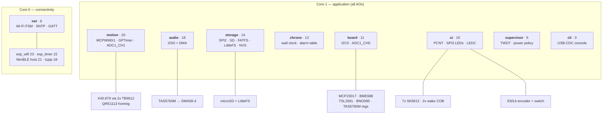
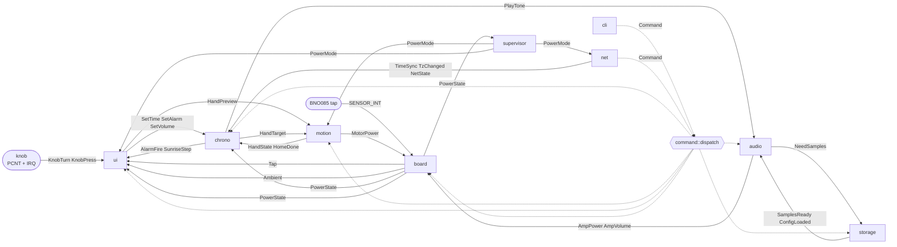
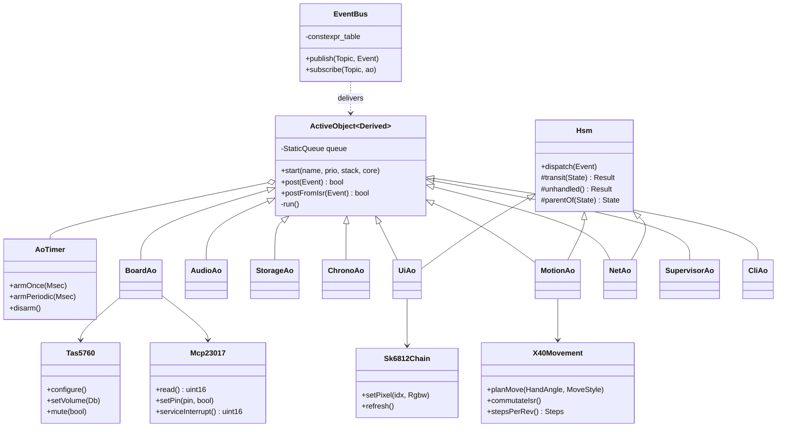
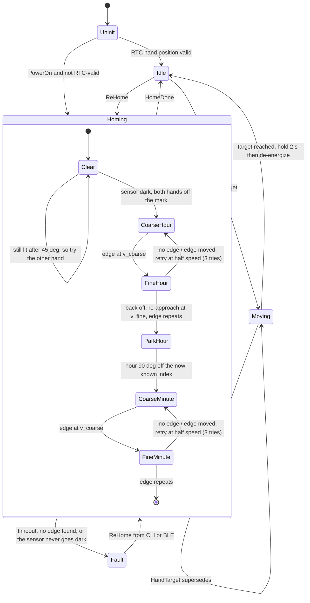
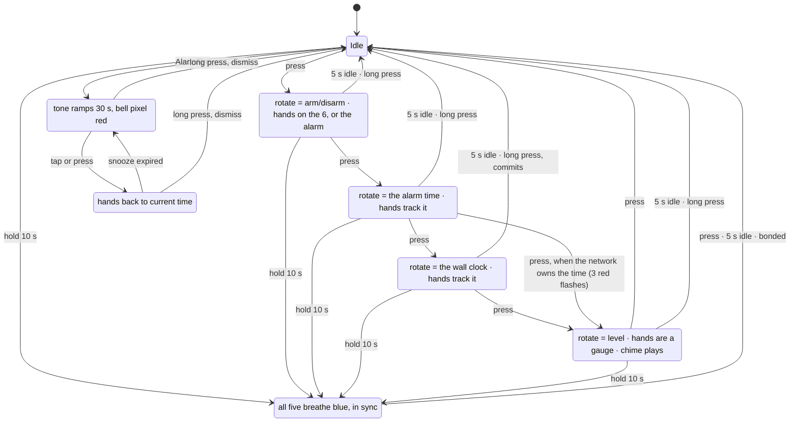
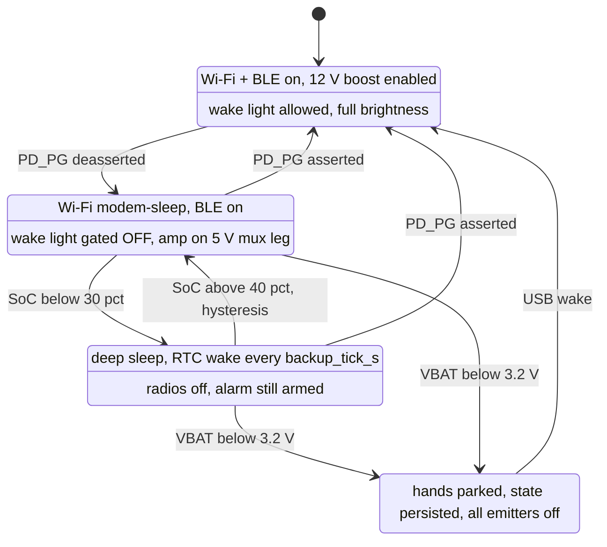
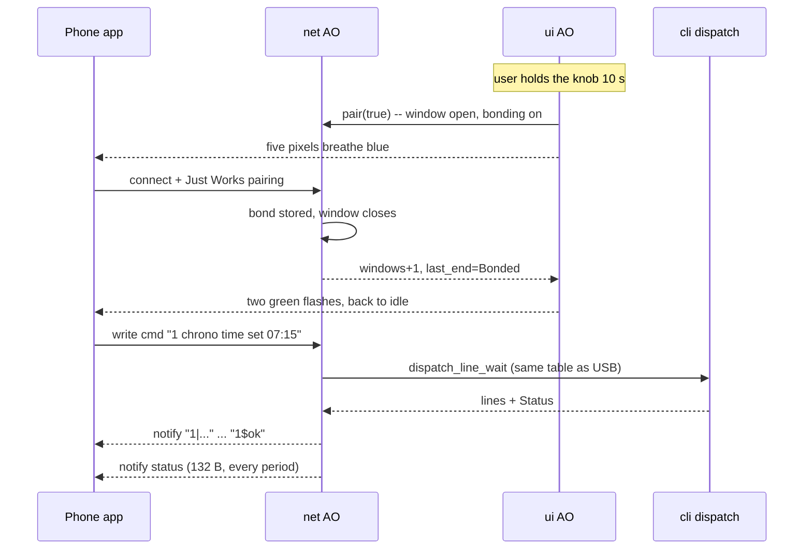
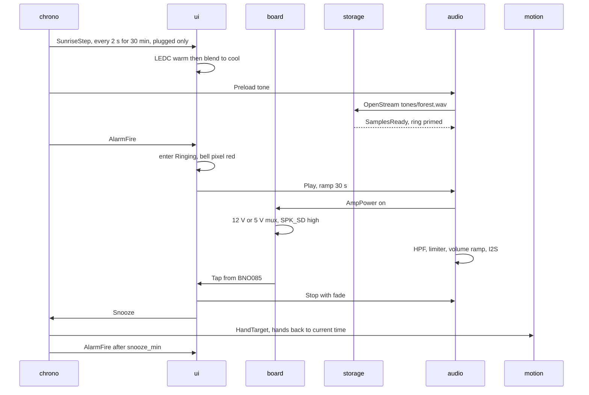

# Firmware Architecture — Wooden Smart Clock

> Design document for the ESP32-S3 firmware. Hardware is frozen and **at the fab**: main board
> **rev 0.3**, sensor board **v0.2** — both ordered 2026-08-09, ETA ~3 weeks (≈2026-08-30). This
> document is the software counterpart to [`README.md`](README.md) (product spec) and
> [`esp32.md`](esp32.md) (pin map). Where the two disagree, `esp32.md` wins on pins and this file
> wins on software structure — with the standing exceptions in **§15**.

**Status:** v1.2 · **Owner:** you · **Created:** 2026-07-26 · **Updated:** 2026-08-18
**Toolchain:** ESP-IDF **v5.5.5** (pinned, GCC 14.2, C++23) — §1.1
**Interim hardware:** **ESP32-S3-DevKitC-1U-N8R8** (DigiKey `1965-ESP32-S3-DEVKITC-1U-N8R8-ND`,
arrives 2026-08-10) — the whole firmware except the motor, amp and sensor daughterboard can be
brought up on it, plus a full host simulator. See **§12.0**.

---

## 0. Locked decisions

| # | Decision | Rationale |
|---|---|---|
| D1 | **ESP-IDF FreeRTOS + a hand-rolled C++23 active-object layer.** Not QP/C++ | FreeRTOS is unavoidable (Wi-Fi/lwIP/NimBLE/FATFS are all FreeRTOS tasks). QP's *pattern* is what's valuable — one queue per AO, run-to-completion, no shared state. The *framework* would need an SMP port and would still leave half the system as non-AO tasks. ~500 LOC you own beats a port you don't |
| D2 | **C++23 (`-std=gnu++23`), no exceptions, no RTTI, no heap after init** | GCC 13 on IDF ≥5.3 → `std::expected`, `std::variant` events, `constexpr` LUTs, concepts for driver fakes. Static queues/stacks make memory behaviour provable |
| D3 | **9 active objects**, all pinned to **core 1**; core 0 left to Wi-Fi/BLE/lwIP | Removes essentially all SMP reasoning — your AOs are effectively uniprocessor |
| D4 | **SK6812 driven by `led_strip` SPI backend on SPI3**, not RMT | SPI3 is otherwise unused (SPI2 = microSD). SPI+DMA is immune to Wi-Fi interrupt jitter, which is the classic NeoPixel glitch source; frees all 4 RMT channels. IO7 reaches SPI3 MOSI through the GPIO matrix |
| D5 | **Stepper commutation from a GPTimer ISR @ 20 kHz**, ×16 microstepping; MCPWM carrier 25 kHz | GPTimer decouples update rate from carrier, and can be **stopped when idle** (the hands are stationary >99 % of the time). 20 kHz × ×16 → max ≈1.1 rev/s slew, ample for time-set |
| D6 | **32.768 kHz crystal is the RTC slow clock** (`CONFIG_RTC_CLK_SRC_EXT_CRYS`) | Drives wall-clock retention, `esp_timer` re-basing across sleep, and the deep-sleep wake timer. ±20 ppm ≈ 1.7 s/day between SNTP syncs. See §7.1 — this is *not* the commutation clock |
| D7 | **Deep-sleep hand cadence is a runtime config** (`backup_tick_s`, default **60**, range 1–900) | Motion is always *absolute-target*, never "step N times", so cadence is a pure power/aesthetics knob with zero correctness coupling. Changing it later is one NVS value |
| D8 | **WAV only** (16-bit PCM, 44.1/48 kHz) | No decoder, no extra stack/heap, no dependency. SD space is free. FLAC can be added later behind the same `AudioSource` concept |
| D9 | **One `Command` surface shared by the CLI and the BLE app** | The phone app and the debug console need the same 40 operations. Defining them once (§5) means every feature is testable from the console the day it exists, and host-testable with no transport at all |

### 0.1 Locked 2026-08-09 (firmware kickoff)

Added when work started, three weeks ahead of the boards. Everything here exists to make the
*absence* of hardware a non-blocker.

| # | Decision | Rationale |
|---|---|---|
| D10 | **One app binary. Two axes of build config: `PROFILE` (`dev`\|`release`) × `BOARD` (`devkit`\|`rev0_3`\|`host`)** — not a separate bring-up firmware | The dev build lands well inside the 2.5 M app slot (§1.2), so flash was never the constraint. The decisive argument is different: a bring-up command that drives the **real** AO through the **real** `Command` surface tests the shipping path. A standalone "HW test" firmware tests code that will not be in the product, and drifts out of sync within a month. `BOARD` selects a pin map + a device-presence bitmask, nothing more (§7.6) |
| D11 | **Toolchain and every dependency pinned in-tree, in one file** (`firmware/toolchain.lock`), with `dependencies.lock` committed | ESP-IDF `v5.5.5` exactly — not "≥5.3". A silent GCC or `led_strip` bump is a debugging trap you pay for at 2 a.m. on the bench. Updating is deliberate and cheap: edit one line, re-run `tools/idf-setup.sh`, commit the new `dependencies.lock`. §1.1 |
| D12 | **Per-module runtime log levels through our own O(1) atomic table**, not `esp_log_level_set` — and the module list **is** the AO list | `sys debug motion verbose` at 20 kHz commutation must cost a relaxed load and a compare, not IDF's per-tag cache lookup. Sharing one vocabulary with the task names and CLI groups (D13) means there is exactly one word for "the motion subsystem" anywhere in the system. §9.4 |
| D13 | **CLI grammar is `<group> [object] <verb> [args]` where the groups are the AO names**, and `help` is generated from the same table the parser uses | `help` that is a hand-written string drifts from the parser on day two. Generating both from one `CmdSpec` table makes drift impossible and gives tab-completion for free. §9.2 |
| D14 | **`clocksim` — a native host binary running the real services against a fake HAL, with the same CLI on stdin — is a first-class build target**, not a test scaffold | The boards are 3 weeks out and the code that carries the bugs (alarm/DST, homing FSM, knob HSM, hand wrap math, limiter) needs no silicon. This also means every CLI command is exercised long before it is typed into a real device. §11.2 |
| D15 | **The DevKitC uses the production pin map verbatim.** A device that is absent returns `NotPresent`; it is never faked into reporting success | The devkit carries the *same module* (WROOM-1U-N8R8, same 3 PSRAM pins gone), so any pin remap would be gratuitous divergence — and a remap is exactly the kind of difference that hides a real bug until the PCB arrives. The one accepted exception (`ENC_SW` → `BOOT`) is opt-in and named in §12.0 |
| D16 | **`Status::NotPresent` is a first-class result, surfaced by the CLI, never logged as an error** | Half the bring-up is deliberately running with things missing (no SD card, no sensor daughterboard, no cell). If absence produces error spam, real errors get lost in it. §5 |

---

## 1. Platform

| Item | Setting |
|---|---|
| SoC / module | ESP32-S3-WROOM-1-**N8R8** (8 MB flash, 8 MB octal PSRAM, 3 GPIO consumed by PSRAM) |
| SDK | ESP-IDF **v5.5.5**, pinned exactly (D11) |
| Compiler | `xtensa-esp-elf` **GCC 14.2** (shipped with 5.5.5) |
| Language | C++23 (`-std=gnu++23`), `-fno-exceptions -fno-rtti`; C only inside vendor drivers |
| Console | **USB-Serial-JTAG only** (IO19/20) on the product board. No UART is exposed — IO43 carries `I2S_MCLK`. The devkit may add UART0 as a *secondary* console (§12.0) |
| Debug | `esp_console` REPL over USB-CDC + OpenOCD/GDB over the *same* cable |
| Host build | native clang/gcc, same C++23, no IDF — unit tests and `clocksim` (D14, §11) |

### 1.1 Toolchain & dependency locking (D11)

Three kinds of dependency, three locking mechanisms, **one file that names the versions**:

```yaml
# firmware/toolchain.lock          ← the single source of truth
idf:
  tag:  v5.5.5                    # git tag in espressif/esp-idf
  path: ~/esp/esp-idf-v5.5.5      # one dir per tag: two versions coexist, rollback is a PATH change
  targets: esp32s3
  python: "3.13"                  # IDF 5.5's detect_python.sh probes up to 3.13 only — see note
components:                       # ESP-IDF Component Manager (registry), exact versions, no ranges
  espressif/led_strip: "3.0.3"
  joltwallet/littlefs: "1.22.3"
vendored:                         # git submodules under firmware/vendor/
  sh2:      { repo: ceva-dsp/sh2, tag: v1.4.0 }    # BNO085 SH-2/SHTP driver (§6.5.1)
  googletest: { repo: google/googletest, tag: v1.17.0 }   # host tests only
tools:                            # host-side only, but still pinned — see the note below
  clang-format: "22"              # major only; output drifts between majors
manual:                           # license-gated, not fetchable — see §6.5
  bosch/BSEC: "2.6.1.0"
```

| Layer | Pinned by | Update procedure |
|---|---|---|
| **ESP-IDF + GCC + OpenOCD** | `idf.tag` above; `tools/idf-setup.sh` clones `--branch <tag> --depth 1 --shallow-submodules` into a **tag-named directory** and runs `install.sh esp32s3` | Bump `idf.tag`, re-run the script, build, commit. The old tree stays on disk — rollback is instant and does not re-download |
| **Managed components** | Exact `==` versions in `main/idf_component.yml`; **`dependencies.lock` is committed** | `idf.py update-dependencies`, review the lock diff, commit it. CI fails if the lock is dirty after a build |
| **Vendored C sources** (`sh2`, GoogleTest) | git submodules at a tag | `git -C vendor/sh2 checkout <tag>` + commit the pointer |
| **Bosch BSEC** | Not redistributable. `tools/fetch-bsec.sh` prints the download URL and verifies a **SHA-256** into `vendor/bsec/` | Optional: the build falls back to open `BME68x` + a gas baseline when `vendor/bsec/` is absent (§6.5) |
| **clang-format** | `tools.clang-format` above (major only). Style in `firmware/.clang-format`, applied by `tools/format.sh`, VS Code format-on-save and the `.githooks/pre-commit` hook | Bump the major, run `tools/format.sh`, commit the reformat **on its own** — mixing a restyle into a behaviour change makes both unreviewable. A skew only warns: it must not block a commit |

- `tools/idf-setup.sh` is **idempotent** and verifies the checked-out tag matches `toolchain.lock`
  before doing anything, so a stale shell cannot silently build against the wrong SDK.
- `tools/env.sh` sources `$idf.path/export.sh` **and** asserts `idf.py --version` equals the pinned
  tag. Every other script sources `tools/env.sh` — there is no other way in.
- ⚠ **Python.** IDF 5.5.5's `tools/detect_python.sh` walks `python3, python, python3.9 … python3.13`
  and takes the *first* hit, ignoring a pre-set `$ESP_PYTHON`. On a machine whose `python3` is
  newer than 3.13 (this one is **3.14.6**) the venv is built with an untested interpreter. Fix is a
  PATH prefix, which `tools/env.sh` applies:
  `PATH="$(brew --prefix python@3.13)/libexec/bin:$PATH"`. Re-check on every IDF bump — the
  candidate list grows with each release.

### 1.2 Build profiles & board targets (D10)

Two orthogonal axes. Neither is ever `#ifdef`-ed into logic: `PROFILE` decides what is *compiled in*,
`BOARD` decides what is *present*.

| | `dev` | `release` |
|---|---|---|
| CLI | every group, `unsafe` available | read-only subset (§9.6) |
| Log ceiling | `verbose` | `info` (verbose/debug strings stripped from the binary) |
| Asserts / 2 ms budget check (§4.2) | on | off |
| Event tracer (§6.9) | on | on — it is the field diagnostic |
| Stack-check | `strong` | `none` |

| | `rev0_3` | `devkit` | `host` |
|---|---|---|---|
| Pin map | `esp32.md` | **identical** (D15) | n/a |
| Devices present | all | whatever you wired | all, faked |
| 32.768 kHz crystal | yes | **no** → `RTC_CLK_SRC_INT_RC` (§12.0) | n/a |
| Toolchain | xtensa GCC | xtensa GCC | native |

```
idf.py -DPROFILE=dev     -DBOARD=devkit build flash monitor
idf.py -DPROFILE=release -DBOARD=rev0_3 build
cmake --preset host-dev && cmake --build --preset host-dev && ctest --preset host-dev
```

`PROFILE`/`BOARD` expand to `sdkconfig.defaults` fragment lists plus one `-DCONFIG_CLOCK_BOARD_*`;
`sdkconfig` itself is **git-ignored** so nobody can accidentally commit a hand-edited menuconfig.

### 1.3 `sdkconfig` fragments

Four fragment files in `apps/clock/`, composed by `PROFILE` × `BOARD` (§1.2). Every symbol below was
**checked against the v5.5.5 Kconfig** on 2026-08-09 — re-verify on an IDF bump, several were renamed
in 5.5 (`NEWLIB_NANO_FORMAT` → `LIBC_NEWLIB_NANO_FORMAT` is the one that bites).

```ini
# ── sdkconfig.defaults — always applied ─────────────────────────────────
CONFIG_IDF_TARGET="esp32s3"
CONFIG_ESPTOOLPY_FLASHSIZE_8MB=y
CONFIG_PARTITION_TABLE_CUSTOM=y
CONFIG_PARTITION_TABLE_CUSTOM_FILENAME="partitions.csv"
CONFIG_BOOTLOADER_APP_ROLLBACK_ENABLE=y        # §6.3 — 60 s healthy uptime confirms the image

# console: USB-CDC is the only path on the product board (IO43 is I2S_MCLK)
CONFIG_ESP_CONSOLE_USB_SERIAL_JTAG=y
CONFIG_ESP_CONSOLE_SECONDARY_NONE=y

# logging — levels are flipped at runtime from the CLI (§9.4), so the *compile*
# ceiling must be VERBOSE or the strings are not in the binary to enable.
CONFIG_LOG_MAXIMUM_LEVEL_VERBOSE=y             # release fragment lowers this
CONFIG_LOG_DEFAULT_LEVEL_INFO=y                # boot default for IDF's own tags
CONFIG_LOG_DYNAMIC_LEVEL_CONTROL=y             # required by `sys debug idf <lvl>`
CONFIG_LOG_TIMESTAMP_SOURCE_RTOS=y             # ms since boot — same base as the event tracer
CONFIG_LOG_COLORS=y

# `sys top` is not collectible without these three
CONFIG_FREERTOS_USE_TRACE_FACILITY=y
CONFIG_FREERTOS_GENERATE_RUN_TIME_STATS=y
CONFIG_FREERTOS_VTASKLIST_INCLUDE_COREID=y

# the CLI prints dBFS, lux, ppm and volts — nano-printf has no %f
CONFIG_LIBC_NEWLIB_NANO_FORMAT=n

# memory
CONFIG_SPIRAM=y
CONFIG_SPIRAM_MODE_OCT=y
CONFIG_SPIRAM_SPEED_80M=y
CONFIG_SPIRAM_USE_MALLOC=y
CONFIG_SPIRAM_MALLOC_ALWAYSINTERNAL=4096       # small allocs stay internal

# language
CONFIG_COMPILER_CXX_EXCEPTIONS=n
CONFIG_COMPILER_CXX_RTTI=n
CONFIG_COMPILER_OPTIMIZATION_PERF=y

# scheduling
CONFIG_FREERTOS_HZ=1000
CONFIG_FREERTOS_UNICORE=n
CONFIG_ESP_MAIN_TASK_AFFINITY_CPU0=y

# power (battery modes, §7.4)
CONFIG_PM_ENABLE=y
CONFIG_FREERTOS_USE_TICKLESS_IDLE=y
CONFIG_PM_DFS_INIT_AUTO=y

# reliability
CONFIG_ESP_TASK_WDT_INIT=y
CONFIG_ESP_TASK_WDT_TIMEOUT_S=10
CONFIG_ESP_TASK_WDT_CHECK_IDLE_TASK_CPU1=n     # AOs feed it explicitly
CONFIG_ESP_COREDUMP_ENABLE_TO_FLASH=y
CONFIG_ESP_COREDUMP_DATA_FORMAT_ELF=y
CONFIG_ESP_COREDUMP_CHECK_BOOT=y               # `sys coredump` learns one exists at boot
CONFIG_ESP_DEBUG_OCDAWARE=y

# radios
CONFIG_BT_ENABLED=y
CONFIG_BT_NIMBLE_ENABLED=y
CONFIG_BT_NIMBLE_EXT_ADV=n

# ── sdkconfig.dev ───────────────────────────────────────────────────────
CONFIG_COMPILER_STACK_CHECK_MODE_STRONG=y
CONFIG_FREERTOS_CHECK_STACKOVERFLOW_CANARY=y
CONFIG_HEAP_POISONING_LIGHT=y
CONFIG_ESP_SYSTEM_PANIC_PRINT_HALT=y           # halt, don't reboot: the backtrace stays on screen
CONFIG_CLOCK_CLI_UNSAFE=y                      # ours — §9.6
CONFIG_CLOCK_LOG_MAX_LEVEL_VERBOSE=y           # ours — §9.4

# ── sdkconfig.release ───────────────────────────────────────────────────
CONFIG_COMPILER_STACK_CHECK_MODE_NONE=y
CONFIG_LOG_MAXIMUM_LEVEL_INFO=y                # strips debug/verbose format strings
CONFIG_CLOCK_CLI_UNSAFE=n
CONFIG_CLOCK_LOG_MAX_LEVEL_INFO=y

# ── sdkconfig.rev0_3 ────────────────────────────────────────────────────
# D6 — external 32.768 kHz crystal as RTC slow clock ← accurate timekeeping
CONFIG_RTC_CLK_SRC_EXT_CRYS=y
CONFIG_RTC_CLK_CAL_CYCLES=3000
CONFIG_ESP_TIME_FUNCS_USE_RTC_TIMER=y
CONFIG_ESP_TIME_FUNCS_USE_ESP_TIMER=y
CONFIG_CLOCK_BOARD_REV0_3=y

# ── sdkconfig.devkit ────────────────────────────────────────────────────
# DevKitC-1 has NO 32.768 kHz crystal (§12.0). Asking for one would fall back
# to the RC silently, which is precisely the bug §7.1 exists to catch — so ask
# for the RC honestly and let `chrono` report a degraded time source.
CONFIG_RTC_CLK_SRC_INT_RC=y
CONFIG_ESP_TIME_FUNCS_USE_RTC_TIMER=y
CONFIG_ESP_TIME_FUNCS_USE_ESP_TIMER=y
CONFIG_CLOCK_BOARD_DEVKIT=y

# ── sdkconfig.devkit-uart — opt-in, only for chasing a boot/panic crash ──
# There is NO "secondary = UART" in IDF: the ESP_CONSOLE_SECONDARY choice offers
# only USB_SERIAL_JTAG, and only when the primary is *not* USB_SERIAL_JTAG. So
# capturing the panic tail on the devkit's CP2102N port means inverting the pair,
# which moves the REPL to UART too. Non-default on purpose — the USB-CDC console
# is the path the product ships with, and that is the one to keep exercising.
CONFIG_ESP_CONSOLE_UART_DEFAULT=y
CONFIG_ESP_CONSOLE_SECONDARY_USB_SERIAL_JTAG=y
```

> **C++ standard.** IDF 5.5 compiles C++ as `-std=gnu++2b` by default. The project overrides this to
> `-std=gnu++23` so the target and host builds agree on one spelling; they are the same standard,
> GCC 14 accepts both.

### Partition table (8 MB)

| Name | Type | Size | Use |
|---|---|---|---|
| `nvs` | data/nvs | 64 K | config, hand trim, alarm table |
| `nvs_keys` | data/nvs_keys | 4 K | NVS encryption (optional) |
| `otadata` | data/ota | 8 K | |
| `phy_init` | data/phy | 4 K | |
| `coredump` | data/coredump | 128 K | post-mortem, read by `cli` |
| `ota_0` / `ota_1` | app | 2.5 M each | A/B OTA with rollback |
| `assets` | data/littlefs | ~2.7 M | system sounds, BSEC state, event-trace spill |

> Resized 2026-08-06 with the **N16R8 → N8R8** module swap (16 MB → 8 MB flash). `coredump`
> moves ahead of the app slots so `ota_0` starts 64 K-aligned at `0x40000`; the two 2.5 M app
> slots then run to `0x540000` and `assets` takes the rest of the chip. **An app slot can never
> be grown by OTA** — if a build approaches 2.5 M, take the space from `assets`, not from `ota_*`.

microSD carries **user** assets only (`/sd/tones/*.wav`); the device must be fully functional with no card.

---

## 2. Layering & repo layout

```
firmware/
├─ toolchain.lock                 # D11 — the only file where a version number is written
├─ CMakePresets.json              # host-dev · host-asan · host-release
├─ CMakeLists.txt                 # host build entry point (IDF entry is apps/clock/)
├─ tools/
│  ├─ env.sh                      # source pinned IDF, assert the tag, fix the python PATH (§1.1)
│  ├─ idf-setup.sh                # clone + install the pinned IDF; idempotent
│  ├─ build.sh                    # PROFILE=/BOARD= → sdkconfig fragment list → idf.py
│  ├─ format.sh                   # clang-format the tree; --check for CI + the pre-commit hook
│  ├─ fetch-bsec.sh               # license-gated blob, SHA-256 verified (§6.5)
│  └─ gen_cmd_docs.py             # CmdSpec table → the §9.3 table; CI fails if they differ
├─ apps/
│  ├─ clock/                      # ← the product.   idf.py -C apps/clock ...
│  │   CMakeLists.txt  partitions.csv
│  │   sdkconfig.defaults  sdkconfig.{dev,release,devkit,devkit-uart,rev0_3}
│  │   main/ app_main.cpp         # construct + start AOs, nothing else
│  │         idf_component.yml    # managed deps at exact versions
│  └─ clocksim/                   # ← D14. native binary, zero IDF
│      CMakeLists.txt  main.cpp   # same services, host port, fake HAL, CLI on stdin
│      uibridge.{hpp,cpp}         # the loopback socket ux/ attaches to — see below
├─ components/
│  ├─ core/                       # ← 100 % host-testable, zero IDF
│  │   event.hpp  ao.hpp  hsm.hpp  bus.hpp  timer.hpp
│  │   result.hpp units.hpp static_vector.hpp ring.hpp trace.hpp
│  │   log.hpp                    # §9.4 per-module levels — the backend is a seam
│  │   port.hpp port_{esp,host}.cpp  # thread, mutex, signal, monotonic clock: two impls
│  ├─ command/                    # ← host-testable: the Command/Response surface (§5)
│  ├─ domain/                     # ← host-testable: hand math, and later the alarm
│  │                              #    scheduler, sunrise curve, DSP, gamma
│  ├─ board_cfg/                  # ← zero IDF: pin map + device-presence bitmask per BOARD (D15)
│  │   board_rev0_3.hpp  board_devkit.hpp  board_host.hpp  present.hpp
│  ├─ clk_hal/                    # NOT `hal/` -- that name is taken by ESP-IDF itself
│  │   api/                       # the only headers a driver may include
│  │   esp/                       # RAII over IDF: Mcpwm Gptimer I2cBus I2sTx SpiBus
│  │   │                          #   Adc Pcnt LedStrip Ledc Gpio Nvs UsbConsole
│  │   host/                      # fakes, scriptable from `sim` (§9.5)
│  ├─ drivers/                    # X40Movement Tb6612 Qre1113 Sk6812Chain Tas5760
│  │                              # Mcp23017 Bme688 Tsl2591 Bno085 Lt3652Status
│  ├─ services/                   # the 9 active objects (§3)
│  ├─ cli/                        # §9: CmdSpec table, parser, generated help, stream sink
│  └─ transport/                  # cli_console/  ble_gatt/  → both call command::dispatch
├─ vendor/                        # git submodules, pinned in toolchain.lock
│  └─ sh2/  googletest/  bsec/    # bsec/ may be empty — the build degrades (§6.5)
└─ test/
   ├─ host/                       # GoogleTest, native compiler, fakes for hal/  (§11.1)
   └─ target/                     # Unity, on-device peripheral tests            (§11.4)

../ux/                            # ← the clock on screen. NOT firmware, holds no logic
   uxapp.py  geometry.json  web/  # stdlib HTTP + WebSocket bridge onto uibridge
```

`uibridge` lives in `apps/clocksim/` and **not** under `components/`, on purpose: `apps/clock`
puts `components/` on `EXTRA_COMPONENT_DIRS`, so anything there is a component the target
build can see. In the app it is structurally impossible to link into the firmware.

**Dependency rule (enforced by CMake `REQUIRES`, so violations fail the build):**

```
apps/clock     → services, transport, cli, clk_hal/esp  (+ IDF)
apps/clocksim  → services, transport, cli, clk_hal/host (no IDF at all) + uibridge
services       → { command, domain, drivers, core, board_cfg }
drivers        → { hal/api, core, board_cfg }    services never touch hal for an owned peripheral
cli, transport → command                          never services, never hal
hal/esp, core/port/esp → IDF                      the ONLY components that may include esp_*.h
core, domain, command, board_cfg → nothing        (no IDF headers → host build works)
```

`hal/api` **declares**, `hal/esp` and `hal/host` **define**. The choice is made by CMake, never by
`#ifdef` in a driver — a driver cannot discover which implementation it was linked against, which is
what keeps `clocksim` honest.

> **Where the CLI actually sits today.** `cli → command, never services, never hal` is the
> destination and it arrives with `command::dispatch` (§5). Until then the `cli` rows reach
> `services` and `hal` directly. Every row is still a *view*: it posts an event to the owning
> AO and reads a snapshot, and no row drives a peripheral an AO owns (rule 1). The
> `REQUIRES` graph currently records the scaffold, not the destination.

### Rules of the road

1. **One owner per peripheral.** Named in §3. Nobody else may touch it — not even "just to read".
2. **No AO event handler blocks > 2 ms.** Debug builds assert on overrun. Slow work → request another AO.
3. **No heap allocation after `app_main` returns.** Static queues, static stacks, fixed-capacity containers.
4. **No shared mutable state.** Events carry copies; config is an immutable snapshot swapped atomically.
5. **Drivers never post events**, never log at INFO, never block on a queue. They are pure I/O + math.
6. **Anything reachable from the CLI is reachable from BLE and vice versa** — one `Command` enum (§5).
7. **All scheduling from `esp_timer_get_time()`** (monotonic µs). `time()` is for *display only*.
8. **ISRs are IRAM-safe**: no logging, no allocation, no I²C, notify/queue-from-ISR only.
9. **Nothing below `apps/` calls `printf` or `ESP_LOGx` directly** — only the `CLK_LOG*` macros
   (§9.4). One grep proves it; a CI check enforces it. This is what makes per-module levels total
   rather than mostly true, and it is what lets `core/` and `domain/` compile on the host.
10. **Every CLI command is a row in the `CmdSpec` table** (§9.2). `esp_console_cmd_register` is
    called in exactly one file, inside `components/cli`. No feature registers its own command.
11. **Absent hardware returns `Status::NotPresent`** (D16) — never a fake success, never an error
    log. `sensor list` shows presence; a bring-up session with three things unplugged stays quiet.
12. **Streaming (`sensor … stream`) never runs in the `cli` task** — the owning AO produces samples
    on its own cadence and writes them to a sink. The console cannot busy-wait on hardware.

---

## 3. Concurrency model

### 3.1 Core pinning

Core 0 belongs to the IDF: `esp_wifi` (prio 23), `esp_timer` (22), NimBLE host (21), `tcpip` (18).
**Core 1 runs every application task.** Consequence: your AOs preempt each other strictly by priority
and never run truly in parallel, so the only cross-core concerns are the `net` AO's queue and a
handful of `std::atomic` status flags.

### 3.2 Tasks

| # | AO | Prio | Core | Stack | Owns exclusively | Responsibility |
|---|---|---|---|---|---|---|
| 1 | **`motion`** | 20 | 1 | 3.5 K | MCPWM0, MCPWM1, GPTimer0, ADC1_CH1 (IO2) | Trajectory planning, homing FSM, absolute hand bookkeeping, backlash policy |
| 2 | **`audio`** | 18 | 1 | 8 K | I²S0 + DMA | WAV streaming → HPF biquad + limiter + volume ramp → I²S. Amp pop-free sequencing |
| 3 | **`storage`** | 14 | 1 | 6 K | SPI2/SD/FATFS, LittleFS, NVS | Audio prefetch into a PSRAM ring; config load/save; BLE asset upload; OTA writes. **All blocking file I/O lives here** |
| 4 | **`chrono`** | 12 | 1 | 4 K | wall clock, alarm table | Time authority (TZ/DST/sources), alarm scheduling, sunrise pre-roll, hand targets, re-home policy |
| 5 | **`board`** | 11 | 1 | 5 K | **I²C0 (sole owner)**, ADC1_CH0 (IO1) | MCP23017 service, TAS5760M registers, BME688/BSEC, TSL2591, BNO085 (SHTP/SH-2), VBAT, charger status, radio toggle |
| 6 | **`ui`** | 10 | 1 | 4 K | PCNT unit0, SPI3→SK6812, LEDC ch0/1 | The knob HSM; all light output (7 pixels + wake light), gamma, ALS gating, hard-off |
| 7 | **`net`** | 6 | **0** | 5 K | esp_event, SNTP, NimBLE app link, OTA | Connectivity HSM, BLE GATT server + provisioning, obeys `RADIO_OFF` as a hard override |
| 8 | **`supervisor`** | 5 | 1 | 3 K | TWDT, power policy, coredump | Power-mode policy, low-battery shutdown, fault latch + LED fault codes, reset-reason reporting |
| 9 | **`cli`** | 3 | 1 | 6 K | USB-CDC console | Text ⇄ `Command`. Touches no hardware |

Total static stack ≈ 45 KB of 512 KB internal SRAM.

**Why 9 and not 3 or 20.** Each task exists because it owns a resource that must have exactly one
owner (I²C, I²S, SPI2, MCPWM, the console) or because it must not be blocked by a slower peer
(`motion` must never wait on an SD read; `audio` must never wait on I²C). Merge levers if you want
fewer: `supervisor`→`chrono`, `storage`→`audio` (costs the decoupled prefetch). Split levers:
LED rendering out of `ui`, BLE out of `net`.

### 3.3 ISR / callback contexts

| Source | Rate | Work |
|---|---|---|
| **GPTimer0 → commutation** | 20 kHz **while moving; stopped when idle** | Q16.16 phase accumulator += velocity → index `constexpr` sine LUT → write 8 MCPWM comparators. ≈3 µs, IRAM. The task never touches a comparator |
| I²S `on_sent` | ~180 Hz | Task-notify `audio` |
| GPIO `ENC_SW` IO17 | user | Start 5 ms debounce timer → `KnobPress` to `ui` |
| GPIO `SENSOR_INT` IO42 | rare | Notify `board` → drain one SHTP packet from the BNO085. **BNO085 only** — the TSL2591's `ALS_INT` moved to expander GPB3 (`REVIEW.md` #11), so it arrives via `EXPANDER_INT` |
| GPIO `EXPANDER_INT` IO44 | rare | Notify `board` → reads INTF/INTCAP (clears the latch). Sources: charger CHRG/FAULT/PD_PG, `SPK_FAULT`, radio toggle, **TSL2591 `ALS_INT` (GPB3)** |
| PCNT IO47/48 | — | **No ISR.** Hardware quadrature + glitch filter; `ui` diffs the count every 20 ms |
| SPI3 DMA (LED) | on demand | Driver-internal |

### 3.4 Task & ownership map


```mermaid
flowchart TB
    subgraph C1["Core 1 — application (all AOs)"]
        direction TB
        MOT["<b>motion</b> · 20<br/>MCPWM0/1 · GPTimer · ADC1_CH1"]
        AUD["<b>audio</b> · 18<br/>I2S0 + DMA"]
        STO["<b>storage</b> · 14<br/>SPI2 · SD · FATFS · LittleFS · NVS"]
        CHR["<b>chrono</b> · 12<br/>wall clock · alarm table"]
        BRD["<b>board</b> · 11<br/>I2C0 · ADC1_CH0"]
        UIA["<b>ui</b> · 10<br/>PCNT · SPI3 LEDs · LEDC"]
        SUP["<b>supervisor</b> · 5<br/>TWDT · power policy"]
        CLI["<b>cli</b> · 3<br/>USB-CDC console"]
    end
    subgraph C0["Core 0 — connectivity"]
        direction TB
        NET["<b>net</b> · 6<br/>Wi-Fi FSM · SNTP · GATT"]
        IDF["esp_wifi 23 · esp_timer 22<br/>NimBLE host 21 · tcpip 18"]
    end

    MOT --- X40["X40.879 via 2x TB6612<br/>QRE1113 homing"]
    AUD --- AMP["TAS5760M → DMA58-4"]
    STO --- SD["microSD + LittleFS"]
    BRD --- I2C["MCP23017 · BME688<br/>TSL2591 · BNO085 · TAS5760M regs"]
    UIA --- LED["7x SK6812 · 2x wake COB"]
    UIA --- KNB["EM14 encoder + switch"]
    NET --- IDF
```

### 3.5 Event flow (publish/subscribe)


```mermaid
flowchart LR
    KNB(["knob<br/>PCNT + IRQ"]) -->|KnobTurn KnobPress| UIA["ui"]
    ACC(["BNO085 tap"]) -->|SENSOR_INT| BRD["board"]
    BRD -->|Tap| UIA
    BRD -->|Ambient| UIA
    BRD -->|PowerState| SUP["supervisor"]
    BRD -->|PowerState| CHR["chrono"]
    BRD -->|PowerState| UIA

    UIA -->|SetTime SetAlarm SetVolume| CHR
    UIA -->|HandPreview| MOT["motion"]
    CHR -->|HandTarget| MOT
    CHR -->|AlarmFire SunriseStep| UIA
    CHR -->|PlayTone| AUD["audio"]
    MOT -->|HandState HomeDone| CHR
    MOT -->|MotorPower| BRD
    AUD -->|AmpPower AmpVolume| BRD
    AUD -->|NeedSamples| STO["storage"]
    STO -->|SamplesReady ConfigLoaded| AUD

    NET["net"] -->|TimeSync TzChanged NetState| CHR
    SUP -->|PowerMode| MOT
    SUP -->|PowerMode| UIA
    SUP -->|PowerMode| NET

    CLIA["cli"] -.->|Command| DISP{{"command::dispatch"}}
    NET -.->|Command| DISP
    DISP -.-> CHR
    DISP -.-> MOT
    DISP -.-> UIA
    DISP -.-> AUD
    DISP -.-> BRD
    DISP -.-> STO
```

Solid arrows = normal runtime events. Dashed = the shared command surface (§5).

---

## 4. The core framework (~500 LOC)

### 4.1 Events

```cpp
// components/core/event.hpp
struct Tick          { uint32_t seq; };
struct KnobTurn      { int16_t detents; };
struct KnobPress     { Msec held; };
struct Tap           { uint8_t count; };
struct HandTarget    { HandAngle hour, minute; MoveStyle style; };
struct HandState     { HandAngle hour, minute; bool homed, moving; };
struct AlarmFire     { AlarmId id; };
struct SunriseStep   { uint8_t warm_pct, cool_pct; };
struct PowerState    { Millivolt vbat; uint8_t soc; bool plugged, charging, fault; };
struct Ambient       { Lux lux; Millicelsius temp; uint16_t iaq; };
struct NetState      { WifiPhase wifi; BlePhase ble; bool radio_disabled; };
struct PowerMode     { Mode mode; };          // Plugged | Battery | BatteryLow | Shutdown
// ... ~40 total

using Event = std::variant<Tick, KnobTurn, KnobPress, Tap, HandTarget, HandState,
                           AlarmFire, SunriseStep, PowerState, Ambient, NetState,
                           PowerMode, /* ... */>;
static_assert(sizeof(Event) <= 16, "keep events queue-cheap");
```

Events are **values**. Anything bigger than 16 bytes (audio blocks, asset chunks) travels as an
index into a statically allocated pool, with the pool slot owned by exactly one AO at a time.

### 4.2 Active object

```cpp
template <class Derived, size_t QLen>
class ActiveObject {
public:
    void start(const char* name, UBaseType_t prio, uint32_t stack, BaseType_t core);
    bool post(Event const&);                              // task context
    bool postFromIsr(Event const&, BaseType_t* woken);    // ISR context
private:
    [[noreturn]] void run() {
        static_cast<Derived*>(this)->onStart();
        for (;;) {
            Event e;
            if (queue_.receive(e, kWdtFeedPeriod)) {
                trace::record(id_, e);                    // §6.9 event tracer
                ScopedBudget b{id_, 2_ms};                // debug: assert on overrun
                std::visit([this](auto const& ev) {
                    static_cast<Derived*>(this)->on(ev);  // overload set, compile-time dispatch
                }, e);
            }
            esp_task_wdt_reset();
        }
    }
    StaticQueue<Event, QLen> queue_;
};
```

`std::visit` over an overload set means **an AO that forgets to handle an event fails to compile**
(provide a catch-all `on(auto const&) {}` only where ignoring is deliberate).

### 4.3 Hierarchical state machine

```cpp
class Hsm {
protected:
    struct Result { enum { Handled, Unhandled, Transition } kind; State target; };
    using State = Result (Hsm::*)(Event const&);
    Result handled()             { return {Result::Handled, nullptr}; }
    Result unhandled()           { return {Result::Unhandled, nullptr}; }   // bubbles to parent
    Result transit(State s)      { return {Result::Transition, s}; }
    virtual State parentOf(State) const = 0;
public:
    void dispatch(Event const&);   // walks up on Unhandled; runs exit/entry chains on Transition
};
```

Used by `ui` (§6.6), `motion` homing (§6.1), `net` (§6.7), and the alarm/ringing lifecycle.
~120 lines, host-tested standalone.

### 4.4 Class model


```mermaid
classDiagram
    class ActiveObject~Derived~ {
        +start(name, prio, stack, core)
        +post(Event) bool
        +postFromIsr(Event) bool
        -run()
        -StaticQueue queue
    }
    class Hsm {
        +dispatch(Event)
        #transit(State) Result
        #unhandled() Result
        #parentOf(State) State
    }
    class EventBus {
        +publish(Topic, Event)
        +subscribe(Topic, ao)
        -constexpr_table
    }
    class AoTimer {
        +armOnce(Msec)
        +armPeriodic(Msec)
        +disarm()
    }

    class MotionAo
    class AudioAo
    class StorageAo
    class ChronoAo
    class BoardAo
    class UiAo
    class NetAo
    class SupervisorAo
    class CliAo

    ActiveObject <|-- MotionAo
    ActiveObject <|-- AudioAo
    ActiveObject <|-- StorageAo
    ActiveObject <|-- ChronoAo
    ActiveObject <|-- BoardAo
    ActiveObject <|-- UiAo
    ActiveObject <|-- NetAo
    ActiveObject <|-- SupervisorAo
    ActiveObject <|-- CliAo
    Hsm <|-- MotionAo
    Hsm <|-- UiAo
    Hsm <|-- NetAo
    ActiveObject o-- AoTimer
    EventBus ..> ActiveObject : delivers

    class X40Movement {
        +planMove(HandAngle, MoveStyle)
        +commutateIsr()
        +stepsPerRev() Steps
    }
    class Sk6812Chain {
        +setPixel(idx, Rgbw)
        +refresh()
    }
    class Mcp23017 {
        +read() uint16
        +setPin(pin, bool)
        +serviceInterrupt() uint16
    }
    class Tas5760 {
        +configure()
        +setVolume(Db)
        +mute(bool)
    }
    MotionAo --> X40Movement
    UiAo --> Sk6812Chain
    BoardAo --> Mcp23017
    BoardAo --> Tas5760
```

### 4.5 Units

```cpp
template <class Tag, class Rep> struct Quantity { Rep v; /* +,-,*,/ , comparisons */ };
using Steps      = Quantity<struct StepsTag,   int32_t>;
using MicroSteps = Quantity<struct UStepsTag,  int32_t>;
using HandAngle  = Quantity<struct AngleTag,   uint32_t>;  // 0 .. 2^16 == full revolution
using Msec       = Quantity<struct MsecTag,    uint32_t>;
using Millivolt  = Quantity<struct MvTag,      uint16_t>;
```

`HandAngle` as a **16-bit wrapping fixed-point revolution** is the single best decision in the
motion code: wrap-around, shortest-path direction and "12 o'clock" all become integer arithmetic
with no modulo bugs, and hour vs minute hands share one type without ever being interchangeable
with `Steps`.

---

## 5. The `Command` surface (CLI ⇔ BLE ⇔ tests)

The debug console and the phone app need the *same* ~40 operations. Define them once:

```cpp
// components/command/command.hpp   (no IDF, host-testable)
struct TimeSet    { int64_t epoch_ms; };
struct TzSet      { StaticString<48> posix; StaticString<40> iana; };
struct AlarmSet   { AlarmId id; Alarm a; };
struct AlarmArm   { AlarmId id; bool armed; };
struct HandGoto   { HandAngle h, m; };
struct HandHome   {};
struct VolumeSet  { uint8_t pct; };
struct WifiCreds  { StaticString<33> ssid; StaticString<64> psk; };
// ...
// ── diagnostics: CLI-reachable, and deliberately BLE-reachable too (rule 6) ──
struct LogLevelSet{ log::Mod mod; log::Level lvl; };        // §9.4
struct PixelSet   { PixelId id; Rgbw c; };                  // ui led
struct WakeSet    { uint8_t warm_pct, cool_pct; };
struct SensorRead { SensorId s; };                          // one-shot
struct SensorStream{ SensorId s; uint16_t hz; Msec ttl; };  // rule 12
struct ExpanderSet{ ExpanderPin p; bool level; };
struct SelfTest   { TestId t; };                            // led walk, i2c scan, opto sweep …

using Command  = std::variant<TimeSet, TzSet, AlarmSet, AlarmArm, HandGoto, HandHome,
                              VolumeSet, WifiCreds, LogLevelSet, PixelSet, WakeSet,
                              SensorRead, SensorStream, ExpanderSet, SelfTest, /* ... */>;

enum class Origin  : uint8_t { Local, Cli, Ble };
enum class Status  : uint8_t { Ok, BadArg, Denied, Busy, NotReady, Failed, NotPresent };

// Where a result goes. The CLI writes lines to the console; BLE packs a notification;
// a host test appends to a vector and asserts on it. Nothing above knows which.
struct ResponseSink {
    virtual void line(std::string_view) = 0;                // human-readable
    virtual void kv(std::string_view k, Value v) = 0;        // machine-readable (§9.5 --csv)
    virtual void done(Status) = 0;
};

Status dispatch(Command const&, Origin, ResponseSink&);
```

- `dispatch()` validates, checks authorization for the origin, and posts the corresponding event to
  the owning AO. It never performs I/O itself.
- **Authorization:** `Origin::Ble` requires a bonded, encrypted link. `Origin::Cli` requires
  `unsafe on` for anything that moves hardware. `Origin::Local` (knob) is always allowed.
- **Host tests call `dispatch()` directly** with fake AOs — the entire app-facing feature set is
  testable with no transport, no radio and no hardware.

Two thin adapters, nothing more:

| Adapter | Lives in | Job |
|---|---|---|
| `transport/cli_console` | `cli` AO | `CmdSpec` table + argtable3 → `Command`; `ResponseSink` → formatted text (§9) |
| `transport/ble_gatt` | `net` AO | TLV frame → `Command`; `ResponseSink` → notification (§8) |

Because the diagnostics commands are ordinary `Command`s, **`clocksim` gets them for free**: the host
binary links the same `dispatch()` and the same `CmdSpec` table, so `ui led bell red` is a real
command with a real authorization check three weeks before a pixel exists to light (D14).

---

## 6. Services in detail

### 6.1 `motion`

**Owns:** MCPWM0 (the outer tube — **hour** — IO4/5/6/3), MCPWM1 (the inner pin — **minute** —
IO38/39/40/41), GPTimer0, ADC1_CH1 (`HOME_OPTO`, IO2).
**Does not own:** `STEP_STBY` — that lives on the MCP23017, so `motion` requests it from `board` (below).

#### 6.1e Hands to shafts — swapped 2026-09-13, and it is not only labels

The **minute** hand is on the X40's **inner pin**, in front, the way a normal clock reads; the
**hour** hand is on the **outer tube** behind it. Seats and heights are in `cad/README.md` (1.00 mm
at 6.9–10.9 mm above the body; 2.90 mm at 2.9–6.9 mm).

The wiring did **not** move with it: driver #1 / MCPWM0 / `STEP_M_*` still drives the tube. So the
crossing lives in firmware, in exactly one place — `motor_esp.cpp`'s `build()`, which hands group 0
to `Hand::Hour` and group 1 to `Hand::Minute`. `board.hpp`'s pin arrays were renamed
`step_tube`/`step_pin` to stop a relabelling from looking like a rewiring job, and the schematic's
`STEP_M_*` / `STEP_H_*` nets are misnomers from this date (`kicad/REVIEW.md` **V12** renames them at
the respin; `kicad/gen/` stays as built until then).

⚠ **Nothing on the host can catch that line being wrong** — the fake has no pins — so `build()` logs
the assignment at boot (`hour=tube(MCPWM0) minute=pin(MCPWM1)`). That log is the verification.

Two mechanical consequences land on the homing FSM, both of them real:

1. **The hour hand occludes the minute hand.** It is ~4 mm nearer the QRE1113, so where the two
   overlap the sensor sees only the hour hand. The `Clear` phase already moves the hour hand first,
   which was arbitrary before and is now the *only* order that can reveal what is behind it.
2. **The minute hand is now the far, weak one.** At its height a reflector read 3010 mV against a
   3159 mV clear level — a 149 mV step, which is precisely the "weakest signal that matters" in
   `kicad/REVIEW.md` **V2**. Against today's span (`kOptoMarkMv` = the hour hand's 2600) that
   normalises to **0.25**, under `motion`'s 0.45 `opto_thresh`: *the far hand's index crossing is
   currently invisible*. Do not lower the threshold on paper — those were bare surfaces at
   distance, a printed index mark reflects far better, and V2 roughly doubles the scale. §12.1
   milestone 3 / §12.2 **F2.4** starts by re-measuring with the real hands on.
   **Re-measured 2026-09-27** (build #1, `R99` = 22k, real hands): clear ~3159 / minute ~3142 /
   hour ~2978 mV. The span is now set just under the clear level (`kOptoClearMv` 3160, `kOptoMarkMv`
   3150), putting the 0.45 threshold at ~3155.5 mV: clear is the ADC ceiling and does not drift,
   so it gets ~3 mV; the minute hand does drift (boot-time homing sometimes missed it at the
   first ~3152 line) and gets ~13. A failed hand search logs its brightest reading in mV.

The labels in `hal.hpp`'s opto block were always written for *this* geometry, so the swap makes the
calibration and the wiring agree for the first time; before it, the hand the docs called weak was
the strong one on the board.

- **Geometry:** X27 base spec: gear **1:180**, one electrical period (6 partial steps of 1/3°) =
  **2° of shaft** → 180 periods/rev × 64 µsteps = **11 520 µsteps/rev** (was 17 280 until 2026-09-27,
  which read the spec's 1080 *partial* steps as full steps). ⚠ *Verify with `motion walk m 1080` (one
  turn) on a stopless movement.*
- **The movement must be the X40.879.NS (no internal stop).** The plain X40.879 is the X27 with
  the **315° stop**; build #1 was fitted with it and buzzed without turning at the stop until reversed
  (2026-09-27, `kicad/REVIEW.md` V18). Homing and every wrap-around assume endless rotation.
- **Cadence:** minute hand = 1 full step every 3.33 s; hour hand = 1 full step every 40 s. The
  movement is idle >99 % of the time → coils de-energized between moves, GPTimer stopped.
- **Commutation:** ISR advances a Q16.16 phase accumulator and writes 8 comparator registers from a
  `constexpr` 64-entry quarter-sine LUT. Task computes only the trapezoidal velocity profile.
- **Motor power handshake:** entering `Moving` posts `MotorPower{on}` to `board`; `board` clears
  `STEP_STBY` over I²C (~200 µs) and replies. Power is held for **2 s after the last move**
  (hysteresis) so a multi-step slew doesn't thrash the I²C bus.
- **Backlash:** every move **finishes clockwise**. A counter-clockwise target overshoots by
  `backlash_usteps` (NVS, default 0) and approaches from below. Removes gear slop from the displayed time.
- **Absolute-target only.** The API is `HandTarget{hour, minute, style}`. There is no "step N times"
  command in the system, which is exactly what makes D7 (flexible sleep cadence) free.


```mermaid
stateDiagram-v2
    [*] --> Uninit
    Uninit --> Homing : PowerOn and not RTC-valid
    Uninit --> Idle : RTC hand position valid
    state Homing {
        [*] --> Clear
        Clear --> Clear : still lit after 45 deg, so try the other hand
        Clear --> CoarseHour : sensor dark, both hands off the mark
        CoarseHour --> FineHour : edge at v_coarse
        FineHour --> ParkHour : back off, re-approach at v_fine, edge repeats
        FineHour --> CoarseHour : no edge / edge moved, retry at half speed (3 tries)
        ParkHour --> CoarseMinute : hour 90 deg off the now-known index
        CoarseMinute --> FineMinute : edge at v_coarse
        FineMinute --> CoarseMinute : no edge / edge moved, retry at half speed (3 tries)
        FineMinute --> [*] : edge repeats
    }
    Homing --> Idle : HomeDone
    Homing --> Fault : timeout, no edge found, or the sensor never goes dark
    Idle --> Moving : HandTarget
    Moving --> Idle : target reached, hold 2 s then de-energize
    Moving --> Moving : HandTarget supersedes
    Idle --> Homing : ReHome
    Fault --> Homing : ReHome from CLI or BLE
```

Two things this sequence has that the original did not, both of them from watching it run
(§12.0.3):

- **`Clear` first.** The original assumed the sensor starts dark. A hand already parked on
  the index holds it lit, so there is never a rising edge and the run simply fails — and
  with *both* hands there, which one is responsible is not knowable. So `Clear` does not
  guess: it moves the hour hand **45°** (fifteen window-widths, sampled every tick of the
  way) and if the sensor is still lit it has *proved* the hour hand was not the cause, and
  moves the minute hand instead. Still lit after that is a real sensor fault, and says so.
- **Two speeds, and one sweep fewer.** Each hand is found fast (`v_coarse`) then confirmed
  slow (`v_fine`); the coarse pass only has to establish which revolution the index is in.
  And once the hour hand's zero is known, parking it is an exact 90° move rather than a
  second search.
- **Hour first, then minute; each retried slower** (2026-09-27). The hour hand is the near,
  bright one and occludes the minute hand, so it is found first and parked out of the way. A
  hand whose search fails (no edge in a turn, the edge moved, the slow pass lost it) is searched
  again from its coarse pass at **½, then ¼** of `v_coarse`/`v_fine` before the run faults —
  build #1's minute hand dips only ~9 mV and a 0.83°-per-sample sweep can step over it. Home
  budget 120 → 240 s to fit six sweeps. Together: **~35 s → ~9 s**, and the fine back-off scales with the measured
  control period, so it widens automatically under `sim warp`.

**Re-home policy** (owned by `chrono`, executed here): cold boot · after an SNTP step > 2 s ·
after 24 h of continuous running · on user request · after any `Fault` · **three index
crossings in a row that land nowhere near the index** (auto-home, below).

#### 6.1a Homing on boot (2026-08-17)

`motion` posts its own `HomeRequest` from `on_start()`. The hands are wherever the last
power-off left them, nothing else can find that out, and every reading the clock gives until it
does is a guess — so the first thing a booted movement does is go and look. Two conditions on
it, and no others:

- the movement and the opto must be **fitted** (`board::present`). On a devkit with nothing
  wired this is not a failure to report, it is simply not the day (D16); it logs once and stays
  `Uninit`.
- `clocksim --no-home` turns it off, for the browser suite: a nine-second sweep before each of
  forty cases buys nothing that the one case testing boot homing does not prove (§11.3).

#### 6.1b The zero is per unit — `motion zero` (2026-08-17)

**The opto answers "the index mark is over the window", which is not the question "the hand is
due north".** The two differ by how the mark was printed, how the hand was pressed onto the
shaft and how square the sensor sits under it — a fact about *one* clock, not about the design,
and it is different for each of the two hands.

So each hand carries a trim in microsteps, positive = clockwise, and homing adopts **`-zero`**
where it used to adopt 0. That is the whole mechanism: the index is *defined* as the place the
zero is measured from, so a calibrated movement asked for 12:00 puts the hand on north.

| | |
|---|---|
| set it | `motion zero <h\|m> <±usteps>` — 32 usteps = 1°, and the `ux` page has a slider per hand |
| stored | `hal::store` → NVS namespace `clock` on target, a `key = value` file on the host (`clocksim --nvs`, default `~/.clocksim.nvs`) |
| applied | at the next home — and **immediately**, if the movement is already homed: the frame shifts and the hand turns to it while you watch, because a calibration you cannot see land is one nobody can perform |
| range | ±¼ turn; further than that is a typo, and applying it would move the hand rather than say so |

The mechanism underneath is one function, `shift_frame(hand, d)`: rename where the hand **is**
and leave every target where it was. The obvious "shift the targets too" is wrong in both
directions — a target is a *label* in this frame, the reason we are shifting is that the label
pointed a few microsteps off north, and moving the labels as well would carry the error forward
and no hand would move at all.

#### 6.1c Auto-home — the index is crossed anyway (2026-08-17)

Homing is nine seconds of sweeping. The hands cross that same index **every hour of every day**
in the ordinary course of telling the time, and each crossing measures exactly what homing
measures, for nothing. So `motion` watches the opto whenever it is *not* homing, and a hand
that arrives at the index early or late is corrected on the spot — a missed microstep, a
knocked cube, a shaft that slipped in the train, all quietly taken back out.

Four rules decide whether a crossing is worth believing, and each exists because a wrong
correction is worse than none:

| rule | why |
|---|---|
| **clockwise only** | the rising edge is the one homing adopted on; approached the other way it sits on the far side of the window — half a window of systematic error |
| **slow enough to be a measurement**: ≤ **0.25°** of travel per ADC sample | the opto is sampled once a control tick. During a slew that is a degree and a half — the whole accept window. While the clock is simply telling the time it is a few microsteps, which is >99 % of its life. What is left is halved out: the edge happened somewhere in the last sample, so the best estimate is half a sample back |
| **one candidate**: the other hand must be > **5°** away | both hands pass the same window, and at noon they are both sitting in it. Nothing can then say which one lit the sensor, and a guess would be a coin toss that moves a hand |
| **within ±1.5°**, or it is not drift | three crossings in a row that land outside it mean the movement has genuinely slipped, and the answer to that is not a bigger trim — it is a real home |

`motion tune autohome 0` turns it off. There are exactly two reasons to: while measuring the
error it corrects, and in a test that teleports the hands and does not want the movement
quietly noticing. `motion status` reports the count and the last correction; so does the
mechanism card in `ux`.

#### 6.1d The dial finds up — gravity re-references the 12 (2026-08-18)

Homing answers *where are the hands*. It cannot answer *which way up is the clock*, because
the index mark, the opto and both shafts are bolted to each other — turn the whole cube on
its side and every one of them turns with it, and the movement goes on being perfectly homed
while the dial reads three hours slow.

So the BNO085's **gravity vector** is polled, and the dial re-references its 12 to whichever
of the twelve printed dots is at the top:

```
up_deg = atan2(-gx, -gy)          dial axes: +X right, +Y at the printed 12, +Z out of the glass
tick   = round(up_deg / 30) mod 12          twelve dots, thirty degrees apart
offset = tick * kRev/12 usteps              added to EVERY dial-frame target
```

Turn the cube 90° clockwise and the dot now at the top is the printed 9 — three ticks round —
so both hands are pushed the same three ticks round and the time reads upright again. It is
**one addition on the way into `motion`** and nothing else: the movement's own microsteps, the
index, `motion zero` and the auto-home trims are all untouched, which is what keeps §6.1b and
§6.1c working with the cube on its side. The two internal targets that are *already* in the
movement's frame — a relative `motion step`, and the target re-issued after a home — carry
`HandTarget::raw` and skip the addition; applying it twice would be 30° of error per tick.

**Three rules, and each one is there because a wrong answer costs half a turn of both hands:**

| rule | value | why |
|---|---|---|
| **dead zone** | dial-plane component < **0.30** of g (~72° off vertical), leaving at **0.40** | lying on its back, the dial has *no* up: gravity is perpendicular to the glass and the projection is noise. Schmitt, so a clock propped at the threshold does not flicker |
| **hysteresis** | **6°** past the 15° halfway line | a cube set down at exactly 15° is otherwise a coin toss taken again every poll |
| **confirmation** | the new tick must repeat on **2** polls | a knock, a lift, a hand steadying the cube: all one sample long, none of them a new orientation |

**Flat means the printed 12** (`FlatPolicy::Zero`) — a clock on its back reads the way it is
printed, which is what it has always done. `FlatPolicy::Hold` (keep the last upright answer,
so laying it down to change a cell does not spin the hands) is the other half of the argument
and is one field away in `LevelCfg`; the policy is a field precisely so that is a one-line
change with a test already written for it.

**Poll cadence** — `kLevelPluggedMs = 500`, `kLevelBatteryMs = 2000` in `services/ui.cpp`.
Plugged, you can turn the cube on the shelf and watch the hands come round after it, so the
poll has to feel like a response rather than a refresh; on the battery nobody is watching a
clock they are carrying, and the same answer costs four times less. The poll lives in `ui`
alongside the tap and the cell — the same borrowed arrangement, and it **moves to `board` with
them** (§12.0.2), at which point the cadence becomes an SH-2 report interval rather than a
loop. Everything that decides anything is in `domain/level.hpp`, which is pure and is where
the tests are.

**Not persisted, deliberately.** The tick is a fact about the room, not about the unit: it
starts at 0 and the first poll after boot (≤ 2 s, and the movement is homing for the first
nine of them anyway) sets it. One less thing in NVS that can disagree with reality.

`motion tune level 0` pins the dial to the printed 12 — and *puts it back there*, rather than
freezing the last tick, because gravity has not changed and will not ask again. `motion
status` reports the tick and the offset; so does the mechanism card in `ux`, where the yaw
slider turns the plate and the hands stay upright.

> **This is the narrow half of R14**, which v0.19 retired. R14 was orientation-*awareness* as
> a product feature — flat vs standing, a display that rotated, modes that changed. That
> stays retired: the cube is fixed upright, nothing branches on pitch, and there is no second
> layout. What is back is one number that re-references the 12, because "the clock is right
> whichever way you put it down" survives the display being dropped, and a numeral-free dial
> with twelve identical dots is exactly what makes it cost nothing to draw.

### 6.2 `audio`

**Owns:** I²S0 (BCLK IO10, LRCLK IO11, DOUT IO12, **MCLK IO43 = 256 × f_S**).

> **Built 2026-09-13 — everything below the pipeline.** The port, the amp's register set, the
> start-up order, a generated sine and the `audio` CLI group are real
> (`clk_hal/esp/src/audio_esp.cpp`, `clk_hal/shared/tas5760m.cpp`, `clk_hal/shared/tone.cpp`,
> §12.0.15). The AO itself is not, and neither is the pipeline: there is no WAV, no PSRAM
> ring, no HPF and no limiter, so the **only** source is `hal::audio::tone()`. See the
> bring-up ceiling below — with no 15 V brick the amp's PVDD is the 5 V rail, and the cell
> protector, not the amp, is what the volume has to be kept under.

Pipeline, per 256-frame block (5.3 ms @ 48 kHz):

```
storage ring (PSRAM) → WAV unpack 16-bit → stereo→mono downmix
  → HPF biquad ~150 Hz (Linkwitz-Riley, protects the 2 mm-Xmax DMA58-4)
  → optional shelf EQ  → soft-knee peak limiter (attack 1 ms / release 100 ms)
  → smoothed volume gain → hard-clip guard → I²S DMA (both slots, PBTL)
```

All float (the S3 has a single-precision FPU). The **TAS5760M has no on-chip DSP** — this chain is
the only thing between a 12 V Class-D amp and a 2″ driver, so the limiter is a **safety** feature,
not a nicety. Coefficients are live-tunable from the CLI (`audio dsp`) and persisted to NVS.

#### Output-power ceiling — **8 W peak into 4 Ω (hard limit, 2026-07-27)**

The limiter is also what protects the **output-filter inductors L5/L6** (Coilcraft XAL4040-103MEC,
10 µH). They carry the full speaker current, and nothing in hardware protects them: the TAS5760M's
overcurrent error trips at **7 A per BTL output, doubled in PBTL ≈ 14 A** — 4–5× past the
inductors' **3.0 A saturation**. Firmware is the only guard.

| | @ 12 W (rail-limited max) | **@ 8 W (the cap)** | Part rating |
|---|---|---|---|
| Speaker RMS current | 1.73 A | **1.41 A** | Irms 2.2 A (20 °C rise) |
| Audio peak current | 2.45 A | **2.00 A** | — |
| + switching ripple `PVDD/(4·L·f_SW)` | ±0.38 A | ±0.38 A | — |
| **Worst-case instantaneous** | 2.83 A (94 % of Isat) | **2.38 A (79 % of Isat)** | **Isat 3.0 A** |
| DCR heat, both inductors | 0.50 W | **0.34 W** | DCR 84 mΩ |

**Ceiling in dBFS** — the limiter works in dBFS, so the watt target has to be translated through the
TAS5760M analog gain (`A_GAIN[3:2]`, reg 0x06 — see `power_values.md` §10):

```
V_rms(8 W, 4 Ω) = √(8·4) = 5.66 V        ceiling_dBFS = 20·log10(5.66 / 10^(A_GAIN_dBV/20))
```

| A_GAIN | 0 dBFS equals | ceiling for 8 W |
|---|---|---|
| **19.2 dBV** (our setting) | 9.12 V rms | **−4.1 dBFS** |
| 22.6 dBV | 13.49 V rms | −7.5 dBFS |
| 25.0 dBV | 17.78 V rms | −9.9 dBFS |

- `kSpkPowerCeilW = 8.0f` and `kLimitCeilDbfs = -4.1f` are **compile-time constants**, not config.
  `Config::limiter_dbfs` and `audio dsp limit` are **clamped to ≤ `kLimitCeilDbfs`** — the CLI accepts
  a quieter value and rejects a louder one with the reason. Default moves **−1.0 → −4.1 dBFS**.
- **Recompute `kLimitCeilDbfs` if A_GAIN or the 12 V setpoint changes.** A gain bump silently
  re-scales the watts behind the same dBFS number.
- **On battery** the *inductor* ceiling is not the binding limit: PVDD drops to ~4.96 V (LTC4412
  mux), the rail clips at 3.5 V rms ≈ **3.1 W**, peak inductor current ~1.25 A. The hard-clip
  guard handles it. **The binding limit on battery is the cell protector** — see R-AUDIO-1.
- The 8 W cap does **not** replace the shared-rail budget: 8 W acoustic ≈ 9.4 W off the 12 V boost,
  and wake LEDs + audio must still stay ≤ ~12 W total (`power_values.md` §5) during a sunrise alarm.

> **R-AUDIO-1 — the cell protector, not the amp, is what limits a loud alarm.**
> The rails are fed from the BAT node, and `R18` caps the LT3652's contribution to **~1 A**
> (`kicad/REVIEW.md` #7). Everything above that comes out of the cell **even while plugged in**,
> through the `HY2111` + dual-FET pair. Trip is `V_DIP` / **R_sense-loop**, and `T_DIP` is only
> 5–15 ms, so a held bass note trips it just as well as a DC load — a high-crest-factor asset
> lowers *average* draw but not the trip risk.
>
> > ⚠ **The divisor is not R_FET — corrected 2026-09-22 (`kicad/REVIEW.md` V14/V15).** `U3`
> > senses `VSS`(cell −) against `CS`(board GND), and rev0.3 puts **111 mΩ of 0.25 mm trace
> > plus the TCO** inside that loop alongside the FET pair. Every trip current in this rule
> > and in V9/V10 was computed against the FETs alone and is optimistic by 3.5–5×.
> >
> > | board state | sense loop | `-GB` trips at |
> > |---|---|---|
> > | rev0.3 as built | 139–178 mΩ | **0.70–1.26 A** |
> > | **build #1 today** (R1/V9 fitted, 2026-09-22) | 113–145 mΩ | **0.86–1.55 A** |
> > | **build #1 now** (R3 + R4 fitted, §12.0.17) — and v0.4 with V14 + V15 | 26–33 mΩ | **3.8–6.7 A** |
> >
> > The bottom row is what the tables below were written against. **Until R3 + R4 are done on
> > build #1, treat the trip as ~1.2 A** — which is under every "comfortable" row here, and
> > roughly *at* the 25 % bring-up ceiling.
>
> | case | audio | + wake LEDs | BAT-node draw | from the cell | vs 2.65 A trip |
> |---|---|---|---|---|---|
> | plugged, alarm only | 8 W | — | ~2.6 A | **~1.6 A** | comfortable |
> | plugged, sunrise alarm | 8 W | ~2.6 W | ~3.3 A | **~2.3 A** | **~15 % margin** |
> | battery, alarm | 3.1 W | *(gated off)* | — | **~1.9 A peak** | comfortable |
>
> Two firmware obligations follow, neither optional:
> 1. **Never ramp the sunrise LEDs and the alarm peak together on purpose.** The margin above is
>    15 %, which is the tolerance stack, not headroom. Reach full LED brightness *before* the
>    audio ramp starts, or hold the LEDs at partial output while audio is above ~half scale.
> 2. **A protector trip is self-clearing and looks like a spontaneous reboot** — the load
>    disappears, the protector releases, the board comes back. If `board` sees an unexplained
>    brown-out during an alarm, log it as a *suspected OC trip* with the audio and LED duty at
>    that instant; do not silently retry at the same level.
>
> ⚠ **The budget above assumes the `-HB`. Board #1 is being assembled with a `-GB`**
> (2026-08-10: PCBWay could not source -HB — LCSC C160793 out of stock — and it was accepted
> rather than hold the order; `kicad/REVIEW.md` #6). **`-GB` trips at 1.89 A worst case**
> (125 mV over 66 mΩ), which changes every row:
>
> | case | from the cell | vs **1.89 A** (-GB) |
> |---|---|---|
> | plugged, alarm only (8 W) | ~1.6 A | ~15 % — the margin the -HB had on the *sunrise* row |
> | plugged, sunrise alarm (8 W + 2.6 W LED) | ~2.3 A | **trips** |
> | battery, alarm (3.1 W) | ~1.9 A peak | **at the trip** |
>
> **`-GB` budget — hold peak cell current under ~1.8 A:**
> - **LEDs off: the 8 W ceiling stands unchanged.** This is the common alarm case.
> - **Wake LEDs ramping: cap audio at ~6 W** (−1.2 dB from `kLimitCeilDbfs`) *or* hold the LEDs
>   at ≤50 % while audio is above half scale. Obligation 1 above stops being a style rule and
>   becomes the thing that keeps the board alive.
> - **On battery: shave ~0.5 dB** off the rail-clip ceiling (~3.1 → ~2.8 W). Today nothing
>   enforces this — the hard-clip guard is a *voltage* limit and the cell doesn't care.
>
> **Bring-up: read the marking on `U3` before trusting either budget** (`-GB` vs `-HB`,
> SOT-23-6 next to the holder's cell− end) and record it in the board log. If it reads -HB,
> revert to the -HB table. Do not infer it from the BOM — the BOM says -HB.
- ⚠ Bench-confirm before trusting it: current probe on L5 at max volume with the real alarm sample,
  looking for the current peaks going non-linear (core saturation), not just for the dBFS number.

#### The bring-up volume ceiling — `hal::audio::kMaxVolPct = 25`, default 10 % (2026-09-13)

Not a taste limit, a **cell-current** one, and it is R-AUDIO-1 read backwards. With no 15 V
contract the 12 V boost never comes on, so amp PVDD is the 5 V rail through the LTC4412 and the
bridge clips at 2 × 5 V pk-pk = **3.54 V rms = 3.1 W** into 4 Ω. R-AUDIO-1's own battery row puts
that at **~1.9 A peak out of the cell** — exactly the `-GB` protector's 1.89 A worst-case trip,
which is what build #1 is fitted with. A trip is self-clearing and **presents as a spontaneous
reboot**, so a full-scale bring-up tone would look like a firmware crash.

| volume | dBFS | demanded | into 4 Ω | ≈ peak from the cell |
|---|---|---|---|---|
| 10 % (default) | −20.0 | 0.91 V rms | **0.21 W** | ~0.35 A |
| **25 % (the ceiling)** | −12.0 | 2.29 V rms | **1.31 W** | ~1.2 A — ~1.5× margin *(see below)* |
| 39 % | −8.2 | 3.54 V rms | 3.1 W | ~1.9 A — **at the `-GB` trip** |

⚠ **That "~1.5× margin" assumed a 1.89 A trip. On build #1 today the trip is 0.86–1.55 A**
(R-AUDIO-1's correction note — 111 mΩ of return copper is in the sense loop), so **25 % is
*at* the trip, not 1.5× under it**, and a trip presents as a spontaneous reboot. Keep bring-up
tones at the 10 % default (~0.35 A) until the sense loop is **measured** at 26–33 mΩ — R3 + R4
are fitted (§12.0.17) but that number is still not on record. The ceiling itself is unchanged — it is already low enough to be
worth keeping — but do not treat it as proven headroom before then.

`set_volume_pct()` answers **`Denied`** above it rather than clamping (ground rule 2: a refusal
must never print as a success), and `audio vol` names the gate. The `ui` volume **gauge** still
spans 0–100 % — §6.6d's 300° of dial is the product's scale, not a hardware fact — but what it
*asks the amp for* is clamped, so above 25 % the hands keep climbing and the preview chime stops
getting louder. ⚠ **Both are removed together** when §12.2's hardware gates close: the sense
loop down to the FET pair (**R1 + R3 + R4** — trip → 3.8–6.7 A) and a **15 V brick** in
(PVDD → 12 V, and the binding limit becomes the 8 W inductor cap above instead).

**Pop-free sequencing** — the datasheet's, not a preference (`amp_tas5760m.pdf` §9.2.1.2.1/2 and
the NOTE under them: *"control port register changes should only occur when the device is placed
into shutdown"*, volume excepted):

```
start  SPK_SD pin LOW → start I²S (MCLK/BCLK/LRCK) → prime silence
       → configure over I²C, MUTED, volume included  → SPK_SD HIGH → wait 10 ms → unmute
stop   mute → wait 5 ms → SPK_SD LOW → stop I²S
```

Two of those are easy to get backwards and both are **silent** when you do: configuring before
the clocks are up is a chip that ACKs every write and does nothing, and unmuting before `SPK_SD`
goes high loses the mute the instant the output stage powers on. The whole sequence therefore
lives in one pair of functions in `audio_esp.cpp`, nothing else touches `SPK_SD`, and the host
fake walks the same order so a reordering is a **host** failure (`test_audio.cpp`).

The register set, and the one line in it that is not the datasheet default:

| reg | value | why |
|---|---|---|
| 0x01 | `0xFD` | digital clipper wide open — the datasheet gives no numeric dBFS map for the 20-bit level, and the real guard is the firmware limiter, which does not exist yet |
| 0x02 | `0x04` | HPF in, **digital boost +0 dB** (POR is **+6 dB**), single speed, I²S |
| 0x03 | `0x80` / `0x83` | fade on; the low two bits are the mute |
| 0x04/05 | from the volume ladder | 0xCF = 0 dB, 0.5 dB per step, < 0x07 mutes |
| 0x06 | `0xD1` | **PBTL**, PWM 16 × LRCK, **A_GAIN 19.2 dBV**, ch-sel R, reserved LSB left at 1 |

⚠ **The digital boost is the one to watch.** Its POR is +6 dB and the ceiling table above is
computed from *0 dBFS = 9.12 V rms*, which is only true at +0 — so `configure()` writes it
rather than leaving the default. `power_values.md` §10 says "digital boost default" and is
**wrong against this arithmetic**; §6.2 is the one the inductor cap depends on.

### 6.3 `storage`

**Owns:** SPI2 (SD: SCLK IO13, MOSI IO14, MISO IO21, CS IO18), LittleFS, NVS.

- Prefetches WAV data into a **2 s PSRAM ring** (≈192 KB @ 48 kHz stereo) so `audio` never blocks
  on a 100 ms SD hiccup. Underrun → fade to silence, never a click.
- Config load/save with a versioned schema + per-version migration function.
- BLE asset upload lands here (offset + CRC32, resumable).
- OTA image writes; rollback confirmation only after 60 s of healthy uptime.
- **Card-absent is a normal state.** System sounds live in LittleFS on internal flash.

### 6.4 `chrono` — the time authority

> **As built, 2026-09-28:** one offset, not a zone. `epoch_ms` is UTC once `chrono time epoch`
> has been used, the local reading is `epoch_ms + tz_off_min`, and the offset (NVS `chr.tz`) is
> whatever the phone last said — the phone owns DST and resends it (`app/PROTOCOL.md` "Keeping
> time"). A POSIX TZ string on-device only becomes necessary when SNTP sets the clock with no
> phone around. `date_valid` separates a real date from a knob-set time of day on 1970-01-01.

- **Two clocks, never confused:** `esp_timer_get_time()` (monotonic µs) for *all* scheduling;
  `localtime()` + POSIX TZ for *display only*.
- **Time source priority** with quality tracking:

| Source | Set by | Quality | Notes |
|---|---|---|---|
| `Sntp` | `net` | best | `esp_netif_sntp`, **smooth (adjtime) sync** so hands slew rather than jump; step only if delta > 35 min |
| `Ble` | phone app | good | Used when Wi-Fi is unavailable or disabled by the rear toggle |
| `Rtc` | 32.768 kHz crystal across reboot/sleep | ok | ±20 ppm ≈ 1.7 s/day |
| `None` | cold boot, no cell, no USB | — | Hands run the "unknown time" animation; status pixel `clock` pulses |

- **Drift learning (optional, cheap):** record the correction applied at each SNTP sync, estimate the
  crystal's ppm error, and apply it as a slow correction while offline. Turns 1.7 s/day into ~0.2 s/day.
- **Alarm model:** `{id, hh, mm, dow_mask, enabled, tone, sunrise_min, volume, snooze_min}`, up to 8.
  Next-fire is **recomputed from `localtime` whenever anything changes** — never stored as
  "seconds remaining". DST policy: an alarm at a skipped local time fires at the next valid minute;
  a doubled local time fires **once**, on the first occurrence.
- Emits `HandTarget` on each due step, `SunriseStep` during the pre-roll, `AlarmFire` at T=0.

### 6.5 `board` — sole I²C owner

| Device | Addr | Cadence |
|---|---|---|
| MCP23017 | 0x20 | On `EXPANDER_INT` → read `INTF`/`INTCAP` (clears the latch) **+ a 1 s resync read** to recover from a missed interrupt (a known MCP23017 failure mode) |
| TAS5760M | 0x6C | On demand (config at start, volume, mute, fault read) |
| BNO085 | 0x4A | `SENSOR_INT` → drain one SHTP packet; **Tap Detector only**, no polling. Not a register map — see below |
| TSL2591 | 0x29 | 1 s, auto-gain; publishes `Ambient` |
| BME688 | 0x77 | BSEC LP mode, 3 s; state blob saved to LittleFS every 6 h |

Also owns **ADC1_CH0 `VBAT_SENSE`**: assert `VBAT_DIV_EN` → settle 1 ms → 64-sample average with
`adc_cali` curve fitting → de-assert. Every 10 s plugged, 60 s on battery, always before a sleep decision.

#### Hardware-imposed requirements (from the 2026-08-02 review — `kicad/REVIEW.md`)

> **R-BOARD-1 — set `IOCON.MIRROR = 1` before enabling any MCP23017 interrupt.**
> `INTA` and `INTB` are tied together on the board (one line to IO44). They are
> push-pull, active-low outputs by default, so if per-bank interrupts are enabled
> while `MIRROR = 0`, one bank asserting while the other does not puts **two
> push-pull outputs in contention**. `MIRROR = 1` makes both pins reflect both
> banks, so they always drive the same level. POR is safe (`GPINTEN = 0`, both
> deasserted); the hazard window is only between enabling interrupts and setting
> MIRROR — so write `IOCON` **first**. Setting `IOCON.ODR = 1` (open-drain) is an
> equally valid alternative; `R94` is already fitted as the pull-up.
> *(review finding #21)*

> **R-BOARD-2 — never assert `CELL_TEST` unless `PD_PG` says the wall is live.**
> `CELL_TEST` turns off `Q2`, the reverse-polarity P-FET in series with the cell.
> Its body diode faces VBAT→cell+, so it **cannot** back-feed: on battery,
> asserting `CELL_TEST` cuts all system power. The board then reboots (rails drop
> → MCP23017 loses power → its GPIOs go hi-Z → `R26` pulls `Q8` off → `Q9` off →
> `Q2` conducts again), i.e. it is a **self-recovering reset loop, not damage** —
> but it is an unbounded one while the condition persists. There is no hardware
> interlock, so this is a firmware invariant: gate every `CELL_TEST` assertion on
> a fresh `PD_PG` read, and treat it as a plugged-only diagnostic.
> *(review finding #16 — accepted as firmware-enforced, see REVIEW.md)*

> **R-BOARD-4 — set `GPPU.3 = 1` (MCP23017 internal pull-up on GPB3) before enabling
> `ALS_INT`.** The TSL2591's `INT` is open-drain and its **only** pull-up (`R12`, 10 k)
> lives on the sensor daughterboard, because the main board had nothing on J7 pin 6 when
> that board was designed. Since `ALS_INT` landed on GPB3 (`kicad/REVIEW.md` #11), GPB3 is
> a CMOS input with no pull-up of its own: with the daughterboard unplugged — bench
> bring-up, service, a main board built before its sensor board arrives — it floats, which
> costs supply current and, if GPB3 is armed for interrupt-on-change, streams spurious
> `EXPANDER_INT` events at the `board` task. The expander's own ~100 kΩ pull-up fixes it
> for free and is harmless when the board *is* plugged in (it parallels R12 to ≈9.1 kΩ).
> *(`kicad-sensor/REVIEW.md` #13)*

> ⚠ **BSEC licensing.** Bosch's BSEC 2.x is a binary blob under its own license. If that's
> unacceptable, fall back to the open `BME68x` driver plus a simple gas-resistance baseline — the
> AO interface (`Ambient`) is identical either way.

#### 6.5.1 BNO085 — not an accelerometer, a sensor hub

This document previously specified an **LIS3DH**; the sensor board carries a **BNO085**
(corrected 2026-08-04, see `kicad/REVIEW.md` #12). The `Tap` event and its consumers are
unchanged, but the driver is a different class of thing and the estimate should reflect that.

**Board facts** (from `kicad-sensor/gen/b_imu.py`, wired to CEVA's own I²C reference):

| | |
|---|---|
| Address | **0x4A** — `SA0` low via `R3` (`R4` is the DNP alternate for 0x4B) |
| Interface | `PS1 = PS0 = 0` → **I²C**; `H_CSN` tied high (unused in I²C) |
| Timebase | `CLKSEL0 = 0` → the sensor board's **own 32.768 kHz crystal** |
| `SENSOR_INT` | active-low, **push-pull** (not open-drain). `R97` on the main board is harmless but redundant |
| Reset | **no host line.** `NRST` is a 10k/100 nF power-on RC only |

**What changes versus a register-map part**

1. **Transport is SHTP, not registers.** Every exchange is a packet: a 4-byte SHTP header
   (length LSB/MSB, channel, sequence — the length **includes** the header and bit 15 of it is
   the continuation flag) then payload, on top of the SH-2 command/report layer. Use CEVA's
   reference `sh2` driver and give it an I²C read/write shim over the `board` bus — do not
   hand-roll it.
   > ⚠ **What actually shipped on 2026-09-09 is a hand-rolled bring-up subset**, and that is a
   > deliberate, reversible deviation from this line rather than a quiet one: `sh2` is not
   > vendored, and being a C library with its own HAL it would put the BNO085 further out of
   > `test_host`'s reach rather than closer. `clk_hal/shared/bno085.cpp` speaks only the boot
   > drain, the product-ID handshake, two `Set Feature` commands and two input reports —
   > everything it parses, `sh2` parses the same way, so swapping it in replaces a transport and
   > keeps the surface. **Reasons, confidence per field and the bench procedure: §12.0.7.**
2. **`SENSOR_INT` means "the hub has a packet for you"**, not "a tap happened". The ISR notifies
   `board`; `board` reads exactly one SHTP packet and lets `sh2` dispatch it. Most packets early
   on are not sensor reports.
3. **Boot is asynchronous.** After the POR RC releases, the hub emits an unsolicited advertisement
   and a reset-complete before it will accept configuration. Drain those, confirm with a product-ID
   request, *then* enable features. Budget a few hundred ms; do not block an AO for it — treat
   BNO085 bring-up as a small state machine inside `board`.
4. **Enable exactly two reports: `SH2_TAP_DETECTOR` and `SH2_GRAVITY`.** Tap is snooze (README
   §12); gravity is the dial finding up (§6.1d), and it is worth the second feature because the
   alternative is a clock that reads three hours slow when the cube is stood on its side. Ask
   for gravity at the poll cadence §6.1d uses (**500 ms plugged, 2 s on battery**) rather than a
   fast stream — it is a shelf, not a gesture. The hub can also produce rotation vector, raw
   accel, gyro, mag, step counter, stability and significant-motion; every one of those costs
   I²C traffic and power for a product that needs one bit and one vector. Leave the rest off.
   **`SH2_GRAVITY` is already gravity** — fused, de-noised and with linear acceleration
   removed — so the firmware must not also low-pass it; the dead zone and the confirmation
   count in §6.1d are about the *room* moving, not about the signal.
4a. **The axis map is a board fact and belongs in the driver.** `hal::imu::State`'s `gx/gy/gz`
   are in DIAL axes (+X right across the face, +Y at the printed 12, +Z out through the glass),
   because nothing above the HAL should know how the sensor board was soldered into the cube.
   Whatever permutation and sign flips the mounting turns out to need, they happen once, in the
   driver, and `sensor imu read` on the bench is how you confirm them: stand the clock upright
   and `up` must read 0°, lay it on its right-hand face and it must read 270°.
5. **Allow generous I²C timeouts.** The BNO085 clock-stretches; the ESP32-S3 master handles it, but
   the per-transaction timeout must not be tuned down to what the MCP23017 needs.
6. **Power is materially higher** than the LIS3DH this replaced (mA, not µA). It is on the always-on
   `+3V3` rail with no gate — folded into the same "mostly wall-powered" acceptance as
   `REVIEW.md` #14, but note it in §7.4 rather than assuming a µA-class part.

> **R-BOARD-3 — the BNO085 cannot be reset by firmware.** `NRST` has no host line, so a wedged
> hub can only be cleared by cycling `+3V3`, which the board also cannot do. Give the driver a
> liveness check (no packet within N seconds of an expected one → mark the sensor failed), publish
> the failure, and **degrade gracefully**: tap-to-snooze stops working, nothing else does. Do not
> let a silent BNO085 stall `board` or wedge the I²C bus for the other three devices.
> *(A host reset line would need a 7th wire on J7, and the 1×07 connector that would have carried
> it was **rejected on 2026-08-08** — `kicad-sensor/REVIEW.md`. So this is permanent, not a
> placeholder: build the liveness check and the graceful degradation, they are the remedy.)*

### 6.6 `ui` — the knob HSM + all light output

**Owns:** PCNT unit0 (IO47/48, glitch filter, polled at 20 ms and diffed), `ENC_SW` IRQ (IO17,
5 ms debounce), SK6812 chain (SPI3 → IO7, 7 pixels: 1–2 dial wash on-PCB, 3–7 status off-board
via J12), wake LEDC (IO45 warm / IO46 cool).

**Borrows, until `board` exists** (§12.0.2, and all three move together): the tap counter, the
cell reading, and the gravity poll that tells `motion` which way up the cube is (§6.1d). None
of them is a knob or a light; they are here because `ui` is the AO that already has a tick.

There is one knob and five unlabelled lights, so the entire vocabulary of this product is
*which pixel is lit*, *what it is doing*, and *where the hands are pointing*. §6.6a–c are the
whole of it, and they are the source of truth — README §12 is the same thing said shorter.


```mermaid
stateDiagram-v2
    [*] --> Idle
    Idle --> Bell : press
    Bell --> Alarm : press
    Alarm --> Clock : press
    Clock --> Volume : press
    Volume --> Idle : press

    Alarm --> Volume : press, when the network owns the time (3 red flashes)

    Bell --> Idle : 5 s idle · long press
    Alarm --> Idle : 5 s idle · long press
    Clock --> Idle : 5 s idle · long press, commits
    Volume --> Idle : 5 s idle · long press

    Idle --> Pairing : hold 10 s
    Bell --> Pairing : hold 10 s
    Alarm --> Pairing : hold 10 s
    Clock --> Pairing : hold 10 s
    Volume --> Pairing : hold 10 s
    Pairing --> Idle : press · 5 s idle · bonded

    Idle --> Ringing : AlarmFire
    Ringing --> Snoozed : tap or press
    Snoozed --> Ringing : snooze expired
    Ringing --> Idle : long press, dismiss
    Snoozed --> Idle : long press, dismiss

    Bell : rotate = arm/disarm · hands on the 6, or the alarm
    Alarm : rotate = the alarm time · hands track it
    Clock : rotate = the wall clock · hands track it
    Volume : rotate = level · hands are a gauge · chime plays
    Pairing : all five breathe blue, in sync
    Ringing : tone ramps 30 s, bell pixel red
    Snoozed : hands back to current time
```

**The modes are named after the icons on the plate.** `bell` arms the alarm, `alarm` sets its
time, `clock` sets the wall clock. The icon is the only label a user ever sees, so it is the
only name the firmware, the CLI, the tests and this document use. *(They were `alarm` /
`setalarm` / `setclock` until 2026-08-13 — note that `alarm` has changed meaning. `ui mode`
still accepts the old two as aliases.)*

Orthogonal regions running in parallel with the above: **`Sunrise`** (30 min warm→neutral ramp,
plugged-only; on battery it degrades to a slow dial-pixel glow since the 12 V boost is off) and
**`Fault`** (blink code across the status row).

#### 6.6a The light engine — five patterns, one config (`domain/anim.hpp`)

Every emitter in the product does one of seven things, and they are the same seven things
everywhere: a breathing bell and a breathing battery warning have to *look like the same
instrument*, and they only do if they are the same code.

| pattern | shape | one-shot? | where it is used |
|---|---|---|---|
| `Off` | dark | — | idle |
| `Solid` | hold at `level` | — | `ui led`, fault codes |
| `RampUp` | 0 → `level`, then **hold** | ✅ | entering a steady mode; the sunrise |
| `RampDown` | `level` → 0, then hold at 0 | ✅ | leaving any mode |
| `Swell` | 0 → `level` → **hold** → 0, then dark | ✅ | the tap's dial wash |
| `Breathe ×n` | 0 → `level` → 0; *n* of them, or forever at 0 | ✅ (n>0) | the alarm, armed **and** off; low battery; pairing (all n=0); the tap's bell (n=2) |
| `Blink` | hard-edged square, `duty` % lit | — | fault codes — **no mode uses it** since 2026-08-15 |
| `Flash ×n` | *n* quick flashes, then dark | ✅ (n>0) | the refusal (n=3); fault codes (n=0) |

```cpp
struct AnimCfg {                   // THE config file: every duration the light has
    uint32_t ramp_ms       = 250;  // the UI's own fade in / fade out
    uint32_t breathe_ms    = 3200; // one full dark -> lit -> dark cycle
    uint32_t blink_ms      = 220;  // "fast blinking": one on+off period
    uint32_t flash_ms      = 90;   // one flash of a burst, lit
    uint32_t flash_gap_ms  = 110;  //   ... and dark, between flashes
    uint32_t swell_in_ms   = 1000; // the Swell: up ...
    uint32_t swell_hold_ms = 5000; //   ... lit ...
    uint32_t swell_out_ms  = 4000; //   ... and away, slower than it came
    uint8_t  blink_duty    = 45;   // percent of blink_ms that is lit
    uint8_t  breathe_floor = 0;    // 0..255: a breath that never goes fully dark
};
```

- Live from the CLI as **`ui anim <ramp|breathe|blink|duty|flash|gap|floor|rise|hold|fall>
  <ms>`**, and it lands in NVS with the rest of §7.5. One number changes every pattern that
  uses it, which is the point of there being nowhere else to put it.
- **The `Swell` is the one pattern with three durations**, because it is the one pattern that
  is a whole *gesture* rather than a state: it arrives, it stays long enough to be read, and it
  leaves slower than it came so the room never sees it switch off. It is therefore also the one
  pattern that ignores the per-instance `ms` — all three numbers live in the config.
- **A counted `Breathe` ends dark on its own boundary**, which is why the bound is breaths and
  not milliseconds: a window that does not divide the period cuts the light off part way up,
  and that reads as a glitch rather than as an ending.
- An `Anim` may **override the duration** per instance (`ms`), which is how the same `RampUp`
  serves a 250 ms mode fade and a 30-minute sunrise. "Hard-coded or a parameter" is both.
- **Gamma is applied once, at the end** (γ≈2.0, integer). An SK6812's duty is linear and the
  eye is not, so `level` is a *perceptual* number — `Tuning::brightness` 60 % means 60 % as
  seen, not 60 % duty.
- The breath is `3t²−2t³`, not a cosine: within 1.7 % of the raised cosine, flat at both ends
  so a breath has no corner where it turns around, and integer — **identical on the host and
  on the S3**, which a libm `cosf` is not.
- Pure functions of `(anim, cfg, now)`. No state, no clock, no HAL — `firmware/test/host/
  test_anim.cpp` asserts a 30-minute ramp in a microsecond.

**Arming is what keeps things in sync.** `cue()` recomputes what every pixel *should* be doing
50 times a second, and `arm()` only resets an animation's `t0` when the cue actually
**changed** (`domain::same()` compares everything but `t0`). Re-arming an unchanged cue every
tick would pin every animation to t=0 forever — a breath would never get past its first
millisecond and a burst would never end. It also means the five pairing pixels, armed in one
pass, share a `t0` and stay in phase for as long as anyone watches.

**Two layers per pixel.** `base_` is what the mode wants; `over_` is a transient that outranks
it and hands the pixel back the instant it finishes — the tap acknowledgement, the refusal
burst, and one day the fault code. The previous arrangement painted over a tap flash on the
next tick and nobody ever saw it.

**`ui` writes the chain only when its own frame changes.** That keeps SPI quiet on an idle
clock, and it leaves `ui led` (§9.3) in possession of a pixel that nothing is animating — a
bring-up command overwritten 20 ms later is not a bring-up command.

#### 6.6b The cue table — what each mode says

| # | mode | pixel | pattern | hands |
|---|---|---|---|---|
| — | `idle` | — | all dark | the time |
| 1 | `bell` | `bell` | armed → **breathe red** · off → **breathe white** | armed → the alarm time · off → **both hands on the 6** |
| 2 | `alarm` | `alarm` | *the same rule* — it answers the same question | the alarm time being set, live |
| 3 | `clock` | `clock` | **steady white** (arrives on a ramp) | the time being set, live — opening on the **clock's own time**, or 12:00 if it has never been told one |
| 4 | `volume` | `vol` | **steady white** | **a gauge**: 12:00 = 0 %, 10:00 = 100 % |
| 5 | → `idle` | — | every pixel fades out over `ramp_ms` | back to the time |
| — | `pairing` | all five | **breathe blue, in sync**; a bond ends it with **two green flashes** across the row; refused (radio off) = three red flashes | untouched — the clock keeps them |
| — | *(overlay)* | `batt` | **breathe amber** below 20 % SoC on battery | — |
| — | *(overlay)* | `clock` | **flash red ×3** — the refusal | — |
| — | *(overlay)* | `dial0` `dial1` | **swell** — the tap's dial wash, armed → red · off → white | — |
| — | *(overlay)* | `bell` | **breathe ×2** over the wash's five seconds, same colour | — |

- **Armed and disarmed both *breathe*; the answer is the colour** (changed 2026-08-15 — it was
  a fast red blink). Same curve, same period, one difference, which is what makes the pair
  comparable at a glance. A blink reads as an alarm *going off* rather than one that is set,
  and this is the light on the thing you look at last before you sleep. Nothing in a mode
  blinks now; `Blink` stays in the vocabulary for fault codes.
- **The volume gauge is 300° of dial**, both hands together, `96 usteps per percent` exactly
  (`11520 × 300/360 / 100`). A percentage needs somewhere to be *read*, and the dial is the
  only readout this product has; the pixel is left as a plain steady white. The other 60° —
  between the 10 and the 12 — is **off the scale, and the hands never enter it**: every move
  inside the mode carries the direction the level is changing, so the gauge is *swept* rather
  than short-cut across its own dead zone (see §6.6e).
- **`bell` rotates by direction, not distance.** Clockwise arms, anticlockwise disarms, and how
  far you turned makes no difference. A 2-count deadband, because an optical encoder with no
  detent reports counts for a knock on the table.
- **Disarmed, the bell puts both hands on the 6** (changed 2026-08-15 — it was 12:00). Stacked
  hands are a reading no working clock can produce: at 6:30 the hour hand is halfway to the 7,
  so the two can never agree on the 6. 12:00 is a *plausible* time and was therefore read as
  one — "the alarm is off" and "it is midnight" looked identical.
- **Setting the alarm time does not arm it.** Arming is mode 1's whole job; mode 2 shows the
  armed state (same pattern) so you can see what you are editing towards.
- **A tap lights the dial, and the colour is the alarm's state** (added 2026-08-18). The two
  dial pixels `Swell` — 1 s up, 5 s lit, 4 s down — and the `bell` icon breathes twice over the
  same five seconds, both **red if armed, white if not**. It is the same red/white rule as mode
  1, deliberately: a tap in the dark is the one moment the clock is asked *is the alarm on?*,
  and answering it with a different vocabulary would make it two conventions instead of one.
  All three pixels are armed in one pass so they share a `t0` — two dial pixels that nearly
  agree are two lights, not one wash. The gesture **restarts** on a second tap, which is the
  one place `arm()`'s same-cue check has to be overridden (a mode must never do it).
- **Zero emission when idle is a hard invariant** (R2/R6) — with one documented exception, the
  low-cell warning, because a clock that dies in the night without saying so is worse than an
  amber pixel. Leaving a mode *fades* rather than cuts, and the fade ends at a hard zero.
  ALS gating only ever *reduces* brightness.

#### 6.6c Press, hold, and the one refusal

| gesture | effect |
|---|---|
| press < 800 ms | next mode |
| press ≥ 800 ms, < 10 s | commit and drop to `idle` |
| **hold ≥ 10 s** | **BLE pairing** — commits at the 10 s mark, *while the knob is still down*, and the release that follows is spent |
| press, in `pairing` | back to `idle` |
| **5 s without input** | drop to `idle`, committing whatever was being set — every mode, **and pairing only when there is no radio** |
| in `pairing`, with the radio up | the mode lasts as long as the **window** (`net ble window`, 120 s) and ends with it: a bond (two green flashes across the row), a press, or the time running out |

**There is one timeout and it is five seconds** (changed 2026-08-15 — `pairing` used to have
two minutes of its own). A control with no labels can afford exactly one rule about how long
it waits for you; a second number for a second mode is a second thing to discover, and nothing
tells you which one you are in. `Tuning::timeout_ms` is the only one left, and `ui knob
pairtimeout` is gone with it. *(Revisited 2026-09-27, when `Pairing` started to advertise:
five seconds is not long enough to get a phone out of a pocket, so a pairing window the radio is
actually holding open is the one exception — the mode lasts as long as the window and ends with
it (§8.2). Without a radio, pairing is still five seconds of blue like any other mode. The rest
of the rule stands: every other mode, one number.)*

The hold acts at ten seconds rather than on release on purpose: a gesture whose only feedback
arrives after you let go is a gesture nobody discovers. A finger on the knob also counts as
input, or the 5 s timeout would fire underneath a deliberate ten-second hold — which is also
what keeps pairing alive for as long as it is held.

**The refusal.** `clock` mode is refused when **the radios are on AND Wi-Fi is provisioned AND
SNTP has landed at least once** — the network owns the time, the next sync would overwrite
anything the knob did, and the user would blame the knob. It shows **three quick red flashes on
the `clock` pixel and advances straight to `volume`**, because the mode you wanted next is
still the mode you want. The rear `RADIO_OFF` toggle is the way back: with the radios off
nothing can overwrite a manual time, so the mode works again. The test lives in `enter()`, so
every route in — the knob, `ui mode clock`, the app — obeys it. The two network facts live on
`chrono` (the time authority) and are set by `net` when §6.7 lands; `chrono net` writes them
today so the interlock is reachable on the bench.

#### 6.6d Knob sensitivity — a detent is a minute, and the dial can keep up

64 CPR × 4 = **256 counts/rev**, `counts_per_minute` of them to a minute: **one detent, one
minute, at any speed the dial can be read.** Counts that do not add up to a whole unit are
*carried, not dropped* — a dragged knob arrives as a stream of one- and two-count deltas, and
dividing each delta on its own threw the whole turn away.

**Setting a time is paced to what the movement can draw** (changed 2026-08-16; before it, a
fast turn was multiplied by an acceleration curve). `v_max` is 6000 usteps/s and a minute of
dial is 288 of them, so the hands can render about **twenty minutes of dial a second**. A knob
that moves the *setting* faster than that is a number racing a hand that is nowhere near it,
and the result is not slightly wrong, it is meaningless:

> once the setting is more than half a turn ahead of the minute hand, "which way round" has no
> answer. The target **wraps**; a hand in flight is re-aimed at somewhere it has already gone
> past, so it stops and backs up. Anticlockwise that reads as *the hour hand goes the right
> way and the minute hand goes the other*; clockwise, at an hour a poll, the minute hand does
> not move at all and appears to be **following the hour hand**. Both were reported, both were
> the same wrap (§16c).

So the setting advances one minute at a time, no faster than the hands run — and **what they
cannot draw is dropped** (changed 2026-08-17):

```
pace   = (one minute of dial) / v_max            ~48 ms at the shipping speed  (20..500 ms)
spend  = (now - last spend) / pace               minutes, so the rate is right under `sim warp`
keep   <= one DETENT's worth of minutes          4 counts, whatever `counts_per_minute` makes
                                                 of them; the rest of a fast spin is gone
carry  = the sub-minute remainder, always        a drag arrives as one- and two-count deltas
```

**Dropping is the whole point, and it replaced a two-second bank.** Banking made a fast spin
worth every minute you spun it, and the price was a dial that went on winding for a second or
two after your finger stopped: *"when the dial is released the hands still move, the minute
hand by roughly a hundred and eighty degrees"*. You cannot both spin faster than the hands can
draw **and** have them stop when you do, and of the two the one worth keeping is that what the
dial says is what you set. The cost is stated plainly: **a turn faster than about twenty
minutes of dial a second is worth less than you turned it** — the clock can only be set as
fast as it can be read, and `motion tune v_max` is the one number that changes that.

The single exception is one **detent**: never split. A detent is the smallest thing a person
does to this knob and it is worth whatever `counts_per_minute` says — one minute at the
shipping four counts (which is what dropping outright would have kept anyway), four minutes at
`ui knob counts 1`. Splitting one would make the sensitivity setting a lie. A *queue* of
detents still cannot accumulate: it is a cap, not a bank, and the whole of it is a fifth of a
second of hand.

`ui knob` edits `counts_per_minute`; the pace follows `motion tune v_max` on its own, so tuning
the movement cannot leave the knob lying about what the dial can show.

**The volume gauge keeps the acceleration curve** (`slow_max` 4 → gain 1, `fast_at` 24 → gain
`accel_factor` 12, a straight line between). It is 300° end to end and cannot wrap, so 0 → 100 %
in one spin is a feature there rather than a hand asked to be in two places at once.

#### 6.6e Which way the hands go — a knob is not a clock

A hand target is a *dial position*, and a dial position does not say which way to get there.
For the **clock** the answer is obvious and has always been "the shorter way": it follows a
value that moves a minute at a time, and 11:59 → 12:00 is one minute forward however you write
it down. For the **knob** that rule is wrong, and wrong in a way that survived until §16.15:

> Wind past the half hour and the minute hand's next position is *more than half a turn* ahead
> — so the shortest way there is **backwards**. Under one steady clockwise turn the minute hand
> ran back while the hour hand, twelve times slower and never near that limit, went on looking
> perfect. It reads as "the minute hand is flaky", which is why it was hunted in the wrong file.

So `HandTarget` carries a **direction**: `0` = the shortest way (chrono, `motion goto`, homing's
re-issue), `±1` = the way the knob is turning (`ui`, in every mode where a turn moves the
hands). `motion` then does two things with it, and both matter:

1. **Resolve** the position into the hands' own *unwrapped* frame (`Motion::resolve`). A
   directed target is a **step of the setting**, accumulated onto the last setpoint rather than
   measured from the hand — because the hand can be **most of a turn behind** a knob being
   wound, and asking a lagging hand to go "anticlockwise to 11:55" the moment the user backs
   off by a minute would send it 350° the wrong way to a place it is 10° short of. A
   shortest-way target resolves against the hand itself: "go to 0" given to a hand standing at
   17 280 means *the zero it is on*, not the one the number was written as.
2. **Chase** it (`domain::chase`): the way it lies, whole revolutions dropped. The knob can
   wind a value three turns past a hand that moves at 6000 usteps/s; those three turns are
   invisible — a hand at 12:20 looks the same on every one of them — but the last twenty
   minutes are not, and reversing to save them is very visible indeed.

A consequence worth stating: **a step of exactly one hour does not move the minute hand.** It
ends where it started, which is the truth; sweeping a full turn to say so would take six
seconds the user is not waiting for.

This is also what keeps the volume gauge on its scale (§6.6b): the level going up is a
clockwise move by construction, so the hands sweep 12 → 10 and never cut back across the
dead zone. The arithmetic is three pure functions in `domain/hand.hpp` — `directed`, `chase`,
`approach_by` — exhaustively tested from every position to every other.

### 6.7 `net`

Wi-Fi HSM (`Off → Provisioning → Connecting → Online → Backoff`), `esp_netif_sntp`, NimBLE GATT
server (§8), OTA orchestration.

**Built 2026-09-27: the BLE half** (`services/src/net.cpp`, radio in `clk_hal/esp/src/ble_esp.cpp`,
wire formats in `components/transport/`). Three jobs: the pairing window, the command channel
(CLI lines through the console's own dispatcher), and the status snapshot (§8.2–8.3). Prio 6,
8 KB stack, 50 ms tick, **core 1** for now (§3.2 says 0; the NimBLE host task is on 0 either way,
and `net` only ever calls it through thread-safe `hal::ble`). Wi-Fi, SNTP and OTA are not built.

**`RADIO_OFF` (expander GPA3) is a hard override**, checked on the state's entry action *and* on
every reconnect attempt — not just at boot. Asserted → `esp_wifi_stop()` + `nimble_port_stop()`,
and the AO refuses every transition out of `Off` until it clears. On-device knob configuration
keeps working with radios off; time then comes from the crystal alone. *(As built: `net` polls
GPA3 once a second; asserted → `hal::ble::stop()` drops the link and stops advertising, and
`Net::pair()` refuses. The controller stays initialised — nothing transmits, and NimBLE's
deinit/re-init path is not exercised by a toggle people flick.)*

### 6.8 `supervisor`

Power policy (§7.4), TWDT registration for all 9 AOs (10 s timeout; each AO's queue-receive timeout
is 2 s so it feeds naturally), low-battery shutdown sequencing, `esp_reset_reason()` +
coredump reporting on boot, fault latch → LED code.

**Firmware safety interlocks** (the hardware is already double-redundant per README §10 — the
firmware's job is not to undermine it):

1. `BOOST12_EN` is never asserted unless `PD_PG` reads **asserted** — the pin is open-drain
   active-low, so that is a **0** on GPB0 (`power_values.md`; §12.0.11 step 6 expects `PD_PG 0`
   with the brick in). Single choke point, one function, and `hal::power::read()` is where the
   inversion happens so nothing above it has to remember which way round the pin is.
2. Any panic / WDT / brownout path asserts `STEP_STBY` and `SPK_SD` **before** anything else.
3. `CELL_TEST` is a brief, plugged-only pulse behind a guard that refuses on battery.
4. Wake-light PWM is gated off in any battery mode (12 V boost is plugged-only).
5. Low battery: `< 3.2 V` → park hands, persist state, all emitters off, deep-sleep on USB-wake only.
6. The firmware never enforces the 80 % charge cap — that is the LT3652 float divider's job. It only
   *reports* `CHRG`/`FAULT`/SoC.

### 6.9 `cli`

§9. Also hosts the **event tracer**: a lock-free 256-entry ring in RTC slow memory recording
`{timestamp, source AO, event tag, 4 payload bytes}` for every event dispatched by every AO
(§4.2). It survives a panic and a deep-sleep cycle, and `sys ev dump` prints it. This is the
replacement for QP's QS tracing, at a cost of ~3 KB and ~200 ns per event.

And the **stream sink**: when a `SensorStream` is active (§9.5) the producing AO writes samples
here, and `cli` drains them to the console at its own priority (3 — the lowest on core 1). A
console that cannot keep up drops samples and says so with a `…dropped N` marker; it never
back-pressures `board` or `motion`. Rule 12 in one sentence.

---

## 7. Cross-cutting design

### 7.1 The 32.768 kHz crystal (D6)

The ABS07 crystal on IO15/16 is the **RTC slow-clock source**, selected by
`CONFIG_RTC_CLK_SRC_EXT_CRYS=y`. It is what makes the clock a clock:

| It drives | Consequence |
|---|---|
| RTC timekeeping across reboot and deep sleep | Wall clock survives resets without a network |
| `esp_sleep_enable_timer_wakeup()` | The `backup_tick_s` wake (D7) lands within ~±20 ppm, not the ±5 % of the internal RC |
| `esp_timer` re-basing after sleep | Monotonic time stays monotonic across sleep cycles |

Boot sequence must **verify the crystal actually started** — `rtc_clk_slow_src_get()` after init; if
it fell back to the internal **136 kHz** RC (the S3's `RTC_CLK_SRC_INT_RC`, not 150 kHz — that is the
original ESP32's number), latch a fault, log it, and mark the time source quality as degraded (the
difference is 1.7 s/day vs minutes/day, and silently shipping the RC would be a bad bug). **The
devkit exercises exactly this path**, since it has no crystal at all (§12.0) — so the fallback is
tested from day one rather than discovered on a bad solder joint.
`CONFIG_RTC_CLK_CAL_CYCLES=3000` gives a tighter calibration than the default at negligible boot cost.

> The commutation ISR (D5) runs off a **GPTimer on APB**, unrelated to the crystal — 20 kHz needs
> resolution, not long-term accuracy.

### 7.2 Hand position

| Where | What | When |
|---|---|---|
| `RTC_DATA_ATTR` (RTC slow RAM) | `{hour_usteps, minute_usteps, homed, magic}` | Every move; survives deep sleep **and** a soft reset → a `backup_tick_s` wake never re-homes |
| NVS | Same, plus `steps_per_rev`, per-hand `zero_offset`, `backlash_usteps` | Graceful shutdown + trim changes |
| Nowhere | — | Cold boot / brownout → **always home** |

### 7.3 Deep-sleep cadence (D7)

```
wake (RTC timer, backup_tick_s)
  → restore hand position from RTC RAM      (~0 ms)
  → read wall clock from RTC                (~0 ms)
  → compute absolute target angles          (pure math, domain/)
  → MotorPower on, move, MotorPower off     (~30–80 ms)
  → sample VBAT, decide next mode           (~5 ms)
  → esp_deep_sleep(backup_tick_s)
```

Duty ≈ 100 ms per 60 s at ~40 mA → **~1 mA average** vs ~25 mA in modem-sleep. `backup_tick_s` is a
plain NVS value: set it to 1 for smooth motion on the bench, 300 to squeeze the last hours out of a
dying cell. Nothing else in the system knows or cares, because motion is absolute-target (§6.1).

### 7.4 Power modes


```mermaid
stateDiagram-v2
    [*] --> Plugged
    Plugged --> Battery : PD_PG deasserted
    Battery --> Plugged : PD_PG asserted
    Battery --> BatteryLow : SoC below 30 pct
    BatteryLow --> Battery : SoC above 40 pct, hysteresis
    BatteryLow --> Plugged : PD_PG asserted
    BatteryLow --> Shutdown : VBAT below 3.2 V
    Battery --> Shutdown : VBAT below 3.2 V
    Shutdown --> Plugged : USB wake

    Plugged : Wi-Fi + BLE on, 12 V boost enabled
    Plugged : wake light allowed, full brightness
    Battery : Wi-Fi modem-sleep, BLE on
    Battery : wake light gated OFF, amp on 5 V mux leg
    BatteryLow : deep sleep, RTC wake every backup_tick_s
    BatteryLow : radios off, alarm still armed
    Shutdown : hands parked, state persisted, all emitters off
```

Alarms fire in **every** mode including `BatteryLow` — the deep-sleep wake schedule is
`min(backup_tick_s, time_to_next_alarm)`, and the alarm wake brings radios up only if needed.

> **Standing draw the firmware cannot switch off.** The EM14 encoder (26 mA on `+5V`), the
> QRE1113 homing LED (14 mA on `+3V3`) and the BNO085 are all hard-wired to always-on rails — no
> gate exists (`REVIEW.md` #14, deferred because the product is mostly wall-powered). So
> `BatteryLow` deep sleep saves the *SoC's* current, not the board's, and backup runtime is set by
> those fixed loads rather than by `backup_tick_s`. Don't model battery life as if deep sleep were
> µA-class.

### 7.5 Configuration

Single versioned struct in NVS namespace `clock`, with one migration function per version bump:

```cpp
struct Config {
    uint16_t version;
    char     tz_posix[48];   char tz_iana[40];
    Alarm    alarms[8];
    uint8_t  volume_pct, brightness_pct, sunrise_min, snooze_min;
    uint16_t backup_tick_s;                                   // D7
    uint32_t steps_per_rev;  int16_t zero_h, zero_m; uint16_t backlash_usteps;
    float    hpf_hz, limiter_dbfs;   // limiter_dbfs clamped <= kLimitCeilDbfs
                                     // (-4.1 = the 8 W L5/L6 cap, §6.2)
    uint8_t  knob_counts_per_unit;
    bool     dial_glow_enabled;
    AnimCfg  anim;                   // every LED duration, §6.6a  -- `ui anim`
    KnobCfg  knob;                   // the sensitivity curve, the timeouts, the hold
                                     // thresholds, brightness    -- `ui knob`
};
```

`AnimCfg` is `domain/anim.hpp`'s own struct; `KnobCfg` is `Ui::Tuning` by another name — the
plain-data half of it, so `storage` keeps depending on `domain` and not on `services` (§2).

**Two of these fields exist already.** `zero_h`/`zero_m` (§6.1b) have to survive a power cut
before anything else does — a per-unit calibration that a reboot forgets is not a calibration —
so they went in ahead of `storage`, through a deliberately tiny HAL surface:

```cpp
namespace hal::store {                       // NVS namespace `clock` on target;
Result<int32_t> get_i32(const char* key);    //   a `key = value` file on the host
Status set_i32(const char* key, int32_t);    // a key never written answers NotPresent (D16)
}
```

int32 only, because everything stored so far is a microstep count or a flag and a typed surface
with one type has no casts in it. `motion` reads its two keys in `on_start()` and writes one on
every `motion zero`. When `storage` (§6.3) lands it owns the whole `Config` and this becomes its
back end rather than a second way in.

`chrono`, `ui` and `audio` hold a `const Config&` snapshot; only `storage` writes, and it publishes
`ConfigChanged` after a successful commit.

---

## 8. Companion app link (BLE)

Two separate concerns, deliberately not merged:

### 8.1 Wi-Fi provisioning — use Espressif's, don't invent one

`wifi_provisioning` over BLE (protocomm, **security2 / SRP6a**) with the stock "ESP BLE Provisioning"
app for v1, and the same protocol re-implemented in your own app later. Credentials never traverse a
characteristic you wrote. Advertised **only** while in provisioning mode (first boot, or knob
long-press → `Provisioning`, 5 min timeout).

### 8.2 Clock Control service — custom GATT (built 2026-09-27)

> **The app-facing contract is `app/PROTOCOL.md` + `app/protocol.json`**, written for the iOS
> side without reference to this file. This section is the firmware's view of the same thing; if
> they disagree, the contract wins and this file is fixed.

**The app speaks the CLI.** The command channel carries the exact line you would type on the
console, and the answer is the console's own output. No second command set, no TLV of our own:
everything the console can do the app can do and nothing else (rule 6), `help` works over the
air, and nRF Connect is a debug terminal on day one. `Status` is the one binary thing, because it
is the one thing an app *plots*.

Vendor UUIDs `7a3e000X-5c1d-4b8e-9f3a-2c6d1e0b9a41`. Every characteristic requires an
**encrypted, bonded** link — enforced in `hal::ble`'s access callback, so nothing above it can
forget.

| X | Char | Props | Payload |
|---|---|---|---|
| `01` | *service* | — | |
| `02` | `cmd` | write (w/ response), ≤ 256 B | `"<id> <cli line>"`, e.g. `"7 motion goto 07:15"`. `<id>` 0–65535, optional (absent = 0). Blank → `bad-arg` |
| `03` | `rsp` | **notify** | `"<id>\|<text>"` one output line · `"<id>+<text>"` a fragment, the line continues in the next frame · `"<id>=<k>=<v>"` a `Sink::kv` pair · `"<id>$<status>"` terminal, exactly one, last. `<status>` = `ok bad-arg denied busy not-ready failed not-present` |
| `04` | `status` | read, **notify** | the 132-byte snapshot, §8.3. Re-taken every `net ble period` (1 s default); notified to a subscriber |
| `05` | `info` | read | `fw=… sha=… built=… board=… profile=… sdk=… proto=1 schema=1` |
| — | `Bulk` | *not built* | chunked WAV upload → `storage`, when `storage` exists |

- **Fragments.** A notification carries MTU − 3 bytes (244 at the 247 we ask for, 20 before the
  exchange). A longer line goes out as `+` frames ending in `|`/`=`; a reader appends until it sees
  a terminator kind. `test_net` checks that `help sys` over a 23-byte MTU reassembles to exactly
  what the console prints.
- **Execution.** `net` queues ≤ 4 lines and runs each through `cli::dispatch_line_wait()` — the
  console's dispatcher, now behind one lock that the console, the ux bridge and BLE share. A line
  that waits > 1.5 s for the CLI (a console `sensor … stream` holds it for up to 120 s) is answered
  `busy`, as is a fifth line in flight. Authorization is the console's: `unsafe on` gates hardware
  over the air exactly as it does on USB, and **the window is shared** — it is one CLI.
- **Advertising.** Always, while the radio is on: service UUID + manufacturer data (company
  `0xFFFF`, one byte, bit 0 = pairing window open) so an app can list *ready to pair* without
  connecting; name `clock` in the scan response. 1 s interval; 100 ms while the window is open. One
  connection.

**Pairing — the window is the proximity proof.** LE Secure Connections, Just Works, bonded. There
is no display and no keypad, so the proof is physical: a phone can bond **only while the window
is open**, and the window only opens from the knob (hold 10 s) or from the CLI (`net ble pair` —
USB, or a phone that is already bonded). *This replaces the original design's "press the knob within
30 s of the request": the hold already is that press, and a second one was a second thing to
discover.* Enforcement, since NimBLE has no "refuse this request" hook: window shut →
`sm_bonding = 0`, so a stranger's Just Works yields an encrypted but **unbonded** link, which the
`ENC_CHANGE` handler drops and every characteristic refuses. A bonded phone reconnects from its
stored LTK whether or not the window is open. The window closes on a bond (two green flashes
across the row), a knob press, `net ble pair off`, `RADIO_OFF`, or after `net ble window`
(120 s). Up to 4 bonds in NVS (oldest evicted); `net ble unbond` forgets them all.

`RADIO_OFF` (§6.7) stops advertising and drops the link; the window cannot open while it is set
(the hold answers with three red flashes, the same refusal `clock` uses).


```mermaid
sequenceDiagram
    participant App as Phone app
    participant NET as net AO
    participant UI as ui AO
    participant CLI as cli dispatch

    Note over UI: user holds the knob 10 s
    UI->>NET: pair(true) -- window open, bonding on
    UI-->>App: five pixels breathe blue
    App->>NET: connect + Just Works pairing
    NET->>NET: bond stored, window closes
    NET-->>UI: windows+1, last_end=Bonded
    UI-->>App: two green flashes, back to idle

    App->>NET: write cmd "1 chrono time set 07:15"
    NET->>CLI: dispatch_line_wait (same table as USB)
    CLI-->>NET: lines + Status
    NET-->>App: notify "1|..." ... "1$ok"
    NET-->>App: notify status (132 B, every period)
```

### 8.3 The status snapshot — schema 1, 132 bytes

One timestamped record of everything the clock knows (`transport/snapshot.hpp`): what `status`
serves, what `sys snap` prints (`--hex` for the raw bytes), and what an app logs to plot the clock
over time — 132 B a sample, ~190 KB a day at one a minute. Little-endian, fixed offsets.
**Append-only:** new fields go on the end and raise `size`; `schema` changes only if a field
moves. A reader decodes the prefix it knows. **Validity is in `flags`** — `env_ok` clear means the
room fields are meaningless whatever they hold. `test_net` pins the offsets below;
`tools/clockctl.py` is the reference decoder.

| off | type | field | | off | type | field |
|---|---|---|---|---|---|---|
| 0 | u8 | schema = 1 | | 70 | u16 | taps (monotonic) |
| 1 | u8 | size = 132 | | 72 | u8 | motion state (uninit homing idle moving fault) |
| 2 | u16 | seq (+1 per record) | | 73 | u8 | dial_tick (§6.1d) |
| 4 | u32 | uptime s | | 74 | u8×4 | hands h, m → target h, m |
| 8 | i64 | epoch ms UTC (`time_valid`) | | 78 | u16 | opto, 0..65535 = 0..1 |
| 16 | i16 | tz offset min (`tz_set`; chrono has no TZ yet) | | 80 | u32 | motion faults |
| 18 | u8 | reset reason | | 84 | u16 / i16 | auto-home trims / last trim µsteps |
| 19 | u8 | slow-clock source (§7.1) | | 88 | u8 | ui mode (idle bell alarm clock volume pairing) |
| 20 | u32 | **flags** (below) | | 89 | u8×4 | volume %, alarm h, m, brightness % |
| 24 | u32 | fw_id (first 8 hex of the git sha) | | 93 | u8×2 | wake light warm %, cool % |
| 28 | u32×2 | heap free, heap low-water | | 95 | u8 | BLE state (off idle pairing connected secure) |
| 36 | u16 | vbat mV | | 96 | u8×28 | 7 pixels R G B W, chain order (dial0 dial1 bell alarm clock vol batt) |
| 38 | u8 | SoC % (255 = unknown, R-BOARD-3) | | 124 | i32 | knob count (256/rev) |
| 39 | u8 | vbat source (cell / bat-node) | | 128 | u8 | bonds |
| 40 | i16 | temp 0.01 °C | | 129 | u8 | Wi-Fi state (0 = off; not built) |
| 42 | u16 | RH 0.01 % | | 130 | i8 | Wi-Fi RSSI dBm (0 = n/a) |
| 44 | u16 | pressure 0.1 hPa | | 131 | u8 | reserved |
| 46 | u32 | gas Ω | | | | |
| 50 | u16 | env age s (sampled every 60 s) | | | | |
| 52 | f32 | lux (−1 saturated) | | | | |
| 56 | u16 | light age s (every 5 s) | | | | |
| 58 | i16×3 | gravity mm/s², dial axes | | | | |
| 64 | i16×3 | yaw pitch roll 0.01° | | | | |

`flags`, bit 0 up: `time_valid time_follow tz_set net_provisioned net_synced net_locked radio_off
ble_connected ble_secure ble_pairing power_ok plugged charging charge_fault full_charge batt_low
homed motor_powered knob_pressed knob_input alarm_armed amp_active audio_playing imu_ok imu_link
als_ok als_saturated env_ok env_gas_valid env_heat_stable` (30–31 free).

Where the numbers come from: `ui`'s own cached power / gravity / knob readings (it polls them
anyway — a second reader would race it for the same chips), `motion` / `chrono` snapshots, and
`net`'s own slow reads of the BME688 (60 s — it blocks ~200 ms and heats itself) and TSL2591
(5 s). ⚠ Those two reads run on `net`'s thread and can delay a command answer by up to ~1 s
during an ALS auto-range; they move to `board` with the rest of the I²C (§6.5).

### 8.4 The alarm, end to end (design — not built)


```mermaid
sequenceDiagram
    participant CHR as chrono
    participant UI as ui
    participant BRD as board
    participant STO as storage
    participant AUD as audio
    participant MOT as motion

    CHR->>UI: SunriseStep, every 2 s for 30 min, plugged only
    UI->>UI: LEDC warm then blend to cool
    CHR->>AUD: Preload tone
    AUD->>STO: OpenStream tones/forest.wav
    STO-->>AUD: SamplesReady, ring primed
    CHR->>UI: AlarmFire
    UI->>UI: enter Ringing, bell pixel red
    UI->>AUD: Play, ramp 30 s
    AUD->>BRD: AmpPower on
    BRD->>BRD: 12 V or 5 V mux, SPK_SD high
    AUD->>AUD: HPF, limiter, volume ramp, I2S
    BRD->>UI: Tap from BNO085
    UI->>AUD: Stop with fade
    UI->>CHR: Snooze
    CHR->>MOT: HandTarget, hands back to current time
    CHR->>UI: AlarmFire after snooze_min
```

---

## 9. Console: CLI, logging, bring-up

Milestone zero (§12), and the reason the three weeks before the boards arrive are not dead time.

**The rule that makes it worth building: the CLI never touches hardware.** Every command becomes a
`Command` (§5) or an injected `Event`. That makes it an integration-test harness — you can drive the
entire product with no knob, no dial and no waiting for 07:00 — and it is why the same commands work
unchanged in `clocksim` on a laptop (D14).

### 9.1 Transport

`esp_console_new_repl_usb_serial_jtag()` + linenoise (history, hints, tab completion) + argtable3.
One USB-C cable carries flash, GDB and this console. `clocksim` swaps linenoise for plain stdin and
keeps everything above it.

Two console facts worth knowing before you are annoyed by them:

- **USB-CDC re-enumerates on reset.** Your terminal drops on every `sys reboot` and on a panic.
  `idf.py monitor` reconnects; a plain `screen`/`minicom` may not. For chasing a *boot* crash use
  the `devkit-uart` fragment (§1.3) — different port, no re-enumeration.
- **Logs and the prompt share one stream.** A burst of verbose logging while you are mid-word looks
  like corruption. Mitigations, in order of how often you will use them: per-module levels (§9.4),
  the automatic log-quieting during streams (§9.5), and `sys debug all off`.

### 9.2 Grammar, the `CmdSpec` table, and `help` (D13)

```
<group> [object] <verb> [args] [--flags]
```

**One vocabulary.** The CLI group, the FreeRTOS task name, and the log module are the same word.
`sys debug motion verbose` and `motion goto 07:15` name the same subsystem, and `sys top` prints it
under the same label:

| CLI group | AO / task (§3.2) | Log module (§9.4) | Alias |
|---|---|---|---|
| `sys` | *(cli + supervisor)* | `sys` `cli` `cmd` `trace` | — |
| `motion` | `motion` | `motion` | `hand` |
| `ui` | `ui` | `ui` | `led` → `ui led` |
| `audio` | `audio` | `audio` | `snd` |
| `board` | `board` | `board` | `i2c` → `board i2c` |
| `chrono` | `chrono` | `chrono` | `time` → `chrono time` |
| `storage` | `storage` | `storage` | `fs` |
| `net` | `net` | `net` | — |
| `sensor` | *(cross-cutting, read-only)* | *(the owner's module)* | — |
| `sim` | *(cross-cutting, injects)* | `sim` | — |

Every command is one row of a table that the parser, the help text and the tab-completer all read:

```cpp
// components/cli/cmd_spec.hpp
struct CmdSpec {
    const char* group;      // "ui"
    const char* object;     // "led"      — nullptr for group-level verbs
    const char* verb;       // "test"
    const char* args;       // "[<id>]"   — argtable3 syntax, used verbatim in help
    const char* help;       // one line, imperative, <= 60 chars
    Flags       flags;      // Unsafe | ReleaseOk | Streaming | HostOnly
    Status    (*run)(Args const&, ResponseSink&);
};
```

- `help` is **generated** from this table — it cannot drift from the parser.
- `tools/gen_cmd_docs.py` regenerates §9.3 below from the same table; **CI fails if this document
  and the firmware disagree.** That is the only way a command table in a design doc stays true.
- Unknown command → the three closest matches by edit distance, not just "unknown command".

```
> help
groups   sys  motion  ui  audio  board  chrono  storage  net  sensor  sim
         help [<group> [<verb>]]      unsafe <on|off>
         profile=dev  board=devkit  unsafe=OFF

> help ui led
ui led <id> <color>            set one pixel
ui led <id> <r> <g> <b> <w>    set one pixel, raw 0-255 quads
ui led test [<ms>]             walk the chain head to tail          [unsafe]
  <id>     0-6 | dial0 dial1 dial | bell alarm clock vol batt | status | all
  <color>  off red green blue white warm cool cyan magenta yellow orange purple
           | #RRGGBB | #RRGGBBWW   suffix @<pct> scales brightness, e.g. red@20
  note     chain order is dial0 dial1 (on-PCB D40/D41) then the five status
           pixels through J12 — `ui led test` is how you prove that harness
```

### 9.3 Command reference

Legend: **⚠** = behind `unsafe` (§9.6) · **▲** = present in release builds · **☰** = streams.

| Group | Commands |
|---|---|
| `sys` | ▲`sys snap [--hex]` (the §8.3 status record — what the app sees — decoded, or its raw 132 bytes) **· built 2026-09-27** · ▲`sys stat` · ▲`sys top` (per-task CPU + stack high-water + core) · ▲`sys heap` · ▲`sys ver` · ⚠`sys reboot [ota\|dfu]` (`hal::reboot()`: `esp_restart()` on target, a re-exec of the process under clocksim — the `[ota\|dfu]` forms wait on the partition work) · ▲`sys coredump [info\|dump\|erase]` |
| `sys debug` | ▲`sys debug` (list all modules + levels) · ▲`sys debug <mod\|glob\|all> <level>` · `sys debug save` · `sys debug reset` — §9.4 |
| `sys ev` | ▲`sys ev` live tap ☰ · ▲`sys ev dump` (256-entry RTC ring, survives panic) · `sys ev filter <ao>` · `sys ev clear` |
| `motion` | ▲`motion status` · ⚠`motion home` · ⚠`motion goto <hh:mm>` · ⚠`motion step <h\|m> <±n>` (works in `Fault`: it is how the index mark gets placed) · `motion stop` (**also clears a `Fault`** — the only other way out is a home, which is exactly what cannot succeed before the mark is placed) · `motion tune [<knob> <value>]` (`v_max` `accel` `v_coarse` `v_fine` `backlash` `thresh` `autohome` `level`) · `motion zero [<h\|m> <±usteps>]` (the per-unit index trim, NVS-backed — §6.1b) · ▲`motion spr` · ⚠`motion power [on\|off]` (the bench inhibit — hard "do not energise", NVS-backed, §12.0.9) — *`motion sweep` arrives with `board`* |
| `chrono` (now) | ▲`chrono status` · `chrono time [set <hh:mm[:ss]>]` (LOCAL time of day; keeps the date) · `chrono time epoch <unix_ms> [<utc_offset_min>]` (the phone's form: UTC instant + offset) · `chrono tz [<utc_offset_min>]` (NVS) · ▲`chrono alarm` · `chrono alarm set <hh:mm>` · `chrono alarm arm <on\|off>` (both NVS; `ui` owns the alarm until the table moves here) **· built 2026-09-28** · `chrono net [<provisioned\|synced\|none\|both> [on\|off]]` (what `net` will report; it is what makes `ui mode clock` refuse — §6.6c) · `chrono follow <on\|off>` · `chrono steps [<1..60>]` (hand positions per minute: 1 ticks, 60 sweeps — a rendering choice, not a timekeeping one) — the rest of the row below arrives with the alarm table |
| `ui` | `ui status` · `ui input [on\|off]` (bench isolation — `off` stops `ui` READING the knob, NVS-backed, §12.0.10) · ⚠`ui led <id> <color>` · ⚠`ui led <id> <r> <g> <b> <w>` · ⚠`ui led test [<ms>]` · ⚠`ui wake <warm%> <cool%>` · `ui mode [<idle\|bell\|alarm\|clock\|volume\|pairing>]` *(`setalarm`/`setclock` still accepted as aliases)* · `ui knob [<knob> <value>]` (`counts` `slow` `fast` `factor` `deadband` `timeout` `longpress` `pair` `bright`) · `ui anim [<timing> <ms>]` (`ramp` `breathe` `blink` `duty` `flash` `gap` `floor` `rise` `hold` `fall` — §6.6a) |
| `audio` | ▲`audio status` (clocks · `SPK_SD` · register set · faults · which rail PVDD is on) **· built 2026-09-13** · `audio tone [<hz>] [<ms>]` (a generated sine; `0` ms plays until stop) **· built** · ▲`audio stop` **· built** · `audio vol [<0-100>]` (**amplitude** percent: 100 % = 0 dB, 10 % = −20 dB; **refuses over `kMaxVolPct`** — §6.2's bring-up ceiling) **· built** · ⚠`audio reg <r> [<v>]` **· built** · ⚠`audio play <file>` *(waits on `storage`)* · `audio dsp` · `audio dsp hpf <hz>` · `audio dsp limit <dbfs>` *(clamped ≤ −4.1 dBFS = the 8 W cap §6.2; louder is rejected **with the reason**)* |
| `board` | `board status` · `board i2c scan` · `board i2c rd <addr> <reg> [<n>]` · ⚠`board i2c wr <addr> <reg> <v>` · `board exp` (both ports, decoded by signal name) · ⚠`board exp set <signal\|pin> <0\|1>` · ▲`board pwr` · ⚠`board pwr mode <auto\|active\|low>` · ⚠`board cell` (`CELL_TEST` discriminator — **refuses on battery**, R-BOARD-2) **· built 2026-09-13** · ⚠`board fullchg [on\|off]` (`FULLCHG_EN`: 4.20 V top-up instead of the 4.05 V float cap; off at POR without firmware help — R24 holds Q1 off while the expander is hi-Z) **· built 2026-09-13** · ⚠`board sleep <s>` |
| `chrono` | ▲`chrono status` · `chrono time [set <iso>]` · `chrono tz [<posix>]` · `chrono sync` · ▲`chrono clk` (slow-clock source + measured ppm) · `chrono alarm list` · `chrono alarm set <id> <hh:mm> <dow>` · `chrono alarm arm\|disarm <id>` · ⚠`chrono alarm test <id>` |
| `storage` | `storage ls [<path>]` · `storage stat <file>` · `storage sd` · `storage cfg` · `storage cfg set <k> <v>` · ⚠`storage cfg reset` · ⚠`storage fmt <littlefs\|sd>` |
| `net` | ▲`net status` · ▲`net ble status` · ▲`net ble pair [on\|off]` (opens through `ui`, so the row lights — refuses with the radio off) · ▲`net ble unbond` · `net ble window [<s>]` (pairing window, 120 s) · `net ble period [<ms>]` (snapshot cadence, 1000) **· built 2026-09-27** · `net wifi <ssid> <psk>` · `net wifi scan` · `net on\|off` · ⚠`net ota <url>` |
| `sensor` | ▲`sensor list` · ▲`sensor <name> read` · ▲`sensor <name> stream [<hz>] [<s>] [--csv]` ☰ · `sensor stop [<name>\|all]` — §9.5 |
| `sim` | *(all host-only)* `sim status` · `sim hand [<h\|m> <deg>]` · `sim motor <on\|off>` · `sim opto [<0..1>\|auto]` · `sim knob <±counts> [over <ms>]` (a lump, or a turn delivered at a rate — §6.6d) · `sim turn <±detents>` · `sim press [<ms>\|down\|up]` · `sim imu [<yaw> [<pitch> <roll>]]` (how the cube sits → the gravity vector §6.1d reads) · `sim tap` · `sim radio <on\|off>` · `sim speaker <on\|off>` *(routes through `hal::audio::enable()` now, so the fake cannot reach a state the firmware could not)* · `sim vbat <mV>` · `sim noise <mV>` · `sim seed <n>` · `sim plug\|unplug` · `sim warp [<x>]` · `sim jump <s>` · `sim present [<dev> [on\|off]]` · `sim reset` |
| *(top)* | ▲`help [<group> [<verb>]]` · ▲`?` · `unsafe <on\|off>` |

> Anything reachable here is reachable over BLE and vice versa (rule 6) — including `sys debug`,
> which is how you turn on verbose logging for a clock that is already in the bedroom.

### 9.4 Per-module logging — `sys debug` (D12)

```
> sys debug
module      level      module      level      module      level
sys         info       motion      info       drv.step    off
cli         info       audio       info       drv.opto    off
cmd         warn       storage     info       drv.led     off
trace       off        chrono      info       drv.amp     off
sim         off        board       info       drv.exp     off
idf         info       ui          verbose    drv.imu     verbose
                       net         info       drv.als     off
                       sup         info       drv.env     off
                                              drv.sd      off
                                              drv.chg     off
ceiling verbose (dev build)   persisted: no

> sys debug motion verbose        # one module
> sys debug drv.* debug           # glob — prefix match
> sys debug all off               # silence everything, then re-enable what you care about
> sys debug idf warn              # forwards to esp_log_level_set("*") for IDF's own tags
> sys debug save                  # persist the table to NVS; survives reboot (dev builds only)
```

**Levels:** `off` `error` `warn` `info` `debug` `verbose`. Any unique prefix works (`v`, `i`, `e`).
The four you asked for are there; `warn` and `debug` exist because the two-step jump from `info` to
`verbose` is otherwise a firehose.

**Implementation** — `components/core/log.hpp`, IDF-free, ~80 lines:

```cpp
enum class Level : uint8_t { Off, Error, Warn, Info, Debug, Verbose };
enum class Mod   : uint8_t { sys, cli, cmd, trace, sim, idf,
                             motion, audio, storage, chrono, board, ui, net, sup,
                             drv_step, drv_opto, drv_led, drv_amp, drv_exp,
                             drv_imu, drv_als, drv_env, drv_sd, drv_chg, count };

inline std::array<std::atomic<uint8_t>, (size_t)Mod::count> g_level;

inline bool on(Mod m, Level l) {                       // ~2 ns: relaxed load + compare
    return (uint8_t)l <= g_level[(size_t)m].load(std::memory_order_relaxed);
}

#define CLK_LOGV(mod, fmt, ...)  CLK_LOG_AT(Verbose, mod, fmt, ##__VA_ARGS__)
#define CLK_LOG_AT(lvl, mod, fmt, ...)                                        \
    do { if constexpr (Level::lvl <= kCompiledCeiling)                        \
             if (log::on(Mod::mod, Level::lvl))                               \
                 log::write(Mod::mod, Level::lvl, fmt, ##__VA_ARGS__);        \
    } while (0)
```

Four properties, each of which is the reason for a specific choice above:

1. **Cheap enough for the hot path.** A relaxed load + compare, ~2 ns — you can leave `CLK_LOGV` in
   the commutation planner. `esp_log_level_set` walks a per-tag cache instead; that is fine at 1 Hz
   and not fine at 20 kHz, which is why we do not build on it (D12).
2. **Compile-time ceiling.** `CONFIG_CLOCK_LOG_MAX_LEVEL_*` (§1.3) makes `if constexpr` discard the
   call *and* the format string, so release builds do not carry verbose text in flash.
3. **Backend is a seam.** On target, `log::write` calls `esp_log_write` with the module name as the
   tag (so `idf.py monitor` colouring and timestamps still work). On the host it is `fprintf`.
   `core/` therefore compiles for `clocksim` and for GoogleTest unchanged.
4. **`idf` is a pseudo-module.** It has no atomic of its own; setting it calls
   `esp_log_level_set("*", …)` — the escape hatch for Wi-Fi/NimBLE noise, in the same command.

**ISR safety:** logging from an ISR is a compile error, not a runtime hazard —
`CLK_LOG*` is unavailable in translation units marked `IRAM_ATTR`-only (rule 8). ISRs record to the
event tracer (§6.9) instead, which is lock-free and IRAM-resident.

### 9.5 `sensor` — the bring-up group

Read-only, always safe, present in release builds. This is the group you live in while a probe is in
your hand. All of it goes through the owning AO (rule 12) — `sensor` is a *view*, not a driver.

| `<name>` | Owner | Reads | Max rate | Why you'll use it |
|---|---|---|---|---|
| `homing` | `motion` | `HOME_OPTO` mV + normalized + edge state | 200 Hz | **Placing the index mark** — the single most fiddly bench task (§12 m3) |
| `knob` | `ui` | PCNT `count`, this view's own delta, `ENC_SW` + the raw pin | 50 Hz | Proves the 100k/200k dividers and the glitch filter. Watch **`count`**: `hal::knob`'s own `delta` is "since anyone last read", and `ui` polls the same knob every 20 ms, so this view diffs `count` itself (§12.0.9) |
| `vbat` | `board` | mV, SoC %, divider-enable state | 10 Hz | Charge curve, `CELL_TEST` before/after |
| `als` | `board` | lux, gain, integration, `ALS_INT` | 10 Hz | ALS gating thresholds; proves GPB3 + R-BOARD-4 |
| `env` | `board` | T / RH / P + **gas resistance in Ω**, `gas_valid`, `heat_stable` | 1 Hz | No IAQ here — that is BSEC's or a baseline's, a layer above (§12.0.7). A gas figure with `heat_stable` clear measures nothing |
| `imu` | `board` | gravity vector + `up`/tilt, tap events, SHTP packet count, liveness | event + 2 Hz | Confirms the hub booted at all (R-BOARD-3); `up` is how the §6.1d axis map gets confirmed on the bench |
| `exp` | `board` | both MCP23017 ports, decoded by signal name | 20 Hz | Watch `PD_PG`/`CHRG`/`FAULT` change as you plug in |
| `chg` | `board` | `CHRG` `FAULT` `PD_PG` + derived charger state | 10 Hz | LT3652 state machine, without a scope |
| `amp` | `board` | TAS5760M fault register + `SPK_FAULT` | 10 Hz | Catches OC/OT/DC-detect during a loud test |
| `clk` | `chrono` | slow-clock source, measured Hz, ppm vs SNTP | 1 Hz | §7.1 — is the crystal actually running? |
| `rssi` | `net` | RSSI, channel, phase | 1 Hz | Antenna sanity on the `1U` external-antenna devkit |

```
> sensor list
name    present  last            age
homing  yes      0.412 (1362mV)  0.1s
knob    yes      count=1284 sw=1 0.0s
vbat    yes      4021mV 79%      3.2s
als     NO       -               -        sensor board not connected
env     NO       -               -        sensor board not connected
imu     NO       -               -        sensor board not connected
exp     yes      GPA=0x0A GPB=0x71  0.9s
clk     yes      XTAL32K 32768.6Hz  1.0s

> sensor homing stream 100 5
# t_ms   mv    norm   edge
  0      1362  0.412  -
  10     1361  0.412  -
  ...
  2310   3018  0.913  RISE
  ...
stream ended (5.0 s, 500 samples, 0 dropped)

> sensor homing stream 200 30 --csv > opto.csv     # pipe from idf.py monitor / clocksim
```

Rules that make streaming usable rather than a footgun:

- **Always bounded.** Default TTL 10 s, max 120 s. A stream cannot outlive your attention and wedge
  the console. `sensor stop` and any keypress also end it.
- **Never in the `cli` task** (rule 12). The owner samples at its own cadence and posts to the sink;
  `cli` drains at priority 3. Overflow drops samples and prints `…dropped N` — it must never
  back-pressure `board`, and it must never stall `motion`.
- **Streams quiet the log** to `warn` for their duration (restored after), unless `--keep-logs`.
  200 Hz of opto samples interleaved with verbose motion logging is unreadable.
- **`--csv`** switches to bare comma-separated rows with a single `#` header line, so
  `idf.py monitor` output pipes straight into a plot.
- **`NotPresent` is not an error** (D16). Streaming an absent sensor prints one line and stops.

### 9.6 Guards

`unsafe on` (auto-expires after **60 s**, extends on each unsafe command) gates everything marked ⚠:
anything that moves a hand, lights an emitter, drives current, writes a register, changes power mode
or erases a filesystem. Rationale is unchanged from v1.0 — a mistyped command should not spin a
movement into a hard stop or unmute an amp at 3 a.m.

- Unsafe commands **compile out** of release builds (`CONFIG_CLOCK_CLI_UNSAFE=n`, §1.3), so this is
  not merely a runtime check.
- The commands marked ▲ stay in release — `sys stat`, `sys top`, `sys heap`, `sys ver`,
  `sys coredump`, `sys debug`, `sys ev`, `board pwr` (read-only), `chrono clk`, `net status` and the
  whole `sensor` group. Those are the field diagnostics; that list is deliberately generous, because
  the alternative is a device you cannot debug once it is in a wooden box.
- `board cell` carries a second, independent guard that is *not* `unsafe`: **R-BOARD-2** requires a
  fresh `PD_PG` read, and the command refuses on battery with that reason printed. Firmware
  invariants do not get to be CLI conveniences.

### 9.7 `sys stat`

One screen, answering "what is it doing right now":

```
clock v0.3.1+g1a2b3c4  dev/rev0_3  up 4d02h  rst=DEEPSLEEP  core1 12%  heap 178K/8.1M psram
time  2026-07-26 14:07:33 CEST  src=SNTP(+0.4s, 18m ago)  slowclk=XTAL32K 32768.6Hz (-19ppm)
hands 14:07  homed  idle  h=6300us m=4021us  drift=0
alarm 07:15 Mon-Fri ARMED  next in 17h08m   snooze=9m
ui    Idle   pixels off   wake 0/0
pwr   PLUGGED  15.0V PD  vbat 4.02V (79%)  chrg=CV fault=none
net   wifi=Online -54dBm  ble=bonded(1) adv=off  radio_off=0
snd   idle  vol 62%  hpf 150Hz  limit -4.1dBFS (8W cap)
sens  als 42lx  env 21.4C/48%/IAQ 63(acc3)  imu ok(1284 pkt)  unsafe=OFF
```

and `sys ver`, which is what you paste into a bug note:

```
app     clock 0.3.1  g1a2b3c4-dirty  2026-08-09T14:02:11Z
build   PROFILE=dev  BOARD=rev0_3  C++23  -O2
idf     v5.5.5  gcc 14.2.0
parts   ota_0 (running, valid)  ota_1 (empty)  coredump: none
```

---

## 10. Timing & resource budget

| Consumer | Load | Note |
|---|---|---|
| Commutation ISR | 6 % of core 1 **while moving**, 0 % idle | 20 kHz × ~3 µs; hands move <1 % of the time |
| Audio DSP | ~8 % of core 1 while playing | 2 biquads + limiter on 48 kHz mono, float |
| LED render | <1 % | 7 pixels @ 50 Hz over SPI DMA |
| BSEC | <1 % | 3 s cadence |
| BNO085 SH-2 driver | <1 % CPU | Tap-only, so packets are rare — but budget RAM for the `sh2` state plus an SHTP buffer sized to the largest report you enable. **Measure it once the driver is in**; it is the one item here that is a guess, not a calculation |
| Everything else | <2 % | event-driven |
| **Internal SRAM** | ~45 K stacks + ~60 K IDF/Wi-Fi + DMA | of 512 K |
| **PSRAM** | 192 K audio ring + BSEC + OTA scratch | of 8 M |

Headroom is large. That's deliberate — the budget is spent on *determinism* (stopped timers,
de-energized coils, tickless idle), not on cycles.

---

## 11. Testing

Four tiers, in descending order of how many bugs they catch per minute spent.

### 11.1 Host unit tests — GoogleTest, no IDF, seconds in CI

Covers everything that actually carries bugs, because all of it is pure:

| Under test | Cases that matter |
|---|---|
| `ui` HSM | Scripted event lists → assert mode, pixels, hand targets. Every timeout path |
| Homing FSM | Homes from an arbitrary unknown hand position; faults when there is no index and recovers on a re-home; a target arriving mid-home is held, not obeyed |
| Motion profile | Lands *exactly* on an absolute target; takes the short way at the 12:00 wrap **when told to and the way it was told to otherwise** (§6.6e); de-energises 2 s after the last move; `run()` rejects a velocity pointing away from its target |
| Alarm scheduler | DST spring-forward (skipped local time), fall-back (doubled time), TZ change mid-week, dow masks, leap day, alarm set to "now" |
| Levelling (§6.1d) | Where `up` is on a turned dial, for every tick and both ways round; the 6° hysteresis holds a tick across the halfway line and the answer legitimately depends on which side you came from; one bad sample is a knock, two agreeing are a shelf; the flat dead zone is a Schmitt and `FlatPolicy::Hold` is the same code with one field changed; zeroes and NaNs move nothing at all; **a cube turned slowly through 720° steps exactly 24 times, in order, never skipping or reversing** ✅ |
| Hand math | Wrap at 12:00, shortest-path direction, **directed and chased moves from every position to every other** (§6.6e), backlash overshoot, `steps_per_rev` trim, angle↔time round-trip for all 43 200 minute positions ✅ |
| DSP | Biquad impulse response vs a reference; limiter never exceeds ceiling for a full-scale square wave; `audio dsp limit` above `kLimitCeilDbfs` is rejected, and a config restored from NVS is re-clamped; no NaN on denormals |
| `Command` dispatch | Authorization matrix per `Origin`; malformed TLV; every command round-trips CLI text → `Command` → BLE TLV → `Command` |
| Config migration | Every version N → N+1, plus corrupt/truncated blobs |
| `CmdSpec` table | No duplicate `group/object/verb`; every row has help text; every ⚠ row is `Unsafe`; §9.3 in this document matches the table (`tools/gen_cmd_docs.py --check`) |
| `log` | Level parsing incl. prefixes and globs; ceiling is respected; `all`/`idf` behave |

**Goal: ≥90 % of `services/` + `domain/` + `command/` covered on the host.** The `post()` seam in
`ActiveObject` is what buys that — swap the queue for a recording fake and an AO becomes a pure
function.

### 11.2 `clocksim` — the whole product on your laptop (D14)

Not a mock of the app: the **real** `services/`, the **real** `command/` and the **real** CLI table,
linked against `core/port/host` (std::thread + condition_variable behind the same `StaticQueue` and
task API) and `hal/host` (fakes). Roughly 400 lines of port + 600 of fakes buys the ability to
develop and demo the entire product with no silicon — which for the next three weeks is the whole
game, and afterwards is still the fastest way to reproduce a bug.

Real as of 2026-08-10 — the alarm lines are still the sketch:

```
$ ./build/host-dev/apps/clocksim/clocksim
clock-sim 0.1.0  (hal=fake, board=host, profile=dev)  type `help`
> unsafe on
> sim hand h 137 ; sim hand m 41    # the hands are somewhere. the firmware does not know
> motion home
motion: home: sweeping the hour hand for the index at 2667 usteps/s
motion: home: hour zero confirmed, coarse was off by -8 usteps
motion: home: hour parked, sweeping the minute hand at 2667 usteps/s
motion: home: minute zero confirmed, coarse was off by -12 usteps
motion: homed in 8694 ms of sim time
> chrono time set 07:38             # and the hands follow the clock from here
chrono: time set to 07:38:00
> chrono alarm set 0 07:00 mon-fri ; chrono alarm arm 0     # ← not yet
ALARM 0 fires   dial h=07:00 m=07:00   pixels [..R....]   audio: forest.wav -6.0dBFS
> sim tap
ui: Ringing → Snoozed (9 min)
```

`python3 ux/uxapp.py` watches the same session in a browser (§12.0.3).

Two flags exist because the product does something on boot that a test rig should not have to
sit through, and because persistence has to go somewhere:

| flag | |
|---|---|
| `--no-home` | do not home on boot (§6.1a). `motion home` still works; the browser suite passes this for every case except the one that is about boot homing |
| `--nvs <path>` | where `hal::store` keeps its `key = value` file. Default `~/.clocksim.nvs`, or `$CLOCKSIM_NVS`; the suite gives every rig its own, since calibration surviving a reboot is the point and one file would carry it between cases |

| Faked | How faithfully | Not faked |
|---|---|---|
| `Adc` (opto, VBAT) | scriptable value + noise; **the opto is derived from where the hands actually are** | real ADC nonlinearity |
| `Pcnt` + `ENC_SW` | `sim turn/knob/press` drive the same counts | contact/optical timing |
| `LedStrip` | renders `[..R....]` + exact RGBW per pixel | SK6812 timing, the level shifter |
| `I2cBus` | address map + presence; register-level device models still to come | clock stretching, bus errors |
| `I2sTx` | consumes blocks on a timer, writes a WAV file | DMA underrun timing |
| The movement | a velocity-controlled µstep axis integrated in sim time, plus **an unknown mechanical offset** so homing has something to find | coil current, torque, missed steps |
| `Nvs` | `hal::store`, a `key = value` file (`--nvs`); survives `sim reset` and `sys reboot` exactly as flash survives a power cut | flash wear, power-loss corruption |
| Wall clock | `sim warp <x>` accelerates it | SNTP jitter |

**The seam for the movement is `hal::motor`: run at a signed velocity, stop at an absolute
µstep target.** On the target that is the GPTimer ISR's phase accumulator, the quarter-sine
LUT and 8 MCPWM comparators (D5); on the host it is integrated lazily in sim time. The
trapezoidal profile, the backlash policy and the homing FSM stay above it in `motion`,
identical on both — which is a small deviation from §6.1's sketch (it put commutation in the
driver) in exchange for a seam the host can stand on.

Two consequences worth knowing before they surprise you:

- **The fake models an unknown hand position.** At power-on the hands are somewhere the
  firmware has no idea about, `sim hand <h\|m> <deg>` is reaching in and moving one, and
  `motion adopt` (after a homing edge) renames the coordinate without moving anything.
  Without this, `motion home` would be a no-op and the FSM would be tested by nothing.
- **A sweep can alias past the index, and that is deliberate.** The opto is continuous and
  the ADC is not, so sampling too slowly relative to the sweep speed misses the 3° window
  entirely. It is a real failure mode, it is the fastest way to find the right `v_coarse`,
  and it is also the ceiling on how far you can warp a homing run (~20× at a 10 ms control
  tick, since the AO's poll bound is real milliseconds).

**What `clocksim` is explicitly not for:** timing, DMA, electrical behaviour, or anything on the
"Not faked" side above. Those are §11.4. A green `clocksim` is not permission to skip the bench —
it is permission to arrive at the bench with the logic already correct.

### 11.3 Interaction tests — the `ux` page, driven by a browser

[`ux/tests/`](ux/tests/). Seventy-six Playwright cases that click the real page in a real
Chrome against a real `clocksim`, one freshly spawned pair per test, and assert on what the dial
then shows. `npm install && npx playwright test`, about five minutes.

They exist because §11.1 and §11.2 both test the firmware from *inside*: unit tests call the
domain functions, and `clocksim`'s console types the same CLI the code under test dispatches.
Neither one exercises the path a person actually takes — click → `sim press` → the ui HSM → a
pixel → a `state` frame → a lit swatch — and that path is where these lived:

| Found | Where it was |
|---|---|
| `motion stop` killed the movement outright, permanently | `Motion::halt()` posted `Stop`, which is the **AO framework's shutdown event**; `run()` consumed it and left its loop. One click and the hands never moved again. Now `Halt` (§4.1). |
| clocksim died of `SIGPIPE` | `uibridge` checked `::send()`'s return value but never suppressed the signal, so a UI client that hung up mid-write killed the whole image. `SO_NOSIGPIPE`/`MSG_NOSIGNAL`. |
| a quick click on the knob did nothing | the host fake let a switch closure shorter than one 20 ms `ui` poll vanish. ENC_SW is an **interrupt** on the board and cannot be missed, so the fake now holds an unread closure over for one read. |
| the tap gesture was wired to nothing | `Tap` had a handler in `ui` and no producer anywhere; `sim tap` incremented a counter nobody read. `ui` now diffs it, until the BNO085 driver exists to post it (§12.0.2). |
| the tap acknowledgement was invisible | the handler lit the bell **and marked the pixels dirty**, so the next tick repainted the mode over it. A 20 ms flash. |
| the low-cell pixel never came on | `paint()` only runs on `dirty_`, and nothing marks it when the *cell* changes — the warning waited for an unrelated knob turn. |
| the hands' preview fought the clock | every mode but `setclock` left `chrono follow` **on**, so chrono's once-a-second push took the preview back between one turn of the knob and the next. Invisible in the tests only because the clock is usually unset there, and therefore pushes nothing (§6.6b). |
| a knob step landed in the wrong turn of the dial | (2026-08-15, and it was a bug in that day's *fix* for §16b.15) a target of "0" given to a hand standing at 17 280 was taken as the zero the number was written as, so the first knob step after a mode entry that crossed the 12 threw the hand a whole turn back. The host cases had their hands near zero and passed; **this suite homes first and enters `alarm` from `bell`, so its hands were a turn up** (§6.6e). |

`12-modes` (2026-08-13) is the UX spec itself, and it needed a way to assert on an *animation*
rather than a pixel: `watch()` samples a swatch every 10 ms and reports what it did — peak,
how many distinct levels, whether it reached zero. `levels === 1 && everDark` is a blink,
`levels > 4 && everDark` is a breath, `levels === 1 && !everDark` is steady. `watchMany()`
samples several at once and adds `identical`, which is the only honest way to test "five
pixels breathing in sync": watching five synchronised breaths *one after another* compares
five different moments of the cycle and proves nothing.

`13-wind` (2026-08-15) needed the same trick for *movement*, and an angle cannot supply it:
350° → 10° is +20 or −340 and nothing on the dial distinguishes them. So it samples `#m-pos`
— the unwrapped microstep count, rendered on the page like everything else — every 10 ms
across two full turns of the hour hand, and asks for the most negative step it ever took.
Zero, or the minute hand went backwards while you were winding forwards.

The rule that makes them worth anything: **no back door**. Every gesture is a real DOM event and
every assertion reads rendered DOM, which is only ever what arrived in a `state` frame. The page
sends commands and the firmware sends status; neither side is allowed a shortcut, so a red test
means the product is broken somewhere between the click and the pixel. See
[`ux/tests/README.md`](ux/tests/README.md).

### 11.4 Target tests — Unity, on-device

Drivers, DMA, I²C timing, deep-sleep wake accuracy, homing repeatability, SK6812 timing margin.
Everything whose failure mode is electrical. Runs on the devkit for what the devkit has (§12.0), on
the real board for the rest.

---

## 12. Bring-up milestones

### 12.0 Milestone −1: the DevKitC, three weeks early

**ESP32-S3-DevKitC-1U-N8R8** — same **WROOM-1U-N8R8** module as the product (same 8 MB flash, same
octal PSRAM eating IO35/36/37), so it is not an approximation of the target, it *is* the target with
fewer things soldered to it. Hence D15: **the pin map does not change.**

**Board facts that will cost you an evening if you learn them the hard way:**

| | |
|---|---|
| **`1U` = IPEX/u.FL antenna connector, no PCB antenna** | Verify a 2.4 GHz antenna is in the box and **fit it before powering up**. Without one, Wi-Fi/BLE range is centimetres and the PA is driving into an open. Nothing else on this list can break hardware; this one can |
| **No 32.768 kHz crystal** | `CONFIG_RTC_CLK_SRC_INT_RC` in the devkit fragment (§1.3). The 136 kHz RC drifts %-level — the devkit cannot prove the timekeeping claim, but it *does* exercise the §7.1 fallback-detection path, which is worth having tested |
| **Two USB-C ports** | `USB` = native USB-Serial-JTAG (IO19/20) — flash + CDC console + JTAG, the production path, use this one. `UART` = CP2102N bridge on IO43/44 |
| **The CP2102N sits on IO43/IO44** | In production these are `I2S_MCLK` (out) and `EXPANDER_INT` (in). IO43 as an output is harmless. **IO44 as an input is contended** — the bridge's TX drives it push-pull, so an open-drain interrupt wired there fights it. Use a ~1 k series resistor, or test `EXPANDER_INT` on a different pin, or skip it until the PCB |
| **Onboard addressable RGB LED** | **IO38 on v1.1+, IO48 on v1.0 — check the silkscreen.** IO38 is `STEP_H_AIN1`, IO48 is `ENC_B` in production. Free `led_strip` bring-up with zero parts; just know why it flickers when you drive the hour coils |
| Strapping pins | IO0/3/45/46, same as production — the boot-state analysis in `esp32.md` carries over unchanged |
| Power | USB 5 V and a 3.3 V LDO on the headers. Fine for a 7-pixel SK6812 strip at low brightness; do not run the strip at full white off the devkit |

**What each milestone below can be reached on the devkit, and what it needs:**

| Milestone | On the devkit? | Extra parts |
|---|---|---|
| 0 · console, `help`, `sys stat/top/ev`, `sys debug` | **fully** | none |
| 0b · partitions, NVS, LittleFS, coredump, OTA A/B + rollback | **fully** | none |
| 2 · slow-clock check (`chrono clk`) | **the failure path** — proves detection, not accuracy | none |
| 4a · `ui led` + gamma + `led_strip` driver | **fully, 1 pixel** | none (onboard WS2812) |
| 4b · full 7-pixel chain + level shifter + `ui led test` | yes | SK6812 ×7 (Adafruit 2758) + SN74AHCT1G125 |
| 4c · knob → PCNT + `ENC_SW` debounce + `sensor knob stream` | yes | EM14 (or any quadrature encoder) + the 100k/200k dividers |
| 1 · `board i2c scan`, MCP23017, `board exp`, `sensor als/env` | yes | MCP23017 + the Adafruit breakouts |
| 3 · `sensor homing stream`, opto thresholds | partly | QRE1113 + load resistor — the *sensor* is testable, the mechanism is not |
| 3 · stepper commutation, microstep tuning, silence | partly | TB6612 breakout + any bipolar stepper; the X40's cadence/backlash needs the real movement |
| 5 · Wi-Fi, SNTP, TZ/DST, `net` HSM | **fully** | antenna |
| 6 · I²S clocks + MCLK ratio, DSP chain | signals yes, amp no | logic analyzer, or a cheap I²S DAC to hear it. The DSP itself is covered by §11.1 + `clocksim` |
| 8 · deep sleep, RTC RAM retention, wake cadence | **fully** (timing accurate to the RC, not the crystal) | none |
| 9 · BLE provisioning, GATT, OTA | **fully** | antenna |

Everything else — and all of the logic in milestones 5, 7 — runs in `clocksim` (§11.2) today, with
no board at all.

> **Order of work while waiting for the PCBs:** `clocksim` + host tests first (they need nothing),
> then milestone 0 on the devkit the day it arrives, then 4a with the onboard pixel. That sequence
> puts the console, the logging, the command surface and the LED driver behind you before the fab
> ships, which is exactly the set of things you do not want to be debugging while also debugging
> a freshly hand-soldered board.

### 12.0.1 What exists as of 2026-08-10

Both builds are green. Three of the nine AOs are real; the rest of §12.1 is still a
directory with a README.

| | |
|---|---|
| Toolchain | ESP-IDF **v5.5.5** installed at `~/esp/esp-idf-v5.5.5`, python 3.13 venv, xtensa GCC 14.2 |
| Target build | `tools/build.sh dev devkit` and `release rev0_3` both link. **App = 296 KB of the 2.5 MB slot (89 % free)** — D10's premise, measured rather than assumed |
| Partition table | Flashed layout matches §1.2 byte for byte (`nvs` 64 K … `assets` 2816 K) |
| Host build | `cmake --preset host-dev` → `clocksim` + `test_host`, ~2 s from cold |
| Implemented | `core/log` (§9.4), `core/status`, **`core/ao` + `core/port`** (the AO loop, both ports), `command` (Sink), `board_cfg` (pin map + runtime presence, D15), `clk_hal` (api + **host fakes incl. the movement** + honest esp stubs), **`domain/hand`** (wrap, shortest path, backlash approach), **`services`: `motion` · `chrono` · `ui`**, `cli` (CmdSpec table, generated `help`, wildcard objects, alias expansion, `unsafe` window, did-you-mean, bounded streaming), groups `sys` · `sensor` · `ui` · `motion` · `chrono` · `sim`, both console front-ends, and the **`ux/` bridge** |
| Tested | **388 host checks**; clean under **ASan/UBSan** and under **ThreadSanitizer** (the stream ring is hand-rolled SPSC, so it gets checked rather than trusted) |
| Not yet | `audio` · `storage` · `board` · `net` · `supervisor`, `drivers`, `transport`, BLE — and the ESP-side HAL, which is stubbed (see §12.0.2) |

**The clock keeps time and the hands follow it, with no hardware at all.** `motion home`
runs the real §6.1 FSM against a mechanism whose hand positions the firmware genuinely does
not know, `chrono` turns wall time into absolute hand targets, and `ui` runs README §12's
press cycle off the fake PCNT. What is missing from the §11.2 sketch is now the alarm and
the audio, not the movement.

Five bugs the AO work turned up, all of them the kind that would have cost an evening on
the bench rather than a minute here:

1. `sim reset` used to rewind sim time, which strands every deadline an AO has already
   computed. A re-based RTC would do the same, so `ActiveObject` now also survives a clock
   that moves backwards.
2. `motion` cached "the coils are live" instead of asking, so a driver reset behind its back
   left the hands quietly stationary.
3. The control loop's ramp used its *nominal* period rather than measured sim time, which
   under warp accelerated fifty times too slowly.
4. **Homing could not start with a hand already on the index** — the sensor is held lit,
   there is no rising edge, and the run fails outright. Now `Clear` runs first (§6.1).
5. `Clear`'s first draft branched on the *previous* tick's opto reading, so a `sim hand`
   landing in the same tick as `motion home` made it move the wrong hand. Deciding on stale
   sensor data is a mistake the bench version could make just as easily.
6. **`Motion::plan()` zeroed the axis velocity on every re-target.** `chrono` re-issues a
   target whenever its computed position moves — about five times a second for the minute
   hand — and each one re-plans *both* axes, so a cruising hand dropped to a standstill and
   ramped up again several times per move. On the hour hand, whose own moves are short, that
   was the whole move. The ramp is now kept whenever the new leg runs the same way as the
   old one; `step_axis()` still clamps to `sqrt(2·a·s)`, so the landing stays exact.
   Watching it in `ux/` is what made it obvious — the numbers alone had looked fine.
7. **`Ui::rotate()` divided each knob delta on its own and dropped the remainder**, so with
   `counts_per_minute` at anything above 1 a normal turn moved *nothing at all*: PCNT is read
   every tick and a hand on the knob delivers one or two counts at a time, every one of which
   divided to zero. Only a flick big enough to clear the divisor in a single delta did
   anything. The residue is carried now. The same arithmetic is what a real encoder produces,
   so this was never a simulation artefact.

Two things the scaffolding caught on its own, which is the argument for building it first:
`main` was missing `nvs_flash` from its `REQUIRES` and the build refused to link (the §2
dependency rule, working); and a component directory named `hal/` **silently shadowed
ESP-IDF's own `hal` component**, so every `hal/gpio_types.h` in the SDK resolved to ours.
IDF component names are one flat namespace — the directory is `clk_hal/` for that reason.

### 12.0.2 The fake HAL and `sim` (D14) — what is real

`clocksim` now drives scriptable fake hardware. The rule it follows is §13.9: **model what the
firmware logic branches on, never the device's own physics.** So the opto has a dark/bright
span, deterministic noise and a presence flag — because homing branches on a threshold — but
there is no phototransistor model, because nothing in the firmware could tell the difference
and a wrong model is worse than none.

| Faked | Scriptable via | Honest about |
|---|---|---|
| ADC (opto, VBAT) | `sim opto 0..1\|auto` · `sim vbat <mV>` · `sim noise <mV>` · `sim seed <n>` | Calibration constants (200/3000 mV) are **placeholders** until milestone 3 |
| **The movement** | `sim hand <h\|m> <deg>` · `sim motor <on\|off>` | Velocity + stop target, integrated in sim time; the index window is 3° wide and **can be stepped over** |
| Knob | `sim turn ±n` · `sim knob ±counts` · `sim press [ms\|down\|up]` | 4 counts/detent is real; contact/optical timing is not modelled |
| IMU | `sim imu <yaw> [<pitch>]` · `sim tap` | A tap counter and a **gravity vector** synthesised from the two angles (§6.1d). No hub, no SHTP, no fusion — the fake hands over the one report the firmware reads. `pitch 85` is the dial on its back, which is the dead zone. Nothing branches on yaw/pitch themselves |
| Expander | `sim radio <on\|off>` | Named signals at their **electrical** levels, not an MCP23017 register model |
| Pixels | read back as `[..R....]`, exact RGBW per pixel | SK6812 wire timing and the level shifter are not modelled — that is milestone 4b |
| Wake light | `sim plug` / `sim unplug` | **Enforces the §6.8 plugged-only interlock** — a service that forgets it fails in `clocksim`, not on a bench |
| Power | `sim vbat` → SoC, CHRG, PD_PG | SoC is a straight line 3.30→4.05 V; a real OCV curve comes with `board` |
| I²C | `sim present <dev> on\|off` → what answers a scan | Address map only; no register models until there are drivers to branch on them |
| Time | `sim warp <x>` · `sim jump <s>` | Re-bases rather than jumping backwards; `sleep_ms` stays real so stream cadence is honest |

**`Status::NotPresent` vs "no driver yet" are deliberately different** (D16). `sensor list`
prints `absent` for a device this board does not have and `no-drv` for one that is fitted but
that nothing reads yet — conflating them would send you to the wrong place at the bench.

```
> sensor list
board host        name     state     last
  homing   ok        mv=1376 norm=0.420             QRE1113 opto: mV + normalised
  knob     ok        count=20 delta=0 sw=0          PCNT count, delta, ENC_SW
  vbat     ok        mv=4021 soc=96 plugged=1 chrg=1 cell mV, SoC, charger state
  als      no-drv    -                              TSL2591 lux
  absent = not fitted on this board · no-drv = fitted, but no driver reads it yet
```

**Still missing from the §11.2 sketch:** `chrono alarm` and the ALARM-fires line. `motion
home` is real, and so is the clock behind it.

### 12.0.3 `ux/` — the clock on screen (2026-08-10)

A browser page and a ~200-line stdlib-only Python bridge, in [`ux/`](ux/). It shows the
plate, both hands at their **true** angles, the seven pixels in place, the wake wash and the
speaker, and it drives the knob, the rear toggle, tap, the IMU and power.

The protocol is deliberately asymmetric and is documented in
[`apps/clocksim/README.md`](firmware/apps/clocksim/README.md):

- **ux → clocksim: one line of CLI text per newline.** Not JSON. So there is no parser in the
  firmware, every input the app can produce is one a human can reproduce at the console
  (D9, D13), and `nc 127.0.0.1 4747` is a working client.
- **clocksim → ux: newline-delimited JSON** — one `hello`, `state` at 50 Hz, plus `log` (via
  a new `log::set_tap`) and `res` per command.

**The page holds no clock logic**, which is the whole point: what you are tuning when you
drag a hand or spin the knob is the C++ that ships. State is read through
`hal::host::snapshot()` rather than the `hal::` calls, because `knob::read()` consumes its
delta and a viewer that ate the `ui` AO's deltas would be changing what it was watching.

### 12.0.3 The rev0.3 board, first power — 2026-09-07

Board #1 back from PCBWay, fully assembled except **`M1`** (stepper) and **`F1`** (77 °C TCO),
both `[DNP]` on purpose (`kicad/REVIEW.md`, assembly-quote items 23 and 37). Nothing else
connected: no cell, and `J3`/`J7`/`J9`/`J10`/`J11` all empty. It boots and runs the console
in that state. What that first evening cost, so the second one doesn't:

**Power: the Mac cannot run this board, and that is by design.** `J1` VBUS goes to the
LT3652's `VIN` and nowhere else, and `R10`/`R11` (316k/100k on `VIN_REG`, 2.7 V) put the
input-regulation knee at **11.2 V**, so below that the charger commands zero current — no BAT
node, no 5 V, no 3V3. Apple's downstream ports are 5 V, the CH224K's 15 V request is refused,
and the board stays dark. It is not a fault and there is nothing to debug.

**So the bench configuration is two cables:** 5 V injected at **`J12` pins 1 and 3**
(`1=+5V · 2=DATA · 3=GND`, JST-PH, back side, pin 1 is the square pad — verified against
`clock.kicad_pcb`, one net, no series element), and `J1` to the host for **data only**. The
`J12` feed is a 1.0 mm F.Cu trunk sized for the 5 off-board pixels, which is ample. `U5`'s
`EN` is tied to VBAT so the boost stays off and does not fight the injection; `U6` self-starts
off the rail and makes 3V3. That powers everything except the 12 V rail and charging — knob,
pixels, expander, SD, stepper VM, and audio at 5 V PVDD through the LTC4412. The Mac's own
5 V on VBUS lands on the idle charger and cannot collide with it.

Injecting 3.3 V at **`J2` pin 1** is the deeper bypass if `U5`/`U6` are ever suspect. `J2` is
`1=+3V3 · 2=GND · 3=EN · 4=IO0` — **not** a data port (§9.1: there is no UART console,
`IO43`/`IO44` are spoken for). Jumper pin 3 to pin 2 to hold the S3 in reset while measuring
rails; `SW1`/`SW2` do reset/boot by hand.

| measured, EN released, ROM only | |
|---|---|
| injected 5 V | **45 mA** — of which `R98`/`U14`'s homing LED is a permanent 14 mA off 3V3 |
| `+3V3` at `J2` pin 1 | 3.30 V |

**A healthy first boot, read from the log:**

- **No `W … clk: 32 kHz XTAL not found, switching to internal 150 kHz oscillator`.** IDF
  probes the crystal during `esp_clk_init()` because `sdkconfig.rev0_3` sets
  `CONFIG_RTC_CLK_SRC_EXT_CRYS`; it logs only on failure, so silence is the pass. **That is
  `kicad/REVIEW.md` #24 item 3 answered on the first article: `Y1` starts.** (Drift is a
  separate question and belongs to `chrono`, §7.1.)
- `octal_psram: Found 8MB PSRAM` + `SPI SRAM memory test OK` and `SPI Flash Size : 8MB` —
  the N8R8 confirmed, both halves.
- `rst:0x15 (USB_UART_CHIP_RESET)` with `reset reason 11` (`ESP_RST_USB`) is esptool's own
  reset after flashing. The `Saved PC:` line decoded next to it is where the *previous* run
  was interrupted, not a crash — on a board that has just been flashed it usually points into
  `esp_psram`, which looks alarming and means nothing.
- Partition table prints byte-for-byte as §1.2.

**And one real bug it found**, worth recording because the bench is what found it: `motion`
homed on boot, `hal::motor::enable()` answered `NotPresent` (no `M1`, and the ESP HAL is still
stubs), and the FSM **ran anyway** — sweeping for an index no sensor would report and closing
with `E home failed: the minute hand found no index in a full turn` on every boot. That is
exactly the error spam D16 exists to prevent, on the bench D16 was written for. Fixed: a
homing request now asks the coils first, and `NotPresent` leaves the hands `Uninit` — unknown,
which is true — for one Info line, while a driver that answers and *refuses* still faults.
Regression test: `test_motion_absent_movement_does_not_fault`.

`rev0_3`'s presence mask is `kAll` ("everything is soldered down"), which is a claim about the
design and is false for any board with parts deliberately left off. There is no target-side
command to correct it yet — `sim present` is host-only — so the authority at the moment of use
is the HAL's own answer, which is where the fix went. Probing will set the mask honestly when
`board` (§6.5) lands.

### 12.0.4 The I²C bus, and two ways to be fooled by it — 2026-09-08

`board i2c scan` on the bare board (no daughterboard on J7) returns exactly:

```
0x20  MCP23017 expander (main board)
0x6C  TAS5760M amp (main board)
```

Both on-board devices, both address straps correct, the bus good at 400 kHz — and `0x29`/`0x4A`/
`0x77` correctly absent, because J7 is empty. That is the electrical half of milestone 1.

**`i2c_master_probe()` false-ACKs, and it will cost you an afternoon.** The first build of the
scan believed a single probe. Measured over fifteen sweeps: the two real devices answered
**15/15**, while `0x27`, `0x33` and `0x4E` each appeared **once**, never the same address twice —
roughly one false ACK per 500 probes. Meanwhile twenty reads of a register with a known value
(`0x20[0x00]`, the MCP23017's `IODIRA`, `0xFF` at POR) came back **exact, 20/20**, and a register
read at a phantom address answered `NotPresent` **10/10**. So the bus was never the problem: an
addressed transaction is completely reliable and it is the probe alone that lies. `scan()` now
requires **two independent ACKs** 2 ms apart; twenty sweeps after that change returned `0x20`
and `0x6C`, twenty times, with nothing else. If you ever see a scan report a device that is not
on `esp32.md`'s address table, read one of its registers before believing it.

The IDF warning `i2c.master: Please check pull-up resistances...` is unconditional whenever
`flags.enable_internal_pullup` is false (`i2c_master.c:1067`) — a blanket reminder printed
before any transaction, not a measurement. We disable the internal pull-ups deliberately because
R95/R96 are on the board.

**Scripting the console needs a terminal, not a pipe.** linenoise probes with `ESC[6n` (cursor
position report) and *waits for the answer*. A plain `pyserial` script never replies, so commands
come back truncated or empty and every measurement taken through one is worthless — which two of
them were, before this was spotted in a raw byte dump. A harness must watch for `ESC[6n` and
answer (e.g. `ESC[1;1R`); there is a working one in this session's scratchpad. `idf.py monitor`
holding the port has the same effect for a different reason: it consumes the replies.

**A log-line "line guard" was tried here and reverted.** The idea was to erase linenoise's edit
line before each log line and redraw the prompt after, to stop logs printing over a half-typed
command (§9.1, the console is "shaky" while an AO logs). It is the wrong shape: writing to the
terminal from the producing task desynchronises linenoise's own cursor and column model, which
then re-probes with `ESC[6n` mid-session. Do not re-add it in that form. If the interleaving is
worth fixing, defer the log lines and flush them between commands — do not draw over a terminal
another component owns. `sys debug <mod> warn` is the cheap mitigation in the meantime.

### 12.0.5 The dial pixels light — 2026-09-08

`hal::pixels` is real: `espressif/led_strip` 3.0.3 on the **SPI3 + DMA** backend (D4, not RMT),
`LED_MODEL_SK6812` with `LED_STRIP_COLOR_COMPONENT_FMT_GRBW`. Everything above the HAL already
existed, so `ui led`, `ui led test` and `ui status`'s `[##.....]` chain rendering all came up at
once. Milestone **4a** is done and **4b** is done for the on-board half.

**`ui led 0 red` lights the pixel on the LEFT of the shaft, viewed from the front** — which
matches `D40` at x=8 against `D41` at x=102 (both y=55), so chain position 1 is the left-hand
dial wash and the chain runs left → right. Worth having verified rather than assumed: the
dial-wash animation indexes on it. Colours came out true, which independently confirms the
`GRBW` byte order — the failure mode there is plausible-but-shifted colours that read like a
wiring fault and are not one.

One `ui led` command returning `Ok` proves the SPI transfer, **not** that a pixel lit: nothing
on this chain reads back, so a dead pixel, a dead `U15` or an unstuffed part all still answer
`Ok`. Eyes on the board are the only test. If it ever goes dark: pixel 0 dark with 1 lit is
close to impossible (data passes through the chain), so **0 lit / 1 dark** is `D41` or the link
between them, and **both dark** is `U15`, IO7, or 5 V at the pixels.

⚠ Pixels 2-6 stay dark until the `J12` harness exists. (`J12` was also the 5 V injection point
during bring-up; that is **retired** as of §12.0.13 — the board runs off the cell.) Its pin 2 is
the chain's data-out to those five, so power and data there need sorting before the status row
can work.

### 12.0.6 The expander answers, and the board is idle-safe — 2026-09-08

`hal::expander` is the MCP23017 driver now (`clk_hal/shared/mcp23017.cpp`), talking through
`hal::i2c`. It is compiled into **both** backends: on target it drives the real chip at 0x20,
on the host it drives the register-level device model behind the fake `hal::i2c`. That is
§11.2's destination — what gets tested on the host is the driver that ships, not a stand-in
for it (`test_mcp23017_driver_configures_the_chip`).

Config registers, **read back off the real chip**:

| reg | value | why |
|---|---|---|
| `IOCON` | `0x40` | **R-BOARD-1** — `MIRROR = 1`. `INTA`/`INTB` are tied to one line, so this is written FIRST, before anything can enable an interrupt and put two push-pull outputs in contention |
| `IODIRA` | `0xF8` | GPA0-2 out (`SPK_SD`, `STEP_STBY`, `BOOST12_EN`); GPA3-7 in |
| `IODIRB` | `0x4F` | GPB4/5/7 out (`FULLCHG_EN`, `VBAT_DIV_EN`, `CELL_TEST`) |
| `GPPUB` | `0x4F` | pull-up on every input, bit 3 included — **R-BOARD-4**'s `ALS_INT` |

Both masks are `constexpr`-derived from `expander::is_output()` and `static_assert`ed, so a
reordered `Sig` enum breaks the build rather than quietly moving `SPK_SD` onto `CELL_TEST`'s
pin. Init order is a hardware requirement, not style: `IOCON` → `OLAT` → `GPPU` → `IODIR`,
because a pin adopts its latch the instant `IODIR` makes it an output.

**`sensor exp read` on the bare bench board** — the reference idle state:

```
exp  gpa=0001 gpb=11110010 radio=on stby=0
```

| all six outputs LOW | | every input at its designed idle |
|---|---|---|
| `SPK_SD` 0 | amp shut down | `RADIO_OFF` 1 — J11 unplugged, internal pull-up; **fails safe to radios-enabled** |
| `STEP_STBY` 0 | both TB6612 in standby, coils dead | `PD_PG` 1 — open-drain, deasserted: no 15 V contract, correct on a 5 V host port |
| `BOOST12_EN` 0 | 12 V boost off | `CHRG`/`FAULT` 1 — LT3652 idle, not charging, no fault |
| `FULLCHG_EN` 0 | 4.05 V cap enforced | `ALS_INT` 1 — idle high |
| `VBAT_DIV_EN` 0 | divider disconnected | `SPK_FAULT` 1 — TAS5760M reports no fault |
| `CELL_TEST` 0 | unasserted (**R-BOARD-2**) | |

That is milestone 1's "confirms `STEP_STBY`/`SPK_SD` idle-safe", measured rather than assumed.
The write path is proven too: `OLATB ← 0x20` put `GPIOB` at `0x6F` and flipped `VBAT_DIV_EN` in
the named view, then restored.

**`sensor vbat` reads this table.** `hal::power::read()` (written 2026-09-13, §12.0.14) takes
`PD_PG`/`CHRG`/`FAULT` from GPB0-2 and **inverts all three** — they are open-drain with the
pull-ups above, so the `1`s in the right-hand column are *deasserted*, which is why an idle bench
board correctly reports not-plugged and not-charging. The fake had `PD_PG` the other way round
until the same day; it does not now.

`get()` reads `GPIO`, never the `OLAT` shadow, even for outputs — an output that cannot reach
its latch (shorted, or fighting something) is exactly what you want a bench read to show.

### 12.0.7 The sensor board answers — three drivers, and what the datasheets actually say — 2026-09-09

`hal::als`, `hal::env` and `hal::imu` are real drivers now: `clk_hal/shared/tsl2591.cpp`,
`bme688.cpp` and `bno085.cpp`, all three compiled into **both** backends, all three reached
through `hal::i2c`. `sensor list` on the host:

```
  imu      ok        g=0.00,-9.81,-0.00 up=0 tilt=1.00 taps=0 pkt=1
  als      ok        lux=120.11 ch0=1057 ch1=175 gain=25x t=100ms int=0
  env      ok        t=21.50C rh=44.0% p=1013.2hPa gas=120075ohm
```

⚠ **Everything below is host-verified and not yet bench-verified.** §12.0.3–§12.0.6 are bench
notes; this one is not. No sensor daughterboard has been on the end of `J7` yet, so what is
proven is that the drivers compile for both targets, that two of them round-trip physical
quantities through register-level models of the real silicon, and that the third's parsing and
axis map are correct against the datasheet. What is *not* proven is a single I²C transaction
with a real TSL2591, BME688 or BNO085. Read §12.0.4 before believing a scan.

> 🔴 **Before that harness goes into a powered board**, ring pin 1 to pin 1 — the cable that
> arrived for build #1 on **2026-09-08 was an `…A`, the Reversed build**, and a continuity
> check is the only reason `U1` survived it (`kicad-sensor/README.md`). A reversed harness puts
> `+3V3` on the BNO085's `H_INTN` with `VDDIO` at 0 V; swapping the `J7` and `J10` harnesses
> puts **+5 V on the sensor board's 3.3 V rail** and takes out all three parts at once.

**`hal::i2c` grew buffer transfers, and it had to.** `read_reg`/`write_reg` describe a chip
whose entire conversation is one address and one byte, and **none of these three parts is that
chip**: the TSL2591 counts photons into a 16-bit pair that has to be read in one transaction or
the halves belong to different integrations, the BME688 keeps 41 calibration coefficients in
three bursts, and the BNO085 is not a register map at all. So `write_read(addr, w, wn, r, rn)`
is now the primitive — either half may be empty, which is how the BNO085's bare header read and
bare packet write are both expressed — and the byte forms are written in terms of it.
`board i2c read <addr> <reg> [<n>]` exposes it.

**Two register models, one deliberate absence.** §13.9 item 9 asked how far to take the
`clocksim` I²C device models and answered "model what the firmware logic branches on, never the
device's own physics". That line held exactly as written:

| part | modelled? | why |
|---|---|---|
| TSL2591 | **yes**, at register level | the auto-range branches on gain, integration time and saturation; a scene in **lux** goes in and comes back out through the driver's own fit |
| BME688 | **yes**, at register level | the compensation arithmetic is the driver, and a scene in **°C / %RH / hPa / Ω** round-trips through it |
| BNO085 | **no**, on purpose | an SHTP responder is a week of work to test what only silicon can invalidate. `hal::imu` on the host stays the angle fake; the driver's pure half is tested instead |

The BME688 model earns its keep by running the datasheet's compensation **backwards** — it
bisects its own independent transcription of the formulas to produce raw ADC words. Two
readings of the same tables that have to agree, rather than one checked against itself. It
round-trips −5…40 °C, 15…95 %RH, 870…1100 hPa and 8 kΩ…900 kΩ to the printed digit.

#### What the datasheets say that the folklore does not

1. **The TSL2591's full scale at 100 ms is `37888`, not `36863`.** The datasheet says so twice
   (p.6 ALS characteristics, p.13 the `ATIME` table). 36863 is everywhere in hobby drivers and
   is not in this document; using it under-reports saturation by a thousand counts, at exactly
   the top of the range where the auto-range makes its decisions.
2. **The TSL2591 lux equation is not in the TSL2591 datasheet.** The datasheet gives two
   channels' spectral responsivity and stops. `lux_from_counts()` implements ams **DN40**'s
   single-coefficient fit (`LUX_DF = 408`), which is a first-order fit and not a calibration —
   it assumes broadly white light through no glass, and this clock puts the part behind a dial
   aperture. **Expect a scale error and trim it against a reference meter when the enclosure
   exists.** Nothing branches on absolute lux today, which is why this is acceptable now.
3. **The COMMAND byte is how a TSL2591 appears dead.** Every access is `0xA0 | reg` (bit 7
   `CMD`, bits 6:5 `TRANSACTION` = `01`). The host model NACKs an access without it, on purpose:
   that one check is worth more than every other modelled register put together.
4. **`par_p6` and `par_p7` are out of numerical order in the BME688's memory map** — `0x98` is
   `par_p7` and `0x99` is `par_p6` — and **`par_h1` and `par_h2` share the nibbles of `0xE2`
   the awkward way round**: `h1` takes the low nibble with `0xE3` above it, `h2` the high nibble
   with `0xE1` above it. These are the two places a careful transcription still goes wrong, and
   neither crashes: they read 6 °C in a 21 °C room and look like a sensor fault for a week.
5. **The BME688 datasheet's printed floating-point pressure listing has three typos** —
   `var1_p`, `var2_p`, `var3_p` where it means `var1`, `var2`, `var3` (§3.5.2). The arithmetic
   is unambiguous once resolved and matches Bosch's published API line for line, but read it
   twice.
6. **The BNO085's second I²C read returns the SHTP header again.** There is no "continue from
   where I left off" on this interface: you read four bytes to learn the length, then repeat the
   read for that many bytes, *including the header* (datasheet §1.3.1 — "a host could read the
   first 4 bytes to determine the number of clocks to generate and then repeat the read"). A
   driver written as though the second read starts at the payload is off by four bytes on every
   packet and never re-syncs, which on a three-device bus looks like a hardware fault.
7. **The SHTP length field includes the header**, and **bit 15 of it is the continuation flag**,
   and **`0xFFFF` is reserved** precisely because a failed peripheral produces it too easily.
   All three are one line in §1.3.1 and all three are desync bugs.

#### The BNO085 driver is a deliberate, reversible deviation from §6.5.1

§6.5.1 item 1 says to use CEVA's reference `sh2` driver and **not** to hand-roll SHTP. That is
still right for the product and this file does not replace it. It is not what shipped today,
for three reasons worth writing down: `vendor/` is empty and `sh2` is not fetched; `sh2` is a C
library with its own HAL that the host build cannot exercise, so adopting it would put the
BNO085 *further* out of reach of `test_host` rather than closer; and milestone 1 needs one
question answered — is the hub alive, which way is up, did that tap register.

So `bno085.cpp` speaks the smallest subset that answers it: drain the boot advertisement,
product-ID handshake, two `Set Feature` commands, two input reports. Every byte layout in it is
the datasheet's and cited inline. **Its confidence is not uniform, and the file says which is
which**: the SHTP header, the six channels, the product-ID exchange and the 17-byte Set Feature
layout are all in the datasheet (Figures 1-26…1-33, 5-1, 5-2); the two feature report IDs
(gravity `0x06`, tap `0x10`), gravity's **Q point of 8** and the tap flags byte are CEVA SH-2
constants that are **not** in this datasheet — stable across every `sh2` release, and the first
lines to check if the hub answers and the numbers are nonsense.

**R-BOARD-3 is implemented as a verdict and a backoff, not as a wait.** A hub with no reset line
that has stopped answering will not start answering because we asked again 20 ms later, so a
failed handshake is refused for 5 s before it is retried — a dead BNO085 does not get to decide
how often the expander and the amp reach the bus. `sensor imu` prints `pkt=` and `NOTREADY` so
"tap-to-snooze stopped working" is one command from an answer. The host test covers it: the fake
bus ACKs `0x4A` and says nothing, which is exactly what a wedged hub looks like from the master's
side.

⚠ **`to_dial_axes()` is a provisional identity map and the bench has to confirm it.** The
BNO085 reports in the Android frame (+X right, +Y to the top, +Z out of the face) and the dial
frame is the same convention, so identity is *correct exactly when the daughterboard is mounted
with its axes aligned to the dial* — which is how it should be fitted and is not yet how it is
known to be fitted. §6.5.1 item 4a's procedure, now also written down as a test:

| pose | `sensor imu read` must show |
|---|---|
| upright, facing you | `up=0` |
| laid on its **right**-hand face | `up=270` |
| laid on its **left**-hand face | `up=90` |
| upside down | `up=180` |
| dial to the ceiling | `tilt` near 0, `up` meaningless (§6.1d's dead zone) |

If those come out permuted or negated, the fix is three lines in `to_dial_axes()` and nowhere
else. Nothing above the HAL may learn how this board was soldered.

#### Bench order when the daughterboard arrives

1. Ring the harness pin 1 → pin 1. **Then** plug it in.
2. `board i2c scan` — expect `0x20`, `0x29`, `0x4A`, `0x6C`, `0x77`. Anything else, read one of
   its registers before believing it (§12.0.4).
3. `board i2c read 0x29 0xB2` → `0x50`, and `board i2c read 0x77 0xD0` → `0x61`. Two ID reads
   settle "is it there and is it what the schematic says" before any driver runs.
4. `sensor als read` in a lit room, then with a hand over it: the gain must *move* between the
   two. Auto-range is the only part of that driver a bench can see failing.
5. `sensor env read` twice, a minute apart. `heat_stable` must be set; a `gas` figure taken with
   it clear measures nothing.
6. `sensor imu read` through the five poses above.
7. `sensor imu stream 20 30` and tap the case — `taps=` must climb.

### 12.0.8 The knob counts and the coils commutate — 2026-09-10

`hal::knob` and `hal::motor` are real on the ESP side. Both are pure-peripheral drivers with no
I²C in the path, so unlike §12.0.7's three they are **target-only by nature** — the host keeps
its own fakes, which is what `clocksim` has always driven.

⚠ **Neither has been on hardware yet.** `F1`, `M1` and the knob harness were soldered
2026-09-09; this is written against `esp32.md`, the EM14 datasheet and the X27 base spec. What
is proven is that it builds clean for `rev0_3` and that the host suite is unaffected.

#### `hal::knob` — PCNT for the rotation, an interrupt for the press

Two mechanisms for two signals, and the split is the hardware's. A and B are a continuous
position that PCNT unit 0 counts in **×4 quadrature** without the CPU (64 CPR → **256
counts/rev**, §6.6d); the push is a single event that must not be missed however briefly it
happens, because press *is* the entire mode UI (README §12).

- **`accum_count` is not optional.** The S3's counter is 16 bits, so without accumulation a
  knob turned 128 revolutions one way reports the far end of its range. The flag only
  accumulates **at watch points**, so the limits have to be registered or it silently does
  nothing.
- **The press is latched in the ISR and held over for exactly one read** — the same contract
  `clocksim`'s fake already implements, deliberately. A closure shorter than `ui`'s 20 ms tick
  would otherwise not exist, and a quick click is easily under that. `read()` reports `sw` if
  the pin is down *now* **or** a falling edge was latched since the last call.
- **The sign lives in one place.** §6.6c gives the knob its meaning by direction — clockwise
  arms the alarm, anticlockwise disarms — so a backwards encoder is not cosmetic, it is a clock
  that disarms when you meant to arm. The EM14 datasheet says A leads B clockwise; if the bench
  disagrees, swap the two edge actions on channel A and nothing else.

> ⚠ **A bench risk worth knowing before you blame the firmware.** A and B reach the pin through
> **100k/200k dividers** (README §12), so the source impedance is ~67 kΩ and stray capacitance
> turns each edge into a microsecond-scale ramp. A slow ramp through a CMOS threshold is where a
> quadrature decoder invents counts. The symptom is specific: **counts moving while the knob is
> still**, or one detent reporting more than four. If that happens the fix is the divider —
> 10k/20k is 10× stiffer and still only 0.24 mA at 5 V — not the 1 µs glitch filter, which
> would have to be raised far enough to start swallowing real edges at speed.

#### `hal::motor` — 2× TB6612, 2× MCPWM, one GPTimer ISR

`esp/src/motor_esp.cpp`, split out of `hal_esp.cpp` because it is the only peripheral on this
side with an interrupt in the signal path. D5's shape, implemented as written: a **20 kHz**
GPTimer ISR advances a Q16.16 phase accumulator and writes **8 MCPWM comparators** from a
`constexpr` quarter-sine LUT; the **25 kHz** carrier is separate so the two tune independently.
The trapezoid stays in `motion`, above the HAL and identical on both platforms.

**PWM-on-IN, and why it needs no current loop.** `esp32.md` straps `PWMA`/`PWMB` high and puts
the modulation on the four `AIN`/`BIN` inputs, so a coil is a *pair* of pins and the sign of the
current is which one of the pair is modulating. An X27-family winding is ~260 Ω and tens of
millihenries, so at 25 kHz the electrical time constant spans several carrier periods and the
coil integrates the PWM into a clean average. **The carrier is a voltage DAC, not a chopper** —
about 19 mA at full duty on 5 V — which is why there is no sense resistor anywhere on this board
and nothing to close a loop around.

Three things in it that are not obvious and would each cost a bench session:

1. **`pos` and `elec` are separate accumulators.** They advance together and are allowed to
   diverge exactly once: `adopt()` renames the coordinate the hand is at without moving the
   hand, so `pos` jumps and the electrical phase must *not*. Homing calls `adopt()` the instant
   it knows where zero is, and a phase step there would physically lurch the rotor and undo the
   measurement that earned the number.
2. **The ISR skips a parked axis, so something else has to prime the comparators.** Not
   re-writing 160 000 registers a second to change nothing is the whole reason the idle case is
   cheap — but it means `enable(true)` must write the current phase itself. Without that the
   bridges come out of standby holding **zero duty**: no current, no holding torque, and a rotor
   free to be dragged by gear friction the moment the hands are asked to move. (Found by
   re-reading, not by running.)
3. **Standby ordering is asymmetric on purpose.** Coming up: prime the comparators, start the
   tick, *then* release `STEP_STBY` — the pin is ~200 µs of I²C away, by which point the
   comparators have latched on a carrier boundary, so the bridges never see a stale duty. Going
   down: drop `STEP_STBY` **first**. It is the one action that is unconditionally safe, taking
   both bridges high-impedance whatever the comparators hold and whatever the ISR is mid-way
   through.

**The ISR is not in IRAM, and that is a bring-up choice.**
`mcpwm_comparator_set_compare_value()` lives in flash unless `CONFIG_MCPWM_CTRL_FUNC_IN_IRAM` is
set, so an IRAM ISR could not call it and would have to poke registers through the private HAL.
The cost of not being in IRAM is that a flash write stalls commutation while the cache is
disabled — the hands twitch, nothing breaks. Revisit when OTA lands, which is the first thing
that writes flash while the movement might be moving.

**`std::sin` is not a constant expression** in standard C++, and leaning on the GCC builtin
would make the file compile on exactly one toolchain — so the quarter LUT is built from a
9-term Taylor series, good to ~1e-10 over `[0, π/2]` where fifteen bits are kept. It has **65
entries, not 64**: including the endpoint costs 2 bytes and removes a special case from the hot
path.

#### Bench order for the movement

⚠ **Current limit first.** `STEP_STBY` is idle-low and stays that way until firmware asks
(§12.0.6 measured it), so the coils are dead at boot — but the first `motor enable` energises
two windings. Have a current meter on the 5 V rail before the first one.

1. `sensor hands` with the coils off — `pos` should be 0/0 and `mov=00`.
2. `motion step` one microstep at a time and **watch which way it goes**. Backwards is one
   constant: `kSwapB` in `motor_esp.cpp`.
3. Count microsteps for one full revolution and confirm **11 520** (§13 open question 1 — this
   is the one number the whole dial depends on, and `motion spr` writes it to NVS).
4. Sweep the carrier and the microstep depth for **silence** (milestone 3). A 25 kHz carrier is
   above hearing; the *mechanical* resonance of the gear train is not, and that is what the
   depth tuning is for.
5. Only then `sensor homing stream` to place the index mark, and the homing FSM after it.

### 12.0.9 First power-on with all of it, and four things it found — 2026-09-10

The first boot with the sensor drivers, the knob and the movement all on a real `rev0_3`. None
of the four faults below was visible on the host, and three of them presented as something
other than what they were — which is the argument for §12.0.7/.8 having said "not bench-verified"
rather than "done".

#### 1. Two active objects installed the I²C bus at the same time

```
E i2c.common: I2C bus id(0) has already been acquired
E i2c.master: i2c_new_master_bus(1058): I2C bus acquire failed
I motion: not homing: no movement fitted
```

`hal::i2c::bus()` installed the bus lazily on first use. On a real boot `motion` homes and `ui`
polls the knob within microseconds of each other, both found the handle null, and both called
`i2c_new_master_bus()` on port 0. **The error lines are the harmless half.** The loser also set
the `g_bus_failed` latch, which was designed to stop a dead bus being retried forever and here
meant one lost race could take the expander, the amp and the whole daughterboard down for the
rest of the boot. What actually happened was quieter and more misleading: the expander write
inside `motor::enable()` failed, so `motion` concluded **"no movement fitted"** on a board whose
movement is soldered through it.

Fixed by removing the race rather than locking around it: the bus is installed in `hal::init()`,
which `app_main` calls before it constructs a single AO, so there is exactly one caller and it
is single-threaded. `bus()` is now a pure accessor.

Two IDF log lines are also silenced **by tag**, with reasons rather than by turning a component
down: `i2c.master`'s "check pull-up resistances" is printed unconditionally whenever internal
pull-ups are disabled (§12.0.4 — we disable them because R95/R96 are fitted), and
`led_strip_spi`'s "Only support WS2812" guesses at timing that §12.0.5 measured.

#### 2. `run_gas` is bit 5 on the BME688, and bit 4 on the BME680

```
env  t=27.05C rh=49.0% p=1011.1hPa gas=6400000ohm (gas invalid)
```

Temperature, humidity and pressure all correct — so the calibration parse, the compensation
arithmetic and the forced-mode handshake were all right. The driver wrote `0x10` to
`ctrl_gas_1`, which is `run_gas` **on the BME680**. §5.3.4.7 of this datasheet says `run_gas<5>`.

The failure mode is worth the paragraph: **it does not fail.** The measurement completes, three
of the four readings are perfect, the gas conversion simply never runs, `gas_valid_r` reads 0
and the resistance pegs at the top of its range. Had the driver not carried `gas_valid` up to
the caller (§12.0.7 argued for it on the grounds that a reading taken before the heater settles
measures nothing), this would have been a plausible 6.4 MΩ in every log for as long as anyone
cared to look.

#### 3. `sensor imu stream` overflowed the stream producer's stack

```
E task_wdt: esp_task_wdt_reset(707): task not found      (x hundreds)
assert failed: xRingbufferSend ringbuf.c:1049 (pxRingbuffer)
```

Neither line names a stack, and that is the point. `run_stream` spawned its producer as a
`std::thread`, which on ESP-IDF is a pthread with `CONFIG_PTHREAD_TASK_STACK_SIZE_DEFAULT` —
**3 KB**. That was survivable while every sampler was a HAL read and a `snprintf` of integers.
`sensor imu` is not: `bno085::read()` drains SHTP packets through two 128-byte buffers, and the
sample line is formatted with `%f`, which on xtensa pulls in a formatter wanting several hundred
bytes of its own. It ran for about 290 s and then smashed its neighbour.

Two fixes, both of which were wrong before and would have stayed wrong:

- The producer is now a `port::thread_start` with an **explicit 8 KB** stack — roughly triple
  the deepest sampler — instead of inheriting whatever pthread's default happens to be. The
  port layer already existed for the AOs; the stream was the one thread in the system that was
  not using it.
- **`Ring` is static.** It is ~12.8 KB and it was a local, i.e. on the *console* task's stack.
  Streams are bounded and hold the console until they end, so there is never a second one.

The pacing changed with it: the producer now sleeps against elapsed time rather than
accumulating deadlines, so a sampler that occasionally overruns its period (`sensor env` blocks
~200 ms for the heater soak) slips one sample instead of spinning to catch up.

`port::thread_join()` does not wait on target — it only reclaims the handle — so the producer
sets a `done` flag and the console spins on that before its stack frame dies. The old code got
away with `std::thread::join()`; the port layer has different semantics and says so.

#### 4. `ENC_SW` read closed from boot, so the clock let itself into pairing mode

```
I (1421) ui: up; knob present
I (11428) ui: held 10000 ms -> BLE pairing
```

Nobody touched the knob. `ui` starts its hold timer on the first `sw` it sees and commits at ten
seconds, so a pin that reads low from the first poll is indistinguishable from a deliberate
ten-second hold — and once committed, a real press does nothing, because the switch never
appears to change state.

The driver was reporting what the pin said, so this is a harness or wiring question and the
firmware cannot answer it. What the firmware **can** do is refuse to be broken by it, and say
what it sees:

- `hal::knob` now requires `ENC_SW` to have been observed **open at least once** before it will
  report a press. A person cannot be holding the knob before the firmware starts polling, so a
  switch closed on the very first read is a fault, not input. One `Warn` line, and the knob goes
  on rotating.
- `knob::State` gains **`sw_raw`**, the unlatched electrical level, and `sensor knob` prints it
  as `pin=`. `sw` is the answer; `pin` is the evidence, and the two together separate "the
  driver is wrong" from "the harness is wrong" without a meter:

Also note which column to watch, because the other one will mislead you: `hal::knob`'s `delta`
is "since the previous read **by anyone**" and `ui` polls the same knob every 20 ms, so a
stream at 20 Hz finds that `ui` has already consumed nearly every count. `sensor knob` therefore
diffs the absolute `count` itself and prints that as `d`.

| `sensor knob read` | means |
|---|---|
| `sw=0 pin=0` idle, `sw=1 pin=1` while pressed | working |
| `pin=1` with nothing touching the knob | IO17 held low — check `J10.5` against the EM14's two switch terminals (`1` and `2`, the middle pair) |
| `pin` never goes to 1 when pressed | the switch or its return (`J10.6`) is open |

#### And one consequence: the movement now has an off switch

Fixing #1 means `motor::enable()` starts working, which means **homing on boot drives both hands
the moment the board powers up** — during sensor bring-up that is a hazard and a nuisance, and
a movement soldered through the board cannot be unplugged.

`hal::motor::inhibit()` is a hard "do not energise", above presence and above `STEP_STBY`,
persisted in NVS under `mot_inh` and exposed as ⚠`motion power [on|off]`. The compiled-in
default is the **board's** (`board.hpp`): the physical boards start inhibited while milestone 3
is open, the host does not, so `clocksim` and the test suite are untouched.

Three details that are the whole of why it is safe:

- It is checked **on the way up only**. Refusing to switch coils *off* because a bench flag is
  set would be the one direction that can do damage.
- Inhibiting while the coils are live drops them immediately rather than at the next
  `enable(false)`.
- `enable()` answers **`Denied`**, and `motion` treats that like `NotPresent` — one Info line
  naming the cure, `Uninit`, no fault. It is a deliberate configuration, not a mechanism that
  failed, and logging an error every boot on a board doing exactly what it was told is the same
  spam D16 exists to prevent, arrived at from the other direction.

⚠ **Flip `kMotorInhibited` to false for the physical boards when milestone 3 closes.**

### 12.0.10 Isolating the knob, and the three lines that say which wire is wrong — 2026-09-10

`ENC_SW` still would not register a press after §12.0.9, and the bench's own hypothesis was
worth taking seriously: *rotations showing up as presses*, i.e. a harness in which `J10.5`
does not land on the EM14's switch. Power was confirmed good — 5.1 V across the encoder's `+`
and `–`.

> 🔴 **Check this before powering the knob again.** `ENC_SW` (`IO17`) has **no divider** — it
> is a dry contact with a 10 k pull-up and 100 nF (`esp32.md`), because a switch needs nothing
> more. `ENC_A`/`ENC_B` reach `IO47`/`IO48` through **100k/200k dividers** precisely because
> the EM14's outputs are **5 V** logic. So a harness that puts channel `A` or `B` on `J10.5`
> drives **5 V straight into a pin that is not 5 V tolerant**, limited only by the encoder's
> own 25 mA drive. That is the one mis-wire in this connector that damages the MCU rather than
> simply not working, and 5.1 V measured at `+`/`–` does not rule it out: the ZH harness is
> **palindromic in its power pins** — reversing it end-for-end leaves `+` and `–` exactly where
> they were and moves everything else.
>
> With the encoder unplugged, ring `J10.5` to the EM14 body: it must reach one of the **middle
> two** terminals (`1`/`2`), and must **not** reach `A`, `B`, `+` or `–`.

Three changes, all of them about being able to see the knob rather than guess at it.

#### `ui input off` — the knob drives nothing

The knob driver and the knob HSM are two separate things to get working, and while the first
is in doubt the second is noise sitting on top of it — a stray count changes mode, a stuck
press arms pairing, and the movement was moving on rotation before §12.0.9 gave it an off
switch. ⚠ `ui input [on|off]` stops `ui` **reading** the knob at all.

At the read, not at the handler, and that is the point: skipping only the actions would still
consume the HAL's shared delta every 20 ms, which is exactly what made `sensor knob` hard to
read (§12.0.9). NVS-backed under `ui.input` for the same reason the movement inhibit is —
bring-up means flashing all evening — and `ui` says `INPUT OFF` at Info on every start so it
cannot be silently forgotten. `sensor knob` reads the hardware regardless.

#### `sensor knob` now prints all three raw lines

```
knob  count=8 d=4 sw=0 pin=0 ab=10
```

| field | what it is |
|---|---|
| `count` | PCNT's absolute count — the number to watch; `d` is this view's own diff (§12.0.9) |
| `sw` | the driver's answer: pressed or not |
| `pin` | `ENC_SW` raw — 1 means `IO17` is being held LOW |
| `ab` | `ENC_A` and `ENC_B` raw, straight off the pads PCNT is counting |

PCNT reads its inputs through the GPIO matrix, which leaves the input buffer enabled, so the
levels are still readable — and three raw lines beside the decoded answer is what turns "the
knob does not work" into a wiring diagram.

**The procedure, and it is decisive.** `ui input off`, then `sensor knob stream 20 20`, then:

| what you do | what a correctly wired knob does |
|---|---|
| nothing | every field static, `pin=0` |
| rotate slowly | `ab` walks **00 → 10 → 11 → 01** (gray code — never both at once), `count` follows, `pin` stays 0 |
| press | `pin` and `sw` go to 1, `ab` does not move |

Any other pattern names the fault:

- **`ab` static while `pin` toggles as you rotate** — the quadrature pair is on the switch
  line. This is the bench's hypothesis, and it is the damaging one: see the warning above.
- **`pin=1` at rest, never 0** — `IO17` tied low. §12.0.9's guard keeps this from arming
  pairing, and the press is correctly refused.
- **`ab` walks but `count` does not** — PCNT configuration, not wiring; the one firmware fault
  this table can still be pointing at.
- **`ab` changing both bits at once** — not quadrature at all: the two lines are shorted, or
  one of them is floating.

The host fake derives `ab` from the count as the same gray code, so the pattern a person
learns in `clocksim` is the pattern the pads produce.

#### Confirmed, same day: the harness was reversed end-for-end

The bench's hypothesis was right, and the table above named it on the first stream. Rotating:

```
  46373     count=0 d=0 sw=1 pin=0 ab=00
  46423     count=0 d=0 sw=1 pin=1 ab=00
  ...
  47473     count=0 d=0 sw=0 pin=0 ab=00
```

`ab` static, `count` static, `pin` toggling as the shaft turns — row one of the fault table.
The as-built wiring, read off the board:

| `J10` | carries | was soldered to | should be |
|---|---|---|---|
| 1 | GND | **`B`** | `–` |
| 2 | +5 V | `+` | `+` ✔ |
| 3 | `ENC_A` | **`2`** | `A` |
| 4 | `ENC_B` | **`1`** | `B` |
| 5 | `ENC_SW` | **`A`** | `1` |
| 6 | GND | `–` | `2` |

That is `J10.n ↔ EM14 position 7−n` exactly — the pigtail counted from the wrong end, or the
body's `– A 1 2 + B` label read upside down. **Pins 2 and 6 land correctly either way**, which
is precisely why 5.1 V across `+`/`–` measured healthy and proved nothing: the ZH connector is
palindromic in its power pins and a reversal is invisible to that one measurement.

Every field in the log follows from it, which is what makes the driver's own behaviour
verified rather than merely un-blamed:

- **`count=0` always** — `ENC_A`/`ENC_B` are on the switch terminals, an open contact. PCNT has
  nothing to count.
- **`ab=00` always** — those two pins sit behind 100k/200k dividers whose far end is now open,
  so each reads its own 200k pull-down. Pressing the knob shorts `1` to `2`, which ties the two
  dividers together and still leaves both low — so **a press is invisible on every line**,
  exactly as reported.
- **`pin` toggling while rotating** — `IO17` is on channel `A`, a 5 V push-pull output.
- **`sw=1` held across samples where `pin=0`** — the latch doing its job: a falling edge on `A`
  between two polls is a closure nobody saw, and §12.0.9 built that deliberately so a quick
  click could not be missed. Fed a square wave it holds `sw` high, which is correct behaviour
  on incorrect input.

⚠ **Two damage checks before re-testing**, because this mis-wire is electrically live and not
merely wrong:

1. **`IO17` was driven at 5 V.** No divider on that net (a dry contact needs none) and the S3
   is not 5 V tolerant — the pin's clamp has been conducting into `+3V3` on every `A` high, at
   whatever the EM14's 25 mA driver would push. Check `IO17` still reads a clean high/low after
   rewiring; `sensor knob` with a correct harness is the test.
2. **Channel `B` was shorted to GND** through `J10.1` for the whole session. That is the EM14's
   own output driving into a short every time it went high. If `ab` shows `A` moving and `B`
   dead after rewiring, the encoder's B channel is the casualty, not the board.

### 12.0.11 Knob and movement confirmed — and the wall the next milestone runs into — 2026-09-11

With `J10` re-pinned the right way round, **both work**. Rotation counts, the press registers,
and the movement commutates and steps. `hal::knob` and `hal::motor` (§12.0.8) are bench-verified
as written; neither needed a code change, which is the outcome §12.0.10's raw-line diagnosis was
built to make possible.

Still open on the movement, and none of it is blocked — it is the rest of milestone 3:

- **`steps_per_rev`** — §13 open question 1, the one number the whole dial depends on. Count
  microsteps for one full revolution and confirm **11 520**; `motion spr` writes it to NVS.
- **Direction.** Clockwise must come out positive. If it does not, `kSwapB` in
  `motor_esp.cpp` is the single line.
- **Silence.** The 25 kHz carrier is above hearing; the gear train's own resonance is not, and
  that is what the microstep-depth tuning is for.
- **Homing** — needs the index mark placed with `sensor homing stream`, and `R99` is still 10 k
  (v0.4 **V2** wants 22 k; the minute-hand step is only 149 mV until then).

#### Next: power, and it is the only block everything else is standing on

Everything measured so far has run on **5 V injected at `J12`** (§12.0.3). That rig powers the
knob, the pixels, the expander, the SD slot, the stepper VM and the amp at 5 V PVDD — but by
construction it powers **neither the 12 V rail nor charging**, so the entire chain from USB-C to
the cell is still exactly as unvalidated as it was the day the board arrived. Two of the four
candidates for "what next" are downstream of it: the **wake LED is 12 V, plugged-only**, and
**audio above 5 V PVDD** needs the same boost. `sensor vbat` — the last open item of milestone 1
— needs a BAT node, which the injection rig does not provide.

It is also the block where being wrong is expensive. `F1`, the 77 °C TCO, was soldered on
2026-09-09, so the safety chain is complete for the first time and has never been exercised.
**Prove the charger with no cell in the holder** — the board is designed to run that way
(`power.md`: the LT3652 regulates the BAT node to 4.05 V with no cell) — and only then insert one.

#### Phase 1 needs no console, no rework and no firmware

Plug a **PD brick** into `J1` and put a meter on four nodes. That is the whole of it:

| node | expect | proves |
|---|---|---|
| `VBUS` | **15 V** | CH224K asked for the high-voltage contract and got it |
| BAT node | **4.05 V** | LT3652 float, with no cell present |
| 5 V rail | 5 V | TPS61023 boost off the BAT node |
| 3.3 V rail | 3.3 V | the buck, and therefore the MCU |

The board will boot and run on that. You simply cannot talk to it, which is Phase 2.

#### Phase 2 — the console problem, and why it is real

**The console is USB-CDC only.** There is no UART left to fall back to: `IO43` (`TXD0`) was
reassigned to `I2S_MCLK` and `IO44` (`RXD0`) is the expander interrupt (`esp32.md`). So the
console lives on USB-Serial-JTAG at `IO19`/`IO20` → `J1`'s `D±`, and `J1` is also the only power
inlet. One connector, and the two things it must carry are mutually exclusive: a Mac will not
source 15 V, and a PD brick has no data.

> ⚠ **Do not solve it by leaving the `J12` 5 V injection in place and plugging a PD brick into
> `J1` as well.** The injection is only safe *because* `U5`'s `EN` is tied to VBAT, so with no
> BAT node the boost stays off and does not fight it (§12.0.3). Bring VBAT up and the boost
> starts — and drives its output into the bench supply feeding the same rail.

##### The rig: an inline USB-C pass-through breakout, and no board rework

```
   PD brick ──VBUS · CC1 · CC2 · GND──>  [ USB-C pass-through ]  ──all──>  J1
                     (D± CUT on this side)        │
                                          D+ · D− · GND  ──>  Mac
                                             (Mac VBUS NOT connected)
```

`J1` still takes the brick, the breakout taps `D±` out to the host, and **nothing is soldered to
the board** — which makes it strictly better than running three wires off `J1`'s pads. It is
v0.4 **V6** in temporary form.

Three things decide whether it works, and the schematic settles the first:

1. **`D±` is orientation-independent, so the tap is safe either way up.** `b_powerin.py` ties
   `A6-B6` and `A7-B7`, and the CH224K's own `DP`/`DM` are shorted to each other as a PD-only
   config strap — *not* to the Type-C pair. So the board's `USB_DP`/`USB_DM` run to the MCU and
   nothing else, unloaded, whichever way the cable goes in.
2. **The breakout must pass `CC1` and `CC2` through.** This is the one that disqualifies most
   cheap boards: a "USB-C breakout" is usually a single connector fanned out to a header, which
   *terminates* the link. You need a **male-to-female pass-through** (a PD sniffer/analyser
   board is the same shape). Without CC reaching `J1`, the CH224K never negotiates, `VBUS` stays
   at 5 V and the LT3652 sits idle — which looks exactly like a dead charger.
3. **The Mac's `VBUS` must not be connected.** 5 V from the host meeting 15 V from the brick on
   one net is the one wiring mistake here that destroys something. Run `D+`, `D−` and **`GND`**
   to the host and nothing else — GND included, or the pair has no reference.

**Cut `D±` on the brick side**, as the bench proposed. It is not belt-and-braces: a PD charger
commonly shorts `D+` to `D−` as a BC1.2 DCP signature, and that short lands straight across the
host's differential pair and stops it enumerating. Cutting the pass-through there costs nothing
and removes the possibility.

⚠ **Verify, do not assume:** the S3 is *self-powered* in this rig, so it asserts its own `D+`
pull-up rather than waiting on `VBUS` detection. S3 boards generally enumerate fine that way,
but it has not been tried on this one — if the Mac sees nothing, that is the first thing to
suspect and not the breakout.

##### Two fallbacks, if the breakout does not arrive in time

- **`VBUS`-cut USB-C cable + bench supply at 15 V.** Mac keeps `D±`, the supply feeds the
  charger. Good enough for the LT3652 and the cell, but it **bypasses the CH224K**, so `PD_PG`
  never asserts — which by §6.8's interlock leaves the 12 V boost gated off. Charger yes, PD and
  wake light no.
- **Phase 1 only**, read off a meter. Cheapest, and genuinely sufficient to know whether the
  power tree works.

#### The bench run, in order

> ⚠ **Superseded 2026-09-11 by §12.0.12.** This order cannot pass: steps 3-4 are exactly the
> case the LT3652 refuses to start into with an empty holder. Kept because steps 1-2 and 5-10
> still stand, and because the reasoning below is what the bench then disproved.

Nothing here needs a cell, and steps 1-6 must all pass before one goes in.

| # | do | expect | if not |
|---|---|---|---|
| 1 | Cell holder **empty**. Remove the `J12` 5 V injection entirely | — | see the trap above — the injection and a live BAT node must never coexist |
| 2 | PD brick → `J1`. Meter on `VBUS` | **15 V** | 5 V means no PD contract: CC not reaching the CH224K (breakout, or `CFG1`). **9 V or 12 V means the contract worked but the brick has no 15 V PDO** (§12.0.12) |
| 3 | Meter the BAT node | **4.05 V** | LT3652 not regulating. Check `VBUS` first, then the float divider — but with an empty holder the answer is **1.3 V and precondition**, §12.0.12 |
| 4 | Meter the 5 V and 3.3 V rails | 5 V, 3.3 V | TPS61023 / the buck. The MCU cannot boot without both |
| 5 | Console up (breakout rig), then `board i2c scan` | `0x20` + `0x6C`, and the J7 three if fitted | the board is running on its own power tree for the first time |
| 6 | `sensor exp read` | `PD_PG 0` — asserted, wall live | this is the bit `§6.8` gates the 12 V boost on, and the last of milestone 1's expander story |
| 7 | `sensor vbat read` | `src=bat-node soc=? plugged=1`, mV ~4.05 V | **closes milestone 1.** `VBAT_DIV_EN` switches the divider in and back out around the read (§12.0.7); `src`/`soc=?` are R-BOARD-3 refusing to call the BAT node cell health (§12.0.14) |
| 8 | Unplug. Meter `VBUS` and the rails | `VBUS` 0 V, rails dead, board off | correct with no cell: the BAT node is the system rail and there is nothing feeding it |
| 9 | **Now** a cell. Check `F1` continuity first (~0 Ω) | board runs unplugged, `sensor vbat` tracks the cell | if `F1` is open it was cooked during soldering — replace before trusting the safety chain |
| 10 | Plug in with the cell present. Watch `sensor vbat stream 1 600` | `chrg=1`, mV climbing, settling at **4.05 V** not 4.2 | the 80 % cap is fixed in hardware by the float divider; 4.2 V means `FULLCHG_EN` is asserted or the divider is wrong |

Only after 10 does the 12 V boost become interesting — and it is what unlocks the wake light and
audio above 5 V PVDD, in that order.

⚠ When a cell does go in: **build #1 carries `HY2111-GB`, not `-HB`** (`kicad/REVIEW.md`), so
`R-AUDIO-1`'s `-GB` budget applies — peak cell current under ~1.8 A, i.e. full-volume audio *or*
the LED ramp, never both. Check the marking before assuming otherwise.

### 12.0.12 Power, first plug — and the charger that will not let the board start — 2026-09-11

The power tree was plugged into a PD brick for the first time. Two faults, found in that order,
and the second one is a design finding rather than a build fault.

#### 1. The first brick had no 15 V PDO

`VBUS` came up at **9 V**, not 15 V. That is not the 5 V default — 9 V is a real PD contract, so
CC reached the CH224K and negotiation worked; only the *selection* was wrong. The suspects were
worth writing down because two of them are board faults and one is not:

| cause | what it looks like |
|---|---|
| `CFG1` shorted to GND | `U1` is SSOP-10-**1EP**; pin 9 sits beside the GND belly pad. CFG2/CFG3 have internal pull-downs, so with CFG1 low the level table (datasheet §5.2.2) reads `0·0·0` = **9 V** |
| wrong resistor at `R3` | 6.8 k is the 9 V code in the single-resistor table (§5.2.1); 56 k is 15 V |
| **brick has no 15 V PDO** | ← what it was. 15 V generally starts at 30 W-class bricks; a 20–25 W phone brick is 5 V/9 V only, and 9 V is then the highest it can offer |

Resolution: a different brick. `VBUS` = 15 V, stable. The diagnostic that separates these in one
step is an ohmmeter, power off, `U1` pin 9 → GND: **~56 kΩ** means the board is right and the
brick is the problem.

> `power.md` says the CH224K "falls back to 5 V if unavailable". It does not — it took the
> highest PDO below the request. Corrected there.

#### 2. The LT3652 cannot cold-start the board with an empty holder

With 15 V on `VBUS`, the whole rail stack came up **collapsed but self-consistent**:

| node | measured | expected | its own feedback pin |
|---|---|---|---|
| `VBUS` | 15 V | 15 V | — |
| BAT node (`R18` pin 2) | **1.3 V** | 4.05 V | `R15` pin 1 = **1.1 V** — and 1.3 × 200/245.3 = 1.06 ✓ |
| +5 V (`C121`) | **2.9 V** | 4.99 V | `R41` = **350 mV** — and 2.9 × 100/832 = 349 mV ✓ |
| +3V3 (`C125`) | **3.0 V** | 3.32 V | TLV62569 at 100 % duty, passing 2.9 V through |

Every divider on the board is reading correctly *for the voltage in front of it*. The 3.0 V on
3V3 looked at first like a wrong `R42`/`R43`; it is not — it is the buck in dropout. **One fault,
four symptoms**, and the arithmetic is what proves it rather than more probing.

The cause is in the LT3652's Electrical Characteristics table, not in anything we built:

- `V_FB(PRE)` = **2.3 V** rising. Below it the charger is in **precondition**, which is 70 % of
  float = **2.84 V** at the BAT node. Measured `V_FB` was 1.1 V — less than half.
- `V_SENSE(PRE)` = **15 mV**. Across `R18` (0.1 Ω) that is **150 mA** — 15 % of the programmed
  1 A, and a hard clamp.

`U5`'s `EN` is hard-tied to VBAT (`b_rails.py`), so the 5 V boost, the 3.3 V buck and a booting
S3 all turn on as soon as the node has *any* voltage. 150 mA at 1.3 V is **195 mW for the entire
board**, and idle draw measured **90 mA at 3.5 V = 315 mW** once the board was running.

**So it is a startup lockout, not a steady-state deficit** — worth being precise about, because the
first reading of this was that the board simply draws more than the charger can give, and it does
not. At the 4.05 V float, 150 mA is 608 mW against a 315 mW demand: ample, *once it gets there*.
The boost is a **constant-power sink** — ~370 mW in (315 at ~85 %) whatever its input — so the
crossover sits at **0.15 A × 2.47 V**, and below ~2.5 V the clamp cannot feed it. It must charge
~220 µF of BAT-node bulk across the same 150 mA at the same time. The system is **bistable**: a
stable well at 1.3 V, a stable point at 4.05 V, and a cold start from 0 V falls into the low one.
Raising the node does not reduce the load, so it never leaves.

**And it latches.** `t_PRE` = `t_EOC`/8 ≈ **33 min** with `C104` = 1 µF. Past that the LT3652
declares **bad battery**, stops entirely and pulls `FAULT` low. Unplug ~10 s before each retry,
or the next measurement is of a dead charger.

> The irony is sharp: §12.0.11's review *raised* `C104` from 100 nF to 1 µF precisely because
> "a deeply-discharged cell cannot clear the 2.84 V precondition threshold at 150 mA in 3.3 min".
> That fixed the **timer** half of the problem. This is the **current vs. load** half, and the
> bench found it the only way it could be found — by running it.

#### What it costs, and the fix

**In the field, not just on the bench.** A deeply-discharged cell on USB hits the same wall: the
150 mA goes into the cell *and* the load draws from it, so the net is negative and the pack never
recovers. That is a product failure mode, not a bring-up inconvenience.

Raising `I_CHG` does not fix it — 150 mA would have to exceed idle load, putting `I_CHG` near
**2.7 A**, over the LT3652's 2 A ceiling and far too much for a 3 Ah 1S cell. **Gate the load
instead:** replace `U5`'s hard `EN`-to-VBAT tie with a supervisor (or a comparator off the
existing `VBAT_SENSE` divider) releasing at **~3.0 V**. The arithmetic works: with the load held
off, 150 mA takes 220 µF from 0 to 3.0 V in **4.4 ms**, and the supervisor then releases into a
node good for 450 mW against a 370 mW demand. Filed as **v0.4 V8**.

#### The bench run order is inverted by this

§12.0.11's run says "prove the charger with no cell in the holder, and only then insert one".
**That path cannot pass steps 3–4.** The empty-holder bring-up is exactly the case the charger
refuses to start. Revised order, with the safety checks that the bench supply's current limit
was otherwise buying:

| # | do | expect | if not |
|---|---|---|---|
| 1 | Brick **unplugged**. `J12` 5 V injection physically off | — | the injection and a live BAT node must never coexist (§12.0.11) |
| 2 | Ohm `F1` (the 77 °C TCO) | **~0 Ω** | open = cooked during soldering; replace before trusting the safety chain |
| 3 | Ohm BAT node (`C107` +) → GND, let the caps settle | **» 1 kΩ** | a few ohms is a short — find it before a cell goes anywhere near the board. **This replaces the current limit** |
| 4 | Insert a **charged** cell (3.4–4.0 V). Brick still unplugged | board runs **on the cell alone**: BAT = cell, +5 V 4.99, +3V3 3.32 | proves boost + buck + MCU with the LT3652 out of the picture entirely — a cleaner test than the charger version |
| 5 | Nothing hot after ~30 s | — | pull the cell immediately if anything warms |
| 6 | **Now** plug the brick | across `R18` **~100 mV** = 1 A full CC, `CHRG` low, node climbing to **4.05 V** | 15 mV = still in precondition, so the cell was below 2.84 V |
| 7 | Console up, `board i2c scan`, `sensor exp read` | `0x20` + `0x6C`; `PD_PG 0` | as §12.0.11 steps 5–6 |
| 8 | `sensor vbat stream 1 600` | `chrg=1`, mV settling at **4.05 V** not 4.2 | **closes milestone 1**; 4.2 V means `FULLCHG_EN` is asserted or the float divider is wrong |

A cell at **3.5 V** is the ideal bring-up cell: comfortably above the 2.84 V precondition
threshold so the charger never enters it, and far enough below the 4.05 V float that step 6
actually shows a charge current to measure.

⚠ Still true: build #1 carries **`HY2111-GB`**, so the discharge OC trips at **1.89 A**
(`R-AUDIO-1`'s `-GB` budget). At bring-up idle that is irrelevant; it is also the only current
limit protecting a short once a cell is in, which is why step 3 is not optional.

### 12.0.13 The protector says no, twice — and the four findings that came out of one evening — 2026-09-13

The board runs. Getting there took four separate lockups, three of which share a root cause, and
**none of which is a schematic error or an assembly fault.** Every part, value and connection in
the power block was verified against its datasheet on the physical board: `R20`, `C109`, `R21`,
the `OD`/`OC` gate assignments, the `U4` drain tie, `F1`, the orientations. All correct.

#### The four

| # | lockup | mechanism | escape |
|---|---|---|---|
| 1 | **Wrong PD voltage** | CH224K takes the highest PDO *below* the request, not 5 V. A 20 W brick gave 9 V, under the LT3652's 11.2 V UVLO | a brick that advertises 15 V |
| 2 | **Precondition well** | `V_FB` < 2.3 V ⇒ 150 mA clamp; the boost is a constant-power sink; bistable at 1.3 V | gate the load (**V8**) |
| 3 | **Discharge-OC** | boost startup (3.7 A valley limit) > `-GB` trip (1.89 A) for > `T_DIP`; release needs **450 kΩ** across PB+/PB−, and the board is 40 Ω | lower R_DS (**V9**) |
| 4 | **Charge-OC** | `I_CHG` 1 A × R_DS(pair) ≥ `V_CIP` (−60 mV worst case) for > `T_CIP` 12 ms; cell never charges | lower R_DS (**V9**) |

2, 3 and 4 are one root cause wearing three hats: **an ungated constant-power load, and no margin
arithmetic between the protector's sense thresholds and the board's real currents.** They also
interlock — 3's charger-release path is blocked by 2, and 4 blocks the charge current 3 needs to
release. There is no sequence of plugging things in that escapes all three.

#### The arithmetic nobody did

`V_CIP` is **−100 mV typ, −60 mV worst case**. The AOSD32334C is specified ≤26 mΩ at **VGS =
4.5 V — its lowest characterised gate drive.** On this board VGS *is* the cell voltage, which
never exceeds 4.2 V, so the part always operates below the only number the datasheet gives. Even
taking 52 mΩ for the pair, `I_CHG` = 1 A lands at 52 mV against a 60 mV threshold: **8 mV of
margin at the most favourable possible reading.** Measured: a 3.4 V cell took no charge at all.

The same resistance sets the discharge trip. 150 mV / 52 mΩ ≈ 2.9 A typical, 1.89 A worst case —
under the TPS61023's 3.7 A valley current limit. **One part's R_DS sits at the centre of both
failures, and the fix is to make it small.**

#### Bench SOP for build #1 as it stands today

Until the rework, the board needs a temporary **bridge** — a wire from the cell − terminal to
board GND, shorting `U4` and `F1` — to reset the protector. Order matters:

| # | do | check |
|---|---|---|
| 1 | Everything unplugged. No brick, no `J12` injection | — |
| 2 | Insert the cell | protector trips — expected |
| 3 | Fit the bridge | board boots, ~90 mA |
| 4 | **Measure `U3` pin 1 (`OD`), black on cell −** | **must read ≈ V_cell** — the release |
| 5 | **Remove the bridge** | board keeps running |
| 6 | Only now, plug `J1` | — |

⚠ **Never plug `J1` with the bridge fitted** — that charges Li-ion with the protector *and* the
TCO shorted out, and the LT3652's CV becomes the only overcharge cutoff. ⚠ **Leave the cell in.**
Pulling it, a brownout, or any >1.89 A draw puts you back at step 2. ⚠ Charging does not work on
build #1 at all (finding 4) — charge the cell externally between sessions.

#### Console, at last: the cell powers the board and the Mac takes `J1`

With the board running on the cell and the protection chain intact, `J1` is free for data. The
Mac's 5 V on VBUS reaches only the LT3652's `VIN`, which idles below the 11.2 V UVLO (§12.0.3),
so it lands on an idle charger and collides with nothing. **This retires the `J12` 5 V injection
rig** — v0.4 **V3**'s motivation is gone, though **V6** (`D±` on `J2`) matters more than ever,
because it is the only way to have the brick and the host connected at the same time.

Budget the session: ~90 mA off a 3 Ah cell is ~30 h, and you cannot recharge over `J1` while the
Mac is on it. Watch for the ~3.2 V firmware shutdown.

#### The rework for build #1 — two parts, and they are one change

| ref | from | to | why |
|---|---|---|---|
| `U4` | AOSD32334C (20/26 mΩ @4.5 V) | **AO4838** — 10.4/13 mΩ, [DK 3152401](https://www.digikey.com/en/products/detail/alpha-omega-semiconductor-inc/AO4838/3152401), ~$1.15 | halves R_DS; fixes findings 3 and 4 |
| `U3` | HY2111-**GB** (as substituted) | **HY2111-HB** — LCSC C160793 — *if obtainable* | `V_DIP` 150→200 mV. Makes cell insertion deterministic; **not required for charging**, which V9 fixes alone. Out of stock 2026-09-13, and v0.4 **V11** exists so this never blocks again |

**`U4` is a literal drop-in.** Both are AOS SOIC-8 (JEDEC MS-012) on the same
`Package_SO:SOIC-8_3.9x4.9mm_P1.27mm` land, and the pin assignment is identical — `1 S2 · 2 G2 ·
3 S1 · 4 G1 · 5,6 D1 · 7,8 D2`. Nothing in the schematic or netlist changes. Also verified against
the old part: VDS 30 V (same), VGS ±20 V (same), VSD 0.7/1.0 V (same — and it matters, because
discharge runs through FET2's body diode whenever charge-OC is latched), ID 11 A vs 7 A (better),
and `Qg`(4.5 V) **9.6 nC max vs 12 nC** (better, so the protector's weak gate drive turns it off no
more slowly — the thing that would have quietly degraded short-circuit response).

Practicals: cell **and** brick out first. `U4` is at board (15.0, 81.0); mask `U3` (6.5, 81.5) and
`R21` (10.5, 78.0) from the hot air. SOIC-8 at 1.27 mm pitch is the most forgiving package on this
board.

**What it does and does not buy.** After the swap, with a cell in the holder: insert → boots, no
bridge; plug the brick → charges at 1 A; `J1` → Mac → programs. What is *not* fixed is finding 2 —
the board still cannot cold-start with **no** cell, and cannot recover a cell already under ~2.9 V
(the protector opens the discharge FET there and you are back to a bare BAT node in the
precondition well). Those need **V8**, which on build #1 means cutting a trace at a SOT-563 —
not worth it. Keep a cell in.

**Not applied to `kicad/gen/`.** V9/V10 are recorded in the v0.4 table and the generated schematic
and PCB still carry the AOSD32334C, exactly as V1–V8 are handled. The generator changes at the
respin, not now, so the checked-in `clock.kicad_sch`/`clock.kicad_pcb` keep matching their source.

#### R-BOARD-3 (new invariant)

**`VBAT_SENSE` measures the BAT node, not the cell.** The divider taps cell+ against board GND,
so when the charge FET is open, cell − floats a full cell-voltage away from PACK− and the reading
is the charger's output. Build #1 reported ~4.0 V for a cell sitting at 3.4 V. Firmware must not
treat `sensor vbat` as a cell-health measurement unless `PD_PG` is deasserted *and* the board is
running from the cell. There is no hardware fix short of a differential sense across the cell.

### 12.0.14 `hal::power` — and R-BOARD-3 written into the return type — 2026-09-13

Milestone 1's last item, and the shape it took is the interesting part.

**One implementation, both backends** (`clk_hal/shared/power.cpp`). The ESP side was a
`NotPresent` stub facing a complete host implementation, and the obvious move was to mirror the
host one across. What the mirror would have duplicated is telling: the two SoC endpoints, three
open-drain inversions, and the R-BOARD-3 decision — none of it silicon. So it went to `shared/`
instead, on top of `hal::adc` and `hal::expander`, the same call `mcp23017.cpp` already makes.
The host tests now exercise the code the board runs (§11.2), and the fake `PD_PG` inversion below
is the kind of thing that *only* shows up when both sides read one implementation.

**What `read()` answers, and what it refuses to answer.** R-BOARD-3 says the number is not always
the cell, so `power::State` carries a `VbatSrc` and `soc_pct` is `kSocUnknown` unless it is
`Cell`:

| `PD_PG` | `src` | `soc_pct` | why |
|---|---|---|---|
| deasserted | `Cell` | computed | running from the cell, cell − is at PACK−, the tap is across the cell |
| asserted | `BatNode` | `kSocUnknown` | the charger's output. Equal to the cell while its charge FET is closed — which nothing on this board can see |

`CHRG` deliberately does not promote `BatNode` to `Cell`. Current flowing proves the charge FET
is closed, but it also puts the node I × (R_fet + R_wire) above the cell, and the LT3652 holds
`CHRG` through its whole C/10 taper. A cell voltage plus an unknown offset is not cell health,
and an SoC derived from it is the faked reading D16 exists to forbid.

**Two polarity bugs, found by writing it down.** The fake modelled `PD_PG` as level == plugged
— active-HIGH — while the pin is open-drain active-low (`power_values.md`, and §12.0.11 step 6
expects `PD_PG 0` with the brick in). `sim plug` printed "PD_PG high (plugged)", and §7.4's power
mode diagram said the same. Target and clocksim would have printed opposite bits for the same
board. All four now agree, and `test_power_status_lines_are_active_low` pins it.

**`board cell` and `board fullchg`** came with it. The discriminator's R-BOARD-2 guard is in the
driver, not the command: a **fresh** `PD_PG` read, `Denied` on battery, and `CELL_TEST` deasserted
on every path out including a failed ADC read. It also reports `CHRG`, because with the charge FET
open neither of its readings is on the cell and the verdict is unproven — R-BOARD-3 reaching the
diagnostic that was supposed to sit above it.

**The fake models the two FETs** on the Vbat node rather than handing out a cell voltage, because
the discriminator is entirely about them: `Q2` conducting ties holder+ to the BAT node, which
plugged reads the 4.05 V float **with no cell in the holder at all** — the failure the
discriminator exists for. `sim cell <in|out>` puts an empty holder in front of it.

**Bench-verified the same day, as far as build #1 can be.** Cell in, Mac on `J1`:

```
sensor vbat read   ->  vbat  mv=3466 soc=22 src=cell plugged=0 chrg=0 flt=0
sensor exp read    ->  exp  gpa=0001 gpb=11110010 radio=on stby=0
board fullchg      ->  full-charge off -- cap 4.05 V
board cell         ->  refused: on battery ... (R-BOARD-2)   [denied]
```

`gpb=11110010` is byte-for-byte §12.0.6's reference idle, which is the part worth noticing: bit 5
is `VBAT_DIV_EN` and it reads **0** *after* a cell measurement, so the divider really is switched
in for the read and put back. `PD_PG` deasserted on a Mac port means `src=cell` — the board is
running off the cell, so the tap is across it and `soc=22` at 3466 mV is a real number. R-BOARD-3's
ambiguity never arises in this bench setup; it needs the wall.

⚠ **And the wall is exactly what this setup cannot have.** `board cell` needs `PD_PG` asserted
(brick on `J1`) and the console needs `J1` as well, so with a Mac on `J1` the command can only ever
refuse — which it does, correctly, off a fresh `PD_PG`. `PD_PG 0`, `chrg=1` and the 4.05 V settle
are unreachable for the same reason.

That does **not** make it a v0.4 wait: §12.0.11's inline USB-C pass-through rig is V6 in temporary
form and needs no rework — brick to `J1`, `D±`+GND tapped out to the Mac, host `VBUS` unconnected,
`D±` cut on the brick side, and the breakout must pass `CC1`/`CC2`. What it does mean is that the
rig stopped being a power-bring-up convenience and became the thing that closes milestone 1
(§12.2 F1.6, which also carries the firmware alternative: sample into a ring on the
brick, swap to the Mac, read it back — the cell keeps the board alive across the swap).

### 12.0.15 The amp makes a sound — I²S, the register set, and a ceiling that is not about taste — 2026-09-13

Milestone 6's first half, brought forward because it needs neither the printed hands nor the
pass-through rig: the port, the chip and one signal. No SD, no WAV, no DSP — deliberately. What
landed is `hal::audio` for real (`clk_hal/esp/src/audio_esp.cpp`), the TAS5760M driver
(`clk_hal/shared/tas5760m.cpp`, one copy for both backends like `mcp23017.cpp`), a sine generator
(`clk_hal/shared/tone.cpp`), a 0x6C register model behind the fake bus, and the `audio` CLI group.

**The one peripheral in the HAL that owns a task.** DMA has to be fed whether or not anyone is
calling, so `hal::audio` has a writer at priority 18 (§3.2) and everything follows from that: a
request slot rather than a blocking `tone()`, and an **idle park** — 500 ms after the last block
the amp is taken down. Without the park, `ui`'s preview chime would re-run the whole start-up
sequence every 1.5 s, and that sequence is ~20 ms of I²C and delay whose audible signature is the
relay-like tick of `SPK_SD`.

**The start-up ORDER is the whole driver.** §9.2.1.2.1 wants clocks *before* the control port and
`SPK_SD` high *before* the unmute, and both mistakes are silent: configure with no MCLK and the
chip ACKs every write and does nothing; unmute before the pin and the mute is lost the instant the
output stage powers on. It is one pair of functions, nothing else touches `SPK_SD`, and the host
fake walks the same order so a reordering fails in `test_audio.cpp` rather than on a bench.

**Two things the datasheet says that the project's own notes did not.**

1. **Digital boost defaults to +6 dB** (reg 0x02 [5:4]). §6.2's entire watt table is computed from
   *0 dBFS = 9.12 V rms*, which is the 19.2 dBV analog gain **with no boost** — so every number in
   it is 6 dB optimistic on a chip left at POR. `configure()` writes +0 dB. ⚠
   `power_values.md` §10's "digital boost default" is wrong against that arithmetic and is flagged
   there.
2. **Volume is the one register change allowed while running** (§9.2.1.2.2's carve-out). Everything
   else is rewritten on every unmute rather than assumed to have survived a shutdown.

**The ceiling, and why 25 % is a number and not a mood.** R-AUDIO-1 read backwards. No 15 V brick
means no 12 V boost, so PVDD is the 5 V rail and the bridge clips at 3.54 V rms = 3.1 W — which
R-AUDIO-1's own battery row puts at ~1.9 A peak from the cell, i.e. **at the `-GB` protector's
1.89 A trip that build #1 is fitted with**. The failure mode is the one that costs a day: a trip
is self-clearing, so it presents as a spontaneous reboot in the middle of a bring-up session. 25 %
is −12 dB → 1.31 W → ~1.5× margin; the default is 10 % → 0.21 W, which is plenty on a desk. It
**refuses** rather than clamping (ground rule 2) and `audio vol` names the gate.

That collided with §6.6d immediately, and the collision is worth recording because the first fix
was wrong. Clamping `ui`'s volume gauge to 25 % broke `test_ui_volume_gauge_...`, and correctly:
the gauge is 300° of dial and 0–100 % is the **product's** scale, not a hardware fact. What is
clamped is what `ui` *asks the amp for*. Above 25 % the hands keep climbing and the chime stops
getting louder — an honest wart with a dated exit, since both the clamp and the ceiling come out
together when the AO4838 and the 15 V brick land.

**The chime became a note.** `ui`'s volume-mode preview used to toggle `SPK_SD` around silence,
which was a tick and nothing else. It is 440 Hz for 140 ms now, with the generator's 5 ms
raised-cosine at each end — without that envelope a beep starts and stops on a step, and a step
into a Class-D bridge is a click that reads on a bench as a bad solder joint.

**What `IO43` costs, and why nothing grabs it at boot.** MCLK is the former `U0TXD`, so the port
is only installed when something first asks for audio. On `BOARD=devkit-uart` — the profile that
moves the REPL to UART0 — the devkit's presence mask starts empty and nothing on target ever sets
it, so `hal::audio` answers `NotPresent` and the console is never taken. On `rev0_3` the console
is USB-CDC and the boot-ROM banner on IO43 is the only thing that ever touches it.

⏳ **Not bench-verified.** Everything above is the host suite plus a clean target build; nothing
has been through a speaker. §12.2 Phase 5 has the bench sequence and what each step
proves.

### 12.0.16 The amp is 1.2 V under a supply minimum — 2026-09-14

The bring-up of §12.0.15 made no sound. Four rounds of bench work eliminated everything in
firmware, and the answer was a schematic net.

**What the board measured, and why none of it helped.** `DVDD` 3.3 V, `PVDD` 5.0 V, `SPK_SD`
3.3 V, `SPK_GAIN0/1` 3.3 V, `SPK_SLEEP/ADR` 0 V — every strap right. I²C perfect: `0x02=0x04
0x06=0xD1 0x04=0xA7` read back exactly what the driver wrote, live off the chip. And reg 0x08
stuck at `0x08` = **CLKE**, with `SPK_FAULT` low, which the fault table says is the only
non-latching error that pulls that pin.

**The elimination, in the order it happened.** §8.3.3.1 gives CLKE three causes: (1) an
unsupported MCLK-to-LRCK or SCLK-to-LRCK ratio, (2) an unsupported MCLK or LRCK rate, (3) one
of them has stopped.

| step | what it proved | tool it needed |
|---|---|---|
| `audio pins <p> <0\|1>` | the pads, traces and joints are good — driven HIGH reads 3.3 V at the amp's own pins | a multimeter |
| `audio probe` | all four pads are **toggling** → cause 3 is out | nothing — it reads the pads back through the S3's own input buffers while I²S drives them |
| `audio clk 384 32` | even divisor, 50 % duty, CLKE unmoved → the duty theory is dead | nothing |
| scope at `U9`'s pins | MCLK 12.288 MHz, BCLK 1.536 MHz, LRCK 48 kHz — ratios 256 and 32, both in Table 6 → causes 1 and 2 are out | a scope, and only at the very end |

Three different, correct frequencies on three adjacent pins also disproved a solder bridge
between them, which was the leading hardware theory at that point.

**So every CLKE cause was eliminated and CLKE was still set.** That is only possible if the
detector itself is not working — and the detector is analog.

**`AVDD` minimum is 4.5 V.** §6.3 Recommended Operating Conditions: **AVDD 4.5–26.4 V**, the
same range as `PVDD`. Only `DVDD` is 2.8–3.63 V. The board ties `U9` pin 1 to **+3V3**
(`kicad/gen/b_audio.py`: *"DVDD/AVDD are +3V3"*, and the netlist agrees: `+3V3 U9.1 AVDD_1`) —
**1.2 V under the minimum.** Figure 64, the mono-PBTL software-control topology this board
copies, routes pin 1 up and over the package to the `PVDD` node.

What made it easy to get wrong is §10's own prose: *"The TAS5760M device requires two power
supplies"* — PVDD and DVDD, with `AVDD` never named. Three supply **pins**, two **rails**, and
the sentence only mentions the rails. §10.1 then compounds it by saying `ANA_REG` is "internally
connected to the DVDD supply" where the pin table says it is derived from `AVDD`.

Starving `AVDD` produces exactly the symptom set above: the digital domain (the I²C
conversation, the register file) runs off `DVDD` and is fine; `ANA_REG`, `VCOM`, `ANA_REF`, the
modulator and the clock-validation circuitry all sit in the analog domain and are not.

⚠ **The spec violation is certain; that it is the sole cause of CLKE is a strong inference and
is not proven until the bodge makes a sound.** `kicad/REVIEW.md` **V13** is the fix (one net,
two caps re-parented, zero BOM) and carries the bench bodge: lift pin 1, wire it to `PVDD`.

**Two things worth keeping from how this went.**

1. **The tools were worth more than the scope.** `audio probe` — reading the I²S pads back
   through the S3's own input buffers while the peripheral drives them — eliminated a whole
   CLKE cause with no instruments at all, and `audio pins` eliminated the wiring with a
   multimeter. The scope confirmed what firmware had already narrowed to one line.
2. **A command that only queues must not report success.** `audio tone` printed a played tone
   for an amp that had never come out of shutdown, because `tone()` returns the moment the
   request is queued and the five-step start-up runs ~25 ms later on the writer task. Fixed the
   same day (§9.3, ground rule 2) — and the fix is what made every round after it trustworthy.

### 12.0.17 The power chain closes — four reworks, and a release the datasheet had already written down — 2026-09-27

**Build #1 charges, plays and runs off the cell.** This entry replaces `REWORK.md`, which is
deleted: R1–R4 are all fitted, so the bench guide has no remaining readers. What it carried that
still matters is here.

#### What was done

| | rework | outcome |
|---|---|---|
| **R1** | `U4` AOSD32334C → **AO4838** | Necessary, and on its own changed nothing observable — the FETs were never the dominant term |
| **R2** | `U9` pin 1 `AVDD` → `PVDD` (cut + wire) | **The amp plays.** §12.0.16's CLKE inference is now proven, not inferred |
| **R3** | 24 AWG bonds: `U4` pin 1 → `F1` pad 1, `BT1` pad 2 → `U4` pin 3 | ~110 mΩ of 0.25 mm return copper out of the sense loop. No behavioural change on its own |
| **R4** | `R21` removed; **bare wire `U3` pin 2 (`CS`) → `U4` pin 1** | Sense loop is now the FET pair alone. **Charging works for the first time** |

R4 was fitted as a wire rather than the intended 2 kΩ — the replacement 0603 broke during the
swap. That turns out to be the *more accurate* configuration, see the pull-up measurement below,
but it costs the clean signal-level release (also below).

#### The finding: §11.1 was there all along

> `battery_protector_hy2111.pdf` §11.1, Notice: *"Discharging may not be enacted when the battery
> is first time connected. To regain normal status, **CS pin and VSS pin must be shorted or the
> charger must be connected**."*

**A correctly built board still needs a release event on first cell connection.** That is not a
defect in this design — it is how the part family behaves — and §12.0.13's bench SOP was working
around it without knowing that, using the wrong bridge.

Measured on build #1, cell in, nothing else connected (black probe on cell −):

| | reading | means |
|---|---|---|
| `U3` pin 5 `VDD` | **V_cell** | protector powered |
| `U3` pin 3 `OC` | **V_cell** | charge FET on |
| `U3` pin 1 `OD` | **0 V** | discharge FET off — the §11.1 state |

**And the charger route does not work on this board.** With the discharge FET off, charge current
must cross FET1's body diode, and the LT3652 floats at 4.05 V:

```
   cell+ ≈ 4.05 V (charger CV, through Q2)
   cell- =  4.05 - V_cell
   needs >  0.7 V (AO4838 V_SD typ; 1.0 V max) to forward-bias the body diode
   ⇒ conducts only below V_cell ≈ 3.35 V  (≈3.05 V worst case)
```

Confirmed: plugging the 15 V brick with a cell above that does nothing at all. **The 4.05 V
health cap — a deliberate safety choice — removes one of the datasheet's two release paths for
most of the cell's useful range.** So the board has exactly one release, and it is manual. That
is `kicad/REVIEW.md` **V17**.

#### The bench SOP — every time a cell goes in

1. Cell in.
2. **Momentary short `U4` pin 1 ↔ pin 3** — (13.500, 78.100) ↔ (16.040, 78.100), 2.5 mm apart on
   the same row. `OD` snaps to V_cell and the board boots.
3. Release. At ~90 mA idle the loop sees ~3 mV, far under `V_DIP`, so it stays in normal status.
4. **Only now** plug the 15 V brick, if you want to charge. With the channel conducting instead
   of the body diode there is no 0.7 V barrier.

⚠ **Never short with the brick already in** — that is charging Li-ion with the protector bypassed.
⚠ **Never bridge cell − to board GND** (§12.0.13's original SOP): that shorts out `F1`, the 77 °C
TCO, which is the one part protecting against an internally shorted cell. Shorting `U4` pin 1 ↔
pin 3 leaves the TCO in circuit. With `R21` refitted (1–2 kΩ) the release becomes a `CS`↔`VSS`
touch instead — two signal pins, microamps, nothing in the power path — which is what §11.1
actually prescribes and the right form for v0.4.

#### One number the datasheet does not publish

`CS` → `VDD`, measured with an ohmmeter: **250 kΩ**. That is the internal pull-up §11.3 describes
(*"CS pin voltage is pulled up by the resistor to VDD in the IC"*). It sets the standing offset
`R21` puts on the sense node before any current flows, and it is why the datasheet caps `R21` at
2 kΩ:

| `R21` | offset on `CS` (3.4 V cell) | of a 150 mV `V_DIP` |
|---|---|---|
| **0 Ω (build #1's wire)** | **0 mV** | — |
| 1 kΩ | 14 mV | 9 % |
| 2 kΩ (as designed) | 27 mV | 18 % |
| 10 kΩ | 131 mV | **at the trip, permanently** |

v0.4 should carry **1 kΩ**, not 2 kΩ: the datasheet's minimum, half the offset, same protection.

#### Still unmeasured

The sense-loop resistance itself. `U4` pin 3 → pin 1 at idle should read ~3 mV (≈30 mΩ at 90 mA),
and across `R18` (0.1 Ω, pads (91.557, 53.107)/(86.932, 53.107)) 100 mV = 1.00 A of charge
current. Charging works, so the loop is under `V_CIP`'s 60–140 mV at 1 A — but the number itself
is not on record, and it is what decides whether the 25 % audio ceiling can be lifted. Take it
next time the board is open.

#### Coordinate card — the power corner

```
U3  HY2111 protector  (6.5, 81.5)  B.Cu SOT-23-6, 0.95 mm pitch -- READ THE MARKING (-GB/-HB)
      pin 1 OD  (7.638, 80.550)     pin 4 NC   (5.362, 82.450)
      pin 2 CS  (7.638, 81.500)     pin 5 VDD  (5.362, 81.500)
      pin 3 OC  (7.638, 82.450)     pin 6 VSS  (5.362, 80.550) = cell -
U4  AO4838 dual FET  (15.4, 80.6)  B.Cu SOIC-8, pins 1-4 at y=78.100, 5-8 at y=83.050
      1 (13.500, 78.100) S2 -> F1 -> GND      3 (16.040, 78.100) S1 -> cell -
      2 (14.770, 78.100) G2 <- OC             4 (17.310, 78.100) G1 <- OD
R21 (removed)  pad 1 CS (11.350, 78.000)   pad 2 was-GND (9.700, 78.000)
F1  TCO 77C    pad 1 (44.000, 82.500)      pad 2 GND (23.680, 82.500)
BT1 18650      cell + (86.800, 96.000)     cell - (15.200, 96.000)
C109           pad 1 VDD (7.640, 78.000)   pad 2 cell - (6.090, 78.000)
R18 0.1R 1W    (91.557, 53.107) -> (86.932, 53.107)     100 mV = 1.00 A charge
CHRG R12.2 (101.675, 50.446)   FAULT R13.2 (106.551, 49.325)   VBUS C100.1 (104.000, 33.023)
U9  TAS5760M   pin 1 AVDD (92.850, 83.432) -- bodged to C170 pad 1 PVDD (103.500, 83.934)
      cut at (92.4, 83.43); via (91.688, 83.101) restores +3V3 if ever needed
```

### 12.1 Milestones

| # | Milestone | Proves |
|---|---|---|
| 0 | **Console + `help` + `sys stat` + `sys top` + `sys ev` + `sys debug`** | The CLI is milestone zero, not an afterthought — everything after this is debuggable |
| 1 | `board i2c scan` → MCP23017 → `board exp` confirms `STEP_STBY`/`SPK_SD` idle-safe → `sensor vbat` → sensors | The board is alive and safe · sensors read on the bench 2026-09-09. **`hal::power::read()` is written, 2026-09-13** — and it is one implementation for both backends (`clk_hal/shared/power.cpp`) rather than a stub facing a host reference, because it is arithmetic over `hal::adc` and `hal::expander` and has nothing platform-specific in it. It carries R-BOARD-3 in its return type (`power::VbatSrc`), and `board cell` / `board fullchg` came with it. **Bench-verify to close: §12.2 F1.6** |
| 2 | `chrono clk` (crystal actually started, §7.1), RTC retention across `board sleep` | D6 works; time survives |
| 3 | `motion` open-loop (`motion step`), tune microstep depth + 25 kHz carrier for silence, `sensor homing stream` to place the index mark, then the homing FSM | The mechanism · **it turns, 2026-09-11** (§12.0.11). F0.1 is **fixed 2026-09-13** — a raw target goes through in `Fault`, `motion stop` clears one, and every `motion` row prints the refusal and names the gate — and the hands **swapped shafts** the same day (§6.1e, minute to the inner pin). ⚠ Now gated on the **printed hands**, not on firmware: `steps_per_rev`, direction and homing all need something visible on a shaft, and §6.1e's arithmetic says today's opto span cannot see the far hand at all. Silence is the only item that works on bare shafts. ⚠ The bench inhibit (`board.hpp:74`) is **not** lifted by `unsafe on` — it needs `motion power on` (**§12.2 Phase 2**) |
| 4 | `ui`: `sensor knob stream` + press + `ui led test` | Knob and the off-board J12 pixel harness · **knob confirmed 2026-09-11** (§12.0.11), after the `J10` harness was found reversed end-for-end (§12.0.10); the J12 pixel row still wants its harness |
| 5 | `chrono` + SNTP: **hands follow real time** | A working clock. Stop and enjoy it |
| 6 | `audio`: I²S + MCLK + TAS5760M regs → `audio tone` → WAV from SD → tune `audio dsp` → **scope L5 current at max volume** (peaks must stay linear, ≤ ~2.4 A — §6.2) | The alarm can be loud without killing the driver *or* saturating the output inductors · **firmware is written and proven correct on the bench, 2026-09-13/14** (§12.0.15, §12.0.16): port, register set, start-up order, generated sine, and a **25 % bring-up volume ceiling**. ⛔ **Blocked on hardware, not firmware:** `U9` pin 1 `AVDD` is wired to +3V3 against a 4.5 V minimum, so the amp's analog domain is starved and reg 0x08 sits at `CLKE` — `kicad/REVIEW.md` **V13**, one net, with a bench bodge. The WAV path waits on `storage`, `audio dsp` on the biquad + limiter |
| 7 | Alarm + sunrise + snooze end-to-end | The product |
| 8 | `supervisor` power modes + `backup_tick_s` deep-sleep loop, measure actual mA | The 48 h backup claim |
| 9 | BLE provisioning + Clock Control service + OTA | The app · **Clock Control service built 2026-09-27** (§8.2–8.3, §12.2 Phase 6): pairing window, CLI-over-GATT, the status snapshot. Host-tested against a fake stack; **not yet run on the board**. Provisioning + OTA not started |

### 12.2 The queue — what to pick up next

*Consolidated here from `NEXT_STEPS.md` on 2026-09-22, which is deleted. The `F<n>.<n>`
numbers are preserved because source comments cite them. §12.1 is the milestone map; this is
the ordered work. Delete a row when it closes; delete the section when it empties.*

#### Phase 0 — what was in the way ✅ done 2026-09-13

| | | |
|---|---|---|
| **F0.1** | ✅ | `motion step` was dead on a board whose homing failed — three defects, all three needed together: a RAW target now goes through in `Fault`, every `motion` row prints its refusal, and `motion stop` clears a `Fault` → `Uninit`. Covered by `test_motion_a_bench_step_still_works_in_a_fault` and `test_motion_an_inhibited_movement_refuses_by_name` |
| **F0.2** | ✅ | Both gates made discoverable: `denied` = the NVS bench inhibit (`motion power on` — **`unsafe on` does not lift it**) · `notready` = a `Fault` the FSM never left (`motion stop`) · `busy` = a homing run has both shafts · `notpresent` = no movement fitted |

#### Phase 1 — milestone 1's last item: `hal::power::read()` ✅ written 2026-09-13

| | | |
|---|---|---|
| **F1.1–F1.5** | ✅ | `power::read()` in `clk_hal/shared/power.cpp` (one implementation, both backends), R-BOARD-3 carried in the return type (`VbatSrc`), `board cell` (F1.3) and `board fullchg` (F1.4), host model + six cases in `test_motor.cpp` (F1.5). Full write-up: §12.0.14. ⚠ The host suite is **flaky on this machine and was before this work** — the `motion` AO cases cascade; compare against a clean worktree before blaming a change |
| **F1.6** | ⏳ | Bench-verify. The **unplugged half passes** (2026-09-13: `src=cell soc=22 plugged=0`, `gpb=11110010` byte-for-byte §12.0.6's idle, `board cell` correctly `[denied]`). The plugged half needs the wall and the console **at the same time**, which `J1` cannot do — see the gates table below |

#### Phase 2 — milestone 3: finish the movement · ⚠ blocked on the printed hands

| | | |
|---|---|---|
| **F2.0** | ✅ | Hands swapped shafts (minute → inner pin, hour → outer tube); firmware crosses them in `motor_esp.cpp`'s `build()`, which logs `hour=tube(MCPWM0) minute=pin(MCPWM1)` at boot. ⚠ **Nothing on the host can catch that crossing being wrong** — that log plus one `motion step h` with a hand on is the whole verification. Do it before anything below leans on it |
| **F2.3** | ⬜ | **Silence — the one item that needs no hands.** Tune microstep depth against the gear train's resonance; the 25 kHz carrier is already above hearing. Bare shafts are audible, so this can be done now |
| **F2.1** | ⬜ | `steps_per_rev` — count microsteps for one revolution, confirm **11 520** (§13 Q1; changed from 17 280 on 2026-09-27 per the X27 gear ratio — needs the stopless `.NS` movement to count a full turn). ⚠ `motion spr` only *prints* the constant; `domain::kRev` is `constexpr` and everything in `hand.hpp` is `constexpr` over it. Worth changing **only if the count comes out wrong** — measure first |
| **F2.2** | ✅ | Direction — clockwise must come out positive. *2026-09-27: build #1 ran both hands CCW (time mirrored about 12–6); `kSwapB` → `true`.* If not, `kSwapB` in `motor_esp.cpp` is one line. ⚠ It is one flag for **both** axes; make it per-hand + NVS-backed only *if* exactly one hand comes out backwards |
| **F2.4** | ⬜ | Homing — place the index mark with `sensor homing stream`, then the FSM. ✅ *Opto re-measured 2026-09-27 with `R99` = 22k + real hands (3159/3142/2978 mV); threshold ~3155.5 mV, just under the clear ceiling — ~13 mV for the minute hand; failed searches log their peak.* Original note: `kOptoMarkMv` = 2600 is the *near* hand's level, so the far (minute) hand normalises to 0.25, under `motion`'s 0.45 `opto_thresh` — its index crossing is currently **invisible**. Do not lower the threshold on paper: those numbers were bare surfaces, and a printed index mark reflects far better. Decide v0.4 **V2** (`R99` 10k → 22k) *after* this measurement, not before |

#### Phase 3 — milestones 4–5

| | | |
|---|---|---|
| **F3.1** | ⬜ | The `J12` off-board pixel harness (5 status pixels, chain positions 3–7). The two on-PCB dial pixels already light |
| **F3.2** | ⬜ | `chrono` + SNTP — **hands follow real time.** The first build that is a clock. Stop and enjoy it |

#### Phase 4 — the one HAL stub left

| stub | where | needs |
|---|---|---|
| `hal::wake` — `set`, `warm`, `cool` | `hal_esp.cpp`, `namespace wake` | the 12 V rail and the two AO3400A PWM channels — gated on the 12 V boost, which is gated on `PD_PG` |

#### Phase 5 — milestone 6: audio ✅ **the amp plays, 2026-09-22**

`hal::audio` was written and bench-proven correct on 2026-09-13/14 (§12.0.15) and then sat
blocked on one net for eight days (§12.0.16). Rework **R2** closed it: reg 0x08 reads
`0x00` and the speaker makes a tone.

| | | |
|---|---|---|
| **F5.0–F5.2** | ✅ | The bodge, the clock triplet, and the sound. The CLKE inference is now **proven**, not inferred — starving `AVDD` was the sole cause |
| **F5.3** | ⬜ | Confirm the volume map with a meter: `audio vol 10` → `audio vol 20` must move the output **+6.0 dB** (percent is amplitude). At 10 % expect ~0.9 V rms into 4 Ω. If the numbers come out 6 dB high the digital boost did not get cleared — `audio reg 2` must read `0x04` |
| **F5.4** | ⚠ | *"The one that costs money if it is wrong."* **Do not run this until the sense loop is measured** (§12.0.17). It was written as `audio vol 25` while watching cell current, predicting <1.2 A against a 1.89 A trip; the real trip on build #1 today is **0.86–1.55 A**, so the test is the failure. Stay at the 10 % default (~0.35 A) |
| **F5.5** | ⬜ | ⚠ Unrelated, pre-existing: **`BOARD=devkit-uart` does not compile.** `console_esp.cpp` calls `esp_console_new_repl_usb_serial_jtag()` unconditionally while that profile sets `CONFIG_ESP_CONSOLE_UART_DEFAULT=y`. The other three profiles are clean. It is the profile you reach for when chasing a boot panic — worth an `#if CONFIG_ESP_CONSOLE_USB_SERIAL_JTAG` before you need it |
| **F5.6** | ⬜ | Still missing, not blockers: `audio play <file>` (needs `storage` + the PSRAM ring), the biquad HPF + limiter (`audio dsp`), and the pop-free 12 V PVDD ramp — which cannot be exercised until `PD_PG` is assertable, i.e. the pass-through rig |

#### Phase 6 — milestone 9: the app link (BLE) · built 2026-09-27, bench next

| | | |
|---|---|---|
| **F6.0** | ✅ | `net` AO + `hal::ble` (NimBLE) + `transport/` (framing, 132-byte snapshot) + `net …` / `sys snap` rows + `tools/clockctl.py`. 17 host cases in `test_net.cpp` (wire offsets, fake-phone policy, window ↔ `ui`). Both target profiles build clean. ⚠ Existing build dirs predate `CONFIG_BT_*`: **`rm build/*/sdkconfig`** once, or IDF keeps BT off and `ble_esp.cpp` fails to find `host/ble_hs.h` |
| **F6.1** | ⬜ | **Bench it.** `tools/clockctl.py scan` → hold 10 s → `clockctl.py shell` → `help`, `sys snap`; then `clockctl.py status --watch`. Check on iOS *and* Android: (a) a stranger outside the window is dropped at `ENC_CHANGE` (`net status` → `refused` +1); (b) a bonded phone reconnects with the window shut; (c) `REPEAT_PAIRING` after "forget device" on the phone only succeeds inside the window; (d) `help` at the default 23-byte MTU (fragments) |
| **F6.2** | ⬜ | Wi-Fi provisioning (§8.1) + SNTP → `chrono` (F3.2). The snapshot already carries `wifi_state`/`rssi`/`net_synced` |
| **F6.3** | ⬜ | Device-side history: a PSRAM ring of snapshots (or a thinned subset) read back in bulk, so a plot survives the phone being away. The record is already the unit |
| **F6.5** | ✅ | 2026-09-28: the app's three commands — `chrono time epoch` (UTC + offset; `Chrono` now keeps `tz_off_min` in NVS and every local reading is UTC + offset), `chrono tz`, `chrono alarm set/arm` (NVS-backed in `ui`). Snapshot: `tz_off_min` populated, new flag bit 30 `date_valid`. `app/PROTOCOL.md` changelog. Product-level list of what is left: **`TODO.md`** |
| **F6.4** | ⬜ | Move the BME688/TSL2591 reads off `net`'s thread (to `board`, §6.5) — today an ALS auto-range can delay a command answer by ~1 s |

#### Hardware gates — what is waiting on what

| gate | blocks |
|---|---|
| ~~`U9` pin 1 `AVDD` → `PVDD`~~ | ✅ **closed 2026-09-22** (rework R2 / v0.4 **V13**, §12.0.17) |
| ~~AO4838 fitted~~ | ✅ **fitted 2026-09-22** (rework R1 / v0.4 **V9**) — and it was not enough on its own |
| ~~the protector's sense loop~~ | ✅ **closed 2026-09-27** (reworks R3 + R4 / v0.4 **V14** + **V15**, §12.0.17). **The board charges.** ⚠ The loop resistance itself is still unmeasured, and it gates the audio ceiling |
| **a cell-insertion release** (v0.4 **V17**) | Every cell swap needs tweezers across `U4` pin 1 ↔ pin 3 (§12.0.17). `hy2111` §11.1 requires a release event and this board satisfies neither of its two conditions — the charger route is blocked by our own 4.05 V float cap |
| an inline USB-C **pass-through** (v0.4 **V6**'s temporary form, §12.0.11 — no rework) | **Every plugged-in reading.** `board cell` needs `PD_PG` asserted (brick on `J1`) and you need the console (also `J1`). Confirmed 2026-09-13 — it refuses correctly and there is no way past it. Must pass `CC1`/`CC2`; a fan-out breakout will not do. Firmware alternative if the rig is not worth buying: **the cell keeps the board alive across a `J1` swap** — sample `power::read()` into a ring on a timer, swap to the Mac, read it back. `sys ev dump` is the natural home and is registered but still `cmd_notyet` |
| **the printed hands** | F2.1, F2.2, F2.4, and F2.0's one real check. F2.3 is the only Phase 2 item that works on bare shafts |
| v0.4 **V8** supervisor | No-cell operation; recovering a cell below ~2.9 V. Not worth reworking on build #1 — keep a charged cell in the holder. ⚠ **Promoted for v0.4 by V16**: gating the boost is one of only two ways to get the 3.7 A startup surge under the protector's trip floor (the other is a `-HB`/`-KB`), and copper alone cannot do it |

#### Ground rules carried out of this bring-up

1. **Check thresholds against real currents, both directions — and against the resistance the
   part actually measures, not the one you meant it to measure.** Three of the four power
   lockups of §12.0.13 were one missing inequality; V14/V15 were the same mistake one level
   down, dividing by the FET when the board senses FET + trace + TCO.
2. **A refusal must never print as a success.** F0.1 was the instance; the `motion` group routes
   every non-Ok answer through one `refused()` helper. `audio` and `board` were audited the same
   way when they landed — re-run the audit for any new group that can be told no by hardware.
3. **D16 holds:** absence answers `NotPresent`, never a faked reading.
4. **v0.4 items live in `kicad/REVIEW.md`, not in `kicad/gen/`.** The generated schematic and
   PCB keep matching the board **as built** until the respin.

---

## 13. Open questions / deferred

1. **`steps_per_rev` for the X40.879** — the addendum defers to the X27 base spec (1/3°/step → 1080).
   Confirm on the bench at milestone 3; everything downstream reads it from NVS, so a surprise costs
   one CLI command, not a rebuild.
2. **Does the X40 hold hand position unpowered?** If detent + gear friction is insufficient, the
   de-energize-between-moves strategy (§6.1) and the deep-sleep cadence both need rework
   (fallback: energize one phase at reduced duty as a hold current).
3. **BSEC license** (§6.5) — blob or open BME68x + custom baseline.
4. **Sunrise on battery** — currently degrades to a dial-pixel glow. Is that acceptable, or should
   `BatteryLow` suppress the sunrise entirely and only ring?
5. **Snooze limit** — unlimited, or dismiss after N snoozes? (Bedroom device; a hard limit is a
   safety-of-oversleeping question, not a technical one.)
6. **Multi-alarm UI** — the knob exposes one alarm (README §12). The app can set 8. Decide whether
   the knob edits "the next alarm" or "alarm 0".
7. **FLAC** — deferred behind the `AudioSource` concept (D8). Add only if WAV file sizes annoy you.
8. **Are ⚠ commands reachable over BLE?** Rule 6 says everything the CLI can do, BLE can do. That is
   right for `chrono alarm set` and clearly wrong for `board exp set` — a bonded phone should not be
   able to toggle `CELL_TEST` or unmute the amp. Current thinking: keep the *surface* uniform
   (one `Command` enum) but make `Origin::Ble` fail every `Unsafe` row, so the asymmetry lives in the
   authorization matrix and not in two divergent command sets. Decide before §8 is implemented.
9. ~~**How far to take the `clocksim` I²C device models** (§11.2).~~ **Answered 2026-09-09 (§12.0.7),
   and the line held as written.** MCP23017, TSL2591 and BME688 are modelled at register level —
   the BME688's is worth its weight on its own, because it bisects an independent transcription of
   the compensation formulas and so catches a coefficient the driver read as the wrong type. The
   BNO085 has **no** model and will not get one: `hal::imu` on the host stays the angle fake and
   the driver's pure half (header parse, Q-point, axis map) is what `test_host` covers. The TAS5760M
   is still open and the same rule decides it: model what the *firmware logic* branches on, never
   the device's own physics.
10. **Bench parts for the devkit.** §12.0 lists what each milestone needs. Ordering the SK6812 strip,
    a level shifter, an MCP23017 breakout and a QRE1113 now would put milestones 1, 3 and 4 in reach
    before the PCBs land; a TB6612 breakout + any bipolar stepper would add most of milestone 3.

---

## 14. Cross-reference: pin → owner

| Pin | Signal | Owned by | Driver |
|---|---|---|---|
| IO1 | `VBAT_SENSE` | `board` | ADC1_CH0 + `adc_cali` |
| IO2 | `HOME_OPTO` | `motion` | ADC1_CH1 oneshot @1 kHz while homing |
| IO3-6 | minute coils | `motion` | MCPWM0 group 0, 4 comparators + the GPTimer ISR |
| IO7 | `NEOPIX_DATA` | `ui` | **SPI3 + DMA** via `led_strip` (D4) |
| IO8/9 | I²C SDA/SCL | `board` | `i2c_master`, 400 kHz; `mcp23017` · `tsl2591` · `bme688` · `bno085` all sit on it |
| IO10/11/12/43 | I²S BCLK/LRCLK/DOUT/**MCLK** | `audio` | I²S0, MCLK = 256 f_S |
| IO13/14/21/18 | microSD | `storage` | SPI2, ~25 MHz |
| IO15/16 | `XTAL32K` | *system* | RTC slow clock (D6) |
| IO17 | `ENC_SW` | `ui` | GPIO ANYEDGE IRQ, 5 ms lockout, latched + held over one read |
| IO19/20 | USB D± | *system* | USB-Serial-JTAG: flash + CDC + JTAG |
| IO38-41 | hour coils | `motion` | MCPWM1 group 1, 4 comparators + the same ISR |
| IO42 | `SENSOR_INT` | `board` | GPIO IRQ → `bno085::isr_tick()`; the drain is on a task, in `read()` |
| IO44 | `EXPANDER_INT` | `board` | GPIO IRQ |
| IO45/46 | wake warm/cool | `ui` | LEDC ~1 kHz, gamma |
| IO47/48 | `ENC_A/B` | `ui` | PCNT unit0, x4 quadrature, 1 us glitch filter, `accum_count` |
| MCP23017 GPA/GPB | STBY, SPK_SD, BOOST12_EN, RADIO_OFF, PD_PG, CHRG, FAULT, **ALS_INT (GPB3)** | `board` | Requested by peers via events |

---

## 15. Document reconciliation (2026-08-09 review)

A full pass over this file against `README.md`, `esp32.md`, `CLAUDE.md`, `kicad/REVIEW.md` and the
schematic generators in `kicad/gen/`.

### 15.1 Corrected in this file (v1.0 → v1.1)

| # | Was | Now | Why it mattered |
|---|---|---|---|
| 1 | "Hardware is frozen (**rev 0.1** PCB)" | main **rev 0.3**, sensor **v0.2**, at the fab | Two revisions of findings (`kicad/REVIEW.md`) landed since 0.1, including the `-GB`→`-HB` protector swap that R-AUDIO-1 depends on |
| 2 | D1 said "C++**20** active-object layer", D2 said C++23 | C++23 throughout | — |
| 3 | §7.1 "fell back to the **150 kHz** RC" | **136 kHz** (`RTC_CLK_SRC_INT_RC`, verified in the v5.5.5 Kconfig) | 150 kHz is the original ESP32's number; the S3's is 136 kHz |
| 4 | "Target: ESP-IDF ≥ 5.3" | **v5.5.5 pinned** (D11) | "≥" is not a dependency, it is a hope |
| 5 | §9 CLI: `hand`/`snd`/`led`/`pwr`/`ev`… | AO-named groups (D13), aliases kept | Asked for; also makes `sys debug <module>` and the group names one vocabulary |
| 6 | `sdkconfig.defaults` had no `FREERTOS_USE_TRACE_FACILITY` / `GENERATE_RUN_TIME_STATS` | added | **`sys top` was unimplementable as specified** — per-task CPU% cannot be collected without them |
| 7 | no `LOG_*` settings | `LOG_MAXIMUM_LEVEL_VERBOSE` + `LOG_DYNAMIC_LEVEL_CONTROL` + `LOG_DEFAULT_LEVEL_INFO` | Without the compile ceiling at verbose, a runtime `sys debug … verbose` has nothing to enable |
| 8 | `CONFIG_NEWLIB_NANO_FORMAT` idiom | `CONFIG_LIBC_NEWLIB_NANO_FORMAT=n` | Renamed in 5.5; and nano-printf has no `%f`, which the CLI needs for dBFS/lux/ppm/volts |
| 9 | §14 pin table: expander line list ended at `FAULT` | `ALS_INT (GPB3)` added | It moved there in `kicad/REVIEW.md` #11 and R-BOARD-4 depends on it |

### 15.2 Resolved in the other documents — **synced 2026-08-09**

All nine are fixed. Historical decision-log entries were deliberately **not** rewritten (a log is
a record of what was decided when); a new `README.md` log entry dated 2026-08-09 records the sync.

| # | Where | Was | Now | Why it mattered |
|---|---|---|---|---|
| 1 | `esp32.md` IO42 row | `SENSOR_INT` ← "**LIS3DH** tap / **TSL2591 · INT**" | **BNO085 `H_INTN` only**, push-pull, "a packet is waiting" not "a tap happened" | Wiring a TSL2591 INT to IO42 on a bring-up jig would contradict R-BOARD-4 and the sensor board |
| 2 | `esp32.md` expander map GPB3 | "*free* — spare (`LCD_DISP` gone)" | `ALS_INT`, IN, PU, **IOC ✔**, with the `GPPU.3 = 1` requirement | `kicad/REVIEW.md` #11 — GPB3 is in use |
| 3 | `esp32.md` I²C address map | **LIS3DH 0x18** | **BNO085 0x4A** (R3 fitted; R4 = DNP alt for 0x4B); BME688 strap note corrected to the sensor board's R10/R11 | An `i2c scan` would not find 0x18 and you would hunt a non-bug |
| 4 | `README.md` §9 | "pixels **1–5 = status**, **6–7 = dial**" | **1–2 = dial** (D40/D41 on-PCB), **3–7 = status** (off-board via J12) | Verified against `kicad/gen/b_led.py`. Backwards, `ui led test` looks broken |
| 5 | `CLAUDE.md` Stack | "Libs: **LVGL 1-bit**, …" | LVGL gone; pinned IDF, `sh2`, `led_strip` SPI backend named | No framebuffer exists — it invited someone to budget flash/RAM for one |
| 6 | `README.md` §6c, §8, §16a, §16b, §17, §1 | **LIS3DH** in six current-state places | **BNO085** + CEVA `sh2`, with R-BOARD-3 flagged | Only `datasheet/` had been updated on 2026-07-29; the root README still specified a register-map part |
| 7 | `esp32.md`, `README.md`, `CLAUDE.md`, **`led.md`** | SK6812 on **RMT** | **SPI3 + DMA** (D4); budget table now **SPI 2/2, RMT 0/4** | See below — `led.md` was not in the original list and had four more |
| 8 | `README.md` §6c | "decode via **ESP-ADF** (MP3/AAC/FLAC/WAV)" | **WAV only**, no decoder (D8) | §6c read as if ADF were planned |
| 9 | `README.md` §6c | "ESP-IDF **or** Arduino/PlatformIO"; "Fastest bring-up: **ESPHome**" | banner marking §6c selection-era and superseded by this file | — |

Three more surfaced while doing it, and were fixed too:

| Where | Was | Now |
|---|---|---|
| `README.md` §8 | "2b — **future**: one custom sensor daughterboard" | **BUILT** — `kicad-sensor/`, `SENSE v0.2`, 30 × 16 mm 4-layer, plus the un-keyed-harness warning |
| `datasheet/README.md` | sensor board "2 layers … not routed yet" | `SENSE v0.2`, **4 layers, fully routed 2026-08-07**; and one leftover LIS3DH in the shared-bus paragraph |
| `kicad-sensor/README.md` | "TAS5760M **0x62/0x63**" | **0x6C** (`SLEEP/ADR` → GND per `kicad/gen/b_audio.py`; 0x6D is the ADR-high alt) |

**On #7 — RMT vs SPI3, the one that was a real choice rather than a typo.** `NEOPIX_DATA` is IO7
either way and reaches both peripherals through the GPIO matrix, so **there was no hardware
consequence and no board change** — only which peripheral the firmware drives. D4 stands: 7 pixels
is 84 bytes at ~2.4 MHz, one DMA transfer, zero interrupts, structurally immune to the Wi-Fi
interrupt jitter that is the classic NeoPixel glitch. RMT matches that *only* with its DMA flag
enabled, since 7 × 32 = 224 symbols overflows the 48-symbol channel blocks. The knock-on is now
recorded in `esp32.md`: **SPI 2/2 used** (SPI2 = microSD, SPI3 = pixels), so there is **no spare
general-purpose SPI host** — while all four RMT channels are now free.

---

## 16. The UX pass (2026-08-13)

The knob cycle existed; what each mode *says* was a table in README §12 and a shrug in the
code. This pass makes the light itself a defined vocabulary (§6.6a), pins every mode's
meaning (§6.6b), and adds the two gestures the product was missing. **§6.6 is now the source
of truth for the on-device experience**; README §12 is the same thing said shorter.

| # | Was | Now | Why |
|---|---|---|---|
| 1 | Pixels were set to a flat colour; "soft ramps are trivial in firmware" (README §9) and none existed | Six patterns, one config struct, one gamma, host-tested (`domain/anim.hpp`) | A breathing bell and a breathing battery warning must look like the same instrument. They only do if they are the same code |
| 2 | Modes `alarm` / `setalarm` / `setclock` | **`bell` / `alarm` / `clock`** — named after the icons | The icon is the only label a user sees. ⚠ **`alarm` changed meaning**; `ui mode` keeps the old two as aliases |
| 3 | `bell` mode: rotate → `armed = minutes > 0`, i.e. it went through the counts-per-minute divisor | Direction only, 2-count deadband | "Turn it clockwise to arm" should not depend on a sensitivity setting |
| 4 | `bell` hands showed the alarm time whether or not it was armed | Armed → the alarm time · **disarmed → 12:00** | The hands are the readout; "no alarm" needs a reading of its own |
| 5 | Volume mode: hands showed the current time, the pixel's *brightness* was the level | **Hands are a gauge** (12:00 = 0 %, 10:00 = 100 %, 300°, 144 usteps/%); the pixel is a plain steady white | A percentage needs somewhere it can be read. Pixel brightness is not a scale |
| 6 | Volume was silent | A gentle chime repeats at the level being set | You cannot set a volume you cannot hear |
| 7 | Nothing stopped the knob overwriting an SNTP-backed clock | `clock` refuses: **3 red flashes → straight to `volume`** (§6.6c) | The next sync would undo it and the user would blame the knob |
| 8 | No pairing gesture at all | **Hold 10 s** → five pixels breathe blue in sync; commits at the 10 s mark, not on release | A gesture whose feedback arrives after you let go is a gesture nobody finds |
| 9 | Leaving a mode cut the pixels to 0 | They **fade** over `ramp_ms`, ending at a hard zero | R2 is about emission when idle, not about being abrupt |
| 10 | The 5 s timeout **discarded** a clock set; pressing through committed it | Both commit | Two ways out of one mode should not disagree about what happens to your edit |
| 11 | `ui` repainted only when a `dirty_` flag said so | It renders every tick and writes the chain only when its own frame changes | Animation has no dirty flag. The side benefit: `ui led` keeps a pixel nothing is animating |
| 12 | `chrono follow` was left ON in every mode but `setclock` | Off in every mode but `Idle`/`Pairing` | chrono re-pushes a target every second and took the preview back between one turn and the next. Invisible in tests only because the clock is usually unset there |
| 13 | A tap lit the bell and marked the pixels dirty | A transient **overlay** layer that outranks the mode and hands the pixel back when it ends | Same bug as the 2026-08-11 one, fixed structurally rather than with a hold-off timer |
| 14 | `Chrono::set_follow()` wrote `follow_`, `last_h_`, `last_m_` **outside the mutex** while `push_target()` read them on chrono's own thread | all three under the lock; `push_target` takes one acquisition and reads `snap_` directly | A latent data race, caught by **ThreadSanitizer** once #12 started calling the setter on every mode change instead of two of them. A stale `follow_` leaves the clock driving the hands through a knob preview — an hour of looking in `ui` for a bug that is in `chrono` |

### 16b. The second pass (2026-08-15) — living with it

Five changes of mind after using the thing, and two bugs that only turn up when you *wind*
rather than nudge. The spec above is updated in place; this is what moved and why.

| # | Was | Now | Why |
|---|---|---|---|
| 15 | **The minute hand reversed under a steady turn.** A wind of more than half an hour puts the minute hand's next position more than half a turn ahead, and `motion` took the shorter way — backwards | `HandTarget` carries a **direction**, `motion` resolves it into the hands' unwrapped frame and **chases** it (§6.6e) | The hour hand moves twelve times slower and never reaches that limit, so it looked perfect throughout — which is exactly why this read as "the minute hand is flaky" and got hunted in the wrong file. Setting a time is the one gesture where the hands follow *you*, not a clock, and the two rules are not the same |
| 16 | The volume gauge **cut across its own dead zone**: 30 % → 100 % is 210° clockwise, so the short way was 150° back over the 12 | Up is clockwise, down is anticlockwise, by construction | Falls straight out of #15. The 60° between the 10 and the 12 is off the scale; a needle that goes there is reading something that is not on the dial |
| 17 | *(found by #15's fix, by the Playwright suite)* A target of "0" given to a hand standing at 17 280 was taken as **the zero the number was written as** | Every target resolves against the hand: `from + shortest(from, to)` (§6.6e) | Dial positions are ambiguous by a whole turn and the hands are counted unwrapped. The host cases had their hands near zero and passed regardless; the browser suite homes first and enters `alarm` from `bell`, so its hands were a turn up. Two suites, and only one of them was standing in the right place |
| 18 | Armed → **fast red blink**, off → white breath | Both **breathe**; the answer is the colour | A blink reads as an alarm *going off*, not one that is set. This is the light on the thing you look at last before you sleep |
| 19 | Disarmed, the hands read **12:00** | Both hands on the **6**, stacked | 12:00 is a plausible time and was read as one. Two hands agreeing on the 6 is a reading no working clock can produce — at 6:30 the hour hand is halfway to the 7 |
| 20 | `clock` seeded itself from `chrono` **whether or not the clock had ever been set** | Valid → the time · never set → **12:00** | An unset chrono is an offset from an epoch it never had, so it reads as minutes-since-boot. The mode opened with the hands pointing at the uptime |
| 21 | Two timeouts: 5 s for every mode, **120 s for pairing** | **One**, five seconds, pairing included. `ui knob pairtimeout` is gone | A control with no labels can afford one rule about how long it waits for you. Nothing on the clock tells you which mode's number is in force |

### 16c. The third pass (2026-08-16) — the dragged knob

§16b fixed the direction of a *stepped* wind: send a step, wait for it to land, send the next.
A finger does not wait. `app.js` coalesces a drag into one `sim knob n` every 33 ms, and at any
speed worth calling a spin those arrive far faster than a 6000 ustep/s movement can answer — so
the setting outran the hands until the minute hand's target **wrapped**, and everything after
that was arbitrary. Two reports, one cause:

| # | Reported | What was actually happening |
|---|---|---|
| 22 | "moving the dial quickly clockwise, the minute hand follows the hour hand" | The acceleration curve made one 20 ms poll worth up to **two hours**. Two hours of dial is exactly two turns of the minute hand, so it did not move at all — while the hour hand sailed on. It was not following the hour hand; it was standing still next to it |
| 23 | "the hour hand correctly moves counter-clockwise, but the minute hand moves clockwise" | With the setting a turn or more ahead, `chase` drops whole revolutions and the target jumps — from *345° away* to *16° away* between one poll and the next. A hand already flying toward the far one is then re-aimed at a place it has **already gone past**, so it stops and backs up. The hour hand, twelve times slower, never got far enough ahead to wrap |

The fix is one rule, and it is the user's: **the setting may not move faster than the hands can
draw it** (§6.6d). No acceleration curve on a time any more; counts are banked and paid out one
minute per ~60 ms, which is `v_max` expressed as minutes of dial. The hands are then never more
than a second behind the number, the target never wraps, and every commanded move is a small
step in the direction you are turning.

Verified in the app itself, with a real mouse drag on the knob rather than a synthesised
count — two turns of the knob in each direction, sampling the rendered hand angles every 16 ms:

| drag | minute hand | hour hand | worst step the wrong way |
|---|---|---|---|
| anticlockwise | −426° | −35.5° | **0.00°** |
| clockwise | +432° | +36.0° | **0.00°** |

Exactly 12:1 between the hands, which is what a clock is, and not one sample against the turn.

**Deliberately not done, and worth a decision later:** setting a time in `alarm` mode does
**not** arm the alarm — arming is `bell`'s whole job. It is defensible (mode 2 shows the armed
state, so you can see what you are editing towards) and it is also the most likely thing a
first-time user gets wrong.

**Still open:** ~~`Pairing` lights up and times out but does not yet advertise~~ — it
advertises as of 2026-09-27 (§8.2, §12.2 Phase 6). The chime which drives `hal::audio::enable()` directly
until the `audio` AO (§6.2) owns the amp, and carries a MOVE-IT comment naming its future owner.

### 16d. The fourth pass (2026-08-17) — the clock finds its own zero

Six reports. Two were the same sentence read two ways, one was a page that had stopped
describing the firmware, and three were the movement not knowing where north is.

| # | Reported | Answer |
|---|---|---|
| 24 | "the timeout is 5 s, not 0.8 s — where do the 0.8 come from?" | Both are real and the knob card named only one of them. 0.8 s is the **hold** that leaves a mode at once; 5 s is the **inactivity timeout**, and it is the number counting down on the mode pill, which is what made the other one look wrong. The hint now names all three ways out (§6.6c is unchanged) |
| 25 | "on boot, the first thing should be homing" | It is (§6.1a). `motion` posts its own `HomeRequest` from `on_start()`, gated only on the movement and the opto being fitted. Every reading before that is a guess about where the last power-off left the hands |
| 26 | "the sensor detects the hand, but the hand is not perfectly north — one calibration per hand" | `motion zero <h\|m> <±usteps>`, NVS-backed, adopted by homing and applied live when already homed (§6.1b). Two sliders on the `ux` calibration card. The index is now *defined* as the place the zero is measured from, which is what lets #27 exist at all |
| 27 | "the clock should auto-home: when a hand crosses the sensor, adjust if it is early or late" | Auto-home (§6.1c). The hands cross the index every hour anyway, so every crossing is a free calibration; four rules decide whether one is worth believing, and three bad ones in a row are a movement that has slipped, which re-homes |
| 28 | "the arrow keys do not move the dial" | They sent counts and never turned the mark on the knob, so in `idle` — where a turn is correctly ignored — the key looked dead. And a slider took the arrows the moment it had focus, silently, for the rest of the session. Both fixed in `app.js`; the keys are the knob's |
| 29 | **"when the dial is released the hands still move — the minute hand by roughly 180°"** | The bank. §16c paced the setting to the hands and let the surplus *queue*: up to two seconds of winding, which at twenty minutes of dial a second is most of a turn arriving after your finger stopped. The surplus is **dropped** now (§6.6d) — measured in the app afterwards at **2.0°** of residual travel, against a deliberate ten-detent turn still landing all ten minutes |

The trade in #29 is worth stating because it is a product decision, not a bug fix: **a turn
faster than the hands can draw is now worth less than you turned it.** Twenty minutes of dial a
second is the ceiling, so a twelve-hour change of alarm is a long deliberate wind rather than a
flick. The clock can only be set as fast as it can be read; `motion tune v_max` is the one
number that moves that ceiling, and the knob's pace follows it automatically.

**Not done, and deliberate:** auto-home cannot help at noon. Both hands pass the same window
and when the other one is sitting in it nothing can say which lit the sensor, so those crossings
are skipped rather than guessed (§6.1c, rule 3). One sensor, two hands — the alternative is a
second opto, and a clock that trims itself every hour except around twelve is not worth one.
